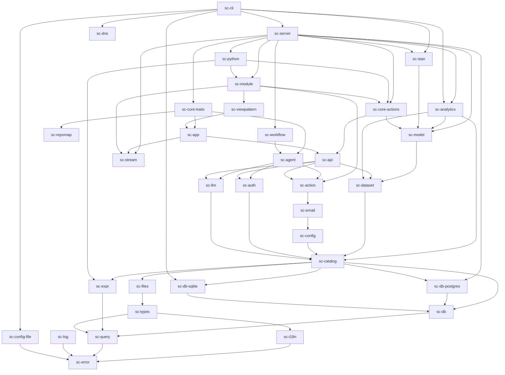

# Saltcorn Feldspar — Technical Design Requirements

This document translates the vision in [GOALS.md](./GOALS.md) into a concrete technical
design: the project (workspace/crate) structure, the major data structures, and the
software architecture. It is a living document and is expected to change as the design is
validated against the MVP.

The project is named **Saltcorn Feldspar** — Saltcorn is the company and the lineage this
design draws on; Feldspar names this rewrite. The shipped artifact is a single binary
called `feldspar`, and everything the binary owns on disk is named after it: the
`feldspar.toml` deployment file, the `/etc/feldspar` and `~/.config/feldspar` search
directories, the `FELDSPAR_*` environment variables, and the `src/feldspar/` runtime
scaffolded into an application's project. "Saltcorn v1" throughout this document means the
previous, JavaScript implementation.

It is normative where it uses **MUST**/**SHOULD**/**MAY** (RFC 2119); everything else is
guidance and rationale. Rust type sketches are illustrative, not final signatures — they
fix the *shape* of the data, not the exact fields or method names.

---

## 1. Design principles

These are the [GOALS.md](./GOALS.md) code guidelines, restated as the rules this design is
held to:

1. **Simple and clean.** Prefer boring, obvious designs. Clean types over clever ones.
2. **Every line of code is a liability.** Minimise total LOC. Do not add an abstraction,
   config option, or code path without a concrete need.
3. **Abstractions, but not baroque ones.** Extension points are traits with the smallest
   surface that does the job.
4. **Integration-tested first.** Everything is covered by integration tests against a real
   database; unit tests where cheap. Never distort the design purely to increase testability.
5. **No silent failures.** Errors either are handled meaningfully or crash with a clear
   message. No swallowing.
6. **Monorepo.** All first-party code lives in one repo; plugins may live outside.
7. **Separation of concerns.** Generic functionality is factored into independent crates
   with minimal, acyclic dependencies.

Two design invariants that fall out of the goals and pervade everything below:

- **Everything is relational.** Tables, rows, and the universal query language are the
  spine. Workflows, actions, agents, files, and models are all ultimately operations over,
  or triggered by, rows.
- **The database is the source of truth.** All metadata and users live in the primary
  database (in `_fd_*` tables and `users`). The in-memory catalog is a *cache* of that
  truth, kept coherent across processes by the message bus. There is no separate on-disk
  app format; a backup is a database dump plus the file stores.

---

## 2. Workspace and crate structure

Saltcorn Feldspar is a single Cargo workspace. Crates are layered strictly: a crate may only
depend on crates above it in this list (lower-numbered). This keeps the dependency graph
acyclic and the layering enforceable by `cargo`.

```
feldspar/
├─ Cargo.toml                     # workspace
├─ crates/
│  ├─ sc-error/                   # 0. error type, Result alias, no-silent-failure helpers
│  ├─ sc-log/                     # 0. structured logging + the error log sink
│  ├─ sc-config-file/             # 0. `feldspar.toml`: named environments (connection +
│  │                              #    serving parameters). Read by the binary and, for its
│  │                              #    `test` environment, by the integration-test harness
│  ├─ sc-dns/                     # 0. the process's resolver: a hickory-backed getaddrinfo
│  │                              #    linked in front of glibc's, so no NSS module is
│  │                              #    dlopened into the static binary (§13.5)
│  ├─ sc-i18n/                    # 0. Locale, negotiation, the Catalog, the message format,
│  │                              #    CLDR plurals, `t!`/`tc!`, the `Translator` seam, and the
│  │                              #    `core` catalogues. Layer 0 because sc-auth and sc-types
│  │                              #    must be able to translate a sentence (§16.1); the
│  │                              #    tree-sitter extractor is behind an `extract` feature
│  ├─ sc-query/                   # 1. universal query language (enum AST) + SQL rendering trait
│  ├─ sc-repomap/                 # 1. the coding agent's repo map: tree-sitter tags, personalised
│  │                              #    PageRank, rendering to a token budget. No store, no deps
│  │                              #    in the tree; its C grammars behind the `grammars` feature
│  ├─ sc-bus/                     # 1. message bus trait + drivers (pg NOTIFY, in-proc, redis…)
│  ├─ sc-db/                      # 2. DatabaseDriver trait, connection, migrations, tx
│  │   ├─ sc-db-postgres/         #    Postgres driver (MVP)
│  │   └─ sc-db-sqlite/           #    SQLite driver (primary database, or a file in a store)
│  ├─ sc-types/                   # 3. type system: RichType, BasicType, attributes, validation
│  ├─ sc-expr/                    # 3. ownership-formula language: parse/analyse/validate,
│  │                              #    symbolic (→ sc-query::Expr) + reified (deno_core) eval
│  ├─ sc-catalog/                 # 4. Catalog, Table, Field, TableProvider trait, cache
│  ├─ sc-config/                  # 5. `_fd_config`: declared settings, validation, ACME cache
│  ├─ sc-auth/                    # 5. User, Role, authz (ACL/RLS), sessions, OAuth2 provider
│  ├─ sc-files/                   # 5. FileStore trait, drivers (local, S3, git), xattr metadata
│  ├─ sc-dataset/                 # 5. Datasets (§14.4): a base and an ordered list of
│  │                              #    operations, compiled into one sc-query statement; the
│  │                              #    stage shapes and grain, reading a stage, the snapshot a
│  │                              #    fit records, and `_fd_datasets`
│  ├─ sc-action/                  # 6. Action trait + registry, Event/Trigger model, `_fd_triggers`
│  │                              #    storage & validation, the live set, dispatch, scheduler
│  ├─ sc-llm/                     # 6. object-safe LlmProvider seam over a provider crate
│  │                              #    (OpenAI Responses + Anthropic), `_fd_llm_providers` (§11.1)
│  ├─ sc-email/                   # 6. Email, the Mailer transport seam, SMTP over lettre (§18.2)
│  ├─ sc-workflow/                # 7. durable workflows: the program a trigger body can be,
│  │                              #    `_fd_workflow_versions`, `_fd_run_traces`, the engine
│  │                              #    that advances a run of it (§10.3)
│  ├─ sc-agent/                   # 7. Agent record + AgentTrait trait + registry + inference
│  │                              #    loop + `_fd_agents`/`_fd_runs` storage (§11.2)
│  ├─ sc-model/                   # 6. Predictive models: a named dataset (sc-dataset) resolved,
│  │                              #    the columnar Frame, the row-identity-hash split, the
│  │                              #    DatasetSource + ModelProvider seams, `_fd_models` /
│  │                              #    `_fd_model_instances`. Beside sc-action rather than
│  │                              #    above the row layer it reads through, because a module
│  │                              #    supplies model providers (TODO "Predictive models" §4)
│  ├─ sc-analytics/               # 6. The Analytics UI's server half (§14.5): workspaces
│  │                              #    (`_fd_workspaces`), the demo data, plot specs and their
│  │                              #    stats, tests, a fit's outputs drawn (above sc-model), and —
│  │                              #    as the analytics milestones arrive — panels, map layers
│  ├─ sc-stan/                    # 6. Bayesian models with Stan, beside sc-model (§14.2,
│  │                              #    "Bayesian models"): CmdStan discovery (`--cmdstan`,
│  │                              #    `$CMDSTAN`, `~/.cmdstan`) and `feldspar cmdstan install`;
│  │                              #    the program's declaration parser and `stanc`, the compile
│  │                              #    cache, the chain runner, the CmdStan CSV reader, the raw
│  │                              #    run directory, and StanProvider. What is not
│  │                              #    Stan-specific (the binder, the draws, the posterior
│  │                              #    summary) is sc-model's. No Cargo feature: nothing is
│  │                              #    linked, availability is a runtime fact
│  ├─ sc-stream/                  # 6. Streams: dataflows as an entity (§14.3). The
│  │                              #    StreamProvider seam and its registry, the element
│  │                              #    type and the envelope, `_fd_streams`, the supervisor
│  │                              #    that keeps subscriptions running, and the built-in
│  │                              #    MQTT provider. Layer 6 for sc-model's reason: a module
│  │                              #    supplies providers, and its rows go through the Catalog
│  ├─ sc-fieldview/               # 6. FieldView trait, built-in fieldviews (React components)
│  ├─ sc-api/                     # 8. Endpoint model (typed Rust values) + API providers
│  │                              #    (REST/GraphQL/gRPC/tRPC/MCP) + TypeScript consumer gen
│  ├─ sc-app/                     # 8. Application, Framework provider trait, routing/subdomains
│  ├─ sc-core-actions/            # 8. the built-in action set (insert_row, update_rows,
│  │                              #    delete_rows, fetch, run_js_code, run_python_code,
│  │                              #    send_email, and fit_model) — above the row layer,
│  │                              #    because a trigger's write goes *through* it (§10.1)
│  ├─ sc-viewpattern/             # 9. Saltcorn UI (§13.3): `_fd_views`/`_fd_pages`, the pattern
│  │                              #    registry, the view snapshot, the `ViewRuntime` seam and
│  │                              #    the `saltcorn-ui` framework. Above sc-app, because it
│  │                              #    implements `Framework`; its runtime is implemented one
│  │                              #    layer further up, by sc-module
│  ├─ sc-module/                  # 9. v1 plugins on a Deno worker in this process (§15.1),
│  │                              #    and the view runtime: v1's vendored patterns run there
│  ├─ sc-python/                  # 9. the Python code adapter (§15.2), over sc-module's seams
│  ├─ sc-core-traits/             # 9. the built-in agent traits (table, trigger and coding
│  │                              #    traits) + the `run_agent` action — same layer, same
│  │                              #    reason: their writes go through the row layer (§11.3)
│  ├─ sc-copilot/                 # 9. copilot agent + AppConstructor stages
│  ├─ sc-server/                  # 9. HTTP server: admin routes, user routes, auth, CSP, sockets
│  └─ sc-cli/                     # 10. `feldspar` binary (serve, user/app mgmt, backup/restore)
├─ ui/
│  ├─ admin/                      # React + TypeScript + react-bootstrap admin SPA over the
│  │                              #    generated typed API client (table editor, file mgr, and
│  │                              #    the workflow editor: React Flow + dagre, §10.3)
│  ├─ ide/                        # the file-store IDE: the VS Code workbench (§12.1)
│  ├─ saltcorn-ui/                # Saltcorn 1's view code, vendored + esbuilt for the module
│  │                              #    worker, and the browser assets its HTML loads (§13.3)
│  ├─ builder/                    # Saltcorn 1's Craft.js layout builder, vendored (JSX) and
│  │                              #    hosted by a TypeScript `src/`: its own admin document
│  │                              #    under `/builder/` (§13.3, "The builder")
│  ├─ analytics/                  # the Analytics UI (§14.5): datasets, workspaces, the Dataset editor —
│  │                              #    React + react-bootstrap over the generated client, served
│  │                              #    admin-only under `/analytics/`
│  └─ form-runtime/               # React dynamic-form framework (conditional/repeated/dynamic)
├─ plugins/                       # the bundled modules (§15.1a): first-party plugins that
│                                #    ship in the release and install in one click
└─ tests/                         # cross-crate integration tests (real Postgres)
```

The dependency graph of the crates that exist today. **An arrow points from a crate to a
crate it depends on**, so every arrow runs from a higher layer to a lower one and the graph is
acyclic by construction. Arrows implied by transitivity are omitted — the picture is the
*transitive reduction*, so `sc-server → sc-catalog` is real but not drawn; it is reached through
`sc-core-actions → sc-api → sc-auth → sc-catalog`. That is worth remembering when a box looks
sparser than it is — `sc-action` also depends directly on `sc-catalog`, `sc-db`, `sc-expr` and
`sc-types`, all of which the one drawn arrow to `sc-email` already implies. The full
direct-dependency lists follow the diagram.



The complete direct dependencies, in layer order (dev-dependencies excluded):

| Crate | Depends directly on |
|---|---|
| `sc-error` | — (nothing) |
| `sc-log` | `sc-error` |
| `sc-config-file` | `sc-error` |
| `sc-dns` | `sc-error` |
| `sc-query` | `sc-error` |
| `sc-repomap` | — (nothing in the workspace) |
| `sc-i18n` | `sc-error` |
| `sc-types` | `sc-error` `sc-i18n` `sc-query` |
| `sc-db` | `sc-error` `sc-query` |
| `sc-db-postgres` | `sc-db` `sc-error` `sc-log` `sc-query` |
| `sc-db-sqlite` | `sc-db` `sc-error` `sc-log` `sc-query` |
| `sc-expr` | `sc-error` `sc-query` |
| `sc-files` | `sc-error` `sc-types` |
| `sc-catalog` | `sc-db` `sc-db-postgres` `sc-db-sqlite` `sc-error` `sc-expr` `sc-files` `sc-query` `sc-types` |
| `sc-config` | `sc-catalog` `sc-db` `sc-error` `sc-i18n` `sc-log` `sc-query` `sc-types` |
| `sc-email` | `sc-catalog` `sc-config` `sc-error` |
| `sc-auth` | `sc-catalog` `sc-db` `sc-error` `sc-expr` `sc-query` `sc-types` |
| `sc-llm` | `sc-catalog` `sc-db` `sc-error` `sc-log` `sc-query` `sc-types` |
| `sc-action` | `sc-catalog` `sc-db` `sc-email` `sc-error` `sc-expr` `sc-query` `sc-types` |
| `sc-dataset` | `sc-catalog` `sc-db` `sc-error` `sc-expr` `sc-query` `sc-types` |
| `sc-model` | `sc-catalog` `sc-dataset` `sc-db` `sc-error` `sc-expr` `sc-query` `sc-types` |
| `sc-analytics` | `sc-catalog` `sc-dataset` `sc-db` `sc-db-sqlite` `sc-error` `sc-model` `sc-query` `sc-types` |
| `sc-stream` | `sc-catalog` `sc-db` `sc-error` `sc-query` `sc-types` |
| `sc-stan` | `sc-catalog` `sc-error` `sc-files` `sc-model` `sc-types` |
| `sc-agent` | `sc-action` `sc-auth` `sc-catalog` `sc-db` `sc-error` `sc-expr` `sc-llm` `sc-log` `sc-query` `sc-types` |
| `sc-workflow` | `sc-action` `sc-agent` `sc-catalog` `sc-db` `sc-error` `sc-expr` `sc-log` `sc-query` `sc-types` |
| `sc-api` | `sc-action` `sc-auth` `sc-catalog` `sc-dataset` `sc-db` `sc-email` `sc-error` `sc-expr` `sc-files` `sc-i18n` `sc-llm` `sc-model` `sc-query` `sc-types` |
| `sc-app` | `sc-action` `sc-api` `sc-auth` `sc-catalog` `sc-db` `sc-error` `sc-expr` `sc-files` `sc-i18n` `sc-query` `sc-stream` `sc-types` |
| `sc-core-actions` | `sc-action` `sc-api` `sc-auth` `sc-catalog` `sc-email` `sc-error` `sc-expr` `sc-files` `sc-model` `sc-query` `sc-types` |
| `sc-viewpattern` | `sc-action` `sc-api` `sc-app` `sc-auth` `sc-catalog` `sc-db` `sc-error` `sc-expr` `sc-files` `sc-i18n` `sc-query` `sc-types` |
| `sc-module` | `sc-action` `sc-app` `sc-catalog` `sc-core-actions` `sc-db` `sc-error` `sc-expr` `sc-log` `sc-model` `sc-query` `sc-stream` `sc-types` `sc-viewpattern` |
| `sc-python` | `sc-action` `sc-catalog` `sc-core-actions` `sc-error` `sc-expr` `sc-model` `sc-module` `sc-types` |
| `sc-core-traits` | `sc-action` `sc-agent` `sc-api` `sc-app` `sc-auth` `sc-catalog` `sc-error` `sc-expr` `sc-files` `sc-llm` `sc-log` `sc-query` `sc-repomap` `sc-types` |
| `sc-server` | `sc-action` `sc-agent` `sc-analytics` `sc-api` `sc-app` `sc-auth` `sc-catalog` `sc-config` `sc-core-actions` `sc-core-traits` `sc-dataset` `sc-db` `sc-db-postgres` `sc-email` `sc-error` `sc-expr` `sc-files` `sc-i18n` `sc-llm` `sc-log` `sc-model` `sc-module` `sc-python` `sc-query` `sc-stan` `sc-stream` `sc-types` `sc-viewpattern` `sc-workflow` |
| `sc-cli` | `sc-agent` `sc-analytics` `sc-api` `sc-app` `sc-auth` `sc-catalog` `sc-config` `sc-config-file` `sc-core-traits` `sc-dataset` `sc-db` `sc-db-postgres` `sc-db-sqlite` `sc-dns` `sc-error` `sc-files` `sc-i18n` `sc-llm` `sc-log` `sc-query` `sc-server` `sc-stan` `sc-types` `sc-viewpattern` |

Four things the graph is worth reading for:

- **The two concrete drivers are depended on only where a driver is *constructed***: `sc-cli`
  and `sc-server` at startup, `sc-catalog` for the connections an admin adds in the UI, which
  are rows it turns into drivers, and `sc-analytics`, which draws a plot over a fit's output data
  on a private in-memory SQLite database (§14.2). Everything between them and the database talks to the
  `DatabaseDriver` trait in `sc-db` — which is what made adding `sc-db-sqlite` a matter of adding
  a crate rather than editing the middle of the stack, and is now demonstrated rather than
  claimed.
- **`sc-core-actions` and `sc-core-traits` sit above `sc-api`/`sc-app`, not beside `sc-action`
  and `sc-agent`.** The built-in action set and the built-in agent traits are *users* of the row
  layer, not part of it — a trigger's write goes through the same path an HTTP request does
  (§10.1, §11.3), so they must be above everything that path touches.
- **`sc-viewpattern` is above `sc-app`, and `sc-module` is above it.** The tree once put view
  patterns at layer 8 as a trait beside the API; what was built is a *framework* (§13.3,
  Saltcorn UI), so it implements `sc-app`'s `Framework` and must sit above it. What renders a
  view is v1's own JavaScript on `sc-module`'s worker, so the seam (`ViewRuntime`) is declared
  in `sc-viewpattern` and implemented one layer up by `sc_module::ModuleViewRuntime` — the
  shape `FrameworkHost` and `TableProviderHost` already have. `sc-server` installs the one into
  the other at boot, and neither crate names the other's concrete type.
- **`sc-expr` is reachable only through `sc-catalog`** and depends on nothing but `sc-query` (and
  `sc-error`). That is the deliberate cut described below: the formula language knows the query
  AST it compiles into and nothing about tables.

Crates planned in the tree above but **not yet created**: `sc-bus`,
`sc-fieldview`, `sc-copilot`. `sc-test-harness`
(under `tests/`) is a dev-dependency of most crates and depends only on `sc-config-file` and
`sc-error`; it is left out of the graph because a dev-only edge is not part of the layering.

Notes:

- **`sc-db` drivers MUST be Rust** (per GOALS). Every other extension point (table
  providers, types, fieldviews, actions, agents/traits, importers/exporters, model
  providers, view patterns, frameworks, API providers) MAY be implemented in Rust or in a
  guest language via a **code adapter** (§15): `sc-module` for JavaScript, `sc-python` for
  Python.
- The React apps under `ui/` (including the admin SPA) are built to static bundles and
  **served by `sc-server`**; there is no separate front-end server. A strict CSP is applied,
  and it is satisfied *structurally* by the React build (no inline scripts or handlers) rather
  than by a server-side symbolic-HTML model (see §12).
- `sc-error` sits below everything and defines the single `Error`/`Result` convention so
  principle 5 is mechanically enforced (no `unwrap()` in library code; errors carry
  context).
- **`sc-expr`** is a generic library that depends only on `sc-query` (its translation target)
  and `sc-error` — deliberately *not* on `sc-catalog`, which describes tables to it through a
  small `SchemaShape` view. It owns the ownership-formula and calculated-field language
  (§7.3): one JavaScript expression, parsed once, evaluated two ways — **symbolically** into
  `sc-query::Expr` and **reified** in a V8 (`deno_core`) isolate. The V8 dependency is behind
  an `eval` cargo feature, so `sc-catalog` and everything else below the server link only the
  parse/validate/translate half; the `JsEvaluator` trait (the reified seam) is constructed
  once at server boot.

### 2.1 Extension points (traits) at a glance

The "code entities" from GOALS become a small set of object-safe traits. A **plugin** is a
bundle that registers zero or more implementations of these into the catalog at startup.

| Trait | Crate | Language | Purpose |
|---|---|---|---|
| `DatabaseDriver` | `sc-db` | Rust only | Connect to one database; run queries; manage schema |
| `TableProvider` | `sc-catalog` | any | Present a data source as a virtual table |
| `RichType` | `sc-types` | any | A type known to Saltcorn (attributes + validation) |
| `FieldView` | `sc-fieldview` | any | Display/edit a value of one or more types (React component) |
| `Action` | `sc-action` | any | One elementary step; configurable; reads one event, returns a value |
| `AgentTrait` | `sc-agent` | any | An elementary agent capability (usually an LLM tool) |
| `LlmProvider` | `sc-llm` | Rust | One configured chat model, streamed; hides the vendor's API |
| `Importer` / `Exporter` | `sc-catalog` | any | Move table data to/from a format |
| `ModelProvider` | `sc-model` | any | Fit/inspect/apply a predictive model over table data |
| `StreamProvider` | `sc-stream` | any | Observe a dataflow: declare its settings, compute its element type from them, and hand back a subscription (§14.3). A module's is poll-shaped, and the host supplies the loop |
| `ViewRuntime` | `sc-viewpattern` | JavaScript (v1's) | Render, post to and configure v1 view patterns — the six vendored ones and any a module's `viewtemplates` supplies — render pages and run their action buttons, and answer the builder's options, previews and lookups (§13.3) |
| `FileStore` | `sc-files` | any | A named directory/object store |
| `ApiProvider` | `sc-api` | any | Expose tables, actions & custom routes over a protocol; emit a typed TS client |
| `Framework` | `sc-app` | any | Own an application's primary UI (React/Next/Svelte/v1); declares its settings for the admin UI |
| `BusDriver` | `sc-bus` | Rust | Publish/subscribe transport for the message bus |
| `CodeAdapter` | `sc-expr` (trait); `sc-module`, `sc-python` (adapters) | Rust | Host a guest-language interpreter exposing the catalog |
| `Translator` | `sc-i18n` | Rust | Fill a catalogue's missing messages — implemented over `sc-llm`'s configured provider in `sc-server` (and re-exported by `sc-cli`), so layer 0 never names an LLM (§16.1) |
| `CatalogStore` | `sc-app` | Rust | Where *one application's* catalogue lives: files under `<project>/locales/` for an app with a source tree, `_fd_translations` rows for one without (§16.1) |

Object-safety and dynamic dispatch (`Box<dyn Trait>`) are the default, because
implementations are chosen at runtime from config and may be provided by guest languages
through a single Rust shim per adapter.

---

## 3. Layered architecture

```
                         ┌───────────────────────────────────────────┐
   HTTP / WS / gRPC ───► │ sc-server  (admin URL + per-app subdomains)│
                         │  · strict CSP · sessions · auth middleware │
                         └───────┬───────────────────────┬───────────┘
                                 │                        │
                    ┌────────────▼─────────┐   ┌──────────▼───────────┐
                    │ Admin UI (React)     │   │ Applications (sc-app)│
                    │  table editor, file  │   │  Framework + N ApiPro│
                    │  mgr, builder        │   │  viders per app      │
                    └────────────┬─────────┘   └──────────┬───────────┘
                                 │                        │
          ┌──────────────────────▼────────────────────────▼──────────────────────┐
          │                       Core services                                    │
          │  sc-workflow · sc-agent · sc-action · sc-model · sc-viewpattern        │
          │  sc-stan · sc-stream · sc-fieldview · sc-copilot · sc-files             │
          └──────────────────────┬────────────────────────────────────────────────┘
                                 │
                    ┌────────────▼─────────────┐        ┌──────────────────────┐
                    │  sc-catalog (the Catalog)│◄──────►│ sc-bus (message bus)  │
                    │  Tables, Fields, cache   │  cache │  pg NOTIFY / redis /  │
                    │  + TableProviders        │  inval │  kafka / in-proc      │
                    └────────────┬─────────────┘        └──────────────────────┘
                                 │
                    ┌────────────▼─────────────┐   ┌──────────────────────────┐
                    │ sc-db DatabaseDriver(s)  │   │ CodeAdapters (§15)       │
                    │ Postgres (primary) + …   │   │ sc-module JS / sc-python │
                    └────────────┬─────────────┘   └──────────────────────────┘
                                 │
                    ┌────────────▼─────────────┐   ┌──────────────────────────┐
                    │   sc-query (enum AST)     │   │ sc-i18n (layer 0)        │
                    └──────────────────────────┘   │ Locale · negotiate · t!  │
                                                   └──────────────────────────┘
```

`sc-i18n` is drawn off to the side because it is under *everything*, not under the query
layer: it sits at layer 0 beside `sc-error`, and every box above it — the router that
negotiates a locale, `sc-types` translating a form field's label, `sc-auth` phrasing a refusal
— reaches it directly (§16.1).

The **Catalog** is the hub. It owns the connected database drivers, the in-memory cache of
tables/fields/config/triggers/etc., and is the object every higher layer is handed to do
its work. It subscribes to the bus for cache-invalidation events and republishes its own
mutations.

---

## 4. The universal query language (`sc-query`)

Per GOALS: a lower-level query representation that is **data, not fluent calls** — an array
of enum values (inspired by SeaQuery but reified). Each `DatabaseDriver` renders it to its
own SQL dialect; `TableProvider`s interpret it directly.

```rust
/// A statement is the top-level query AST. It is a plain data value: serializable,
/// inspectable, and buildable by any language through the code adapters.
pub enum Statement {
    Select(Select),
    Insert(Insert),
    Update(Update),
    Delete(Delete),
}

pub struct Select {
    pub from:    Source,             // table, subquery, or provided table
    pub columns: Vec<Projection>,    // expr AS alias; supports joins' columns
    pub joins:   Vec<Join>,          // inner/left/… ON Expr
    pub filter:  Option<Expr>,       // WHERE
    pub group:   Vec<Expr>,
    pub having:  Option<Expr>,
    pub order:   Vec<OrderBy>,
    pub limit:   Option<u64>,
    pub offset:  Option<u64>,
}

pub enum Expr {
    Col(ColRef),                     // table-qualified column
    Lit(Value),                      // a literal, always parameterised on render
    Param(usize),                    // bind parameter
    Binary { op: BinOp, l: Box<Expr>, r: Box<Expr> },
    Unary  { op: UnOp,  e: Box<Expr> },
    Func   { name: String, args: Vec<Expr> },
    In     { e: Box<Expr>, set: InSet },
    Json   { target: Box<Expr>, path: Vec<JsonStep> },   // JSON is first-class
    Case   { .. },
    // …minimal, extended only as real queries demand it
}

pub enum Value {                     // the row value type used everywhere
    Null, Bool(bool), Int(i64), Float(f64), Text(String),
    Bytes(Vec<u8>), Json(serde_json::Value), Uuid(Uuid),
    Date(..), Time(..), Timestamp(..), Decimal(..),
}
```

Requirements the AST **MUST** support because the goals demand them:

- **Composite primary keys** and **foreign keys to non-primary-key columns** — so `ColRef`
  and join conditions are general `Expr`s, never "the id column".
- **JSON as a built-in** — `Expr::Json` and `Value::Json`, not an add-on type.
- **Literals are always parameterised** on render (SQL-injection-safe by construction; this
  is the query-layer half of the XSS/injection story, the React UI layer is the other half).

Rendering is a trait so each dialect controls quoting, placeholders, JSON operators, upsert
syntax, etc.:

```rust
pub trait SqlDialect {
    fn render(&self, stmt: &Statement) -> Result<(String, Vec<Value>)>; // sql + binds
}
```

---

## 5. Database layer (`sc-db`)

```rust
/// Instantiated once per connected database. MUST be implemented in Rust.
#[async_trait]
pub trait DatabaseDriver: Send + Sync {
    /// Introspect the live schema via information_schema (or equivalent).
    async fn introspect(&self) -> Result<Vec<PhysicalTable>>;

    /// Run a query; literals are already parameterised by sc-query rendering.
    async fn query(&self, stmt: &Statement) -> Result<RowStream>;

    /// Schema management (create/alter/drop table, add/drop column, index…).
    async fn apply_schema(&self, change: &SchemaChange) -> Result<()>;

    /// Transactions: each workflow step and each metadata mutation runs in one.
    async fn begin(&self) -> Result<Box<dyn Transaction>>;

    /// Row-level security support advertisement (drives authz strategy, §7).
    fn capabilities(&self) -> DbCapabilities;

    /// Translate a Postgres-dialect migration to this driver's dialect.
    fn dialect(&self) -> &dyn SqlDialect;
}

pub struct DbCapabilities {
    pub row_level_security: bool,
    pub composite_pk:       bool,
    pub listen_notify:      bool,   // enables the pg-notify bus driver
    pub returning:          bool,
    // …
}
```

Design rules from GOALS:

- **No table discovery step.** As soon as a database is connected, *all* its tables are
  usable via `introspect()`. Metadata is an optional overlay, never a prerequisite (§9).
- **No automatic primary key on create.** `apply_schema` for "create table" does **not**
  invent an `id` column. The user creates key fields explicitly like any other field.
- **A key fills itself in, and says whether it does.** A column carries an optional
  `ColumnGenerator` — `Identity` (Postgres's `GENERATED BY DEFAULT AS IDENTITY`) or
  `Default(sql)` — which is one field and not a `default` beside an `identity` flag,
  because a column has one of them and Postgres refuses a column that has both. It
  travels in three directions: `ColumnDef` carries it when the column is created,
  `SchemaChange::SetColumnGenerator` gives it to a column that already exists, and
  `introspect()` reads it back (`is_identity` as well as `column_default`, or every
  identity key would look like a key somebody has to type). The third is what makes the
  first two honest — the admin UI tells the admin what a key *does*, not what creating it
  was supposed to do, which differ for every table Saltcorn picks up as it finds it.
- **Migrations are arrays of Postgres SQL values** translated per-dialect by `dialect()`.
  Per GOALS, we **do not** run schema-changing migrations during early development — we
  evolve the initial setup instead until the metadata schema is stable.

### 5.0 Secondary databases (Connections)

The primary database is the one `feldspar.toml` names: the one that hosts `users` and every
`_fd_*` table, and the one the process must reach before it can read anything at all. It is not
the only one. An admin adds a **connection** in Tables → Connections — host, port, database,
user, password, schema — and that database's tables join the catalog beside the primary's, with
the connection's name badged next to each in the tables list.

A connection names a **backend**: `postgres`, or `sqlite`. A SQLite connection is not a host and
a role, because a SQLite database is a *file* — so it names a **file store and a path inside
it** (§14.1), which is where Saltcorn's files already are and where the admin has already said
who may read them. A bare filesystem path would let anyone with that screen open any file the
server process can read. Everything after the dial is identical: the file's tables are in the
tables list, stamped with the connection, read and written through the same paths. A file that
is not there is refused rather than created — a connection to a missing file is a mistake, and
answering it with an empty database that works would be the least helpful possible reply.

- **A connection is a row** (`_fd_db_connections`, §9.2), not a line in the configuration file,
  because it is added on a running server with immediate effect. It is stored as columns rather
  than as a URL, so the password is a column that can be declared secret: it is redacted to
  `SECRET_SENTINEL` on every read, restored when a save echoes the sentinel back, and never
  appears in a log line or an error.
- **One schema per connection**, applied as the connection's own `search_path` and as a filter
  over `introspect()`. Applying it to the connection rather than to each rendered statement is
  what lets every existing query path work unchanged — a select, an insert, a `RETURNING` all
  name their table unqualified.
- **The primary wins every name.** The catalog keys tables by name, so a foreign table whose
  name is already taken is **not** adopted; it is recorded (`Catalog::shadowed_tables`) and
  named on the Connections screen. Anything else would let a foreign `users` repoint
  authentication at somebody else's database.
- **Everything routes by `Table::database`.** `Catalog::provider` sends a table's reads and
  writes to the driver of the database that hosts it, and so does every DDL path —
  `create_field`, `drop_field`, `drop_table` and the schema editor's batch. A table is created
  in a *named* database (`Catalog::create_table_in`, `Operation::CreateTable`'s `database`),
  because a table that does not exist yet has nothing to infer it from; every later operation
  reads the answer back off the table. The New table dialog shows the chooser only when there is
  more than one connected database to choose from.
- **One batch, one database.** A schema batch is one transaction, and a transaction cannot span
  two Postgres servers, so `schema_edit::apply` pins the batch to the first database an operation
  names and refuses a second. Splitting it silently into two transactions would mean a batch that
  can leave one database changed and the other not.
- **Row-level security stays primary-only.** Its policies are generated against the `users` table
  and the role GUC, both of which live in Saltcorn's own database, so `rls_available` is false
  for a foreign table and enabling it is refused.
- **A connection that cannot be dialled is still a connection.** Connecting proves reachability
  by introspecting once (building a pool succeeds against a host that does not exist); a failure
  is recorded rather than fatal, the row stays listed with its reason, and editing it is the
  repair. The same rule as a file store's (§14.1), and the same reason: a secondary database
  that is down must not stop a server whose primary database is fine.

### 5.1 Table constraints

A table's **constraints** — its jointly-unique keys, its indexes, its full-text index and its
row constraints — are modelled the way its primary key and its foreign keys are: as facts of the
live schema. `PhysicalTable::constraints` is what `introspect()` reads back, `Table::constraints`
is the merged view, and `SchemaChange` grew `AddUniqueConstraint`, `DropConstraint`,
`CreateIndex`, `DropIndex` and `SetComment` to create them. **There is no `_fd_constraints`
table**, and that is the §9 rule applied rather than an omission: a constraint is something the
database knows, so storing it again would be storing a second answer. A `UNIQUE` added in `psql`
is therefore listed beside Saltcorn's own, a restored dump keeps its constraints with no metadata
to restore beside them, and there is no state where the two disagree.

Two things about a constraint are Saltcorn's and not Postgres's: the **error message** an admin
writes for its violation, and the **formula** a row constraint was generated from. Both ride in
the object's comment (`COMMENT ON CONSTRAINT` / `ON INDEX` / `ON TRIGGER`) as one JSON object
under a `saltcorn_constraint` key — attached to the object, dropped with it, carried by
`pg_dump`, and impossible to outlive what it describes. A comment that is absent, is prose, or
is JSON without that key leaves a constraint that still works and is still listed, with no
message; a **trigger** without it is not treated as a row constraint at all, because a trigger is
also how the rest of the world implements auditing and denormalisation, and listing somebody's
audit trigger as a rule an admin may delete would be listing it as something it is not.

A **row constraint** is a formula over the row that must be true of every row, and it is
enforced by a `plpgsql` `CONSTRAINT TRIGGER` — not by a `CHECK`, because GOALS requires join
fields and aggregations in constraint formulae and a `CHECK` may not query another table. The
function evaluates the *same* `sc_query::Expr` the ownership translator produces (§7.3), over a
derived table that gives the row being written the table's own name:

```sql
SELECT (<translated formula>) INTO sc_ok FROM (SELECT (NEW).*) AS "<table>";
IF sc_ok IS DISTINCT FROM true THEN
  RAISE EXCEPTION '%', '<the admin's message>'
    USING ERRCODE = 'check_violation', CONSTRAINT = '<the constraint's name>';
END IF;
```

so the expression needs no rewriting and a formula means one thing whether it is enforced by a
policy, evaluated at runtime, or checked here. The trigger is `DEFERRABLE INITIALLY IMMEDIATE`
for the reason the foreign keys are (§13.1) — unchanged at the statement, deferrable to commit
by a caller holding the transaction, which is what lets rows that point at each other arrive in
a file's order — and therefore `AFTER`, which is what a deferrable trigger is.

`CONSTRAINT = '<name>'` is the last piece: it puts the constraint's name in the error the same
way Postgres does for a unique violation, so `sc-api::rows` has **one** lookup for both. A write
that breaks a rule comes back as a 400 carrying the admin's sentence rather than a 500 carrying
`duplicate key value violates unique constraint "sc_uq_…"`. For that to work the driver keeps
the SQLSTATE and the constraint name in the error text it formats (`<message> [<sqlstate>]
(constraint "<name>")`), which is also what `sc-catalog`'s policy-violation mapping had been
matching message text for want of.

Names are **derived** from what a constraint is — `sc_uq_<table>_<fields>`,
`sc_ix_<table>_<field>`, `sc_fts_<table>`, `sc_ck_<table>_<name>` — so adding the same rule twice
collides by name instead of quietly creating two constraints enforcing one rule, and a name over
Postgres's 63-byte limit is truncated with a hash suffix rather than silently truncated by the
backend into somebody else's name. A row constraint additionally takes a short name from the
admin, because it is the one kind whose identity cannot be derived from its fields.

A **backup** carries a table's constraints in its `table.json` and the restore adds them after
the rows, the order `pg_dump` uses — a unique constraint over restored data is checked in one
pass rather than once per insert, and a row constraint created first would judge each row as it
arrived against a table whose other rows are not in yet. There is no `_fd_*` table for a backup
to have picked them up from incidentally, so a restore without this would rebuild the columns
and the rows and quietly drop every rule.

Finally, the schema editor knows what a constraint needs: a field a constraint names cannot be
dropped from under it (Postgres would drop a unique constraint with the column, silently, and
leave a row constraint's trigger to fail at the next write), and a table's full-text index is
rebuilt whenever its text fields change, because that index is over *every* text field and an
index that stopped covering the table it claims to cover is the failure nobody notices.

The **primary database** is one connected driver, distinguished by the fact that it hosts
the `_fd_*` metadata tables and the `users` table. Additional databases are connected for
data only. (MVP: single database, same as the primary store.)

### 5.2 The SQLite backend (`sc-db-sqlite`)

Postgres is what a deployment runs; SQLite is what a laptop, a Raspberry Pi and a one-file
backup run. It is a second implementation of the same `DatabaseDriver` trait and it is reached
two ways: as the **primary** database, named by `sqlite = "…"` in `feldspar.toml` (or `--sqlite
PATH`), and as a **secondary connection** to a `.sqlite` file sitting in one of the file stores
(§5.0). Nothing above layer 2 changes for either: the catalog holds an `Arc<dyn DatabaseDriver>`
and does not ask which one it is.

What the backend has to solve, and how:

- **Five storage classes, eleven value types.** SQLite is dynamically typed, so a timestamp and
  a uuid are both text and a bool and a row count are both integers. What closes the gap is the
  **declared type**, which SQLite keeps verbatim and reports back: the DDL emits `sc-types`' own
  names (`int8`, `jsonb`, `timestamptz`) rather than translating them, so introspection and
  decoding read a value back as the thing it was written as, and §6's type layer maps a SQLite
  column exactly as it maps a Postgres one. Timestamps are written fixed-width UTC
  (`YYYY-MM-DDTHH:MM:SS.mmmZ`) so that text order — which is what `ORDER BY` gives on a text
  column — is time order. Reading is more lenient than writing, because a file created by
  something else holds `DATETIME` columns and `2024-05-06 12:00:00`.
- **`ALTER TABLE` does very little.** SQLite cannot alter a column or add a primary key, so
  `SetPrimaryKey` and `SetColumnGenerator` — the two halves of "make this field the key", which
  is how a table gets one, since none is invented — are applied by the documented **table
  rebuild**: create the new shape, copy the rows, drop the old, rename, and put the indexes and
  triggers back. It runs inside a savepoint with `PRAGMA defer_foreign_keys`, and the foreign
  keys are checked before the savepoint is released. `render_ddl` refuses a rebuild rather than
  emitting a guess: it is written from the table's *current* columns, which the change does not
  carry.
- **An identity key is `INTEGER PRIMARY KEY`** — the rowid alias, spelled exactly so, and never
  beside a table-level key declaration, which would stop SQLite numbering it.
- **There is no `COMMENT ON`.** A constraint's error message and a row constraint's formula ride
  in an object's comment (§5.1), so the driver keeps them in a table of its own
  (`_fd_object_comments`), written by the same `SetComment` change and read back by
  introspection.
- **A constraint violation arrives wearing a SQLSTATE.** SQLite reports an extended result code;
  the driver translates the constraint ones to the Postgres spellings (`23505`, `23502`,
  `23503`, `23514`) that `sc_api::rows` and the catalog's constraint mapping already read, so an
  admin's own error message for a rule is shown on either backend.
- **It is a library, not a server**, so every call blocks: the driver runs them on tokio's
  blocking pool, over a small pool of connections (a transaction owns one; WAL lets readers run
  beside the writer).

What it does **not** advertise is as load-bearing as what it does: no `row_level_security` (no
policies, and nothing to write them against — so §7 enforces authorization above the database
and `rls_available` is false), no `listen_notify` (§16's bus does not use the database), no
`unlogged_tables`. Row constraints, which are generated as PL/pgSQL triggers, and full-text
indexes, which are `to_tsvector` expressions, are Postgres-only for now: they fail at the
database with the database's own message rather than being silently skipped.

---

## 6. Type system (`sc-types`), fields, and fieldviews

### 6.1 Types

```rust
/// A Rich type is one Saltcorn understands: it has typed attributes and validation and a
/// set of fieldviews. A Basic type is any DB type not mapped to a rich type — usable, but
/// only through catch-all fieldviews. The driver maps DB types → rich/basic types.
pub trait RichType: Send + Sync {
    fn name(&self) -> &str;
    fn attributes(&self) -> &[FormField];             // e.g. min/max, select options
    fn validate(&self, v: &Value, attrs: &Attrs) -> Result<()>;
    fn sql_types(&self) -> &[&str];                   // DB types this maps from/to
    fn fieldviews(&self) -> Vec<Box<dyn FieldView>>;  // deferred until §6.3 ships
}
```

MVP shipped **no rich types** — everything was basic — per the milestone. The tables-and-fields
milestone then implemented the trait (minus `fieldviews()`, which waits on §6.3's fieldview
registry) and, with it, the **rich-type registry** (`sc-types::rich`): rich types are registered
by name — `registered_rich_types()`, `rich_type(name)`, `rich_type_config_spec(name)` — mirroring
the file-store-backend and framework registries, and for the same reason: the admin UI must
render an attribute form for a type it knows nothing about, including one a plugin registers
later, so a type is a name plus a `Vec<FormField>` spec plus a validator, resolved at runtime.

`TypeRef` gained a `Rich(RichTypeRef)` variant. A `RichTypeRef` is a **name** resolved against
the registry on use (`RichTypeRef::resolve`); identity is the name, which keeps `TypeRef`
comparable by value. `TypeRef::validate_with(value, attrs)` is the attribute-carrying entry point
the row-write path calls (§2.3 of the milestone): coerce the JSON through the column's storage
type, then let the rich type enforce its configured attributes.

Two rich types ship, chosen to prove the three things the machinery must do — validate a value,
declare typed attributes, and constrain what may be stored:

- **`String`** over `text`, with `max_length`, optional `options` (a select), and an optional
  anchored `regex`. The regex subsumes the originally planned `Email` type (and any other
  pattern), so no dedicated `Email` type exists.
- **`Integer`** over `int8`, with `min`/`max`.

Two boundaries hold the shape steady. **`File` is a field kind, not a rich type**: like `Key`, it
is a *reference* (a store-relative path stored as `text`), not a value family — the admin-facing
type picker merges kinds and types into one list because that is how an admin thinks, but the
model keeps them apart. And **introspection never resolves a column back to a rich type**:
`TypeRef::from_sql_type` always yields a basic type, and a column is rich only because the
`_fd_fields` overlay says so (§9) — guessing "this `text` column is an Email" from the database
is exactly the magic that makes a legacy database behave surprisingly.

### 6.2 Fields — the `BaseField` / `DataField` / `FormField` split

GOALS calls out that v1 conflated DB fields and form fields. v2 separates them explicitly:

```rust
/// Properties shared by every field.
pub struct BaseField {
    pub name:  String,      // valid identifier in SQL and every guest language
    pub label: String,      // human string
    pub type_: TypeRef,     // rich or basic
    pub attributes: Attrs,  // JSON object, type-specific
}

/// A column in a database table.
pub struct DataField {
    pub base:      BaseField,
    pub required:  bool,
    pub unique:    bool,
    pub primary_key: bool,             // may be part of a COMPOSITE pk
    pub calculated: Option<Calc>,      // stored or non-stored calculated field
    pub kind:      DataFieldKind,
}

pub enum DataFieldKind {
    Plain,
    /// Foreign key: holds the value of a referenced field (NOT necessarily the target PK),
    /// with a summary field used as the default label when selecting.
    Key { target_table: TableId, target_field: FieldId, summary_field: Option<FieldId> },
    /// File reference: a relative path within a named file store, optionally restricted to
    /// a folder and/or file types.
    File { store: FileStoreId, folder: Option<String>, mime_allow: Vec<String> },
}

/// A field in a form (may derive from a DataField or be standalone).
pub struct FormField {
    pub base:     BaseField,
    pub fieldview: FieldViewRef,
    pub required: bool,
    pub default:  Option<Json>,        // value used when none is given
    pub visibility: Option<Formula>,   // conditional display on other field values
    pub options_source: OptionsSource, // static | server query | client code
    // …repeat groups & dynamic attributes handled by the form runtime (§12)
}

impl DataField { pub fn to_form_field(&self) -> FormField { /* … */ } }
impl FormField { pub fn to_data_field(&self) -> Option<DataField> { /* … */ } }
```

**`FormField` is also how every configurable extension point declares its settings**, and
there is deliberately **no separate `AttrSpec` type**. A `Framework` (§13.3), `Action`
(§10.1), `Agent` (§11.1), `ModelProvider` (§14.2), `FieldView` (§6.3) and a `RichType`'s
attributes (§6.1) all answer one question — *what should the admin be asked?* — and all answer
it with `Vec<FormField>`. The definition above already allows it: a form field "may derive from
a `DataField` **or be standalone**", and a setting is exactly the standalone case. Giving
settings a parallel type would mean two vocabularies for one question, two things for the admin
UI to render, and two things a guest-language extension must know about; `name`/`label`/`type_`
would be declared twice and drift once. The values a `FormField` describes as settings live in
an `Attrs` bag, so its `default` and `options_source` deal in JSON — the same thing that ends up
in the bag.

Note the level this puts things at: `BaseField.attributes` is an `Attrs`, and what may go in it
is described by that type's `attributes()` — a `Vec<FormField>`. A `FormField` therefore both
carries a `BaseField` and describes what another field's attributes may hold. That is the same
self-description a JSON Schema has, and it is well-founded: the recursion bottoms out at basic
types, which have no attributes.

`BaseField`, `FormField` and `Attrs` live in `sc-types`. `DataField` lives one layer up in
`sc-catalog`, because its `Key`/`File` kinds reference catalog identifiers and it bridges to
`Column`/`ColumnDef` — that is the only part of the split that ever needed layer 4.

**Calculated fields.** Defined either by a simple expression — which may traverse foreign
keys in both directions: outgoing via Ⱶ-joinfields, incoming via the Ↄ aggregation chains
of §7.3 (decided in [AGG_EXPRS.md](./AGG_EXPRS.md), proposal G; calculated-field
expressions use the same aggregation language without `user` and the operation flags) —
or by guest code via a code adapter. Dependency handling per GOALS:

- If **no** calculated field uses a code adapter, calculation is implemented as ordinary
  triggers with a recursion limit.
- If simple expressions are mixed with code-adapter functions, dependencies (both "this
  field depends on…" and "…depends on this field") are collected and **topologically
  sorted**; a cycle is a load-time error (no silent failure).

```rust
pub struct Calc { pub stored: bool, pub source: CalcSource }
pub enum CalcSource { Expr(Formula), Code { adapter: AdapterId, body: String } }
```

**A non-stored field is projected in SQL where it translates, and computed after the read
where it does not.** Most expressions translate: `pages * 2`, a Ⱶ-join and an Ↄ-aggregation
are each one more projection of the `SELECT`. A field that calls `predict("…")` (§14.2) or a
module function (§15.1) cannot, because its value comes from outside the database. Such a
field is not skipped. `sc-api`'s `CalcPlan` (`calc_read.rs`) splits a table's calculated fields
into the ones SQL projects and the ones computed **after** the rows are fetched. The second
kind are evaluated by the reified evaluator over the page, in dependency order, so a field that
reads a predicting field sees its value. Every read path that projects calculated fields goes
through the one plan: a list, a read by key, `select_values_in`, and the `RETURNING` of an
insert and an update. GraphQL, the code host and the CSV export read through those, so there is
one implementation and nothing to drift.

- **Hoisted values are resolved first.** Predictions are **batched per page**: one
  `ModelHost::predict` per model, with every row's key, so a 50-row page is one dataset read
  and one provider call rather than fifty. Join paths, relations and module calls are resolved
  per row by `prefetch_bindings`, as on the write path.
- **An error fails the read**, naming the field, the model and the row ("`estimated_price` of
  `houses` could not be computed for the row whose id is 500: …"). A failed batch is asked again
  row by row to find which row it was. A null would be a silent failure, and a model with no
  active fit therefore makes its table's reads fail until one is activated. The save check
  warns about that when the field is added.
- **It cannot be filtered or sorted on**, because the database never sees it. Every place that
  lowers a filter or an ordering (REST's query string, GraphQL's `where` and `order_by`, counts,
  the code host's query plans) refuses with one sentence: "cannot filter on `estimated_price`:
  `estimated_price` is computed after the rows are read, because it calls `predict`, so the
  database never sees it".
- **A write computes it after the commit.** If that fails, the error says the row was saved.
  Inside a caller's transaction the after-read fields are left out, because a prediction reads
  the row through the dataset on another connection, where it is not committed yet.
- **A model's dataset read is SQL-only** (`RowQuery::sql_only`). Otherwise a field that predicts
  with a model of its own table would recurse: computing the field reads the dataset, and
  reading the dataset computes the field.

*Stored* calculated fields do not exist yet. When they do, `predict` in one is refused, for the
reason §14.2 gives.

### 6.3 Fieldviews

A fieldview displays and optionally edits a value of one or more types. With the admin UI and
applications rendered by React (§12), a fieldview is fundamentally a **React (TypeScript)
component**, described on the Rust side by a small metadata record so the catalog can list,
select, and configure it:

```rust
/// Rust-side descriptor for a fieldview; the actual render/edit UI is a React component
/// referenced by `component` and bundled with the relevant UI (admin SPA, v1-view runtime).
pub struct FieldView {
    pub name: String,
    pub handles: Vec<String>,    // type names this covers, or "*" catch-all
    pub is_edit: bool,
    pub config_spec: Vec<FormField>,
    pub component: ComponentRef, // bundled TS component id
}
```

The earlier symbolic-HTML `Node` model — a `sc-markup` crate producing CSP-safe server HTML
with extracted client JS — has been **dropped**: React satisfies the strict CSP structurally
(no inline handlers) and supplies the interactive components directly. Fieldviews remain
post-MVP; the MVP uses only the catch-all display/parse path over `Value`.

---

## 7. Users, authentication, authorization (`sc-auth`)

### 7.1 Users

Per GOALS, the `users` table lives in the primary database and is deliberately minimal:

- Primary key is **UUID** and is **not deletable**. Code MUST NOT assume any other field
  exists.
- An `email` field exists initially but the admin MAY delete it and substitute another
  identifier field.
- Passwords are stored hashed with a modern KDF (argon2id).
- A `legacy_id` field MAY be added when importing v1 apps (v1 user ids were autoincrement
  integers).
- **`language`** is a nullable text column holding a BCP-47 tag — the locale this user reads in
  (§16.1, D8). A **system column** despite being a user preference, because it has a type
  nothing else on the form has (a select over the enabled locales) and because an admin who
  added a column called `language` would otherwise be editing this one through a text box. It
  is writable from two places at once: the user form, where an admin sets it when creating an
  account for somebody who reads French, and the user menu's locale picker, where that somebody
  changes it without needing an admin. `NULL` — the usual value — means "negotiate", and it is
  what lets a trigger emailing a customer translate against *that customer's* language rather
  than the admin's.
- `role` is an integer **1–100**; 1 = admin (full access), 100 = public (not logged in).
  Admins MAY add arbitrary fields to the user table. `role` is a **foreign key onto
  `_fd_roles`** (§7.4): a role is a row carrying a name and role-specific settings, so
  `users.role` naming a role that does not exist is a state the database rules out.

```rust
pub struct User {
    pub id: Uuid,                       // never deletable
    pub role: u8,                       // 1..=100
    pub extra: BTreeMap<String, Value>, // admin-defined fields (may include email)
}
```

### 7.2 Authentication

- Password + session cookie baseline.
- **Sessions are rows, cached per node.** A login mints a 256-bit opaque token, sends it in an
  `HttpOnly` cookie and writes a row to `_fd_sessions` in the primary database. An in-memory
  map would be the fastest possible store and the reason there could only ever be *one*
  application server — a session minted on node A is not one node B has heard of, so a load
  balancer in front of two processes logs people out at random. The table is the one thing
  every node already shares.

  What keeps it off the critical path is that it is cheap in three specific ways. The table is
  **`UNLOGGED`** where the backend advertises it (`DbCapabilities::unlogged_tables`): a session
  is worth sharing between nodes and not worth a WAL record, and the price — an unclean
  shutdown truncates it, and it never reaches a physical standby — is a re-login, which is what
  a restart already cost. **Nothing is written per request**, because the expiry is fixed at
  login rather than sliding. And each node keeps a **read-through cache** in front of it,
  bounded two ways: an LRU capacity bounds memory, and a per-entry freshness TTL (60s) bounds
  staleness.

  Three consequences are deliberate. **Misses are never cached** — node A mints a session, the
  browser's next request lands on node B, and a node that cached "no such token" would keep the
  user logged out. **The row names the user rather than copying them**, so a cache miss re-reads
  the user and a role change lands within the freshness TTL instead of surviving the session's
  whole 24 hours. And **the token is stored SHA-256-hashed** — a fast hash, unlike a password's
  argon2id, because 256 bits of uniform randomness has no dictionary to defeat — so a database
  dump is not a pile of live cookies.

  **Logout is the one place this is weaker than a map**, and the weakness is bounded rather than
  hidden. The node that handles it deletes the row and evicts its own entry, so it is consistent
  at once; another node holding a cached entry honours the cookie until that entry goes stale.
  The window is the freshness TTL, it closes entirely once the message bus (§16) can carry an
  eviction to every node — `SessionStore::invalidate` is the seam it will hook to — and a
  deployment that will not accept it sets the cache TTL to zero, making every lookup a read.
- **Device recognition** ("Google-level"): remember known devices, email the user on a
  new-device login.
- **OAuth2 server option**: Saltcorn can act as an identity provider (`sc-auth` exposes the
  authorization-code/PKCE endpoints when enabled).
- Additional providers (OAuth clients, SSO) via an `AuthMethod` extension.

### 7.3 Authorization

Separate permissions for **read, create, update, delete** (v1 had a coarser model). Per
table (and per File-field endpoint) a minimum role governs each operation; **ownership**
grants row-level access to users who do *not* meet the table-wide minimum role. Ownership is
expressed as an **ownership formula** — a JavaScript expression, stored in the table's
`attributes`, over the row's fields, the current `user`, the operation flags
(`_read`/`_insert`/`_update`/`_delete`/`_write`), Ⱶ-joinfields (below) and Ↄ-aggregations
(below). This is implemented; the paragraphs that follow describe the system as built.

**The access rule.** For an operation on a row:

> **allowed = the caller's role meets the operation's `min_role` OR the ownership formula
> evaluates true** for this row / user / operation.

Ownership *extends* access below the role floor; it never narrows it. A caller who already
meets `min_role` is unaffected by the formula (and by RLS, through a role-floor clause in
every policy). A table with no formula behaves exactly as the plain role model does.

**The public role is everybody.** A caller nobody is logged in as holds the public role (100),
so a `min_role` of 100 — on a table operation, an application's custom query or an exposed
trigger — admits them: no login, no session, and no CSRF token. It does not mean "a logged-in
user whose role is 100". `AuthRequirement::admits` states the rule once, and the REST
provider, the admin dispatcher and the MCP endpoint tools all ask it. A mutating request to
such an endpoint that fails the CSRF check is not refused; it is served as the anonymous caller
it then is. Its session cookie is not read, and no session is started or ended, so a
cross-site page that makes the browser send the cookie gets nothing an anonymous caller would
not. Everything stricter keeps the check, and so do the `Public` auth endpoints (`login`,
`signup`, …) and an application's own UI pages.

**One language, parsed once, evaluated two ways.** The formula lives in the `sc-expr` crate
(§2). A single parse (via `swc_ecma_parser`, the parser family Deno uses, so the grammar is
exactly V8's) is lowered into `sc-expr`'s own owned AST and evaluated two ways from that one
object:

- **Symbolically** — translated to `sc-query::Expr`, i.e. a SQL predicate. This is what an
  injected `WHERE` clause (runtime checks) and an RLS policy both are.
- **Reified** — actually run, in a V8 (`deno_core`) isolate on a dedicated thread, for the
  constructs SQL cannot hold (`user.groups.some(g => …)`), and as the *reference*
  implementation.

**Parity is a tested property, not a hope.** For every translatable construct, matrices of
formula × row × user are evaluated *both* ways — reified in the isolate, and via the
translated `Expr` executed against real Postgres — and each case asserts three things:
the two evaluators agree *and* both match the expected verdict (so both drifting wrong
together still fails the test). Null handling is specified once, by the translation, and the
reified path is normalised to meet it: `===`/`==` render as `IS NOT DISTINCT FROM` (JS's
two-valued equality — `owner === user.id` on a null `owner` is *false*), ordered comparisons
and arithmetic are null-guarded so JS's `null → 0` coercion cannot diverge from SQL, and
`user.x` on an anonymous (null) user reads as null rather than throwing.

**Fail closed, everywhere.** A stored formula that no longer validates at load time (a field
was dropped, a dump restored) grants nothing and the table stays `min_role`-only, with the
reason reported on the `Table`. An anonymous caller's `user` is null, so a formula that must
not grant anonymously is written `user && …` (bare `user` is object-or-null, so its
truthiness is exactly the logged-in test). Under RLS a missing GUC is SQL NULL, so an
un-set caller context sees no rows by construction. A denial is always shaped identically to
absence — affected-rows 0, mapped to not-found — so "exists but forbidden" is never a probe.

**Enforcement strategy is chosen from `DbCapabilities`**, and the *same formula* produces the
*same verdicts* either way — flipping between them swaps the mechanism, never the outcome
(the RLS tests are the runtime-check scenarios re-run):

- **Runtime checks** (any backend). For reads below the role floor, the translated predicate
  is ANDed into the `SELECT`'s `WHERE`; joinfields ride in as correlated columns projected in
  the same query (zero extra round trips) and are stripped before rows reach the wire. Writes
  inject the predicate into the `UPDATE`/`DELETE` `WHERE` and additionally run a reified check
  on the existing row and, for updates/inserts, on the merged proposed row (WITH CHECK
  semantics — moving a row out of your own ownership is refused). An **untranslatable** formula
  falls back to fetch-then-filter through the reified evaluator.
- **Postgres row-level security** (`DbCapabilities::row_level_security`; opt-in per table via
  `rls_enabled`). `sc-catalog` emits `ENABLE` + **`FORCE ROW LEVEL SECURITY`** and four
  policies — SELECT/DELETE `USING`, INSERT `WITH CHECK`, UPDATE both — from the *same*
  translation under a **GUC** user-env: `user.x` becomes a read of `current_setting('sc.user',
  true)` (a JSON GUC) and the role floor a read of `sc.role`. Every row operation runs inside a
  transaction that `SET LOCAL`s those two GUCs (the value is bound via `set_config`, never
  interpolated); admin endpoints run at `sc.role = 1` so the row viewer works on a FORCE'd
  table. That transaction is per statement on the ordinary path, and the caller's **own**
  statement inside a shared one — a workflow step's, an import's — where `SharedTx::run` applies
  the pair per writer and clears it (to `''`, which the policies read as `NULL`) for a statement
  with no caller, so a shared transaction never lends one writer's identity to the next (§10.3). Reads go unfiltered and writes unpredicated to the database — the policy does the
  work, including the joinfield subselects, so nothing is refetched. Enabling RLS is refused at
  save time if the formula does not translate under the GUC env for all four operations, so a
  policy is never emitted for a formula the database cannot honour. `USER_GUC = "sc.user"` and
  the role GUC are wrapped in `NULLIF(…, '')` so an unset-or-empty custom GUC folds to NULL and
  the policy fails closed.
  **Operational requirement:** Saltcorn must **not** connect to Postgres as a superuser (or as a
  role with `BYPASSRLS`). Such a role bypasses row security entirely — `FORCE ROW LEVEL SECURITY`
  covers the table's *owner*, not a superuser — so every policy this emits would be inert while
  looking correct. The database role needs only `LOGIN` and ownership of its own objects; CI
  creates one deliberately rather than using the image's bootstrap superuser, and a deployment
  that gets this wrong has no enforcement to fall back on but the runtime checks above.

**The Ⱶ operator is an identifier character, not an operator.** U+2C75 (Latin capital letter
half H, category Lu) is a valid JavaScript identifier character, so `publisherⱵname` is a
*single* identifier that V8 and swc both accept unchanged — no preprocessing, no syntax
extension. The reified path binds a variable literally named `publisherⱵname`; the symbolic
path splits on Ⱶ into a **join path** rendered as correlated scalar subselects
(`(SELECT _fd_j1.name FROM publishers _fd_j1 WHERE _fd_j1.id = books.publisher)`), nested per
link to any depth, resolving link-by-link through `Key` fields. A null FK yields no row yields
SQL NULL, granting nothing — optional-chaining semantics for free.

**Non-stored calculated fields** (§6.2) reuse this whole machinery over the same scope
**minus `user` and the operation flags**: an expression computed on read, dependency-ordered
so one calc field may read another, projected in SQL where it translates and computed after the
`SELECT` where it does not (§6.2). A calc-field reference inside an ownership formula is
**inlined** as its defining expression, transitively, before translation — so a calc field is
usable in ownership formulae and in RLS policies alike (an untranslatable inlined definition
refuses RLS, naming the construct). Because a calc field can hold no `user`/flags, inlining can
never smuggle them into a policy. *Stored* calculated fields, and the tamper-safe inlining of a
stored field's *value* into a policy, are deferred to their own milestone.

Beyond roles, GOALS asks for **access-control lists / an ACL language** for views, pages and
actions; that layer above the table/File-field ownership implemented here is future work.

**Formula aggregations — the Claudian antisigma (`Ↄ`).** Formulas aggregate over
*incoming* keys; the design is decided and recorded in [AGG_EXPRS.md](./AGG_EXPRS.md)
(proposal G), and it is available both in ownership formulae and in calculated-field
expressions (§6.2 — the same language minus `user` and the operation flags). A **relation
identifier** spelled with the Claudian antisigma — `order_linesↃorder`, child table Ↄ key
field; U+2183 is category Lu and therefore a valid JavaScript identifier character exactly
like Ⱶ, and like Ⱶ it is refused in table and field names — denotes the array of child
rows whose key points at the current row. Aggregation is a **curated method chain** on it:

```js
order_linesↃorder.filter(r => r.status === "shipped").sum("qty")
sharesↃdocument.some(s => s.shared_with === user.id && (_read || s.can_write))
readingsↃsensor.maxBy("ts").temp
```

Kept native: `filter`, `map`, `some`, `every`, `length`, `includes`, `join`. Invented:
`sum`/`min`/`max`/`avg`/`distinct`, each taking an optional **selector** (a constant
field-name string or an arrow over the child row), and the ordered pair `maxBy`/`minBy`
(selector required; rows with a null key ignored; ties broken by the child's primary key;
member access on the result is optional-chaining by definition). `reduce` and everything
ambient-ordered, positional or effectful is refused by name, with the error naming the
alternative. Null/empty semantics are AGG_EXPRS.md's table, which is the **parity
contract**: symbolically a chain is one correlated subquery (`some`/`every` are
`EXISTS`/`NOT EXISTS` — under RLS, aggregation-based ownership costs no refetch);
reified, a prelude defines the invented methods on the isolate's `Array.prototype` and the
host binds prefetched child rows, batched per relation, never per row. Analysis yields
`AggUse` records (child table, key field, fields read) — the prefetch plan today, and the
recomputation-trigger dependencies for stored calculated fields later. Enabling RLS on a
formula whose aggregation reaches a table whose own policy reaches back is refused with
the cycle named — Postgres would otherwise raise `infinite recursion detected in policy`
at query time.

**Who may *write* these rules.** The four settings above — `min_role_read`, `min_role_write`,
`ownership_formula` and `rls_enabled` — are set by an admin through `updateTable` (§13.1) and,
since the agents milestone, by an **agent** carrying the `admin_copilot` trait (§11.3). A
reader of this section must not have to infer that from §11, so it is stated here with its two
conditions: the agent's `allow_access_changes` grant must be on — it is **off by default**, and
it is a separate grant from `allow_drop` because a drop announces itself while a widened role
floor does not — and the **run's caller must be role 1**, checked in the tool before anything
else, because a schema has no ownership formula to fall back on and an agent exposed to a
role-80 user through a chat view must not become the table editor. This does not widen anyone's
authority: the caller is already an admin, and an admin sets these through `updateTable` today.
What it changes is the *speed* at which they can be set, which is why enabling RLS is refused
unless the formula translates for all four operations, and why disabling it — the one operation
whose damage is invisible in the schema afterwards — is reported back to the model in words.

### 7.4 Roles (`_fd_roles`)

A role is a **row in `_fd_roles`**, not a bare integer. It carries the role number on the fixed
1–100 scale (lower = more privileged), a name shown wherever a role is chosen or displayed, and
`attributes` for role-specific settings (§9's sparse-value rule, so the first such setting needs
no schema change). `users.role` is a foreign key onto it, and so, in intent, is every
`min_role` the access model uses.

`_fd_roles` is **not an overlay** (§9): a role does not exist without its row, exactly as an
application or a file store does not, so the table holds the authoritative list rather than
adding to introspection. Bootstrap seeds exactly the two roles the system itself depends on —
**admin (1)** and **public (100)** — and no invented middle role, because a seeded role nobody
uses is one every admin has to read and decide to delete. Those two are **built in**: neither is
deletable (without admin nobody can administer anything; without public an anonymous request has
no role to be), and a role any user still holds cannot be deleted either — nothing cascades a
user to a different role.

---

## 8. The Catalog and caching (`sc-catalog` + `sc-bus`)

### 8.1 Catalog

```rust
pub struct Catalog {
    primary: Arc<dyn DatabaseDriver>,          // hosts _fd_* and users
    databases: HashMap<DbId, Arc<dyn DatabaseDriver>>,
    cache: RwLock<CatalogCache>,               // tables, fields, config, triggers, apps…
    bus: Arc<dyn BusDriver>,
    code: CodeAdapters,
}

struct CatalogCache {
    tables:   HashMap<TableId, Table>,
    triggers: HashMap<TriggerId, Trigger>,
    config:   ConfigStore,
    apps:     HashMap<AppId, Application>,
    models:   HashMap<ModelId, Model>,
    tags:     HashMap<TagId, Tag>,
    // users, workflow runs and files are NOT cached (see below)
}
```

Per GOALS: **all entities except users, workflow runs, and files are cached in memory** for
performance. When a transaction mutates a cached entity, it publishes a cache-invalidation
message on the bus; every process (including the mutating one, after commit) reloads the
changed entity. Users, runs, and files are read through on each access because they are
high-cardinality and/or change constantly.

### 8.2 Table

```rust
pub struct Table {
    pub id: TableId,
    pub name: String,
    pub database: DbId,
    pub provider: TableProviderRef,       // a DatabaseDriver-backed table, or a virtual one
    pub fields: Vec<DataField>,           // composite PK allowed; may have zero explicit PK
    pub access: AccessRules,              // per-CRUD min role + ownership
    pub attributes: Attrs,
}
```

### 8.3 Table providers

```rust
/// Presents a data source as a table. Interprets the universal query language and returns
/// matching rows. May optionally be materialised into a real table with sync options.
#[async_trait]
pub trait TableProvider: Send + Sync {
    fn fields(&self) -> Vec<DataField>;
    async fn query(&self, select: &Select) -> Result<RowStream>;
    async fn write(&self, change: &Statement) -> Result<RowStream>; // if writable
    fn materialisation(&self) -> Materialisation;   // None | Snapshot | Synced { … } — deferred
}
```

A `DatabaseDriver`-backed table is just the trivial provider (`DriverTableProvider`). The
non-trivial one is `ProvidedTableProvider`: a table whose rows come from a **module**'s v1
`table_providers` export — `@saltcorn/rss`'s `RSS feed`, `@saltcorn/proxmox`'s cluster
listings, `@saltcorn/postgres-tables`' remote tables. Materialisation is still deferred.

**A provided table's `_fd_tables` row is not an overlay, it is the table's only definition.**
That is the one exception to §9's rule, and it is exactly the `_fd_triggers` relationship
appearing inside a table whose other rows have the opposite one: the table exists because the
row does, there is nothing in any database to introspect, and deleting the row deletes the
table. It does not weaken "legacy databases just work", because a provided table is not a
database table and so there is no fact of the database for its row to contradict. The
definition is three sparse attributes — `provider_module`, `provider_name`, `provider_config`
— by §9's own column-or-attribute rule. **The module is stored as well as the provider**, which
v1 does not do: v1 keys `table_providers` globally in one process's state, while here a call
must reach the worker *that module* was loaded on.

**The columns are asked for, not stored.** `Catalog::reload` calls the provider's `fields(cfg)`
on every reload, which is v1's arrangement and the right one — the columns are the module's
answer, so an upgraded package presents what it presents now and nothing Saltcorn wrote down
can disagree with the code serving the rows. A module that is not installed, will not load, or
whose `fields(cfg)` throws leaves the table **in the catalog with no columns and a sentence**
(`Catalog::provided_table_issues`): the admin UI is the only place it can be fixed from, so it
must still be listed there.

**The `Select` is interpreted twice, on purpose.** `sc_catalog::inmem::pushdown` translates the
filter, the ordering and the bound into v1's `where`/`options` pair — all or nothing, because a
provider that honoured half a condition would return the rows matching half a condition and
nothing downstream could tell that from a provider that ignored the hint — and
`run_select_over` then applies the whole `Select` to whatever came back. This is
`json_list_to_external_table`'s arrangement, moved from JavaScript to Rust and from v1's `where`
object to this system's AST, and the reason is v1's: a provider is *allowed* to ignore
everything it was passed (`@saltcorn/rss` answers the whole feed whatever you ask), so the
caller cannot treat the answer as already-filtered. What the interpreter **refuses by name** is
a `JOIN`, a `GROUP BY`, a `HAVING`, a subquery source and a correlated subquery: a provided
table's rows are not in a database, so there is nothing for a join to reach, and a query that
silently dropped one would answer a different question inside somebody's view. Un-grouped
aggregates are supported, because `count(*)` is what the tables page shows beside every table.

**Writing is a narrowing, and writability belongs to the configuration.** v1's `get_table(cfg)`
either puts `insertRow`/`updateRow`/`deleteRows` on the object it returns or it does not —
`@saltcorn/postgres-tables` omits all three behind its `read_only` flag — so writability is a
property of *this table's settings*, not of the provider, and it is asked
(`TableProviderHost::writes`) once per reload beside the columns and carried on the table as
`TableSource::Provider { writes }`. The admin UI draws its buttons from it, because a button
with nothing behind it is a screen that lies; the write path checks again on the far side,
because a module can be reconfigured between a reload and a write.

The three methods are **not a query language** — `insertRow` takes a record, `updateRow` takes a
record and one primary key, `deleteRows` takes v1's `where` object — so `ProvidedTableProvider::
write` narrows a `Statement` into them and refuses, by name, every narrowing it cannot make:

| Statement | v1 call | How the address is found |
|---|---|---|
| `INSERT` | `insertRow(rec)` per row | — |
| `UPDATE` | `updateRow(rec, id)` per row | the filter is run as a `SELECT` first; its rows' primary keys are the ids |
| `DELETE` | `deleteRows(where)` | the filter is run as a `SELECT` first; the `where` sent is `{ pk: { in: [ids] } }`, never `{}` |

Reading first is not optional: every write this system issues carries `RETURNING` (`rows.rs`
asks for `*` on all three), `updateRow` answers nothing and `insertRow` answers only a key, so
the row that comes back is read either way — and a `DELETE` must read *before* it deletes,
since afterwards there is nothing left to read. What is refused rather than approximated: a
provider that declares no single primary key (there is no way to name one row — reads and
inserts are unaffected), and a non-literal expression in a `SET` or a `VALUES` (there is no
database behind the table to evaluate it in).

The seam is inverted the way `sc-expr`'s `ModuleFnHost` is — `TableProviderHost` is declared in
`sc-catalog` (layer 4), implemented in `sc-module` (layer 6) as `ModuleTableProviders`, and
installed on the catalog by `sc-server` after every module change, which also reloads the
catalog because a module change can change a provided table's columns *or* whether it can be
written.

**What runs on a module worker, and what does not.** npm's `pg` runs under `deno_runtime`
unchanged — a table provider over a remote PostgreSQL opens a real connection from a worker
granted that one socket, TCP or Unix (`unix:/var/run/postgresql/.s.PGSQL.5432` is a net
permission, because that is where Deno checks it). `@saltcorn/postgres-tables` *itself* does not
load, and the reason is not `pg`: it begins `require("@saltcorn/data/db")`, so it is a client of
v1's own internals rather than a thin wrapper over an npm library, and that package fails inside
its own module graph (`isNode is not a function`) on a worker with no v1 server around it. A v1
plugin of the second kind (`@saltcorn/rss`) loads here; one of the first does not.

---

## 9. Metadata storage (`_fd_*` tables)

All metadata lives in the primary database. **Any table named `_fd_*` is a system table:
hidden from users.** Every system metadata table MUST have: `name`, `id` (UUID),
`description`, `attributes` (JSON, always an object), plus any other fields. The design rule
(a genuine value judgement per GOALS): **a value present for many rows gets its own column;
a sparse value goes into `attributes`.**

| Table | Holds | Notes |
|---|---|---|
| `_fd_tables` | overlay metadata for tables **and** provided-table definitions | access rules, label/description, attributes; the DB's own tables need no row to be usable (§9.1). A row carrying `provider_module`/`provider_name`/`provider_config` in `attributes` is **not** an overlay — it is a virtual table's only definition (§8.3) |
| `_fd_fields` | overlay metadata for fields | rich type name, field kind (`Key`/`File`) + parameters, label/description, attributes; later calculated-field defs and fieldview defaults (§9.1) |
| `_fd_triggers` | triggers, whose body is an action **or a workflow** | **not an overlay** — the row is the trigger's only definition (§10.2): event, channel, `only_if`, `body` (`action` \| `workflow`), the action + configuration an `action` body carries, `min_role`, and in `attributes` the sparse `enabled` flag and periodic timing. `last_run_at` is the scheduler's own column, never written by a save. A workflow body's steps are **not** here: they are versioned in `_fd_workflow_versions`, so a suspended run finishes on its own version (§10.3) |
| `_fd_workflow_versions` | one row per saved version of a workflow | `(workflow, version)` is unique and the table is **append-only**: saving an edited workflow mints `version + 1`, and a run records the version it started on and loads that one for its whole life (§10.3). `steps` holds the whole workflow document — the same JSON the API answers and the editor round-trips |
| `_fd_agents` | agents | **not an overlay** — the row is the agent's only definition (§11.2): provider + model, system prompt, enabled traits with their configurations, `min_role`, and in `attributes` the sparse temperature / max tokens / max steps, plus the coding milestone's additions: the `strong` and `cheap` **model roles** (each a `{provider, model}` pair naming an `_fd_llm_models` row), the budgets (`max_cost`, `max_wall_seconds`, `context_budget`, `max_images`), the loop-control thresholds (§11.2) and `keep_turns`. A key that is absent is the default, so a save that knows nothing of a key must keep it — which the admin form does |
| `_fd_llm_providers` | LLM connections | name + backend (`openai_responses` \| `anthropic` \| `openai_chat`) + config (§11.1); the same shape as `_fd_file_stores`, and the API key is a `secret` field, redacted on read. No model: that is `_fd_llm_models` |
| `_fd_llm_models` | the models a provider serves | `provider_id` is a **foreign key** to `_fd_llm_providers`, and (`provider_id`, `name`) is unique, so one model name under two providers is two rows. `is_default` (at most one per provider, enforced in the save's transaction) and `config`: prices, context window, working budget, edit format and capability overrides, all optional, blank meaning the built-in default (§11.1). Deleting a provider deletes its models in the same transaction |
| `_fd_runs` | workflow & agent runs | current context + state, updated after each step; `kind` discriminates `agent` from `workflow`, so a chat session and a durable run are one mechanism (§11.4) |
| `_fd_run_traces` | per-step context + timing | one row per completed step attempt: when it ran, which attempt it was, how it came out, and the context **after** it. Written only when tracing is enabled for that workflow, and in the same batch as the run's own advance (§10.3) |
| `_fd_errors` | error log | one row per logged error; `kind` = Application \| System (§16); message, source chain, and context (app/route/table/run/step/role); a runtime stream, **not cached** |
| `_fd_config` | configuration | key + JSON value, one row per setting. Every key is **declared** as a `FormField` in `sc-config` (§6.2's vocabulary), which is what types it: a write is validated against the declaration and an undeclared key is refused, so the admin UI renders the settings screen from the declarations and knows nothing about any particular setting. Per-application scope is not built yet — today's keys are all installation-wide (§13.5). `feldspar get-cfg` / `set-cfg` read and write the same rows from a terminal — the value a terminal supplies is a string, so the declaration is what types it — for the reason `feldspar api` exists: a setting reachable only from a browser is unreachable from a deploy script |
| `_fd_acme_cache` | ACME account + issued certificates | not configuration and not admin-visible: opaque bytes keyed by the digest of the domain list and the CA directory URL (§13.5), in the database so a renewal survives a restart and a second node does not order its own |
| `_fd_applications` | applications | framework + its config, subdomain, table/store subset, API config, static dirs, CSP; **not an overlay** — the row is the app's only definition (§13.2), so this table is needed as soon as apps are (MVP) |
| `_fd_views` | a Saltcorn UI application's views | **not an overlay**, and **per application** (§13.3): `(application, name)` is unique, so two applications may each have a `List Books` over one table. The pattern name, the table (which must be in the application's subset), `min_role`, `slug`, and a `configuration` that is **v1's shape, stored untouched** — it is what v1's own `list.ts` reads. `application` is by value, so deleting an application deletes its views itself |
| `_fd_pages` | a Saltcorn UI application's pages | the same rules as `_fd_views`: per application, unique by name, a v1-shaped `layout` stored untouched, `min_role`, and `root_page_for_roles`, `no_menu` and `request_fluid_layout` in `attributes` |
| `_fd_library` | a Saltcorn UI application's library ("shared components" in current v1) | the same rules again: per application, unique by name, deleted with the application. `icon` and a v1-shaped `layout` stored untouched. A layout places an item as `{ type: "library", library_id, slots }`, with `library_id` this table's UUID. Only a `saltcorn-ui` application may write one, and only the admin API writes it; the worker reads it from the view snapshot (§13.3, "The library") |
| `_fd_translations` | an application's catalogue, for an application with no project tree (§16.1) | the same rules as `_fd_library`: per application, unique by `name` — which is the **locale tag** — and deleted with the application. `messages` is the flat catalogue of §16.1, keyed by the **English source text**. It is the home of a *Saltcorn UI* application's translations, because a Saltcorn UI application's definition is rows; a code application's are files in its repository (`<project>/locales/{locale}.json`), because that is where *its* definition is. Both are behind one `CatalogStore`, so the admin API, the Translations screen and the LLM fill are written once |
| `_fd_models` | model definitions | **not an overlay** — the row is the model's only definition (§14.2): the provider, the `dataset` (which rows and which derived values, as a list of `sc-expr` formulas), the provider's configuration, the hyperparameter *space* (per key a value or a list to search over) and the split's fractions and seed. `table_name` is derived from the dataset on the way out and checked against it on the way in, so the list can be filtered by table without reading every dataset |
| `_fd_model_instances` | one fit each | the provider's serialised `state`, its `parameters` (structured for display), the **host's** `metrics` per split, and the `encoding` the fit was made with — which is the load-bearing one: a prediction is encoded the way its fit was, or it fails. `status` is a column because every row has one and it is what the list filters on; the failure **sentence** is in `attributes`, because it is present only on the rows that failed. `active` is a column and at most one row per model carries it |
| `_fd_streams` | streams: dataflows as an entity | **not an overlay** — there is nothing to introspect a stream from, so the row is its only definition (§14.3): the provider, the `configuration` its `config_spec` declares (secrets stored as given, redacted on the way to a form), `min_role` (the floor for **observing** it through an application; `None` is admin-only, the trigger rule for the trigger reason), and in `attributes` the sparse `enabled` flag. The **element type is not a column**: it is a pure function of `provider` + `configuration`, computed on read, because a stored copy would be a second answer that drifts the day a provider's declaration changes. Nor are the elements — a flow is made durable by a trigger that writes a row, and there is no `_fd_stream_elements` |
| `_fd_roles` | roles | **not an overlay** — a role is a row carrying a name and role-specific settings; `users.role` is a foreign key onto it (§7.4). Two built-ins (admin, public) seeded at bootstrap |
| `_fd_sessions` | live sessions | **`UNLOGGED`** where the backend allows it (§7.2): the SHA-256 of the token, the user it names, and when it lapses. Shared by every node, cached per node behind an LRU + freshness TTL. `user_id` is deliberately **not** a foreign key — the schema layer renders no `ON DELETE` action, so one would block deleting a signed-in user; a session resolves by reading the user, so a deleted one's session resolves to nobody |
| `_fd_password_tokens` | invitation and password-reset links | the SHA-256 of the emailed token (never the token), the user it sets a password for, its purpose (`invite` or `reset`) and when it lapses. Redeemed with `DELETE … RETURNING`, so a link works once. `user_id` is not a foreign key, for the reason `_fd_sessions` gives |
| `users` | users | UUID PK (not `_fd_`-prefixed; it is user-facing and extensible) |

**Files have no per-file database row.** Per-file metadata is stored in **xattrs** on disk;
a cross-platform xattr crate is required (Linux/macOS/Windows/FreeBSD). File stores that are
git repositories are recognised as such. The metadata is the access rule (`min_role`), the
free-form attributes, and the **owner** — the id of the user whose request created the entry,
recorded on write and never rewritten afterwards, since the owner is the creator rather than
the last writer. It is a *label*, not an authority: reaching a file is the path-cumulative
`min_role` rule and nothing else.

The **overlay** principle for `_fd_tables`/`_fd_fields` is the key to "legacy databases just
work": introspection yields the tables and fields; the overlay only *adds* access rules and
attributes where present. A newly connected database needs zero metadata rows.

The overlay principle also decides where things **do not** go. A table's constraints — its
jointly-unique keys, its indexes and its row constraints — have no `_fd_*` table at all, because
they are facts the database already holds: they are created as the objects they are, read back by
introspection, and carry what Postgres has nowhere to put (an error message, a formula) in the
object's own comment (§5.1). A metadata table for them would be the one thing this section
forbids — a second copy of something introspection yields.

The overlay principle does **not** extend to every `_fd_*` table, and the distinction decides
what the MVP can defer. A table exists in the database whether or not `_fd_tables` has a row
for it; an application, a trigger or a model does not exist anywhere but its row. So the
overlay tables can be deferred while their subjects still work (§17), whereas `_fd_applications`
must arrive with applications themselves — there is nothing to introspect an app *from*.

### 9.1 The merge and precedence rules, as implemented

`_fd_tables` and `_fd_fields` now exist, and the rules below are the ones the code enforces
(stated on `Table::apply_overlay` / `Table::apply_field_overlay` in `sc-catalog`).

**Precedence.** The database is the authority on everything it knows — columns, types,
nullability, keys; the overlay is the authority on everything it knows — access rules, label,
description, rich type, field kind, attributes — **and the two sets do not intersect**. A merge
with no contested field has no conflict semantics to get wrong. This is a standing constraint on
what may ever be *added* to the overlay tables, not just a description of today's columns; the
full-column-list tests are what enforce it.

**No row → today's behaviour exactly.** A table with no overlay row comes out of `Catalog::reload`
identical to what `Table::from_physical` built, including admin-only
`AccessRules::default()` — the merge loop can only modify entries the introspection loop already
created, which is the zero-setup promise in one line of code. Deleting an overlay reverts to that
default, never to the previous value. `Table.overlay: Option<TableMetaId>` records provenance:
`None` means "nobody has configured this table", and the id is what lets an edit update the
existing row instead of racing to create a second.

**Keys.** `_fd_tables.name` is `UNIQUE` — it is the key the merge joins on, and it *is* the §9
`name` column (the subject's name; the Rust field stays `table_name`). `_fd_fields` has the
composite `PRIMARY KEY (table_name, name)`, since a field name is unique only within its table;
`id` remains a required, unique row handle (§9 requires `id` present, not that it be the key).

**Strict reads, refused nonsense.** A missing or ill-typed column is an error naming the table
and column, never a silent default. Both role columns are `NOT NULL`, and an off-scale role is
refused — on save and on read alike — rather than clamped, because rounding a role to the nearest
legal one would silently decide who reaches the data. System (`_fd_*`) tables may not have overlay
rows: refused on save *and* ignored in the merge, because a restored dump or hand-edited database
can contain a row the API would not have written.

**Orphans are kept and reported, not deleted.** An overlay row whose table (or column) no longer
exists survives (`orphan_table_meta`, and the field merge's kept rows): a dropped-and-recreated
table — a restore, a migration run outside Saltcorn — would otherwise silently lose its access
rules, and the failure is the confusing kind. Deliberately not enforced on save either: requiring
the subject to exist would make the row unsavable exactly when an admin is repairing one. The
admin API lists orphans and can forget them by name.

**Field-specific rules.** The kind is stored as a text discriminant plus its parameters folded
into `attributes` (lifted back into the structured `DataFieldKind` on read; those keys are
reserved). A rich type whose `sql_types()` does not include the column's actual type — or a type
name no longer registered — is a **reported inconsistency** (`FieldMergeIssue`, surfaced by
`Catalog::field_overlay_issues()`), not a silent downgrade and not a hard failure: the table
stays usable and the admin is told. For `Key` fields the database's target wins whenever it
enforces one — atop an introspected foreign key the overlay adds only `summary_field` and cannot
repoint the reference; on a column with no FK behind it, the overlay supplies the whole
reference, the case the database cannot enforce.

**Liveness.** Saving or deleting an overlay reloads the catalog cache, exactly as a schema change
does, and re-projects the API providers of any mounted application exposing the table
(`AppMounts::refresh_table`, §13.2) — an access or field change reaches a running app with no
restart. The overlay is only consulted when its table exists in the database: bootstrap creates
the overlay tables *through* `create_table`, which reloads, so a reload that assumed them present
could never bootstrap them.


### 9.2 Entity relationships

The metadata tables **as they exist today** — the ones a bootstrap actually creates. Read the
diagram with one caveat in mind, because it is the whole character of this schema: **almost none
of these relationships is a database foreign key.**

One of them is not bootstrapped and is not in the primary database at all:
`_fd_object_comments` is the SQLite driver's stand-in for `COMMENT ON` (§5.2), created on demand
in whichever SQLite database a comment is set in. It is drawn here because it is a `_fd_` table
somebody will meet, and it is not connected to anything because it is not part of this schema.

```mermaid
erDiagram
  ROLES["_fd_roles"] {
    uuid id PK
    int role UK "1..=100; the number authz compares"
    text name UK
    text description
    json attributes
  }
  USERS["users"] {
    uuid id PK
    int role FK "-> _fd_roles.role, a real REFERENCES"
    text email UK
    text password_hash "argon2; nullable"
    bool disabled
  }
  SESSIONS["_fd_sessions"] {
    text token_hash PK "SHA-256 of the cookie token"
    uuid user_id "deliberately NOT a foreign key"
    timestamp expires_at
  }
  APITOKENS["_fd_api_tokens"] {
    text token_hash PK "SHA-256 of the bearer token"
    uuid id UK "the public handle a list reports and a revoke names"
    uuid user_id "deliberately NOT a foreign key"
    text label "what the audit line calls it"
    json grants "the six flags of 13.6"
    timestamp created_at
    timestamp expires_at "nullable: a token that does not lapse"
    timestamp last_used_at "throttled to one write a minute"
    timestamp revoked_at "nullable while it is live"
  }
  PASSWORDTOKENS["_fd_password_tokens"] {
    text token_hash PK "SHA-256 of the emailed token"
    uuid user_id "deliberately NOT a foreign key"
    text purpose "invite | reset"
    timestamp created_at
    timestamp expires_at "7 days for an invitation, 1 hour for a reset"
  }
  TABLES["_fd_tables"] {
    uuid id PK
    text name UK "the physical table it overlays"
    text label
    text description
    int min_role_read
    int min_role_write
    json attributes
  }
  FIELDS["_fd_fields"] {
    uuid id UK
    text table_name PK "composite PK with name"
    text name PK
    text label
    text description
    text type "rich type name"
    text kind "Plain | Key | File"
    json attributes "kind parameters, incl. target_table"
  }
  TRIGGERS["_fd_triggers"] {
    uuid id PK
    text name UK
    text description
    text event
    text channel "table name for table events"
    text only_if
    text body "action | workflow -- which engine runs it"
    text action "nullable: a workflow body names none"
    json configuration
    int min_role
    json attributes "enabled, periodic timing"
    timestamp last_run_at "written only by the scheduler"
  }
  AGENTS["_fd_agents"] {
    uuid id PK
    text name UK
    text description
    text provider "-> _fd_llm_providers.name"
    text model "-> _fd_llm_models.name under that provider; blank is its default"
    text system_prompt
    json traits "enabled traits + their configuration"
    int min_role
    json attributes "sparse: the strong/cheap model roles, the budgets, the loop-control limits"
  }
  MODELS["_fd_models"] {
    uuid id PK
    text name UK
    text description
    text table_name "the table the dataset's rows start from, written on save"
    text provider "-> a registered model provider"
    json dataset "{ dataset_id } -- a named dataset"
    json configuration
    json hyperparameters "per key a value, or a list to search over"
    json split "train/validation/test fractions + the hash seed"
    json attributes
    json view_state "A3.4: the model editor's, never read by a fit"
  }
  DATASETS["_fd_datasets"] {
    uuid id PK
    text name UK
    text description
    json base "a table, or another dataset; never changed"
    json operations "the ordered list of { id, enabled, kind, params }"
    json attributes
  }
  WORKSPACES["_fd_workspaces"] {
    uuid id PK
    text name
    text kind "one of the six; only those whose milestone arrived can be made"
    json state "the kind's own, restored when it is opened"
    uuid created_by "-> users.id, by value"
    timestamp updated_at
  }
  INSTANCES["_fd_model_instances"] {
    uuid id PK
    uuid model FK "-> _fd_models.id"
    text name
    text description
    text status "fitting | fitted | failed"
    timestamp created
    bool active "at most one per model, enforced on save"
    json state "the provider's serialised fit, opaque to everything else"
    json parameters "scalar | table | text blocks, for display"
    json metrics "the host's, per split"
    json encoding "fitted on the training rows only, and applied unchanged"
    json hyperparameters "the point this fit used -- never a list"
    json attributes "the failure sentence, the outcome, the row counts, the search"
  }
  DRAWS["_fd_model_draws"] {
    uuid id PK
    uuid instance FK "-> _fd_model_instances.id, deleted with it"
    text variable "alpha, lp__"
    json element "the 1-based index array, [] for a scalar"
    int chain
    bool warmup
    json draws "one value per iteration, in order"
  }
  OUTPUTS["_fd_model_outputs"] {
    uuid id PK
    uuid instance FK "-> _fd_model_instances.id, deleted with it"
    text name "rows, draws, or a provider's own"
    json data "a columnar frame and the rows it stood for -- what a fit's plots read"
  }
  LLM["_fd_llm_providers"] {
    uuid id PK
    text name UK
    text description
    text backend "openai_responses | anthropic | openai_chat"
    json config "api_key is a redacted secret"
    json attributes
  }
  LLMMODELS["_fd_llm_models"] {
    uuid id PK
    uuid provider_id FK "-> _fd_llm_providers.id"
    text name "unique per provider"
    text description
    bool is_default "at most one per provider"
    json config "prices, window, budget, capability overrides"
    json attributes
  }
  DBCONN["_fd_db_connections"] {
    uuid id PK
    text name UK "stamped onto every table it contributes"
    text description
    text backend "postgres | sqlite"
    text host
    int port
    text database
    text username
    text password "a redacted secret"
    text schema "the one schema it presents"
    text file_store "sqlite: the store its file is in"
    text file_path "sqlite: the file, inside that store"
    json attributes
  }
  COMMENTS["_fd_object_comments"] {
    text kind PK "index | trigger"
    text table PK "empty for an index, which is named on its own"
    text name PK
    text comment "what COMMENT ON would have held"
  }
  STORES["_fd_file_stores"] {
    uuid id PK
    text name UK
    text description
    text backend
    json config
    int min_role
    json attributes
  }
  RUNS["_fd_runs"] {
    uuid id PK
    text kind "agent | workflow"
    text subject "the agent's or workflow's name"
    text description
    text state
    text error
    json context
    uuid user_id "nullable, NOT a foreign key"
    int subject_version "the workflow version this run is pinned to"
    timestamp wake_at "when it next wants the engine; null = waiting on a person"
    timestamp lease_until "a node's claim on it"
    text claimed_by
    json attributes
    timestamp created_at
    timestamp updated_at
  }
  WFVERSIONS["_fd_workflow_versions"] {
    uuid id PK
    uuid workflow "the trigger, by value"
    int version "UNIQUE (workflow, version); append-only"
    text description "why this version was saved"
    json steps "the whole workflow document"
    json attributes
    timestamp created_at
    uuid created_by "nullable, NOT a foreign key"
  }
  TRACES["_fd_run_traces"] {
    uuid id PK
    uuid run "the run, by value"
    int seq "its position in the run"
    text step
    timestamp started_at
    timestamp finished_at
    int attempt "1 for the first try"
    text outcome "ok | error | suspended"
    text error
    json context "the context AFTER the step"
    json attributes
  }
  APPS["_fd_applications"] {
    uuid id PK
    text name
    text description
    text subdomain UK "the routing key"
    json framework
    json extra_frameworks
    json tables "array of table names"
    json file_stores "array of store names"
    json triggers "array of trigger names; nullable"
    json apis "array of provider + mount"
    json static_dirs
    json csp
    json attributes
  }
  VIEWS["_fd_views"] {
    uuid id PK
    uuid application "the app, by value; UNIQUE (application, name)"
    text name "a URL path segment"
    text description
    text viewpattern "a registered pattern: List, Show, ..."
    text table_name "in the app's subset; null if tableless"
    json configuration "v1-shaped, untouched"
    int min_role "checked on save, NOT a foreign key"
    json slug "nullable"
    json attributes
  }
  PAGES["_fd_pages"] {
    uuid id PK
    uuid application "the app, by value; UNIQUE (application, name)"
    text name "a URL path segment"
    text title
    text description
    json layout "v1-shaped, untouched"
    int min_role "checked on save, NOT a foreign key"
    json attributes "root_page_for_roles, no_menu, request_fluid_layout"
  }
  LIBRARY["_fd_library"] {
    uuid id PK "what a layout's library_id names"
    uuid application "the app, by value; UNIQUE (application, name)"
    text name
    text description
    text icon "a Font Awesome class; nullable"
    json layout "v1-shaped, untouched"
    json attributes
  }
  TRANSLATIONS["_fd_translations"] {
    uuid id PK
    uuid application "the app, by value; UNIQUE (application, name)"
    text name "the locale tag -- fr, pt-BR"
    text description
    json messages "the flat catalogue: English source text -> translation"
    json attributes
  }
  STREAMS["_fd_streams"] {
    uuid id PK
    text name UK "a trigger's channel, an app's StreamRef, a socket path segment"
    text description
    text provider "-> a registered stream provider"
    json configuration "the provider's settings; secrets redacted on read"
    int min_role "the floor for observing it; nullable = admin-only"
    json attributes "sparse: enabled"
  }
  MODULES["_fd_modules"] {
    uuid id PK
    text name UK "the npm package name"
    text source "npm | local"
    text location "the specifier that would reinstall it"
    text version "what is installed; null before it is"
    json configuration "the module's own settings; passwords redacted"
    json attributes
  }
  CONFIG["_fd_config"] {
    text key PK "declared as a FormField in sc-config"
    json value
  }
  ACME["_fd_acme_cache"] {
    text key PK "digest of domains + CA directory URL"
    text data
  }

  ROLES ||--o{ USERS : "role -- enforced FK"
  USERS ||--o{ SESSIONS : "user_id -- by value"
  USERS ||--o{ APITOKENS : "user_id -- by value"
  USERS ||--o{ PASSWORDTOKENS : "user_id -- by value"
  USERS |o--o{ RUNS : "user_id -- by value, nullable"
  TABLES ||--o{ FIELDS : "table_name -- same subject, joined by name"
  FIELDS }o--o| TABLES : "attributes.target_table -- Key fields"
  LLM ||--o{ AGENTS : "provider -- by name"
  LLM ||--o{ LLMMODELS : "provider_id"
  LLMMODELS |o--o{ AGENTS : "model -- by name, or the default"
  LLMMODELS }o--o{ AGENTS : "attributes.strong/cheap -- a role's model, by name"
  AGENTS ||--o{ RUNS : "subject -- by name, when kind = agent"
  TRIGGERS ||--o{ WFVERSIONS : "workflow -- by value, append-only"
  WFVERSIONS ||--o{ RUNS : "version -- a run is pinned to the one it started on"
  RUNS ||--o{ TRACES : "run -- by value, when tracing is on"
  TRIGGERS }o--o| TABLES : "channel -- by name, table events"
  AGENTS }o--o{ TRIGGERS : "traits -- run_trigger tool config"
  APPS }o--o{ TABLES : "tables[] -- by name"
  APPS }o--o{ STORES : "file_stores[] -- by name"
  APPS }o--o{ TRIGGERS : "triggers[] -- by name"
  APPS ||--o{ VIEWS : "application -- by value, deleted with the app"
  APPS ||--o{ PAGES : "application -- by value, deleted with the app"
  APPS ||--o{ LIBRARY : "application -- by value, deleted with the app"
  APPS ||--o{ TRANSLATIONS : "application -- by value, deleted with the app"
  VIEWS }o--o{ LIBRARY : "library_id -- inside configuration JSON"
  PAGES }o--o{ LIBRARY : "library_id -- inside layout JSON"
  VIEWS }o--o| TABLES : "table_name -- by name"
  MODULES |o--o{ TRIGGERS : "action -- by name, an action the module supplies"
  STREAMS |o--o{ TRIGGERS : "channel -- by name, stream events"
  INSTANCES ||--o{ DRAWS : "instance -- by value, one row per element per chain"
  INSTANCES ||--o{ OUTPUTS : "instance -- by value, one row per output frame"
  DATASETS ||--o{ MODELS : "dataset.dataset_id and related[].dataset_id -- by value"
  DATASETS ||--o{ DATASETS : "base, and a Join's or Union's other -- by value"
  DATASETS }o--o| TABLES : "base.table -- by name"
  USERS |o--o{ WORKSPACES : "created_by -- by value"
  APPS }o--o{ STREAMS : "streams[] -- by name"
  MODULES |o--o{ STREAMS : "provider -- by name, a stream provider the module supplies"
```



Exactly **one** relationship above is an enforced `REFERENCES`: `users.role → _fd_roles.role`
(§7.4), which is why `bootstrap_roles` must run before the users table is created. Every other
line is a reference *by value*, and each one is a decision rather than an omission:

- **`_fd_sessions.user_id`, `_fd_api_tokens.user_id` and `_fd_runs.user_id`** are unenforced on
  purpose. The schema layer renders no `ON DELETE` action, so a foreign key here would mean an
  administrator cannot delete a signed-in user, cannot delete a user who once minted an API
  token, and cannot delete a user who once chatted without destroying the record of what
  happened. A session and a token both resolve by *reading* the user, so a row naming somebody
  who is gone resolves to nobody and the sweep collects it; a run is evidence, and evidence
  outlives its subject.
- **References by name — `_fd_agents.provider`, `_fd_runs.subject`, `_fd_triggers.channel`
  (a table for a table event, a **stream** for a stream one), `_fd_streams.provider`, and
  the JSON name arrays in `_fd_applications`** — are by name because the name is the thing an
  admin writes and an action configuration quotes. An id would make the configuration
  unreadable and unportable between installations.
- **`_fd_modules` is drawn against `_fd_triggers` but owns nothing there.** A module supplies
  actions under v1's unqualified names (§15.1), and a trigger names an action — so the line is
  "this trigger may be running something that module supplies", by name, and it is dotted in
  both directions on purpose: the trigger does not know a module exists, and removing the module
  leaves the trigger stored and reported rather than deleted. What is *not* in the row is what
  the module supplies: the actions, their settings and the module's own settings form are read
  from the package at load, never stored, because `npm install` can change all three.
- **`_fd_tables` and `_fd_fields` are overlays, not parents.** The line between them is a join on
  `table_name`, not ownership: the subject of both rows is a *physical* table, which exists
  whether or not either row does (§9.1). A field overlay for a table with no `_fd_tables` row is
  normal, and both may outlive the table itself as reported orphans.
- **`_fd_fields.attributes.target_table`** points at a table for `Key` fields, but only supplies
  the reference when the database does not already enforce one; atop an introspected foreign key
  the overlay adds `summary_field` and nothing else (§9.1).

Note also what is *not* an entity here. There is no `_fd_constraints`: a table's unique keys,
indexes and row constraints are database objects, introspected like the primary key (§5.1). There
is no per-file table: file metadata lives in xattrs on disk. And `_fd_config`/`_fd_acme_cache` are
deliberately relationship-free key/value stores — every `_fd_config` key gets its meaning from a
`FormField` declaration in `sc-config`, not from a row pointing anywhere.

Tables named in §9 that are **not yet created**: `_fd_errors`.

---

## 10. Actions, triggers, workflows (`sc-action`, `sc-workflow`)

*Implemented; this section describes what is built.*

### 10.1 Actions

```rust
/// One elementary step: configurable, and run against one event.
#[async_trait]
pub trait Action: Send + Sync {
    fn name(&self) -> &str;
    fn description(&self) -> &str;
    /// The settings this action takes, as data (§6.2's `FormField`).
    fn config_spec(&self) -> Vec<FormField>;
    /// Everything the spec cannot express — that a named table exists, that a
    /// configured formula resolves in the scope this event gives it. Called on
    /// **save and on load**, never at fire time.
    async fn validate_config(&self, check: &ConfigCheck<'_>) -> Result<()> { Ok(()) }
    async fn run(&self, ctx: &mut ActionContext<'_>) -> Result<Json>;
}
```

Three commitments are expressed as types rather than as prose:

- **An action is one elementary step.** `run` returns a value and takes no branch: control
  flow is the workflow engine's (§10.3). The small built-in set GOALS asks for is a
  *consequence* of that split, not a separate decision.
- **Configuration is data.** An action declares its settings as `FormField`s, so the admin UI
  renders a form for an action it has never heard of, and save-time validation checks the
  values against the same declaration. This is the same vocabulary a framework (§13.3) and a
  file-store backend (§14.1) use.
- **The caller travels as JSON.** `ActionContext` exposes the `Event` (below), the
  configuration, the catalog, the JS evaluator and the firing chain — the caller as a role
  plus the user's fields, not a `sc_auth::User`, because that JSON object is exactly what the
  formula language binds `user` to and it keeps an action implementable from a guest language.

**Where an action's configuration is a formula**, it is the §7.3 language in a scope the event
defines: bare identifiers are the affected row's fields, `row`/`old`/`user`/`payload` are
ambient, and `row`/`old` are *out of scope* on an event that has no row (so naming `row` in a
`login` trigger is an unknown identifier, not a silent null). `sc-action` owns that scope
(`action_shape`, and `step_shape` for the same action run as a workflow step, which adds the
run's `context` — §10.3) so an `only_if` and an action's settings cannot disagree about what is
in scope.

The seven built-ins are `insert_row`, `update_rows`, `delete_rows`, `fetch`, `run_js_code`,
`run_python_code` (§15.2) and `send_email`, and they live in **`sc-core-actions`, above the row
layer**. That placement is the design's one real constraint on where an action may live: a
trigger's write goes through `sc-api`'s `rows` module, so it is coerced, validated,
`File`-field-checked and *observed* exactly like an API caller's write. A second write path would
quietly skip all of it. Two more are registered apart from the set, because each holds a seam a
server assembles: `run_agent` (§11.5) and **`fit_model`** (§14.2), the one model action.

**An action is in the set only if it is generic**: it means something for every table, every
provider and every application. A capability that exists for one kind of thing is a *method* of
that thing, reached from a code body; a computed value is a *formula*, which already has a place
in every action that writes rows. That rule is why there is no `predict_row` and no
`write_posterior`. A prediction is `predict("House prices")` in any formula, and writing a
posterior back is `m.writePosterior(…)` on a model handle in code (§14.2). Every trigger form
lists every action, including for an admin who will never build a model, so an action that
means something for one provider is a cost paid by everybody.

- `insert_row` / `update_rows` / `delete_rows` take a target table and formulas. The `where`
  of the latter two **selects** rows: translated into SQL when it translates, and falling back
  to fetch-then-filter through the reified evaluator when it does not (as ownership reads do).
  Matched rows are then written **one at a time by primary key**, which is what makes each
  affected row's own triggers fire with its own row payload. `delete_rows` requires a `where`:
  an omitted one would mean "delete everything", which is not something a missing setting
  should be able to cause.
- `fetch` sends an HTTP request built from the event and returns the parsed response — the
  response is the point, so a directly-run trigger can hand it back to its caller. Its timeout
  is bounded (60s max) because a trigger runs inside the write or request that fired it. Its
  **URL is a template**, so a request can be addressed to the row it is about.
- `send_email` builds one message out of the event and sends it through the `Mailer` seam
  (§18.2). Every setting — the recipients, the subject, both bodies, an optional `from` — is a
  `{{ }}` **template** in the same formula language, rendered as text where a value is text (an
  address, a subject) and as HTML where it is markup. The HTML body may be written as **MJML**
  and compiled (`mjml`), which is how a message gets a layout that survives Outlook without
  hand-written tables. Every **File field of the trigger's table** becomes an attachment
  checkbox, and a ticked one sends the file the row points at — the one place an action's
  *declaration* depends on the channel (`Action::config_spec_for`), which is also what the
  configuration is validated against. The transport is handed in through `ActionContext`,
  exactly as the JavaScript engine is, which is what lets its tests assert *what would have
  been sent*.
- `run_js_code` runs a JavaScript body with `row`/`old`/`user`/`payload` in scope — and five
  host surfaces: `db`, the tables (below), `fetch`, an HTTP request (below), `fs`, the file
  stores (below), `trigger`, this server's other triggers (below), and `modfn`, an installed
  module's functions (§15.1). Those five are exactly the surface: no subprocess, no timers, no
  schema changes, no path to a file that is not a store an admin connected, and no way to fire
  an event except by being one more caller of the dispatcher every event already goes through.
  Beside them a body is handed Saltcorn 1's `Table` and `Field` (below), which are not a sixth
  surface but v1's vocabulary over the first and the fourth, and `models`, whose
  `models.get("…")` answers a model handle (§14.2) and which is also not a surface: its
  requests are `op: "models"` on the `db` host, on the run's call budget. It runs on its
  **own pool of isolates**, not the single pure isolate every ownership formula shares, which
  is what lets it suspend on a host call and carry a configurable `timeout_ms` (default 5s,
  max 60s) without either becoming a property of every authorization decision in the process.

An action's writes carry **admin authority** on an RLS table (`ROLE_ADMIN` plus the event's
user): a trigger is the admin's configuration, and the audit row a user may not insert is
precisely the one the audit trigger exists to write.

#### `db`: tables in a code body

The escape hatch that cannot read a row is an escape hatch for arithmetic. `run_js_code`
therefore binds one thing beside the event's values:

```js
db.table("invoices")   // the general form — any table name
db.invoices            // sugar: a Proxy over the same call
```

`db` exists **only in a code body**. A formula — an ownership formula, an `only_if`, a
calculated field, a `{{ }}` token — evaluates in the pure isolate it always did, where
`typeof db === "undefined"`: a formula that could query is a formula that could be slow on
every row of every read.

**Reading.** Chain methods are pure and return a new builder; **terminals execute**. The chain
mirrors `sc_query::Select` field for field, and the terminals reuse the names the
Ↄ-aggregation chains already have in the formula language.

```js
const rows = await db.books
  .where({ author: "Woolf", pages: { gt: 200 } })
  .select("id", "title", "publisherⱵname")
  .orderBy("published", "desc")
  .limit(10)
  .offset(20)
  .rows();
```

| chain method | meaning |
| --- | --- |
| `.where(cond)` | restrict; repeated calls **AND** |
| `.select(...cols)` | projections: field names, Ⱶ-paths, and `{ alias: "formula" }` objects |
| `.orderBy(field, dir?)` | `"asc"` (default) or `"desc"`; repeated calls append keys |
| `.limit(n)` / `.offset(n)` | the bound |
| `.groupBy(...fields)` / `.aggregate({ alias: "fn(arg)" })` / `.having(cond)` | grouped aggregation |
| `.asUser()` / `.asAdmin()` | authority (below) |

The terminals are `.rows()`, `.iter(n?)`, `.first()`, `.get(pk)`, `.count()`, `.sum(f)`/`.avg(f)`/
`.min(f)`/`.max(f)`, `.exists()`, and the three writes `.insert(v)`, `.update(v)`, `.delete()`.

**Streaming.** `.iter()` is `.rows()` for a table that does not fit in one answer: it yields the
same rows in the same order, one batch per database call, so the isolate holds a batch rather
than the result.

```js
for await (const invoice of db.invoices.where({ paid: false }).orderBy("due").iter()) {
  await db.reminders.insert({ invoice: invoice.id });
}
```

Each batch is a read of its own, resumed from where the last one stopped — a **keyset** on the
query's own ordering, with the primary key appended to it so that no two rows tie and no batch
boundary can skip or repeat one. Which is where its three restrictions come from, each refused
by name rather than silently approximated:

- `.orderBy()` must name a column, a calculated field or a Ⱶ-path — never an expression.
  Resuming binds the last row's value back into a `WHERE`, and a value needs a column's type.
- The table needs a single-column primary key, for the same reason `.update()` and `.delete()`
  do: something to address a row by.
- A grouped aggregate cannot be streamed; groups have no key to break a tie on.

Delegated, a stream needs its ownership rule to reach *inside* the statement, because that is
what bounds a batch: RLS policies do and a translatable formula does, while a formula only the
evaluator can decide is refused, naming `.rows()` — §5's asymmetry, exactly as for an aggregate.
Batches are separate statements and no transaction spans them (§6), so an iteration is not a
snapshot: a loop that changes a row's **sort key** may see that row twice or not at all, while
changing any other column is safe. A `.limit(n)` bounds the iteration rather than a batch, and
`.iter(n)` sets the batch size (the row cap by default, and clamped to it — the rows are the
same either way, only the number of round trips differs). The bound on a stream is therefore the
**call budget**, not the row cap: 200 batches of 1000 is the default reach.

**Grouped aggregation.** `.aggregate({ … })` names the values to compute, written the way the
formula language writes an aggregate, and `.rows()` answers **one row per group** with the group
keys beside them:

```js
await db.invoices
  .where({ paid: false })
  .groupBy("customerⱵemail")                        // a field, a Ⱶ-path or a formula
  .aggregate({ n: "count()", owed: "sum(amount)" })
  .having({ n: { gt: 1 } })                         // the object DSL, over these aliases
  .orderBy("owed", "desc")
  .rows();
```

The scalar terminals are the same path with nothing to group by — `.count()` is
`.aggregate({ value: "count()" })` — so the filter, the caller context and the delegated
refusal below are decided in one place. A `.having()` key is an alias of *this* aggregate and
only that: a condition on a group key is a condition on the rows, which `.where()` says for
less. Groups are rows, so the row cap bounds them, and an ordering may name an alias (the
aggregate is repeated in the clause, since an output alias is not in scope in a `HAVING` and
not portably in an `ORDER BY`).

**One filter vocabulary, two spellings.** `where` takes either the object DSL every other
surface already speaks — the REST query string, the GraphQL `where`, the agent tools — or a
formula string, which is what the `update_rows` and `delete_rows` actions take:

```js
.where({ status: "draft", pages: { gte: 100 }, id: { in: [1, 2, 3] } })
.where({ or: [ { status: "draft" }, { and: [ { status: "sent" }, { paid: false } ] } ] })
.where('status === "draft" && ordersↃcustomer.length > 3')
```

Both lower to one `sc_query::Expr` through the one vocabulary in `sc_api::filter`, so `eq`,
`is_null`, `like` and the rest mean in a code body exactly what they mean in a URL — and
`and`/`or`/`not` live in that shared module, so REST, GraphQL and the agent filters have them
by the same code. A projection may be a formula, which is where joins and child aggregations
enter a select:

```js
await db.customers.select(
  "id", "name",
  { city:  "addressⱵcity" },                       // Ⱶ  → correlated scalar subquery
  { spend: "ordersↃcustomer.sum(o => o.total)" },  // Ↄ  → correlated aggregate subquery
  { net:   "price * (1 - discount)" },             // an ordinary expression
).rows();
```

Each is an `sc_expr::Formula`: parsed, validated against the catalog's `SchemaShape`,
translated by `translate_value`, and projected as an extra column — the same path a GraphQL
`manager { email }` and a non-stored calculated field take. **There is one expression
language**; a formula the translator refuses (one that needs the JS evaluator) is an error
naming it and saying to compute it in the code body instead, which costs the author nothing
because the code body is JavaScript.

**Writing.** `.insert()` answers the written row (an array in, an array out); `.update()` and
`.delete()` answer `{ updated | deleted, ids }`, the shape those two actions already return.
Either **without a `.where()` throws**, in the guest and again in the host: a whole table
rewritten or emptied is not something an omitted call should be able to cause. Writes go
through the row layer (`rows::create_row_ctx` / `update_row_ctx` / `delete_row_ctx`), so they
are coerced, validated, File-field-checked and **observed by triggers** — a write from a code
body is an event like any other, carrying this trigger's chain, so the cascade bound applies to
it exactly as it does to `insert_row`. A bulk update or delete resolves its matched rows first
and then writes them one at a time, as `update_rows` does; the events are the point.

**Authority: admin by default, `asUser()` to delegate.** A code body's reads and writes are the
admin's, carrying the event's user (so an RLS policy that reads `user` still sees who caused
it). `asUser()` is available on the handle, on a table and on a query, and sets one field of
the plan — so where it appears in the chain does not matter:

```js
await db.asUser().invoices.where({ paid: false }).rows();   // the whole handle
await db.invoices.asUser().where({ paid: false }).rows();   // one table
await db.invoices.where({ paid: false }).asUser().rows();   // one query
await db.invoices.asAdmin().insert({ … });                  // the default, said out loud
```

Delegated, every operation goes through `sc_api::ownership`'s `read_rows_as` /
`aggregate_values_as` / `insert_row_as` / `update_row_as` / `delete_row_as` at the event's own
role and user — §7.3's rule, the same functions the agent tools use, so there is no second
implementation of "meets the floor OR the formula grants it" to be subtly wrong. A denial is a
catchable `Error`, so a body may try a delegated write and fall back. Events differ in whom
they have to delegate to and that is honoured rather than hidden: a table event or a
directly-run trigger carries the user who caused it, while a **scheduled** or **startup**
trigger carries nobody and therefore reads as the public role — which is why `asAdmin()` is the
default. One asymmetry: a delegated **aggregate** — grouped or not — over a table whose ownership
formula the translator refuses is an error (an aggregate over rows it cannot filter would silently count
rows the caller may not see), and the message says to read the rows and aggregate in the code
body.

**Results, errors and bounds.** Rows are the REST wire shape (`sc_api::convert::value_to_json`),
so a row means the same thing in `db.books.rows()` as it does over HTTP: a Decimal is exact, a
Date is ISO. **Nothing a chain produces reaches SQL as text** — it builds a plain plan object and
the host resolves every table, column and join path through the catalog before lowering to a
`Statement` whose literals are parameterised. The one exception is named and deliberate:
`db.sql("select … $1", [args], { asUser })` runs SQL the body wrote, for the question the chain
does not ask (a window function, a recursive CTE, an `ON CONFLICT`). It is the same admission
§13.4's custom SQL queries are — a code body is server-side configuration written by an
administrator, so `Statement::Raw`'s rule (authored, never assembled from what a caller sent)
holds by construction, and the body's values are **binds**. It carries the same consequences:
no ownership formula filters it, no rich type coerces what it returns, and a write inside one
raises **no table event**; what still holds is the caller-context transaction (an RLS table's
policies decide), the row cap and the call budget. `asUser()` there means the statement runs at
the caller's role and user — which is what RLS reads, and nothing more. The API is
**asynchronous**: every terminal answers a promise, `.iter()` is walked with `for await`, and a
body is the inside of an `async function`, so `await` is legal at its top level. The chain
itself stays synchronous — it builds a plan and touches nothing — so `await` goes at the front
of a whole chain and never inside one, and a `Promise.all([…])` of two chains issues both
queries at once. The forgotten `await` is not silent: a terminal answers a `DbPromise` whose
`toJSON`, `Symbol.toPrimitive` and `Symbol.iterator` throw one named error, so a body that
treats an un-awaited call as a value is told so rather than answering `{}`. Four bounds on the
tables, each
with its own named error: **1000 rows per
read** (a read is materialised into the isolate, so the error says to add a `.limit()` or to
stream it with `.iter()`, and the cap **refuses** rather than truncating — a body handed 1000 of
4000 rows would compute a wrong answer out of a right-looking one), **200 host calls per run** (an accidental N+1 must not
hammer the database quietly), the **wall clock** (`timeout_ms`) — which covers the whole
call rather than the executing part of it: a body is refused a host call once it is spent, the
worker reaps a run suspended past it, and the *caller* stops waiting shortly after it, which is
the only bound that covers a run holding its caller **without executing** (queued behind a full
isolate, or one query that never comes back) — and the **JS slice**, one second of JavaScript
without yielding.

The two clocks are deliberately different instruments. The wall clock is mostly the database's
time, and it is enforced in the three places above, none of which stops anybody else's body. The
slice is the guest's own time, between one `await` and the next, and it is what the **watchdog**
enforces — the only thing that can stop JavaScript, and a blunt one, because it stops the isolate
and every run resident on it. So the isolate tracks which run is executing (a run marks itself as
it is admitted and as each host call answers it), an overrun is answered to the body that
overran and names its trigger, and that body's co-residents are re-queued only where they have
made **no** host call: one that has already written rows is answered with an error of its own
rather than run a second time. `fetch` adds two of its own (below). Behind all of them the
isolate's **heap** is bounded too, and
reaching it stops the worker admitting new runs rather than aborting the process. A body's
statements each autocommit, as every action's writes do — **except inside a workflow step**,
where the whole body runs in the step's transaction (§10.3): its `db` operations, its `db.sql()`
and the triggers its `trigger(…)` calls run all join it, so a body that fails half way through a
step leaves nothing behind. A body-scoped `db.transaction(fn)` is a later addition over the same
seam, the row layer's `Executor::Transaction`.

**How many run at once.** A run suspended on a host call costs a pending promise rather than a
thread, so one isolate serves hundreds of bodies at once and the pool stays small: more isolates
buy CPU parallelism, which is not what a body waiting on the database is short of. What
concurrency does cost is memory — a resident run holds its scope, its bindings and up to a
capped read in the V8 heap — so each worker **admits** a bounded number of runs and the rest
queue for a place, with the queue time still inside each run's own wall clock. The two numbers
are the deployment's, not the application's (a node's cores and memory are properties of that
node), so they are `serve` flags rather than stored settings: `--code-workers` (2) and
`--code-max-inflight` (256), 512 concurrent bodies by default. Past that the ceiling is the
**database connection pool**, which is where it belongs and which already bounds itself: a code
body's read is one pooled query like any other, so the answer to "how many `run_js_code` requests
can this server serve" is the pool's, not a thread count's, and it is tuned where every other
query's concurrency is.

**A run does not cost a compile.** The `db` surface is compiled once per isolate, as a factory
that builds one run's handle over that run's token; each body is compiled once per isolate too
and kept under a content key, so a trigger firing a thousand times parses its source once and
every run after the first is a token, a key and its bindings. What is still per run is the
token, the bindings and the scope — which is what makes the fixed cost of a code body the seam's
round trip rather than V8's parser.

#### `fetch`: an endpoint in a code body

The second host surface, and the web's own:

```js
const res = await fetch("https://api.example.com/rates", {
  method: "POST",
  headers: { authorization: `Bearer ${payload.token}` },
  body: { since: row.due },            // an object is JSON; a string is sent as written
});
if (!res.ok) throw new Error(`rates: ${res.status} ${res.statusText}`);
const { usd } = await res.json();
await db.invoices.where({ id: row.id }).update({ rate: usd });
```

**The shape is the browser's**, deliberately, because an author already knows it: `fetch(url,
{ method, headers, body })` answers a `Response` with `ok`, `status`, `statusText`, `headers`,
`url`, `redirected`, and `text()` / `json()` / `bytes()` / `arrayBuffer()` / `clone()`;
`Headers` and `Response` are there as classes. **A status the endpoint did not like is not an
error** — `res.ok` is false and nothing throws — while a transport failure rejects with a
`TypeError`. That is the web's rule and it is the useful one here: the retry, the fallback and
the log line are written in the body, rather than being a trigger that failed with somebody
else's 503 in the message.

Four differences, each the sandbox showing through rather than an oversight: **no streaming**
(`res.body` is not a `ReadableStream`, because the seam carries one JSON value); **no
`AbortSignal`** (there are no timers to drive one, and a `signal` is refused by name rather
than ignored); **`timeout_ms`** as an option of ours, since the browser's answer to that
question is the signal we do not have; and **an object body is JSON**, because `[object
Object]` on the wire — which is what the web does — is a bug every time it happens. The options
a browser needs and a server does not (`mode`, `credentials`, `cache`, …) are accepted and
ignored; anything else in the options is refused by name, because a misspelled `header:` that
did nothing would be exactly the silent failure principle 5 is about.

**The rules are the `fetch` action's**, because it is the same capability reached the other way
and an admin who can configure one can write the other: absolute `http`/`https` only (a
relative URL has nothing to resolve against server-side, and `file:`/`data:` would make the
server read something local). Which hosts may be called is deliberately not a question this
answers — a code body is administrator-authored configuration running on the server, so the
network it can reach is the network the server can reach, and a deployment that needs less than
that has a firewall, which is where that rule belongs and where it cannot be argued with.

**Bounded**, in the two ways that are this milestone's: **50 requests per run**, a budget of its
own rather than a share of the 200 database calls (a call that leaves the building is a
different accident — a retry loop in a trigger is a denial of service against a third party),
and **8 MB per response**, refused rather than truncated for the reason a 1000-row read is.
Every request is clamped to what is left of the run's `timeout_ms`, less a small margin, so a
hung endpoint fails *inside* the body — where the `catch` the author wrote actually runs —
rather than at the same instant the run itself expires. Requests are asynchronous like
everything else, so `Promise.all([fetch(a), fetch(b)])` really does issue both at once, and a
body suspended on an endpoint costs a pending promise rather than an isolate.

The seam is JSON here too — one request object in, one response object out
(`sc_expr::FetchHost`, implemented in `sc-core-actions` over the same HTTP client the `fetch`
action uses) — so §15's other guest languages inherit `fetch` the way they inherit `db`.

**The plan is the seam.** The fluent surface is JavaScript; what crosses into Rust is one plain
JSON object per terminal, which is what makes this the seam §15's other adapters implement
rather than a JavaScript feature:

```json
{
  "op": "select",
  "table": "invoices",
  "authority": "admin",
  "where": { "paid": false, "due": { "lt": "2026-08-17" } },
  "select": [ "id", "amount", "customerⱵemail",
              { "alias": "chased", "formula": "remindersↃinvoice.length" } ],
  "order":  [ { "field": "due", "dir": "asc" } ],
  "limit": 50,
  "offset": 0
}
```

`op` is `select` | `aggregate` | `insert` | `update` | `delete`; `where` is either the object
DSL or `{ "formula": "…" }`; `aggregate` carries `[{ "alias", "fn", "arg" }]` and `group`
carries the grouping fields (with `having` keyed by the aggregate's aliases); `values` carries
an insert's row(s) or an update's assignments. Every terminal is one plan and one round trip,
built by `sc_expr`'s JavaScript prelude and answered by `sc_api::code_host::TableHost`, which
is where all the table knowledge is — `sc-expr` sits below `sc-catalog` and does not learn what
a table is.

#### `fs`: files in a code body

The third host surface. `fs(name)` is a **file store** (§14.1), `open` is a **reference** to a
path in it — no I/O, and the path need not exist — and everything that touches bytes is a
method on that reference:

```js
const theFile = fs("myFileStore").open("the_file.txt");
const exists = await theFile.exists();
const theString = await theFile.text();
```

There is no separate way to *create* a file, and that is the design rather than an omission: a
reference that can be read can be written, and the parent directories are made on the way.

```js
await fs("uploads").open("reports/2026-08.json").write({ rows: 12, ok: true });
await fs("uploads").open("reports/2026-08.json").create("…");   // refuses: it is already there
```

`write` replaces, `create` refuses to, and both take a string, bytes (`Uint8Array` /
`ArrayBuffer`), a `Response` — so `await file.write(await fetch(url))` saves a download — another
**file**, which is copied host-side so the bytes never enter the sandbox, or any other value,
which is stored as JSON for the reason `fetch`'s object body is *sent* as JSON. Both answer the
number of bytes written.

**The reading vocabulary is a `Response`'s**: `text()`, `json()`, `bytes()`, `arrayBuffer()`. An
author who has read a fetch response has read a file. The one departure from a `Blob` is
deliberate: `size` and `type` are part of `await file.stat()` rather than properties, because
there is no synchronous I/O across this seam and a property that had to lie about a file it has
not looked at is worse than an await. A missing file is `await file.exists() === false`, and an
error only to something that was told to read it — `exists` is a question, not a `catch`.

| on a file | |
| --- | --- |
| `path`, `name`, `parent`, `store`, `isDirectory` | identity; synchronous, and nothing has been read |
| `exists()`, `stat()` | `{ size, isDirectory, modified, mimeType }`, or `null` for nothing there |
| `text()`, `json()`, `bytes()`, `arrayBuffer()` | the contents |
| `write(data)`, `create(data)` | create-or-replace, and create-or-refuse |
| `delete()` | whether there was anything to delete |
| `moveTo(dest)`, `copyTo(dest)` | `dest` may be a file in **another** store; answers the destination |
| `meta()`, `setMeta({ minRole, attributes })` | the store's own per-file metadata |

| on a directory | |
| --- | --- |
| `file(name)`, `dir(name)`, `parent`, `path`, `name` | references, synchronous |
| `list()` | the direct children — as the same file and directory objects, so a listing is walked and acted on rather than re-opened by name |
| `exists()`, `stat()`, `create()`, `delete()` | `create()` is `mkdir -p` and idempotent; `delete()` takes everything in it |

**Authority** is `db`'s: the admin's by default, because a trigger is server-side configuration,
and `fs(name).asUser()` delegates to the event's caller — at which point §14.1's
**path-cumulative** `min_role` rule decides every operation (the store's floor, then every
directory on the path, then the entry itself, most restrictive winning), and a listing is
*filtered* rather than refused. One asymmetry is stated rather than inherited: a delegated body
may **tighten** an access rule with `setMeta` and never loosen one, since a caller who can reach
a file can already read it, and letting them publish it would make a non-admin the author of an
access rule.

**Bounded**, in three ways of its own: **100 operations per run** (a budget apart from the 200
database calls and the 50 fetches, because a walk over a directory is a third kind of accident);
**8 MB across the seam** per read and per write, refused rather than truncated for the reason a
1000-row read is; and **256 MB per copy**, which is larger precisely because those bytes never
enter the isolate. Two things a body must not assume: nothing **streams**, and a file write is
**not rolled back** by a trigger that throws afterwards.

The seam is JSON here too — one operation in, one value out (`sc_expr::FileHost`, implemented by
`sc_api::code_host::FileStoreHost` over the catalog's connected stores) — so §15's other guest
languages inherit `fs` the way they inherit `db`:

```json
{ "op": "read", "store": "uploads", "path": "notes/a.txt",
  "authority": "admin", "encoding": "text" }
```

`op` is `read` | `write` | `stat` | `list` | `mkdir` | `delete` | `copy` | `rename` | `meta` |
`setMeta`; bytes travel base64 (`base64`) or as text (`text`); `copy` and `rename` carry
`toStore`/`toPath`, so a cross-store move is one operation. Nothing in a request is trusted: the
store is resolved through the catalog, the path is re-checked for the traversal the guest already
refused, and an unknown field is a refusal naming it.

#### `trigger`: another trigger in a code body

The fourth host surface, and the smallest. `trigger(name)` is a **handle** over one of this
server's triggers — nothing has happened yet — and `run` is the only verb:

```js
const archived = await trigger("archive_done").run({ before: payload.today });
await trigger("reindex").run();                            // no payload is {}
await trigger("send_invoice").asUser().run({ id: row.id });
trigger.names;                                             // what this run may name
```

A handle rather than `db.books`'s property access, because a trigger's name is the admin's own
sentence and may contain spaces; and the names travel into the run, so `trigger("archiv")` is
refused where the typo is, naming what does exist.

**It runs the dispatcher's trigger, not a copy of it.** The call goes through the same
[`TriggerDispatcher::run_trigger`](#the-fire-path-and-its-choke-point) the Run button, `POST
{mount}/actions/{name}` and the scheduler use, so everything §10.2 says about a trigger holds
however it was asked: the `only_if` runs — and `null` comes back when it declines, which is not a
failure — a disabled trigger stays disabled, one that failed validation says why, and the
**cascade bound** counts this run. That last is the important one. The child event carries the
calling trigger's chain, so `Event::firing` refuses past `MAX_DEPTH` and names the whole chain: a
body that runs the trigger it is itself the action of stops at the fifth turn with a sentence an
admin can read, and this is bounded by construction rather than by convention. A trigger that
fails is an ordinary catchable error, so a body may run one and fall back.

**Authority** is `db`'s once more: the **admin's** by default — running a trigger from a trigger
is server-side configuration calling server-side configuration, so no floor is consulted — and
`asUser()` delegates, at which point the target's own `min_role` decides and a refusal is
catchable. What does *not* depend on the authority is who the child event says caused it: the
event's role and user travel either way, so the trigger that runs sees the same `user` it would
have seen had that caller run it directly, and its own `db.asUser()` means the same person.
Causation is a fact; authority is a decision.

**Bounded** in two ways of its own: **20 trigger runs per body** — a budget apart from the other
three, because what it bounds is a whole other run rather than one call, and because it bounds
the *width* of a cascade where the chain bounds its depth — and each run **clamped to what is
left of the calling body's wall clock**, so a slow child fails inside the body that started it
rather than holding the request that fired the outermost trigger.

The seam is JSON here too — one run in, one value out (`sc_expr::TriggerHost`, implemented by
`sc_api::code_host::TriggerRunHost` over the one dispatcher) — so §15's other guest languages
inherit `trigger` the way they inherit `db`:

```json
{ "trigger": "archive_done", "payload": { "before": "2026-08-01" },
  "authority": "admin", "timeout_ms": 4750 }
```

`timeout_ms` is filled in by the op from what is left of the run, so an implementation has no
policy to decide. Nothing in a request is trusted: the name is resolved against the live trigger
set and the authority is re-checked, since what the guest sends is what a body could have sent.

**Deliberately not in it**: firing an *event* by kind and channel (a body that wants a table's
triggers writes the row); fire-and-forget, which needs §18's queue and is otherwise a run nobody
waits for or reports; and a transaction spanning parent and child.

#### `Table` and `Field`: Saltcorn 1's API in a code body

An application that is being moved from Saltcorn 1 arrives with bodies already written, and
they do not say `db.books.where(…)`. They say:

```js
const Table = require("@saltcorn/data/models/table");
const books = Table.findOne({ name: "books" });
const recent = await books.getRows({ published: { gt: 2000 } }, { orderBy: "title", limit: 10 });
await books.updateRow({ read: true }, recent[0].id, user);
```

So `Table` and `Field` are bound in a code body as **v1 spells them**, and they are the same
classes an installed v1 plugin gets, from the same text — `sc_expr::V1_API_JS`, compiled into
the code isolates' prelude and concatenated into `sc-module`'s host script (§15.1). Two
implementations of v1's `Where` translation would disagree by the third bug fixed in one of
them.

**They are v1's vocabulary over `db` and `trigger`, not a second seam.** Every read and write
is one `Plan` — the object `db.books.rows()` sends — over *this run's* `db` handle, and
`run_trigger` goes over this run's `trigger` handle. One sender, one call budget, one row cap,
one authority default, one ownership rule: a v1 `insertRow` inside a trigger is an event that
says who caused it and how deep in a cascade it already is, because it is the same write.
Nothing in the file assembles SQL, and the only method that answers any — `getJoinedQuery` —
answers a statement the *host* rendered from the plan, which nothing here will take back.

**Metadata is local and synchronous; data is a host call.** That is v1's own division and it
is what makes the port possible: `Table.findOne` returns a table rather than a promise, and
eight years of plugins read `pk_name` and `fields` off it on the next line. The local half is
the **schema snapshot** (`sc_api::code_host::schema`): every table and field this catalog has,
in v1's property names, built from the same `Catalog` a plan is resolved against and stamped
with the catalog's generation. A run carries the *generation*; the JSON crosses only when the
isolate does not hold that generation yet, which is once per catalog reload rather than once
per run (`__scDefineSchema`). So `books.getField("author").is_fkey` costs nothing, and cannot
disagree with the server's own answer, because one is computed from the other.

**Run parameters, minted per run**, beside `db`, `fetch`, `fs`, `trigger` and `modfn` and for
the same reason (decision 5): a body that assigns to `Table` poisons nothing, because the next
run is handed its own. They are bound **only where the `db` host is** — a body in a context
with no host names `Table` and gets the `ReferenceError` it already gets for `db`, rather than
a class that fails on use — and they are **reserved names** on `db`'s terms wherever they are
bound, so a caller whose bindings include one is refused naming it rather than emitting a
redeclaration deep inside the generated wrapper. A run with a host but *no* snapshot gets
classes that refuse by name: a `Table.findOne` answering `undefined` for every table would
have a body compute the wrong answer instead of failing.

**`require` is a refusal that says what to write instead.** A body's own
`const Table = require("@saltcorn/data/models/table")` is legal JavaScript — the wrapper
compiles a body as a *nested* function, so it shadows the parameter rather than redeclaring it
— and while `require` was one of the shadowed node globals what an admin saw was
`require is not a function` on line 1, a message about the wrong thing. It is now a function
whose whole body throws, naming the specifier it was given and, where the classes really are
in scope, saying to delete the line. It is the first line of most v1 bodies and the one an
admin will paste.

**Whose data it is, in v1's spelling.** v1 says it with an argument — `getRows(where, {
forUser: u })`, `insertRow(row, user)`, `deleteRows(where, user)` — where omitted means
unrestricted. Omitted is therefore the plan's default authority, the admin's, which is what
every other action has (§10.1); given, it lowers to `Authority::User(id)`: that user loaded
where users live and checked through **the same `*_as` functions** `db.asUser()` goes through.
There is no second implementation of "meets the floor OR the formula grants it". It can only
narrow — the body already runs as admin and could read everything by leaving the argument out
— so naming somebody is a body volunteering to be treated as them, and a named user who does
not exist is an error naming them rather than a silent fall back to admin. `forPublic: true`
is the public role with no user.

**Joins are projections.** v1's `getJoinedRows` is the method whose vocabulary looks least
like this server's and lowers to it most exactly: a `joinFields` entry becomes a Ⱶ-path
projection (`{ ref: "home", target: "name" }` is the formula `homeⱵname`) and an `aggregations`
entry an inverse relation (`readingsↃpatient_id.avg("temperature")`, docs/AGG_EXPRS.md). Both
are `Selection`s of an ordinary select plan, so a joined read is **one** statement, goes
through `ownership::join_guard` like every other path, and needed no host operation of its own.

**What is not implemented is fatal on call, naming itself.** Schema editing (`Table.create`,
`field.alter_sql_type`), row history, offline sync, stored-calculated recomputation, CSV and
JSON import/export and v1's view-builder helpers are reachable as properties and throw when
called, from **one list** in `v1_api.js` — a list that refuses at build time to hold a name
that is also implemented, so the two can never disagree. The same rule runs through the
translations: an unknown `selopts` key, an unknown `getJoinedRows` option, `inSelect`, a
`RegExp` or `Symbol` value in a where, `noTrigger` on a write — each is refused by name with
what to write instead, because a `Table.findOne` that answered `undefined`, or a where-clause
that quietly dropped a condition, would not fail; it would compute the wrong answer inside
somebody's trigger. The compatibility table is in
[docs/tutorial-triggers.md](tutorial-triggers.md).

**Deliberately not in it**: v1's `db` module (`db.query`, `db.select`, `db.insert`), which is
why `getJoinedQuery`'s SQL is for reading rather than running; `File`, `User` and `getState`,
which are stubs still (§15.1); and everything about *changing* a table, because a schema here
is introspected from the database (§9) and a plugin that edits one is a different argument.

### 10.2 Triggers

A trigger binds one event to one configured action:

```rust
pub struct Trigger {
    pub id: TriggerId,                 // UUID: it is stored metadata (§9)
    pub name: String,                  // unique; the key an app, an API path and Run use
    pub description: String,
    pub when: EventKind,               // insert/update/delete · none · login · startup ·
                                       // error · often/hourly/daily/weekly · stream
    pub channel: Option<String>,       // the table, for a table event; the stream, for a
                                       // stream event; nothing else has one
    pub only_if: Option<String>,       // a predicate over the affected row (table events),
                                       // or over `payload` (a stream's envelope)
    pub action: String,                // a registered action's name
    pub configuration: Attrs,          // that action's settings
    pub min_role: Option<u8>,          // the floor for running it through an app's API;
                                       // None = admin-only
    pub attributes: Attrs,             // sparse: `enabled`, and the periodic timing
    pub last_run_at: Option<DateTime<Utc>>, // the scheduler's record; never written by a save
}
```

**One trigger = one event + one *body*.** Not a list of actions: a sequence of steps is a
*workflow*, and conflating the two is what made v1's execution path hard to reason about. Two
triggers on the same event is how you get two things done. The body is where that distinction
now lives: `TriggerBody` is `Action { action, configuration }` or `Workflow` (§10.3), stored with
a `body` discriminator column, so a workflow is a trigger whose body is a program and inherits
everything above unchanged.

**The event is separate from the trigger.** One insert on `books` is one `Event`; it may fire
three triggers or none, and nothing about the event changes either way. That split is what lets
the row layer emit without knowing whether anything listens, and what a workflow engine will
later listen to with a different body.

#### Storage and the live set

`_fd_triggers` follows §9: a trigger has nothing to introspect it from, so **its row is its
definition** (not an overlay). Reading is strict — a missing or ill-shaped column is an error
naming the trigger, never a silently defaulted field that would fire the wrong action.

`Triggers` is the **cached live set**: firing an event is a lookup, never a query (GOALS), so a
write that nothing observes does not pay for the feature. Loading **validates**, and a trigger
that fails is dropped from the live set *with its reason kept* — fail closed, exactly as an
invalid ownership formula grants nothing — while remaining stored, listed and editable, because
editing it is the repair. A *disabled* trigger is filtered at match time rather than dropped at
load, so it stays listed (that is how it gets switched back on).

Validation runs on **save** and again on **load**, in one function: the action resolves in the
registry, the configuration validates against its `config_spec`, `min_role` is on the 1–100
scale, a table event names a real table and a non-table event names none (*both* directions),
the periodic timing is in range and belongs to the kind, and the `only_if` parses and resolves
against that table's shape.

#### `EventKind::Stream`: an event from outside

Eleven of the twelve events this system knows how to raise, it raises itself — a write, a login,
a clock. The twelfth is `stream` (§14.3): the element of a dataflow, delivered by a subscription
to a broker or a feed, `channel` = the stream's name and `payload` = the envelope. Everything
else about a trigger is untouched, which is the point — `only_if`, `min_role`, the enabled flag,
the cascade chain and its bound, the admin's Run button and an application's exposure all already
work on an `Event`, so a stream became a trigger source by adding a variant and nothing else.

Two rules the validation states, and one of them is a deliberate half-measure:

- **`channel` is required and non-empty** for a stream event, as it is for a table event, but
  `sc-action` stops there: it cannot resolve a *stream* name without a dependency on `sc-stream`
  that would invert the layering (`sc-stream` is at layer 6 beside it, and neither knows the
  other). `sc-server`'s trigger form and endpoints offer the live stream list and refuse an
  unknown name, which is where the admin is anyway — the same split as an action a module
  supplies.
- **A stream event has no row.** The row-shaped bindings (`row`, `old`) are absent and `only_if`
  reads `payload` — `payload.value.temperature > 30`. A formula written against `row` fails the
  way it already does for a `startup` trigger.

The bridge lives in `sc-server::streams`, not in either crate: the consumer it installs on the
supervisor calls `TriggerDispatcher::fire` per element in a spawned task, subject to §14.3's
drop-and-count rule — a trigger slower than its stream loses firings rather than growing a queue.

#### The fire path, and its choke point

A table write raises its event through a seam the **catalog** owns (`TableEvents`), because
`sc-action` is layer 6 and the row layer is layer 8 — the writer cannot name the dispatcher.
`TriggerDispatcher` implements it and a server installs it once at boot; until then a write is
simply unobserved, which is what makes a build tool or an admin script safe to run against the
same database.

`TableEvents::observes(table, op)` is a **synchronous predicate the row layer asks first**, and
it is the choke point that keeps the feature free for writes that do not use it: an update
fetches its pre-image only when something will read it.

Every other event is raised by something that already sits above `sc-action` and can simply
hold the dispatcher: `login` from the one place a session starts, `startup` from the boot path,
`error` from the four places an `Error` becomes a response (a 404 for an unrouted path is a
*rejection*, not a failure, and does not raise one), and `none` from whoever asks —
`run_trigger`, which is what the admin's Run button and an application's exposed endpoint both
call.

One dispatch, for each matching trigger in name order:

1. **Check the depth.** An action may write a row, which is an event, which may fire another
   trigger — a feature (denormalising into a second table is the archetype), so it is *bounded*
   rather than forbidden. An event carries the **chain of trigger names** that led to it and
   refuses to descend past `MAX_DEPTH` (5), naming the whole chain: a depth counter alone would
   catch the loop but leave the admin to find it.
2. **Evaluate the `only_if`**, reified, against the affected row. An evaluator error means the
   trigger does **not** run: "could not be decided" is not "yes".
3. **Run the action**, with the chain, so anything it writes knows how deep it is.

**One trigger's failure is one trigger's failure**: every run is independent, and none of it
reaches the write that caused it — which has already committed. A request that inserted a row
gets its row back even when the audit trigger it fired is misconfigured, and the reason is
reported rather than lost.

The `error` event is guarded against re-entrancy at exactly one place (the fire-and-forget
path), so an error raised while handling an error cannot become an infinite loop at the worst
possible moment.

#### `only_if`

A predicate over the affected row, in decision 7's scope: bare identifiers are the row's
fields, `row`/`old`/`user` are ambient, and the **operation flags (`_insert`, …) are refused by
name** — the trigger's own event *is* the operation, so `_insert` inside an insert trigger is a
tautology and inside a delete trigger a lie. It is always evaluated reified (there is no
statement for a translation to ride in on: the row is in hand, already written), and every
Ⱶ-path or Ↄ-relation it reads is resolved by the same prefetch an ownership check uses.

An `only_if` on a channel-less event is refused on save: there is no row to test, and accepting
a condition that can never be true is worse than saying so.

#### The periodic scheduler

`often` (every five minutes), `hourly`, `daily` and `weekly` — no cron expression, because a
cron string is a second language to learn, to validate and to render a form for. The timing is
three sparse attributes (`minute`, `hour`, `day_of_week`) and **everything is UTC**: a
server-side schedule has no user to have a timezone, and a local one would mean an hour that
happens twice a year and an hour that does not happen at all. One function (`Schedule::of`)
both validates and reads the timing, so what the admin is refused and what the scheduler
computes cannot drift apart; a timing value on a kind with no use for it is refused rather than
ignored.

`Scheduler` is one tokio task started by `serve` (and only by `serve`), waking on the minute
boundary and firing due triggers through the same `run_trigger` path a direct run takes. The
clock is a **parameter** — `tick(now)` — and the loop is the only place the time is read, which
is what lets the rules be tested against a table of instants instead of waited for.

- A trigger's clock starts from its persisted `last_run_at`, or from **now** for one that has
  never run — never from the epoch, which would make every newly created trigger instantly
  overdue.
- A run missed while the server was down is caught up **once**: due is
  `next_due(last_run) <= now`, and after one run `last_run` is now.
- Each firing runs in **its own task**, so one slow action delays neither the clock nor another
  trigger, and an occurrence that arrives while the last is still running is **dropped, not
  queued**.
- `last_run_at` is a column `save_trigger` never writes — only the scheduler does. An admin
  editing a trigger at 3pm must not thereby claim the daily job ran at 3pm, or that it never
  ran.
- **Disabling is not downtime**: a disabled trigger's clock still advances, so switching a
  nightly report off for a week and back on runs it *tonight*. Nobody chooses downtime, so that
  one is caught up; switching a trigger off is a decision to skip those runs.

#### Reaching a trigger from outside

An application declares the subset of triggers it exposes (§13.2), and each becomes one
`POST {mount}/actions/{name}` typed into the app's generated client as `runFoo(body)`. The body
is the event's payload and the action's result is the response. Authorization is the trigger's
own `min_role`, **defaulting to admin** when unset — a trigger whose access nobody has thought
about must not turn out to be public — and a trigger the app does not name has no endpoint at
all: a 404, not a 403, because exposing one is the application's decision.

#### What `TriggerBody::Workflow` will need

The pieces already in place: the event model, the registry, the live set, the fire path and its
depth bound, and `run_trigger` as the "somebody asked" entry point. What a workflow body adds
is **durability** — a run row with context and position, committed per step (§10.3) — which is
why it is a separate milestone rather than a fourth variant of this dispatch: a `Workflow` body
does not return a value at the end of `run`, it *suspends*.

### 10.3 Durable workflow engine

*Built in the eighteenth post-MVP milestone; this section describes what exists, and says so
where it deviates from what was planned.*

This is the part GOALS is most emphatic about ("v1 is a mess; match modern engines"), and the
design draws on DBOS / Temporal / Restate. The shape it landed in is four things: a **program**
that is data, a **version** that is a row, a **run** that is a steppable value, and a **queue**
that is a query.

**A workflow is a trigger body, not a top-level entity.** `TriggerBody` is `Action { action,
configuration }` or `Workflow`, `_fd_triggers` carries a `body` discriminator, and `action` is
nullable. So a workflow inherits its event, its `only_if`, its `min_role`, its enabled flag, its
periodic timing, its exposure through an application and the admin's Run button with no second
copy of any of them (GOALS: "every workflow is a trigger").

```rust
pub struct Workflow {
    pub id: TriggerId,                    // the trigger's id: a workflow is its body
    pub version: u32,                     // a run pins one and finishes on it
    pub start: String,
    pub steps: Vec<Step>,
    pub error_policy: ErrorPolicy,        // the default for every step
    pub trace: bool,                      // write `_fd_run_traces` rows
    pub max_steps: u32,                   // the step budget; 1000 by default
}

pub struct Step {
    pub name: String,                     // what a `next` points at, and the context key an
    pub description: String,              //   action step's result is stored under
    pub kind: StepKind,
    pub next: Next,
    pub error_policy: Option<ErrorPolicy>,// overrides the workflow's
}

pub enum StepKind {
    Action { action: String, configuration: Attrs },   // any registered action
    Set { assignments: Vec<Assignment> },              // formulas into the context
    ForEach { over: String, var: String, body: String },
    Wait { until: String },                            // a durable timer
    UserForm { fields: Vec<FieldDecl>, assign_to: String,
               min_role: Option<u8>, timeout: Option<String> },
}

pub enum Next {                           // control flow is **data** (see below)
    Step { step: String },
    Branch { arms: Vec<BranchArm>, otherwise: Option<String> },
    Formula { formula: String },          // v1's escape hatch, kept
    End,
}

pub enum ErrorPolicy {
    Retry { max: u32, backoff: Backoff }, // exponential, capped, jittered
    Handler { step: String },             // jump, with the error under `context.error`
    Fail,
}
```

**Five step kinds, and the count is the decision.** GOALS asks for a minimal set of built-in
workflow actions, so `Action` runs *any* registered action — which is how `run_js_code`,
`send_email`, the row actions and `run_agent` are all workflow steps with no code in
`sc-workflow` — and the other four are the things no action can be: writing the context, looping,
waiting, and asking a person. Adding an action is not adding a step kind.

**Control flow is data, with a formula escape hatch.** v1 spells `next_step` as a JavaScript
expression over the step names: expressive, and impossible to *draw*, because a visual editor
cannot round-trip an arbitrary expression into edges. `Next` is therefore an enum whose first two
variants are exactly what the canvas draws and edits, while `Formula` keeps v1's power for the
case that needs it — drawn as one dashed edge to a "computed" marker, editable as text, never
silently rewritten, and standing the reachability check down rather than marking a good step
dead. All four lower to one question the engine asks: *given this context, which step is next?*

#### Versions are rows, and a run pins one

`_fd_workflow_versions` holds `(id, workflow, version, description, steps, attributes,
created_at, created_by)` with `UNIQUE (workflow, version)`, and it is **append-only**: saving an
edited workflow reads the maximum and inserts the next; nothing updates a row, and a *revert*
mints a new version whose steps are an old one's. `_fd_runs.subject_version` is what the run
started on, and the driver loads *that* row on every advance. That is the whole implementation of
GOALS' "a suspended run can finish with its version of the workflow": the program may be edited
twice while an approval sits in somebody's inbox, and the run is not retro-fitted to steps it
never started.

#### The run is a steppable machine

`WorkflowRun` is the whole resumable state of one run as a single serialisable value — the
context, the **frame stack** (a `ForEach` keeps its collection and cursor in a frame, so loops
nest without nesting the step list), the current step, the attempt count, the step budget and the
trace sequence — and it performs **no IO**. It answers a `Decision`:

```text
RunAction { step, action, configuration }   // run this action
Evaluate  { step, formulas }                // a Set value, a Branch guard, a ForEach's
                                            //   collection, a Wait's deadline, a computed next
Suspend   { step, until, awaiting_input }   // a timer, or a person
Done      { context }
Failed    { step, error }
```

fed back through `step_succeeded`, `step_failed`, `evaluated` and `resumed`. It is **idempotent**:
asking twice without answering asks for the same thing twice and spends no more budget, which is
what makes at-least-once a property rather than a hope. The state *is* what `_fd_runs.context`
stores, so resuming is a deserialise rather than a reconstruction, and every rule above is
testable synchronously with no database, no clock and no runtime — the same split as the agent
loop (§11.2), for the same reason.

`_fd_runs` is one table for both engines, as `RunKind` promised; a workflow run adds
`subject_version`, `wake_at`, `lease_until` and `claimed_by`, and `RunState` gained `Waiting`.
`_fd_run_traces` holds one row per completed step attempt — when it ran, which attempt, how it
came out, and the context *after* it — written only when the workflow's `trace` flag is on,
because a trace row carries a copy of the whole context.

#### The driver, and what one advance guarantees

`Driver::advance` loads the pinned version, asks the machine, does the IO — runs the action
through `ActionRegistry` with an `ActionContext` carrying the run context, the event, the
evaluator, the mailer and the dispatcher; or evaluates the formulas through the server's isolate
— feeds the outcome back, and **writes once**. One advance services one *step entry*: not one
decision, so a `Set` of three assignments is three trips to the evaluator and one step; and not
one step *name*, so a `ForEach` whose body is a single step gets one advance, one write and one
trace row **per item** — the durability granularity of a loop is the item.

**Execution guarantees (normative, and honest about the one that changed):**

- **Each step runs in one transaction, and one advance is one atomic write.** The rows the step
  writes, the context, the cursor, the attempt count, the run's state, its `wake_at` and the
  step's trace row commit **together, once** — so a run is never observed half-advanced, and
  never advanced past a step whose writes were lost. A step that **fails** is rolled back first
  and its failure recorded afterwards, in a transaction of its own: a record that rolled back
  with the failure would leave a run that had never heard of it.

  The mechanism is `sc_catalog::SharedTx` — a transaction handle several writers hold at once,
  because a step's writes are made several frames below it, by an action, by the row layer, and
  by the triggers those writes cascade into, none of which can be handed a unique borrow. The
  driver creates one per advance and hands it to the step through `ActionContext::transaction`;
  the row layer runs every statement for a table that transaction serves inside it
  (`rows::Executor::Transaction`); `TableWrite::tx` carries it into the emit seam so a cascade
  lands where its cause landed; and a code body's `db` operations and `trigger(…)` calls take it
  the same way. It **begins on its first statement**, so a step that calls an HTTP endpoint and
  writes nothing holds no transaction while it waits.

  Because the writers sharing one transaction are *not* the same caller, the caller-context GUCs
  travel with the **statement** rather than with the transaction: `SharedTx::run` re-applies them
  whenever they change, and applies the empty value for a statement with no caller — which both
  policy clauses fold to `NULL`, so "no caller" reaches the policies as no access rather than as
  whoever went last.
- **A step is still at least once**, for what the database does not hold: an HTTP request, an
  email and an LLM call are not transactional, and neither is a write to a table on another
  database connection or one a module serves (a `SharedTx` serves one database — those writes
  take the pooled path), nor a **run** a step starts, agent or workflow, each of which is its own
  unit of durability with its own run row. So a node that dies between a step's effect and its
  commit comes back, is told to run **that** step again, and runs no other. Steps SHOULD be
  idempotent; `docs/tutorial-workflows.md` has the working remedies.

  Two consequences worth stating rather than discovering: a statement that fails inside a step's
  transaction ends the step (Postgres refuses everything after it until the rollback, and the
  row layer says so in those words), and an ownership *check* on a delegated write still reads
  through the pool — it decides permission and writes nothing, and a check that cannot see an
  uncommitted row denies rather than grants.
- **Error handling** is the policy above: bounded retries with an exponential, capped, **jittered**
  backoff (jitter derived from the step, the attempt and the sub-second part of the failure's
  instant — deterministic, so the machine's tests are repeatable, and non-synchronising, so a
  hundred runs that failed on one outage do not become its second wave); or a jump to a handler
  step with the failure under `context.error`; or fail. A per-step policy beats the workflow's,
  exhausting a step's retries falls through to the workflow's, and a workflow-level retry that
  runs out **fails** rather than starting again. A `Next` that names a step the workflow does not
  have is the *program* being wrong: it ends the run without consulting a policy.
- **Durability.** A run persists its context and position after every step, so it can wait for a
  timer, a person, or a restart. A failed run is a record — the reason on `_fd_runs.error` with
  the step named, in the error log (§16), and raised as an `error` event, once.

#### The queue is the runs table, claimed with a lease

The plan said the engine is driven by "a durable queue on the bus", and `sc-bus` does not exist.
Building one to hold the queue would be building the wrong thing first: a durable queue's
authority has to be the database anyway, or a crashed node loses the runs it was holding. So the
runnable set is a query —

```text
kind = 'workflow' AND state IN ('running','waiting')
  AND wake_at IS NOT NULL AND wake_at <= now
  AND (lease_until IS NULL OR lease_until < now)
```

— and claiming is a conditional `UPDATE` on that same predicate, correct for two nodes as well as
one: both may read the row, the first puts a lease in the future, and the second's `WHERE` then
matches nothing. **Recovery is not a special case**: an expired lease reads exactly like no
lease, so a crashed node's run is picked up by the next poll, with no crash detector, no heartbeat
table and no recovery pass.

That query is cheap, and it was still the most expensive thing an idle server did: one round trip
every poll, forever, on a deployment with no runs in it at all — which the low-power goal will not
have. So the **catalog caches one fact about the runs table**, `RunWakeups`: the earliest instant
any live run might want the engine. A poll the cache says is pointless runs **no query at all**;
a poll that finds nothing due asks once more (`next_wakeup`) for when to bother next and then goes
quiet until then. The cache is maintained by everything that writes a run row — `note_wakeup`, on
the same call that writes it — and its invariant is deliberately one-sided: **never later than the
truth**. Too early costs one query that finds nothing and rescans; too late would be a run that
never wakes, so a note only ever moves the instant earlier and only the database's own answer may
move it later. A run another process started is invisible until the scan's **trust window** (five
minutes) ends, which is the floor under how wrong a quiet process can be with no bus to tell it;
when `sc-bus` exists a `NOTIFY` calls `note_wakeup` and the window can grow.

`WorkQueue` — *claim what is due*, *renew a lease*, *wake me when something might be* — is the
seam `sc-bus` will implement (a `NOTIFY`, a Redis subscription). Behind it today is a poll and a
sleep, and **nothing above the seam knows which it is talking to**; the engine's tests drive it
over an in-memory queue to keep that true. `WorkflowEngineTask` is the one tokio task that
advances runs nobody is waiting for, started by `serve` and only by `serve` (as the scheduler is,
and for the same reason: a build tool or an admin script must not begin advancing runs because it
opened the same database), with the clock as a parameter and a shutdown that lets an in-flight
step finish. It fills the `WorkflowEngine` seam `sc-action` holds — dispatch is layer 6 and the
engine layer 7, so the dispatcher cannot name it — and a process with no engine refuses a
workflow trigger **by name**.

Starting a run answers the run's **id and state**, not a value: a workflow body may suspend for a
day, so what a caller gets is something addressable rather than a wait (§10.2). A step's writes
carry the run's chain plus the step's name, so `MAX_DEPTH` bounds a workflow that writes a row
that starts a workflow exactly as it bounds an action that writes a row; the authority is the one
§10.1 gives an action.

#### The scope a step's formulas are read in

`step_shape` is `action_shape` plus one fieldless ambient, `context` (`sc-workflow`'s
`workflow_shape` is that function, named there rather than reimplemented), and it is the only
place a step's scope is decided. `context.x` rather than a bare `x` deliberately: bare
identifiers already mean "a field of the row this formula ranges over" (§10.1's `EVENT_SCOPE`),
and redefining them inside a workflow would make one language mean two things. An action reads
and writes the run context through `ActionContext::context`, and its return value is stored under
the step's name.

**Every** formula a step contains reads the context — a `Set` value, a branch guard, a `ForEach`'s
collection, a `Wait`'s deadline, a form's timeout **and the action's own settings** — and that
takes both halves of one rule. The first group is evaluated by the driver, in `workflow_shape`.
The settings are evaluated by the action, which cannot know which of the two it is in, so it is
*told*: `ConfigCheck::shape` carries the scope its configuration is validated against, and
`ActionContext::with_run_context` marks the run whose context `ActionContext::shape` and
`ActionContext::bindings` then put in scope. Every action that evaluates a setting goes through
those two calls rather than building a scope of its own — `insert_row`/`update_rows`/`delete_rows`
through `rows_scope`, `send_email` and `fetch` through `render_event_template`, `run_agent`
through `event_formula_value`, and `run_js_code`, whose body is bound `context` as an object.

Presence is scope, as it is for `row`: the *same* action configured as a trigger's own body has
no run to read, so `context` there is the unknown identifier it should be rather than an empty
object that reads as "nothing has happened yet".

#### The editor

The visual editor is React Flow (`@xyflow/react` 12, MIT) with `@dagrejs/dagre` for layout, in
`ui/admin`; no canvas is written by hand. The rules are not in the canvas: `workflowGraph.ts`
holds `stepsToGraph` / `graphToSteps` / `layout` / `validate` / `runPath` as plain functions over
plain values with `vitest` tests over them — the repo's established split — and the `.tsx` files
render what they return. Edges are the authority on control flow, so dragging one is an edit;
what the canvas cannot draw (descriptions, an action's configuration, a retry's backoff) it
carries untouched, so a trip through the editor changes nothing the admin did not change. An
`Action` step's settings are `SettingsFields` over that action's own `config_spec`, which is why a
plugin's action gets a working step form with no change to the editor. The run screen reuses the
same canvas read-only, with the trace projected onto it as the path taken — **drawn on the version
the run is pinned to**.

A workflow **validates on save and again before a run starts**, in one pass that answers a
*list*: every `Next` names a step that exists, the start step exists, every step is reachable,
each action resolves and its configuration validates against its own `config_spec_for` the
trigger's channel, each formula parses and resolves in the scope that step will have, and an
error policy names a real step. A list rather than one error because the caller is an editor:
three broken steps are three markers on three nodes. A workflow that fails stays stored, listed
and editable — editing it is the repair — and refuses to start a run.

**Not built here**, and named so the gaps are the reader's rather than a surprise: the end-user
presentation of a running workflow (v1's `WorkflowRoom` and its modal popups, which wait on §13's
viewpatterns — today a suspended run is resumed from the admin UI or the API), a `SubWorkflow`
step, parallel steps, and the copilot that *writes* workflows (§11.6).

---

## 11. Agents (`sc-llm`, `sc-agent`, `sc-core-traits`) and copilot (`sc-copilot`)

*Designed for the sixth post-MVP milestone; §11.1–§11.5 are written for it, §11.6 is not.*

An **agent** is a configured LLM loop: a provider and model, a system prompt, and a set of
enabled **traits**. A trait is an elementary agent capability — most contribute one or more
**tools** to the loop, some only change the turn (extra system prompt, preloaded data). This is
v1's `agents` plugin restated with the vocabulary the rest of v2 already uses: a trait declares
its configuration as `FormField`s exactly as an action, a framework and a file-store backend do,
so the admin UI renders a form for a trait it has never heard of, and the same declaration is
what validates a saved agent.

Three separations are load-bearing, and they are why this is three crates rather than one:

- **Talking to a model is not being an agent.** `sc-llm` knows providers, messages, tools and
  streaming, and nothing about Saltcorn. `sc-agent` knows agents, traits and the loop, and
  nothing about which vendor is on the other end.
- **A trait that touches rows must sit above the row layer**, for the reason §10.1 gives for
  `sc-core-actions`: a write goes through `sc-api`'s `rows` module so it is coerced, validated
  and *observed*. So `sc-agent` (layer 7) owns the trait, the loop and the storage, and the
  built-in traits live in `sc-core-traits` (layer 9), beside the built-in actions.
- **An agent is a kind of `Action`** (GOALS, §10.2), but it is *not* stored as one. Its
  definition is its own record; `run_agent` is the one registered action that runs it. A trigger
  therefore fires an agent through machinery that already exists, and the agent stays editable
  as an agent rather than as a blob inside a trigger's `configuration`.

### 11.1 The LLM seam (`sc-llm`)

```rust
/// One configured model, ready to be called. Object-safe: which provider runs is
/// decided at runtime from stored configuration.
#[async_trait]
pub trait LlmProvider: Send + Sync {
    fn model(&self) -> &str;
    /// One request. Returns a stream of deltas ending in a `Stop`.
    async fn stream(&self, req: LlmRequest) -> Result<LlmStream>;
}

pub struct LlmRequest {
    pub system: Option<String>,
    pub messages: Vec<LlmMessage>,   // User | Assistant{content, tool_calls, provider_items}
                                     //  | ToolResult{content, images}
    pub tools: Vec<ToolSpec>,        // name, description, JSON-Schema parameters
    pub max_tokens: Option<u32>,
    pub temperature: Option<f64>,
    pub parallel_tool_calls: Option<bool>,
    pub cache: CachePlan,            // breakpoints: prefix, session header, tail
    pub prompt_cache_key: Option<String>,
}

pub enum LlmDelta {
    Text(String),
    Reasoning(String),
    ToolCall(ToolCall),              // id, name, arguments (JSON)
    ProviderItem(ProviderItem),      // opaque, vendor-signed: sent back with its turn
    Stop { reason: StopReason, usage: Usage },
}

/// A provider row plus one of its model rows, connected. The loop reads what the
/// model can do and costs from here and never looks it up again.
pub struct ConnectedModel {
    pub provider: Arc<dyn LlmProvider>,
    pub provider_name: String,
    pub backend: String,
    pub capabilities: ModelCapabilities,
    pub prices: Prices,
}
pub fn connect_model(provider: &LlmProviderDef, model: &LlmModelDef) -> Result<ConnectedModel>;
```

**Streaming is the only shape**, not one of two. A non-streaming call is a stream collected to
the end (`LlmStream::collect`), whereas the reverse is not true, and the chat interface (§11.4)
needs deltas from the first turn. Having exactly one path also means the tool-call assembly that
providers do differently is written and tested once.

**The vocabulary above is ours, not the crate's.** Everything a provider crate exposes stays
behind this trait, for the reason §2 gives generally: a provider abstraction is precisely the
kind of dependency whose API churns, and `sc-agent` must not churn with it.

**Which crate.** [`rig-core`](https://docs.rs/rig-core) (0.41, ~470k downloads/month) is the
choice, one thin adapter per provider. It is the only surveyed crate that carries **OpenAI's
Responses API as a first-class provider** (`providers::openai::responses_api` — reasoning items,
`tool_choice`, structured outputs, streaming) *and* a maintained **Anthropic** provider (content
blocks, cache control, thinking), which is exactly the pair GOALS requires. It defaults to
`rustls` and keeps `reqwest` behind its own `http_client` seam, so it does not contradict §16's
no-OpenSSL posture. Rejected, with reasons, because the survey is the decision:

- **`llm` / `rllm`** (`llm` 1.3.8, ~4.7k downloads/month) — the crate named in the request. Its
  `LLMProvider` trait *is* object-safe, which would have saved the adapter, but it speaks Chat
  Completions only. The Responses API is a requirement, not a preference: it is where OpenAI's
  reasoning models and their compatible reimplementations are.
- **`litellm-rust`, `multi_llm`, `tiycore`, `llm-sdk-rs`** — each is a smaller, younger take on
  the same surface; none has both required APIs with the depth rig's do.
- **Writing the two clients by hand** — two providers is not much HTTP, and this was the serious
  alternative. It loses on the parts that are not the happy path: SSE framing, partial-JSON
  tool-argument assembly, and each provider's error and refusal shapes. Those are what a
  maintained crate is actually buying.

**What rig is *not* used for.** Its `Agent`, its tool registry, its RAG and vector stores, its
`CompletionModel` generics: the loop is ours (§11.2) because it must persist to `_fd_runs`,
enforce a caller's role inside every tool, and stream to a browser. Concretely, rig's
`CompletionModel` is not object-safe (associated types, `impl Future`, `Clone`), so a
`Box<dyn>` chosen from stored configuration needs a seam regardless; `sc-llm` is that seam and
is not much more than it.

**The agent runtime was surveyed again before Phase 2, and still not taken.** Rig 0.41 moved
`Agent` out of `rig-core` into a separate crate, **`rig-agent`** ("Rig's classic agent runtime",
first published 2026-07-19), so adopting it is a new dependency rather than a feature flag. What
it offers is real — `Agent<M>` with a builder, a `ToolSet` whose `DynamicTool` is defined at
runtime from a name, a description, a JSON schema and a closure (which would suit a
configuration-driven trait), a typed `AgentHook` stack, multi-turn streaming as
`MultiTurnStreamItem`, `ConversationMemory`, and an MCP client wired into the tool set. It is
declined for three reasons, in order of weight:

- **There is no erased model.** Rig type-erases vector stores and tools but not models: there is
  no `dyn CompletionModel` anywhere in 0.41. Because Saltcorn chooses the provider at runtime
  from an `_fd_llm_providers` row, `Agent<M>` would require a unified `enum` model with unified
  `Serialize`/`DeserializeOwned` `Response` and `StreamingResponse` types and a re-mapping of
  both stream shapes — glue that would also make `sc-llm`'s two adapters redundant.
- **Persistence granularity.** `ConversationMemory::append` is specified as running after a
  successful *turn* and carries messages only — no usage, state, caller or run kind — whereas
  §11.4 writes `_fd_runs` after every *step*. Reconstructing that from hooks, which return
  control actions rather than state, is not the shorter path.
- **Nothing to say about the rest.** The bulk of `sc-agent` is the agent record, its storage,
  `AgentTrait` with admin-rendered `config_spec`s, validate-on-save-and-load, and `_fd_runs`.
  Rig's agent addresses none of it, and the loop it *would* replace is the smallest part.

Tool authority, expected to be the obstacle, is not one: rig carries a per-run `ToolContext`
typemap, and a `DynamicTool` closure can capture the caller directly.

**One piece of its design is taken, without the dependency.** `rig-agent`'s `AgentRun` is a
sans-IO, steppable, `Serialize + Deserialize` state machine — `next_step()` yields *call the
model*, *call these tools* or *done*, and the driver feeds the results back — so the run state
*is* the persisted value and resumption falls out rather than being bolted on. §11.2's loop is
built in that shape over `sc-llm`'s own types. What is deliberately not taken is the type: its
vocabulary is rig's `Message`/`ToolCall`/`UserContent`, which sits behind this seam by design, so
using it would convert rig → `sc-llm` → rig on every request, with the fidelity risk that carries
for content blocks that must round-trip exactly; and rig states its run serialization has no
cross-version stability, which is a poor property for a stored run. The one future argument for
revisiting is `rig-agent`'s MCP integration — but it pays off only through rig's `ToolSet`, which
returns to the first bullet, so an `AgentTrait` over the `rmcp` crate is the likelier route.

**Providers are configured entities, like file stores.** A named record in `_fd_llm_providers`
— `name`, `backend` (`openai_responses` | `anthropic` | `openai_chat`), `config` (`Attrs`),
`description` — with the backend's settings declared as `FormField`s and rendered by the same
admin form that renders a file store's. `openai_responses` takes a `base_url` (defaulted, so any
OpenAI-compatible endpoint — a local server, a gateway, an alternative vendor — is a value in a
field rather than a code change) and an API key; `anthropic` takes an API key and an optional
base URL; `openai_chat` (Chat Completions, what most cheap and open-weight hosts serve) takes a
required base URL and an optional key, since a local host has none. This is what makes
"OpenAI-compatible" a configuration fact.

**Models are rows of their own.** A provider serves several models, and what differs between
them — prices, context window, working budget, edit format, capabilities — is a row of
`_fd_llm_models` under the provider (§9), with settings declared as `FormField`s **per backend**
(`model_config_spec`). Every model setting is optional, and **blank means the built-in
default**: `ModelCapabilities::resolve` applies rules over the backend and the model's name, then
the row's non-blank overrides, so an improved rule reaches every row that did not set its own. A
blank price is unknown, never zero, and `Usage::cost(&Prices)` is `None` when a used token class
has no price. An agent names a provider and a model row under it, or no model for the
provider's `is_default` row; a reference that stops resolving drops the agent from the live set
with its reason. The admin UI lists a provider's models, adds them by hand or from the host's own
listing (*Fetch models*, `GET /models`), and tests one model at a time.

**`usage.input_tokens` is the whole prompt on every backend.** Anthropic reports cache reads and
cache writes apart from its input tokens, and its adapter adds them back, so the cached and
cache-write counts are parts of the input. That makes the count usable for measuring a context,
and it is what `TokenEstimator` calibrates its character heuristic against.

**Counting a request before it is sent.** `estimate_tokens(&LlmRequest, backend)` counts
characters at a fixed ratio and images by that backend's published per-image rule, and `TokenEstimator` carries a
per-run **calibration factor** taken from the last reported `input_tokens` — so the estimate of
what has been appended since the last response is scaled by how wrong the previous estimate was
for this model and this conversation. Tokenising properly per vendor was the alternative and is
not worth a tokeniser dependency per backend for a number whose only consumer is a threshold
(§11.2): the measurement that matters is the provider's own, and this only has to cover the tail.

**Secrets.** `FormField` gains `secret: bool`. It is a property of the *declaration*, so it
travels to every consumer at once: the admin UI renders a password input, the API **redacts**
the value on read (a fixed sentinel, never a truncation — a prefix is still a leak), and a
write that submits the sentinel unchanged **keeps the stored value** rather than overwriting the
key with its own mask. Redaction happens where the record is serialised, not in the screen, so
a secret cannot be exposed by a second reader that forgot. Encryption at rest is *not* in this
milestone: the value sits in the primary database like every other configuration value, and
saying so is better than implying a protection that a database dump would disprove.

**What was built, where it deviates from the above** (Phase 1, recorded here rather than left
for the end of the milestone):

- **`StopReason` has two variants, `EndTurn` and `ToolCalls`, and is derived rather than
  forwarded.** Neither provider's *streaming* response carries a finish reason through
  `rig-core` 0.41 — both surface token usage and nothing else — so the adapter infers it from
  what the stream produced: a turn that emitted tool calls stopped to call them, and one that
  did not ended. A `MaxTokens` variant is deliberately absent, because it would be a value
  nothing could ever produce, which is worse than its absence. The consequence to know: a
  response truncated by the token cap reads as `EndTurn`. A response truncated by the
  *transport* is still an error, because the HTTP body ends short.
- **`LlmDelta::Reasoning` is separate from `Text` and does not travel back.** An assistant
  message's reasoning is accumulated for display and dropped from the history the next turn
  sends, since replaying a model's own notes to it is neither expected nor accepted unchanged
  by either vendor.
- **The adapter merges consecutive tool results into one user message.** Anthropic requires
  alternating roles, `LlmMessage::ToolResult` is one result because that is the shape a loop
  produces them in, and rig does no merging — so a run of them is folded at the boundary. This
  is a wire-format obligation the design did not name and every multi-tool turn depends on.
- **`anthropic` defaults `max_tokens` to 4096.** Anthropic requires the field on every request;
  a caller that sets none gets this rather than a vendor rejection they would have to decode.
- **The workspace's `reqwest` moved to 0.13**, which is what rig builds on, so there is one HTTP
  client in the build rather than two. TLS stays pure-Rust (§16); the default provider is now
  `aws-lc-rs` rather than `ring`.
- **Providers have no `min_role`.** A file store has one because an application's users browse
  it; a provider is reached only through an agent, and §11.2's `min_role` is the single authority
  over who may chat with it.

**What `rig-core` 0.41 exposes for the request options, and the gaps** (coding-agent milestone,
Phase 1):

- **Responses.** `parallel_tool_calls`, `prompt_cache_key`, `store` and `include` are fields of
  rig's `AdditionalParameters` and travel through `additional_params`. A model with reasoning
  replay is called with `store: false` and `include: ["reasoning.encrypted_content"]`, and the
  encrypted items come back as `ProviderItem`s that rig replays from an assistant turn's
  `Reasoning` content. Nothing is missing.
- **Anthropic.** Caching is a switch on rig's model (`with_prompt_caching`) that marks the system
  prompt, the last tool and the last message, which covers a `CachePlan`'s prefix and tail
  breakpoints. **The session-header breakpoint cannot be placed**: rig's generic messages carry no
  per-block `cache_control`, so it is not sent. `disable_parallel_tool_use` has no field either
  and goes in `tool_choice` through `additional_params`. Signed and redacted thinking blocks are
  replayed from `Reasoning` content.
- **Chat Completions.** `parallel_tool_calls` travels through `additional_params`.
  `prompt_cache_key` is **not sent**, because hosts other than OpenAI refuse fields they do not
  know. A tool result cannot carry an image, so an image follows the tool results in a user
  message labelled with its call id. rig emits each tool result as its own `tool` message, so
  the merged results of `rig_bridge` come apart again on this wire, as the API requires.
- **Reasoning replay reverses the second bullet above only for opaque items.** Readable
  reasoning still does not travel back. An Anthropic thinking block does carry its text, because
  the signature covers it and Anthropic refuses the signature without it.
- **An image sent to a model without `vision` is replaced by a stub** naming the model, in the
  adapter, so no backend is ever sent one.
- **No native `apply_patch` tool** (Phase 5). rig 0.41 can declare only function tools, and its
  Responses output parser knows no `apply_patch_call` item, so a model whose capabilities say
  `native_apply_patch` is still offered `coding`'s `apply_patch_…` as a **function tool** taking the
  V4A patch text. The capability is resolved and stored, and nothing reads it yet.

### 11.2 Agents, traits and the loop (`sc-agent`)

```rust
pub struct Agent {
    pub id: AgentId,                 // UUID: stored metadata (§9)
    pub name: String,                // unique; what a trigger and the chat address
    pub description: String,
    pub provider: String,            // an `_fd_llm_providers` name
    pub model: Option<String>,       // overrides the provider's default
    pub system_prompt: String,
    pub traits: Vec<EnabledTrait>,   // { trait_: String, config: Attrs }
    pub min_role: Option<u8>,        // who may chat with it; None = admin-only
    pub attributes: Attrs,           // sparse: temperature, max_tokens, max_steps
}

#[async_trait]
pub trait AgentTrait: Send + Sync {
    fn name(&self) -> &str;
    fn description(&self) -> &str;
    fn config_spec(&self) -> Vec<FormField>;
    /// Beyond what the spec can express: that a named table exists, that a store
    /// is connected. Called on save **and on load**, as an action's is (§10.1).
    async fn validate_config(&self, check: &TraitCheck<'_>) -> Result<()> { Ok(()) }
    /// The tools this trait contributes. May be zero.
    fn tools(&self, cfg: &Attrs) -> Vec<ToolSpec>;
    /// Run one of them. `cfg` is this trait's configuration; `ctx` carries the
    /// catalog, the caller and the run.
    async fn call(&self, cfg: &Attrs, tool: &str, args: &Json, ctx: &mut TraitContext<'_>)
        -> Result<Json>;
    /// Change the turn without adding a tool — extra system prompt, preloaded data.
    async fn on_turn(&self, cfg: &Attrs, turn: &mut Turn<'_>) -> Result<()> { Ok(()) }
}
```

`AgentRegistry` is `ActionRegistry`'s twin (a `BTreeMap`, duplicate names refused), for the same
reason: the set is meant to grow from outside the crate, and the admin UI must render a trait it
has never heard of from its `config_spec` alone.

**A trait may be enabled more than once.** "Query the `books` table" and "query the `orders`
table" are one trait with two configurations, so `traits` is a list of `(trait, config)` pairs
rather than a map keyed by trait name. Tool names are therefore made unique per enabled trait
(`query_books`, `query_orders`) by the trait itself from its configuration, and a collision
across two enabled traits is refused **on save**, where it is a fixable mistake, rather than
discovered when the model picks the wrong one.

**The loop**, in `sc-agent`. It is a **steppable machine, not an `async fn`** (§11.1): the run
holds its own state, `next_step()` says what must happen next — call the model, call these tools,
or stop — and the driver performs that one piece of IO and hands the result back. The state is
therefore serialisable at every step boundary, which is what `_fd_runs` stores; a resumed process
loads it and asks for the next step, and the durable workflow engine (§10.3) inherits the same
machine rather than needing a second one. What the driver does at each step:

1. Build the request: system prompt (plus whatever `on_turn` appended), the run's messages, and
   every enabled trait's tools.
2. Stream it. Text and reasoning deltas go to the caller as they arrive; tool calls are
   accumulated.
3. For each tool call, dispatch to the trait that declared it, in the order the model asked —
   **sequentially**, because a trait that writes a row and a trait that reads one have an order
   between them that only the model knows. A tool that fails returns its error *as the tool
   result*, not as a loop failure: "that table does not exist" is something the model can act
   on, and turning it into an exception is what makes an agent unable to recover.
4. Append the results and go to 1, until the model stops asking for tools or **`max_steps`**
   (default 250) is reached — an agent that will not converge must be stopped by a number, and
   the number is the admin's.

**The caller travels with the run.** Every tool executes as the user who is chatting, not as the
server: a `query_table` tool is an ordinary read through `sc-api`'s rows module with that
caller, so §7.3's ownership and RLS apply unchanged and an agent cannot become a way around
them. This is the opposite of an action's authority (§10.1), and deliberately: a trigger is the
admin's configuration running on the admin's behalf, whereas a chat turn is a user's request. An
agent run *from* a trigger runs with that trigger's authority, and the difference is visible at
exactly one place — where the run is created.

**Storage and validation** follow triggers exactly (§10.2): `_fd_agents` is a definition, not an
overlay; reading is strict; validation runs on save and again on load, in one function (the
provider resolves, each named trait resolves in the registry, each configuration validates
against its `config_spec` and then its `validate_config`, `min_role` is on the 1–100 scale, tool
names do not collide); and an agent that fails validation is dropped from the live set **with
its reason kept**, remaining stored, listed and editable, because editing it is the repair.

**What was built, where it deviates from the above** (Phase 2):

- **`AgentTrait::tools` takes the catalog** — `tools(&self, catalog: &Catalog, cfg: &Attrs)`. A
  tool's description *and* its JSON schema are generated from the thing it is configured against
  (§11.3): `query_books` tells the model which fields it may filter on, with their types, rather
  than leaving it to guess, and a declaration built from the configuration alone could say none
  of that. It stays infallible: a trait whose table has since been dropped still returns its tool
  under the name the configuration gives it, because dropping it silently would turn "this agent
  names a table that is gone" into "this agent has no tools", and only the first is repairable.
- **`TraitContext` carries two optional capabilities** beside the catalog, the caller and the
  run: the JavaScript evaluator (a read of a table whose ownership formula does not translate
  decides per row in V8, §7.3) and the trigger dispatcher (§11.3's `run_trigger`). Both are
  `Option`, because a run may be driven from a context that has neither, and a tool that needs
  one and has not got it says so — `require_evaluator`, `require_triggers` — rather than reading
  anyway or finding a second way to fire an event.
- **The machine and the driver are two types.** `AgentLoop` owns every decision and performs no
  IO (`next_step()` → `CallModel | CallTools | Done`); `Runner` is the only thing that performs
  one, and is where the caller, the observer, the evaluator and the dispatcher are supplied. So
  there is exactly one place a step ends, and therefore exactly one place a run is saved.
- **`RunCaller` has two shapes and no default** — `user(u)` and `system()` — and `Run::new` takes
  one. Decision 5 puts the difference between a chat turn's authority and a trigger's at exactly
  one place; a constructor with a default would have made it two, one of them invisible.
- **A run ends in a `Conclusion` of `Answered`, `MaxSteps` or `Aborted`**, and only a failure of
  the loop *itself* is an `Err`. Hitting the step budget is not an error — the transcript is
  intact and the number that stopped it is the admin's own — but it is not an answer either, so
  it needs a name of its own rather than an empty string.

**Roles, modes, per-run state, budgets** (coding agent milestone, Phase 2):

- **Model roles.** An agent's own model is the **executor**. Two optional roles, `strong` and
  `cheap`, are `{provider, model}` attributes naming `_fd_llm_models` rows, validated on save and
  load like the agent's own pair, and falling back to it when unset (`Agent::model_for`).
  `ProviderConnector::connect(catalog, agent, role)` connects one; `Runner::new` takes the
  executor as a `ConnectedModel` and connects a role lazily, on first use, through
  `Runner::with_connector` (which replaced `with_subagents`: the one connector serves roles and
  sub-agents). A run asking for a configured role with no connector is a configuration error, not
  a silent fallback. Deleting a model or provider is refused while any role names it.
- **Run modes.** `RunMode` is `plan` | `act` (default) | `explore`, stored sparsely as the run's
  `mode` attribute beside its `role`. `AgentTrait::tools(&ToolsContext, cfg)` replaced
  `tools(catalog, cfg)`: the context carries the catalog, the mode and the answering model's
  `ModelCapabilities`. `TraitContext` and `Turn` carry the mode too. The save-time collision check
  compares the union of every mode's tools. `coding` offers only its read-only tools outside
  `act`, and refuses an edit or script call in a read-only run by name.
- **Per-run trait state.** `AgentLoop` holds one JSON value per enabled trait instance, keyed by
  position and trait name (`trait_state_key`), reached through `TraitContext::state()`. It is
  written with the run after the tool step and restored on resume.
- **Self-delegation.** `DelegateRequest` gains `mode`, `role` and `resume`. A run that is not
  itself delegated may start one child of its **own agent** in a **different mode**; the child is
  at depth 1 and may not do it again, and every other cycle is still refused. `resume(id)` drives
  an existing child of this run (checked by subject and `parent_run`), or starts the child under
  that id so a trait can record it first. The `Delegator` a tool sees is a per-call wrapper around
  the runner that knows the parent run's mode and where to roll the child's ledger up.
  `abort_run` stops a run and every live run below it, which the chat socket uses on stop and
  disconnect.
- **The ledger.** Each model call records its role (the role the run asked for, even when an unset
  role fell back to the executor's model), model name, usage, cost (`None` when unpriced), elapsed
  time, and the signal and compaction slots Phases 3 and 4 fill. Children's per-role totals are
  rolled up as one entry per child run. Any unknown term makes a total cost unknown. The run's
  closing log line reports cost and the cache-hit ratio.
- **Budgets.** `max_cost`, `max_wall_seconds` and `context_budget` are attributes, copied into
  the loop state when a run is created (as `max_steps` is), and checked before each model call.
  One that runs out ends the run as `Conclusion::OverBudget { budget: cost | wall_time | context }`,
  stored as `done`, sent on the chat's `done` event as `conclusion`/`budget`, and reported by
  `run_agent` as `over_budget`. Wall time is **working** time (model calls and tools), so a chat
  left overnight is not over budget. Only an explicit `context_budget` ends a run for now; the
  working-budget default arrives with compaction (Phase 4). `max_cost` is refused on save unless
  every model the agent may call has input and output prices.
- **Parallel tool calls** are sent as `false` unless the agent's `parallel_tool_calls` attribute
  is set.

**Loop control: what a stuck cheap model looks like, and what happens to it** (coding agent
milestone, Phase 3, `sc_agent::control`):

- **Arguments are checked before dispatch, by an in-crate checker.** `sc_agent::schema` validates
  a call against the tool's own declared JSON Schema and reports every failing path in one
  message, as a **failed tool result** rather than a loop error, because the model can fix an
  argument. It covers the subset tool schemas actually use — types, `required`, `enum`,
  `properties`/`additionalProperties`, array items, numeric and string bounds — and **ignores
  keywords it does not know**, so a trait that declares something exotic is not refused for it.
  A dependency (`jsonschema`) was the alternative and was not worth a compile-time cost for a
  vocabulary this small.
- **Everything is measured per *round*, not per call.** `LoopControl::observe_round` is shown
  each round's fingerprints, which calls were malformed, which `Signal`s their traits raised and
  what the model said before calling. The three detectors are identical consecutive calls
  (`max_identical_calls`, 3), the same *set* of fingerprints in consecutive rounds
  (`max_repeated_rounds`, 2) and the same normalised assistant text (`max_repeated_text`, 3);
  every threshold is an agent attribute. A fingerprint is canonical JSON of the call by default,
  and `AgentTrait::fingerprint` lets a trait say what a repeat *means* for it — `coding` reduces
  a shell call to its whitespace-normalised command, and `view_app` to its action and target.
- **Signals are how a trait says "this kind of failure is piling up".** `TraitContext::signal`
  takes `EditFailed` (an edit that failed the whole cascade) or `CheckFailed` (new failures the
  baseline did not have), and `max_signals` (3) of one climbs the ladder. The tool result has
  already explained itself; the signal is only the count.
- **One rung per troubled round: warn → escalate → stop.** The warning is appended to that
  round's last tool **result**, deliberately not to the system prompt, which would break the
  cached prefix (Phase 4's whole point). The escalation sends the **next single call** to the
  `strong` role. The third rung ends the run as `Conclusion::Stuck { reason }`. `calm_rounds`
  (5) untroubled rounds put the ladder back at the bottom and a new message from the person
  resets it, so an hour-long run is not stopped by three unrelated hiccups.
- **The malformed-call cap is separate, and has no warning rung.** An unknown tool, unparseable
  arguments or a schema failure already came back as a sentence naming the fault, so there is
  nothing to warn about: `max_malformed_calls` (3) in a row end the run `Stuck`.
- **`Stuck` is a conclusion, like `MaxSteps`.** The chat's `done` event, the run list and
  `run_agent` all carry it, and a trigger-started agent that ends `Stuck` fails the action with
  that reason rather than returning an answer nobody wrote. All of this state lives in
  `AgentLoop`, so it survives a save and a resume; `LoopControl` also keeps cumulative
  `firings`/`escalations` tallies that a reset does **not** clear, which is what §13's metrics
  are read from.

**Context management: the layout is the cache plan** (coding agent milestone, Phase 4,
`sc_agent::context`):

- **A request runs from most to least stable**: the stable prefix (the agent's prompt, each
  trait's `prompt` contribution, and the tools **sorted by name**), then the **session header**,
  then the append-only history. The header is what `AgentTrait::session_header` returns, built
  **once per session** and stored with the run, so neither step 2 nor a resume rebuilds it. It is
  a *user* message at index 0 rather than part of the system prompt, because a trait's header is
  data (a repo map, an `AGENTS.md`, a git log) and the system prompt is the cached prefix.
  `CachePlan`'s breakpoints are set from exactly this layout, and `prompt_cache_key` is the run
  id. `on_turn` is documented as cache-breaking and `coding` does not use it.
- **The stored transcript is never edited.** Clearing and compacting are **overlays** beside the
  messages: a stub per cleared tool result, keyed by index, and `(up_to_index, summary)` records.
  The request is built from transcript plus overlays; the chat and the admin read the transcript
  itself with a marker where each compaction happened, and can expand the summary. So "what the
  model can still see" and "what happened" are two questions with two answers, and the second one
  is never lost.
- **The measurement is the provider's own number plus an estimate of the difference.** The
  previous response's `input_tokens` is the truth about everything up to it, and
  `TokenEstimator`'s calibrated character heuristic covers what has been appended since. At
  `COMPACT_PERCENT` (80%) of the budget the loop compacts *before* the next call. The budget is
  the agent's `context_budget`, or the executor model's working budget when it is unset. A
  model's built-in working budget is its window capped at 250k tokens, so a large-window model
  compacts at 200k; a model no rule recognises is assumed to have a 250k window.
- **Two passes, and the second is conditional.** Pass 1 replaces every old tool result with the
  stub its trait writes through `AgentTrait::elide`, **all in one batch**, so the cache breaks
  once rather than every step; a tool call and its result are never separated. Pass 2 runs only
  if pass 1 left the request still at or above `SUMMARY_PERCENT`, and has the **cheap role**
  write a fixed-section summary of everything before the last `keep_turns` (3) turns. A request
  still over the whole budget after both ends the run `OverBudget { budget: context }` — there is
  nothing further to try, and saying so beats sending a request that will be refused.
- **A stub replaces the result, never the call.** `Elidable::default_stub` is `[elided: N
  characters of <tool> output]`, and the model still sees the call and its arguments, so it knows
  what it did and can do it again. `coding` overrides two: an old `view_app_…` result keeps the
  **path** it was looking at (`[elided snapshot of /tasks]`), and an old `implement_feature_…`
  result keeps its first line, which is the verdict — the latest checklist arrives later anyway.
  Images are handled apart from the budget: compaction elides every screenshot but the latest,
  **even inside the kept turns**, because an image dominates whatever context it is in.
- **`FakeProvider` grew what these tests need**: role-aware scripts (`FakeModels`), and request
  assertions for the layout — that two consecutive requests are byte-identical up to the history,
  that the header is not rebuilt, and how many results are stubs. A request does not carry its
  mode, so a scripted expectation about a mode is written as `Match::Offers` over the tools the
  request declares.

### 11.3 The built-in traits (`sc-core-traits`)

Deliberately few, and split by what they touch. Each names its target in its configuration —
there is no trait that can reach *any* table or *any* store, because "which tables may this
agent see" is the first thing an admin needs to be able to answer. **`admin_copilot` is
the single exception**, and the reason is structural rather than an oversight: see the
schema-and-triggers paragraphs at the end of this section.

**Tables.** `query_table` (one configured table; tool arguments are a `where` object, an
optional field list, an ordering and a bounded `limit`), `insert_row` and `update_rows` /
`delete_rows` as separate opt-in traits, so read-only is the default shape of an agent and
granting writes is a decision with a form field attached. All of them go through `sc-api::rows`
with the run's caller.

**What was built, where it deviates** (Phase 3, `query_table`):

- **`AgentTrait::tools` takes the catalog.** The declaration was `tools(&config)`, and a tool
  declared from its configuration alone cannot do what this section asks of it: `query_books`'s
  description and JSON schema are *generated from the table's own fields*, so the model is told
  what it may filter on rather than guessing, and the ordering key is an enum of exactly the
  fields that have a column. It stays infallible — a trait whose table has since been dropped
  returns its tool under the name its configuration derives, described as unavailable, because
  dropping it silently would turn "this agent names a table that is gone" into "this agent has
  no tools", and only the first is a repairable message.
- **The §7.3 read rule is shared, not re-implemented**: `sc_api::read_rows_as(catalog, table,
  RowQuery, role, user, evaluator)` is the one entry point for a reader that is not an API
  surface, and `RowQuery` (filter, ordering, bound) is the only shape a tool can ask in. On the
  reified path the bound is applied **after** the evaluator has spoken — a `LIMIT` that counted
  rows the caller may not see would answer "10 rows" with three.
- **`TraitContext` carries the evaluator**, and `Runner::with_evaluator` puts it there. A tool
  needs V8 exactly when the table it reads has an untranslatable ownership formula; a tool that
  could not reach one would have to choose between failing and skipping the check, and
  `TraitContext::require_evaluator` makes the first choice explicit.
- **`query_table`'s `where` is a JSON object, not a formula.** Each entry is a field against a
  value to match exactly or an object with one operator key (`eq`, `ne`, `gt`, `gte`, `lt`,
  `lte`, `like`, `ilike`, `in`, `is_null`), all ANDed. A model writes JSON reliably and
  JavaScript unreliably, and the object form is the one whose vocabulary the schema can
  enumerate. `max_rows` is a **ceiling** the `limit` argument is clamped to, and the result
  carries `more_rows_available` so a truncated answer is not stated as a complete one.

**What was built, where it deviates** (Phase 3, the write traits):

- **The §7.3 write rule is shared too**: `sc_api::insert_row_as` / `update_row_as` /
  `delete_row_as` are the write half of `read_rows_as` — meets `min_role_write` **or** the
  ownership formula grants the row, checked on the existing row *and* on the row as it would
  become, then through `sc_api::rows`' ordinary write so the values are coerced, the `File`
  fields validated and the table's own triggers fired. The REST provider keeps its own
  orchestration because it turns each denial into an HTTP status; the *rule* is the shared
  part, which is the half that must not be able to differ.
- **`update_rows` requires a `where` as well as `delete_rows` does.** The TODO asks it of the
  delete alone, but a whole table rewritten by an omitted argument is the same accident as one
  emptied by it, and §10.1 already refuses both on the *actions*. A model that means every row
  writes a condition that matches every row.
- **`max_rows` on a write refuses rather than truncates.** One row past the ceiling and nothing
  is written, with the count in the message. A read that returns the first 50 of 200 is a short
  answer; a write that changes the first 50 of 200 is a half-applied change nobody can find the
  other half of. The rows are then selected through `read_rows_as` — the **caller's own read** —
  so a tool can only change rows the same caller could have been shown, and written one at a
  time by primary key, which is what gives each its own event (§10.2's decision 2).
- **A write trait's field allow-list bounds what may be *set*, not what may be *matched*.**
  "The row whose title is Dune" is how a model addresses a row it may not rename, and the rows a
  filter can reach are already bounded by the caller's access. A read trait's allow-list is the
  other way round, because there a hidden field could be read back one comparison at a time.
- **`insert_row`'s arguments are the row itself**, flat, and its schema has **no `required`
  list**: a `NOT NULL` column may have a database default and the catalog does not record
  defaults, so demanding every required column would make the model invent values the database
  was going to supply. The prose says which fields are required; a genuinely missing value comes
  back as an error the model can read and retry.

**Actions.** `run_trigger` exposes one configured trigger as a tool. The trigger's own
`min_role` still gates it, so exposing an agent to a role does not thereby expose everything the
agent could call. This is the trait that connects an agent to the whole of §10 — a workflow,
once §10.3 lands, becomes callable the same way, because a workflow is a trigger.

**What was built, where it deviates** (Phase 3, `run_trigger`):

- **`TraitContext` carries the `TriggerDispatcher`**, put there by `Runner::with_triggers`,
  exactly as it carries the evaluator and for the same reason: the tool runs *the* dispatcher's
  trigger — the same one every other event fires on, with its `only_if`, its cascade bound and
  its enabled switch — so an agent is one more thing that can ask rather than a second way to
  fire. A context without one says so (`require_triggers`) instead of reaching for another path.
  This is why `sc-agent` depends on `sc-action`; nothing in it knows which triggers exist.
- **The trigger is resolved from storage on save and from the live set at call time.** A trigger
  that is stored but not currently valid leaves *its own* live set with a reason; an agent that
  names it stays valid, and calling the tool reports the trigger's problem in the trigger's own
  words. One broken thing should produce one error, in the place it can be repaired.
- **The payload schema is open** (`additionalProperties: true`). What a payload should contain
  is the action's business, and a closed schema here would be this crate guessing at another
  crate's contract — a guess the vendor enforces by refusing the call.

**Code.** The `coding` trait works inside **one configured file store**, optionally rooted at a
subdirectory, through the `FileStore` trait and §9's access rules — so it is the same
capability the file manager and the IDE already have, handed to a model. It contributes its
tools from that one configuration: `read_file` (numbered lines, paged), `find_files` (a glob over
the tree, newest first) and `search_files` (a server-side grep, which is also the endpoint the
IDE's find-in-files wanted) always; `write_file` and **one edit tool** under a **checkbox** —
`edit_file` (quoted text found by a match cascade) or `apply_patch` (V4A), as the `edit_format`
setting resolves for the model; and the script runner under a second checkbox. Beside it,
`build_application` builds the application whose source that store is, returning the build's
diagnostics as the tool result — a failed build is the most useful thing the model can be told —
and it stays its own trait because it is configured against an *application*, not a store.

**The edit engine** (coding-agent milestone, Phase 5) keeps per-run state in the loop's trait
state: the content hash of every file as the model last saw it, so an edit or overwrite of a file
the run has not read, or that changed since, is refused naming the read tool; and a **change
ledger** of each touched file's pre-image, from which `run_diff` computes the run's unified diff
and diffstat in Rust, for any store backend. Edits are found by a cascade — exact, then ignoring
trailing whitespace and CRLF, then ignoring indentation (re-indenting the replacement), then the
unique fuzzy best above 0.9 similarity — and every step must find exactly one place. A patch
applies all or nothing. After a turn's last tool call a new loop hook, `after_tools`, lets
`coding` format the edited files with the project's own prettier and run its `diagnose` script
once, under the `may_check` grant, with each diagnostic marked new or pre-existing against the
diagnostics recorded before the run's first edit. Pre-images over 1 MB, or not text, are kept by
hash only, so the run row does not carry a bundle; such a file shows as changed without lines.

**The shell is an opt-in grant, not a trait.** There is no `run_command` trait. The script
grant is the bounded version: it runs `npm run <script>` for a script that **already exists** in
the project's `package.json`, so the model chooses from the project's own commands. The coding
agent milestone (Phase 6a) reversed "no shell" for an admin who opts in: `coding`'s
`may_use_shell` checkbox, off by default, offers `shell_<slug>` (a stateless, time-bounded
`bash -c` in the scope) and `process_<slug>` (named long-running processes, killed when the run's
drive ends through the `AgentTrait::run_ended` hook, and when the server stops) **only to a run
whose caller is an admin** (`ToolsContext::caller`), because a shell runs as the server's OS user.
`shell_sandbox: container` runs each command in `docker`/`podman` with only the scope mounted
and no network unless `shell_network` is on. Each shell call is bracketed by a snapshot of the
scope, so what it changed enters the change ledger and the model's reads of it go stale.

**What was built, where it deviates** (Phase 5, the coding traits):

- **One trait, `coding`, offers six tools over one `FileScope`** (a store plus an optional
  sub-directory). It shipped as six separate traits — the shape the three write traits have — and
  was consolidated afterwards, because that shape put the *same* store and the *same* root on six
  forms: an admin configured one scope six times, and a change of mind about the root was six
  edits, five of which could be forgotten. What was worth keeping from the six is that a
  read-only agent is the default shape, and that survives as two checkboxes on the one form:
  `may_edit` adds `write_file` and `edit_file`, `may_run_scripts` adds the script runner, and
  both are off by default (Phase 5 of the coding-agent milestone added `may_check`, and made the
  edit tool one of two). A withheld tool is **not declared to the model**, and a call that
  arrives for one anyway (from a stale transcript) is refused naming the checkbox — the
  `admin_copilot` shape, for the `admin_copilot` reason: grants that share a scope
  belong on one trait, not on several that can disagree about where they point. Tool names are
  still derived from the scope (`edit_file_apps_web`), so the trait over two directories is two
  sets of tools and the same directory twice is a collision refused on save; a derived name longer
  than the 64 characters both vendors accept is refused there too, rather than by the vendor
  mid-conversation.
- **The configured root is a *second* confinement**, above the store's own. A path that would
  leave it is refused by any spelling, and every path reported back to the model is relative to
  it — a prefix the model may not change is one it will eventually send back and be refused for.
- **`build_application` is configured with the application's subdomain**, not with a store: which
  store the source is in is the application's own configuration (§13.2/§13.3), and asking the
  admin for it twice would be two places to get it wrong. That is also why it stayed out of
  `coding` when the rest were folded together: it is scoped on a different axis, and an agent
  building two applications out of one source tree would otherwise need two `coding` instances,
  which would then collide on the file tools' names. It builds through the same
  `sc_app::build_application` the admin's Build button runs but does **not** mount the result —
  mounting is the server's, and an agent's build answers "does this compile?" rather than "serve
  this". A failed build comes back as a **result** (`built: false`, the tools' output, and the
  file/line/message triples parsed out of it) rather than an error, so what the model reads is a
  list of diagnostics rather than a sentence.
- **An application arrives with an agent made of these two.** `coding` over its source tree and
  `build_application` on its subdomain is the combination that builds an app, so creating an
  application creates exactly that agent rather than leaving an admin to assemble it from the two
  forms. Which traits, and how they are configured, is the **framework's** declaration and is
  documented with the frameworks (§13.3); what matters here is that nothing about these traits is
  special-cased for it — it is the same registry, the same configuration and the same save-time
  validation an admin's own agent goes through, and an admin edits or deletes the result like any
  other agent.
- **The search is `sc_files::search_store`**, one walk with three callers: the `coding` trait's
  `search_files` tool, the new admin endpoint `POST /api/file-stores/{store}/search`, and the IDE's search
  provider, which registers for the `file` scheme and thereby *replaces* the tree-walking provider
  the search-service override installs. It applies `filter_visible` per directory, so a search
  cannot report a line out of a file the caller could not have opened, and it does not descend
  into `node_modules`, `.git`, `dist`, `build`, `target` or `.venv`. The endpoint narrows by a
  **single** glob; a query naming several is searched whole and filtered in the client, because
  sending the first of several would silently drop the files the others named.

**What was built, where it deviates** (coding agent milestone, Phases 5–10: the `coding` rework):

- **One trait, one scope, fifteen tools, and the grants decide which are declared.** The set is
  `read_file`, `find_files`, `search_files`, `repo_map`, `save_plan`, `implement_feature`,
  `explore`, `write_file`, `edit_file`, `apply_patch`, `run_script`, `check`, `view_app`, `shell`
  and `process`, each suffixed with the scope's slug (and since then `list_assets`, `call_api`
  and `view_image`, which depend on the `application` setting and the model's `vision` rather
  than on a grant). Which of them a run is *offered* is the
  mode (§11.2) and the checkboxes — `may_edit`, `may_run_scripts`, `may_check`,
  `may_view_app`, `may_use_shell` — and a withheld tool is never declared to the model. Since the
  longest derived name is `implement_feature_<slug>`, `validate_config` checks **that** name
  against the 64 characters both vendors accept, rather than the shortest one that happens to
  fit.
- **`find_files` replaced `list_files`.** A model that can ask for `src/**/*.tsx` does not need
  to walk a tree one directory at a time, and the walk is `sc_files::walk_store`, which skips
  what §9 hides and the directories `search_store` skips. Globs gained `{a,b}` alternatives for
  both tools. The glob is relative to `dir`, because a pattern the model must prefix is one it
  will eventually forget to prefix.
- **`check` is the ratchet, not a script runner.** `checks` is an ordered list of `package.json`
  script names; `diagnose` (default `typecheck`) is the one that also runs after edits through
  `after_tools`; and when the `application` setting is set, `sc_app::build_application` runs
  **after** the scripts as one more check, skipped when `diagnose` is among them and has new
  failures — a bundler's output on top of a type error is noise. Every diagnostic is classified
  **new or pre-existing** against a baseline recorded per check while the ledger is still empty,
  so an agent inheriting a broken tree is not blamed for it, and the shared parsers
  (`sc_app::parse_diagnostics`: tsc, eslint, vitest/jest, generic) turn each tool's output into
  file/line/message triples. The **ratchet pseudo-check** reads the change ledger rather than any
  tool's output: a deleted test file, fewer test blocks than before, or an added `skip`/`only` is
  a failure, because the cheapest way to make a check pass is to delete the test. New failures
  raise `CheckFailed`.
- **`build_application` left the builder agent, and stayed a trait.** `coding` now has the
  `application` setting, so `check` builds the app as its last step and the model gets the
  diagnostics **with** the type errors and the test failures in one result rather than from a
  second tool it has to remember to call. The React framework therefore declares `coding` alone
  (§13.3), and `build_application` remains registered for the agent whose only job is to build
  one. **Deviation:** on a server with no headless browser, `create_builder_agent` saves the
  agent with `may_view_app` **off**, because `coding` refuses that grant where there is no
  browser and an application should not fail to get an agent over it; and `check` now says "no
  checks are configured" when only the build ran, which is what a `code` application's builder
  looks like.
- **The shell reverses "no shell", and the reversal is fenced three ways.** `may_use_shell` is
  off by default; the tools are offered **only to a run whose caller is an admin**, and that is
  re-checked inside `call` so a stale transcript cannot carry a call from a run that used to have
  one; and `shell_sandbox: container` runs each command in `docker`/`podman` with only the scope
  mounted and no network unless `shell_network` is on. The grant is the last field on the form
  and its label says what it is — every other permission at once — because it runs as the
  server's OS user. `process_<slug>` (`start`/`stop`/`logs`/`list`) exists so a long-running
  command is not a shell call that times out: its processes belong to the run, are killed by the
  new `AgentTrait::run_ended` hook when the drive ends and again when the server stops, and a
  trailing `&` on a `shell` command is refused with a pointer to it. **Deviation:** the scope
  snapshot that puts shell-made changes into the change ledger is taken before **every** shell
  call rather than once, so nothing is held between calls and a change made by other means
  between two calls is not attributed to the shell.
- **The repo map is its own crate.** `sc-repomap` has **no workspace dependencies** — the caller
  passes paths and bytes — which keeps tree-sitter's C builds out of everything that depends on
  `sc-core-traits`, and the grammars sit behind a default `grammars` feature. Tags come from the
  grammars' own `tags.scm` with the references a code agent needs added (JSX components, exported
  constants, TS type aliases, enums and type references, Python `from` imports); ranking is
  personalised PageRank on Aider's weights, hand-rolled rather than adding a graph dependency.
  **Deviation:** a definition nobody refers to gets 1% of its file's rank rather than a
  self-edge, which was handing the whole rank of a file that links nowhere else to whatever it
  defined first. Rendering binary-searches to a token budget; the map is in `coding`'s session
  header at `repo_map_tokens`, focused by the words of the brief, and `repo_map_tokens = 0`
  leaves it out.
- **The prompt is a hook, and its size is a test.** `AgentTrait::prompt` is given what `tools`
  is given, and `sc_agent::stable_prefix` assembles the system prompt and the tool list from
  every trait's contribution — so the text can name only the tools *this* run is offered, and the
  shell note appears only where the grant is on. `coding`'s contribution is R§4's
  `<workflow>`/`<rules>`/`<edit_format>` blocks. The scope is named **once**, in the prompt,
  rather than in fifteen tool descriptions. The size test (8.3) is the reason several of these
  texts are as short as they are: the React builder's stable prefix plus tool definitions is
  ≤ 4 000 estimated tokens in both `act` and `plan`. It was far tighter, and it took cutting
  every tool description and dropping `SHARED_PROMPT`'s workflow to fit. The budget was 1 500 and `act` measured
  1 496 — spent to the last token — until `list_assets` made the set ten tools
  (TODO "Static directories" §6); a tenth tool costs about a hundred, so the number went up
  rather than an existing description coming off. It went up again, to 1 750, when the builder
  gained `http`'s `fetch_web` (TODO W.7): `act` was at 1 596, and `fetch_web`'s description was
  halved to 676 characters first, so the ~150 it costs is the tool and not its prose. It went
  to 2 000 with invitations and forgotten passwords: the prompt names the `/set-password` page
  that emailed links open, which nothing else in the project tells the builder to keep (~230
  tokens; `act` 1 974 on GPT). It went to 2 100 when agents learnt to look: `view_image` for a
  model with `vision` (~90 tokens), and `view_app`'s looking actions offered in `plan` so a
  planner sees the page it is planning a change to (~200 tokens there; `act` 2 072 on GPT,
  `plan` 2 032). It went to 2 200 with `call_api` (~110 tokens after its description was cut to
  one line and its method list to five; `act` 2 190 on GPT, `plan` 2 138). Then it went to
  4 000, because the cutting had gone too far: an agent offered `call_api` told its user that
  nothing could make an HTTP request. Each description now says what the tool returns, when to
  use it, and the rule that trips a model up; each parameter says what it is for; and the
  workflow names `call_api` (~950 tokens; `act` 3 130 on Claude, `plan` 3 038). It is still a
  **test**, but with headroom, so that the next tool is described properly rather than
  squeezed.
- **`planned` is a workflow setting, not a second trait.** `workflow = planned` starts the run in
  `plan` mode (the new `AgentTrait::starting_mode` hook, read by `Runner::new`), where the tools
  are the read-only four plus `save_plan`, `implement_feature` and `explore`. The plan — an
  ordered `features` list (`id`, `title`, `description`, `kind`, `acceptance`, `files`, `pages`,
  `checks`, `notes`, and the harness's own `status`/`attempts`/`runs`) plus `progress` entries —
  lives in `coding`'s per-run trait state, so it is one planner run's state and nothing else's, and
  every plan tool's result ends with the compact checklist. `save_plan` may set only
  `todo`/`blocked` and may not drop a feature that is in progress. `implement_feature` runs one
  **session** per feature through self-delegation in `act` mode (§11.2), with
  `max_sessions_per_feature` retries, an independent `check` plus the ratchet after the child
  returns, a commit per green feature written by the cheap role, and a re-plan instruction after
  two consecutive failures or a child that ended `Stuck`. `explore(question)` is a cheap-role
  session in `explore` mode returning ~300 words, and a depth-1 session may start one.
  **Deviations:** the independent check compares against a **plan** baseline recorded before the
  first session, because a failed session's changes stay in the tree; the commit is plain `git`
  over the session's changed paths rather than `GitRepo`, so any scope whose work tree lies
  inside the store's directory is committed, which is the same rule the session header's git log
  uses; and a `bug` feature's `red_before_fix` is recorded by noticing a red check while the run
  has changed only test files.
- **`view_app` and the preview are one feature split across three crates.** The tool is
  `coding`'s, the mount is the server's (§13.2) and the seam between them is `sc_agent::view`:
  `TraitContext::previews` and `TraitContext::browser`, both `Option` with `require_*` like the
  evaluator, so a run driven from a context that has neither says so instead of finding another
  way to open a browser. `TraitCheck` gained `host: HostCapabilities` for the same reason —
  `validate_config` refuses `may_view_app` where no browser was detected, on save and on load.
  **A run that has built nothing looks at the live build**: its first `view_app` call mounts the
  run's preview from the application's output directory as the last build left it
  (`sc_app::app_output_dir`, through the same `AppPreviewer::mount_preview` a green `check`
  calls), and the result says so; a later green `check` re-mounts that preview with the run's
  own build. So the agent can screenshot the page it was asked about before touching it, and
  `plan` is offered the tool too — `goto`, `wait_for`, `snapshot` and `screenshot` only, since
  `click`, `fill` and `press` change what a plan is written from.
- **`call_api` asks the application's API what it answers.** It is **not a grant**:
  `call_api_<slug>` is offered in every mode wherever the `application` setting names one, as
  `list_assets` is. (It was a checkbox, `may_call_api`, for a day; an agent saved before the
  checkbox existed was never offered the tool and told its user that nothing could make an HTTP
  request, which is the argument against a grant for something every builder needs.) It sends one HTTP request —
  `method`, `path` with its query, `body`, `headers` — and back come the status, the headers
  that say something (the security boilerplate is left out, a `set-cookie` value is hidden) and
  the body, JSON pretty-printed and cut at 12 000 characters. **As whom** is the `user`
  argument: left out, the caller (or `view_app_user` for a triggered run); `"public"`, no
  session; an email, that user — which, for anyone but the caller themself, only an admin's run
  may name, since it is acting as them. The seam is a third capability beside the previewer and
  the browser, `sc_agent::AppRequester` on `TraitContext::requests`, which `serve` installs as
  `sc_server::AppRequests`: the request is handed **in process** to the same router the public
  listener serves, with `Host` set to the application's subdomain, a CSRF token in cookie and
  header, and for a user a session logged in for this one request and logged out after it. So
  the answer is the one the application's own page gets — the provider, the table's rules, the
  ownership formula and the CSRF middleware all apply — and no socket is involved (no
  `ConnectInfo`, so a loopback-only route sees an unknown peer). It targets the **live mount**,
  not the run's preview: the API is built from the catalog, which the two share, and a preview
  host would need the run's browser session to be reachable at all. A subdomain nothing is
  mounted at is refused rather than falling through to the admin routes. Outside `act` — `plan`,
  and the `explore` helper a planner hands its questions to — the tool offers `GET` only and
  accepts `GET` and `HEAD`; the body is read to 1 MB or the 30-second timeout, whichever comes first, and
  the result says which. An old result elides to its status line.
- **`view_image` shows a seeing model an image file.** `read_file` refuses binary, rightly;
  `view_image_<slug>` is offered wherever reading is (every mode, no grant) to a model with
  `vision`, and takes a `path` in the scope or a `url` one of the application's static
  directories serves — the URL `list_assets` gave, resolved by `static_dir_for` and
  `StaticDir::resolve` exactly as the router does, refused wherever the router would 404, and
  read through `check_access` as the caller. PNG, JPEG, GIF and WebP go as they are when they
  fit 1 568 px and 1.5 MB (the screenshot cap); a larger one is scaled to fit and re-encoded —
  PNG where a pixel is transparent, JPEG otherwise — with the `image` crate the tree already
  had through deno. An SVG is text and is refused toward `read_file`. An old result elides to
  `[elided image <name>]`, and the run's image cap and screenshot-first compaction apply to it
  as to a screenshot.

**The schema, the triggers, and an application's own SQL endpoints.** `admin_copilot` is the
first **app-building** trait: it describes and edits the catalog itself, the trigger set over it,
and the custom SQL queries an application serves as API endpoints. Asked to "create the database
schema for a law firm's ERP system" it creates the connected tables and their fields in one act,
edits what is already there — including, under its own grant, the access rules of §7.3 — drops
what it is granted to drop, and answers questions about the schema **without ever seeing a row**.
Asked to "email the client when a matter closes" it writes the trigger that does it. Asked for "an
endpoint that returns each author with their book count" it writes the SQL, and the database types
the answer. Views are still nobody's tool; §11.6's copilot is the rest of that story, and this is
where it will stand.

Nine tools, in three parts. `describe_schema` reads: every non-system table with its label, description, role
floors, ownership-formula **source** (not merely a boolean — a tool that may write a formula and
can only read a flag has no way to edit one except by overwriting it blind), its
`ownership_error` where a stored formula stopped validating, `rls_enabled` beside the
`rls_available` the backend reports, every field with its type and constraints, and the
relationships the keys make **in both directions**. `edit_schema` writes, taking an ordered list
of operations rather than one per call: a schema is a set of *connected* tables, so a
per-operation tool turns a twelve-table ERP into forty round trips, each re-sending the whole
transcript and each able to fail halfway with no way back. One list is one turn, one transaction
and one refusal.

**What was built, where it deviates** (Phase 7, `admin_copilot`):

- **The rule moved out of the handlers first.** Creating a table and creating a field existed only
  as closures inside `sc-server`'s admin handlers, which was fine while an HTTP request was the
  only way to change a schema. `sc-core-traits` is layer 9 and cannot name `sc-server`, so the
  whole of it — the `type` → storage-type resolution, how a primary-key field is stored, the
  DDL-then-overlay sequence, the calculated-field check, `validate_ownership_settings` and
  `sync_table_rls` — is now `sc_api::schema_edit`, beside `rows` and for the same reason. The
  handlers are thin callers of it, as the REST provider is of `rows`. This was the phase's real
  work; the trait on top is small.
- **A batch is one transaction and one reload.** `schema_edit::apply` resolves every operation
  against a **projected** catalog (`sc_catalog::SchemaProjection`), so a key pointing at a table
  created three operations earlier and a formula naming a field added two operations earlier both
  validate; only then is any DDL issued, through one `Transaction`, with the RLS policy SQL joining
  it at the end because it may reference columns the operations above it create. A refused
  operation rolls the whole batch back, naming the operation by its index. The `_fd_tables` /
  `_fd_fields` overlay rows cannot join that transaction — they go through the row layer, not the
  driver handle — so `createField`'s partial-failure message becomes the batch's.
- **Dropping is new capability, not just a new caller.** `Catalog::drop_table` /
  `drop_field` did not exist; they do now, each deleting the overlay rows with the thing they
  describe (an overlay left behind would be indistinguishable from §1.1's deliberately-kept
  orphan), and each refusing **by name and before the DDL** what the database would otherwise
  refuse with a foreign-key error a model cannot act on. `dropTable` and `deleteField` endpoints
  and the admin UI's delete buttons ship with them: an agent must not be able to do something the
  admin UI cannot.
- **Mounted applications re-project through a seam, not through the handlers.** `createField`
  used to call `AppMounts::refresh_table` itself. A schema change arriving from an agent must
  re-project too, and `sc-api` cannot name `sc-server`, so `sc-catalog` carries a `SchemaObserver`
  seam — the shape `TableEvents` already has — that the server registers at boot and
  `schema_edit` notifies after a successful batch. The handlers' own `refresh_table` calls are
  gone rather than double-firing beside it.
- **It names no table, and is scoped by what it may do.** Four grants — `allow_create`,
  `allow_edit`, `allow_drop` and `allow_access_changes`, the last two off by default — are
  checkboxes on **one** trait rather than four traits, because the operations share a batch:
  creating `matters` with a key to an existing `clients` is a create *and* an edit, and a batch
  that half-applied for want of a grant is the state the transaction exists to avoid. A batch
  containing an ungranted operation is refused whole, naming the operation and the checkbox.
  Access changes are their own grant, above `allow_drop`, because a drop announces itself and a
  widened role floor does not.
- **The caller must be an admin.** Both tools refuse a run whose `RunCaller` is not role 1. Every
  other trait leans on §7.3 to decide what a caller may see; a schema has no ownership formula to
  fall back on, and the admin API guards every catalog endpoint with `admin()` — so without this,
  an agent exposed to a role-80 user through a chat view would hand them the table editor.
- **What it may never touch, regardless of grant**: `_fd_*` tables (invisible to `describe_schema`,
  refused by `edit_schema`); `users` and `_fd_roles`, which are described and may gain a field but
  are never dropped and never lose a built-in column.
- **The tool schema decides three things rather than leaving them to the model**, each because a
  guess costs a turn or a wrong column: the **type names are an enum built from the live registry**
  (basic and rich, the same list `listFieldTypes` builds its picker from), so `varchar(255)` cannot
  be invented; a **foreign key is `references: <table>`**, with the storage type taken from the
  target's primary key rather than asked for, so the pair cannot disagree; and a **key is a field
  like any other** — `primary_key: true` on one of them, since nothing invents an `id` (GOALS), and
  the tool's description says so, because a model that assumes an `id` builds tables no trait can
  address. The operation items are flat objects with per-`op` optional fields
  documented in their descriptions, **not** a `oneOf` discriminated union — providers vary in how
  well they handle `oneOf`, and Rust validation naming the missing field for the operation at index
  *n* is a better error than a schema the provider silently flattens.
- **`alter_table` is read-modify-write; omitted means leave.** A deliberate divergence from
  `updateTable`'s whole-object contract, recorded in §13.1 beside the contract it diverges from.

**The triggers, and the problem they pose.** The other four tools are `describe_triggers`,
`describe_action`, `save_trigger` and `delete_trigger` — the trigger set read, written and removed
through `sc_action::save_trigger`, which is the same authority the admin's own form goes through,
so an agent cannot save a trigger an admin could not have and is refused in the words the admin
would have read. The dispatcher is reloaded before the tool result comes back, so what was just
written is live.

The hard part is not the trigger, it is the **action's configuration**. A trigger is one event
plus one configured action; there is an open-ended set of actions, each declaring its own
`config_spec`, and some of those specs are not even fixed — `send_email` grows a checkbox per File
field of the trigger's table. Putting every action's every setting into one tool's JSON schema
would be a large, mostly-irrelevant declaration re-sent on every model call of every conversation,
and would go stale the moment a plugin registers an action.

Saltcorn 1 answered this with a **nested inference call**: `create_action` chose the action and
the trigger conditions, and a second, ad-hoc model call — with a tool built for that one action —
filled in its parameters. v2 answers it with **progressive disclosure inside the one loop**, which
is the pattern the ecosystem converged on for the same problem (a discovery tool plus an execution
tool, schemas fetched on demand rather than carried): `describe_action` returns one action's
settings when the model asks for them, `save_trigger` takes `configuration` as an open object, and
a configuration that does not validate comes back as a refusal **carrying the settings it should
have used**. Four reasons, in the order they mattered:

- **The parameters are exactly what the conversation decides.** A nested call has to be re-briefed,
  by the model that is about to guess: "email the client, not the fee earner" lives in the
  transcript the sub-call cannot see. It is the argument §11.3's `subagent` makes for why a child
  does not inherit its parent's context, read the other way round — delegation pays when the
  child's *work* is long and noisy, and filling in one form is neither.
- **A refusal has to reach the model that can fix it.** `validate_trigger` is real: it resolves
  every configured formula in the scope the event will give it, so a first attempt is often wrong.
  In one loop that is a tool result and the next turn corrects it; inside a nested call it is
  either an error nobody can attribute or a retry loop nobody can see.
- **A hidden second inference is a run nobody can read.** §11 is built on a run being a transcript
  with one subject, a step budget and a row in `_fd_runs`. A tool that quietly calls the model
  again has none of those. Where a task genuinely wants its own context window, `subagent` already
  provides one — visibly.
- **It costs less.** Saltcorn 1's flow spends two inferences on every action, always. This spends
  one extra *tool* round trip, only when the model does not already hold the settings — and
  because the refusal carries them, a model that guesses well pays nothing.

What was kept from Saltcorn 1 is the sequencing it was reaching for — **choose the action, then
configure it** — made explicit and cheap by `describe_action`'s two levels: every action's name
and one line, then one action's full settings, resolved for the table the trigger will fire on.

Four more decisions in that half:

- **The four grants cover both halves.** Creating a table and creating a trigger are both
  `allow_create`; deleting a trigger is `allow_drop`; and a trigger's `min_role` — which decides
  who may `POST /actions/{name}` — is an **access rule**, so it needs `allow_access_changes`
  exactly as a table's role floors do. A second set of checkboxes would have been four more
  decisions for the admin, on the same question, with the same right answers.
- **`save_trigger` takes one trigger, not a list.** The schema editor takes a list because tables
  are *connected*; triggers are not — two of them are two independent rows, nothing in one
  resolves against the other — so a batch would buy an all-or-nothing guarantee nobody needs while
  making every refusal ambiguous about which trigger caused it.
- **The name is the identity, and saving under one that exists edits it.** A trigger's UUID is
  never shown or accepted: the name is what an API path, a Run button and an app's exposed subset
  already reference. Creating and editing being two *grants* over one tool is what makes the
  implicit upsert safe — an agent allowed only to build new triggers cannot rewrite one an admin
  wrote by reusing its name. Omitted means unchanged and `null` clears, as `alter_table` does.
- **Secrets are masked on the way out and merged back on the way in.** A tool result is written
  into `_fd_runs` and re-read into the provider's context on every later turn, so a key that
  reaches one has been copied somewhere nobody thought about. `redact_attrs`/`merge_secrets` —
  §11.1's pair — apply here for that reason rather than as an access control; the caller is an
  admin either way.
- **Mounted applications re-project through a seam here too.** `sc-action` grew a
  `TriggerObserver`, the sibling of `SchemaObserver` and installed the same way, notified from
  `TriggerDispatcher::reload` — the one thing every writer of a trigger calls afterwards, whether
  it is a handler, a restore or an agent. The handlers' own `refresh_triggers` calls are gone
  rather than double-firing beside it.

**An application's custom SQL queries, and where the line is drawn.** The third part is
`describe_applications`, `save_api_query` and `delete_api_query` (§13.4). An application record
carries a subdomain, a framework and its settings, a table subset, file stores, exposed triggers,
static directories and a CSP; **one** of those is the agent's to write and the rest are not
(since amended: `update_application` changes the connected tables, the static directories and,
behind `allow_access_changes`, the CSP — see the creating-an-application part below). A
framework's `store` and `source` say where somebody's code lives, a CSP is a security boundary, a
subdomain is a DNS record somebody else configured — none of them is *building*, and all of them
are the kind of setting whose damage is invisible from the transcript. A custom SQL query is the
opposite: it is the escape hatch for the report the row layer's read cannot express, and it is the
thing an admin most naturally asks for in a sentence. So the trait writes those and only reads
everything else about the application.

Four decisions in that part:

- **`sc_app::save_application` is the one authority**, as `schema_edit` is for the schema and
  `sc_action::save_trigger` is for the triggers. It runs the validation the admin's form and
  `feldspar api add-query` run, and then **prepares every query against the database** — which is
  both the last validation and the typing. A statement Postgres will not prepare comes back
  carrying Postgres's own message with nothing stored; one it will is stored with the result
  columns the database reported, and those columns come back to the model as `returns` in the same
  turn. The agent is told the shape of what it wrote without running it against anybody's rows.
- **Which API a query belongs to is a rule, and it now has one home.** `select_api` moved from
  `sc-cli` down into `sc-app` (layer 8), so the command line and the trait resolve it identically;
  an application with two APIs that serve custom queries is refused as ambiguous rather than
  resolved, because picking one would be picking which client method appears where. The refusal
  names how *this* caller's user says which — `--api` at a command line, the `api` argument in a
  tool call.
- **The generated client is rewritten, and the running app is not.** The client is emitted on
  every save for the reason the admin API emits it: the app's source tree must not disagree with
  its definition. The **mount** is not touched — a mounted app's providers are built from its
  record at mount time — so the tool result says the endpoint is served from the app's next build
  rather than letting the model report a live endpoint that is not answering yet.
- **The four grants cover this part too**, exactly as they cover the triggers: adding a query is
  `allow_create`, changing one is `allow_edit`, deleting one is `allow_drop`, and a query's
  `min_role` — which decides who may call the endpoint — is `allow_access_changes`. A query with
  no stated floor is admin-only, which is §13.4's own rule rather than a new one.

**Two areas, on top of the four grants.** The grants answer *what may this agent do*; the areas
answer *to which of the three* — `allow_triggers` and `allow_applications`, both on by default,
each removing its tools from the model's list when it is off rather than leaving them there to be
refused. That asymmetry with the grants is deliberate: a grant must stay *visible*, because a model
that cannot drop a table still has to be able to say that dropping one is what the admin's request
needs; an area that is off is not part of this agent's job at all, and a tool the model can see is
a tool it will try. An agent scoped to the schema should not spend a turn — and the admin's money —
discovering it is not the trigger editor. The two are independent, and each composes with the
grants rather than replacing them: the applications area on with `allow_drop` off is an agent that
can write an SQL endpoint and cannot remove one.

**Other agents.** `subagent` exposes **one configured agent** as one tool, so an agent is a
thing an agent can be given, exactly as a table and a trigger are. The parent hands over one
bounded task, the sub-agent runs a whole loop of its own — its own system prompt, its own tools,
its own step budget, its own row in `_fd_runs` — and hands back what it concluded. Two things
make it worth having, and they are different things: **context**, because the sub-agent's twenty
tool calls happen in a window that is not the parent's and the parent's conversation grows by one
paragraph rather than by a transcript; and **scope**, because "the agent that may edit the source"
and "the agent that may answer customers" want different tool sets and different role floors, and
composing them by delegation keeps each definition readable. It is the trait `sc-agent`'s
`Delegator` seam exists for, and the first one configured against something that is not data,
code or the schema.

**Delegation, not handoff.** The other shape a multi-agent system can take — transfer the
conversation, let the specialist own every message from then on — is deliberately not this. A run
has one subject and one authority recorded on it, and a transcript that changed agent halfway
would be two agents' work under one heading; a handoff would also have to swap the tool set
mid-conversation, which is the one thing `Turn` refuses. Here the parent stays answerable for the
answer, and the child is its own run.

**What was built, where it deviates** (`subagent`):

- **`TraitContext` carries a `Delegator`**, put there by `Runner::with_connector(connector)` —
  the third capability offered the way the evaluator and the dispatcher are, and for the same
  reason. A trait that names a sub-agent cannot start a run itself: it has no trait registry, no
  provider connector and no idea how deep the chain already is, and all three live on the runner
  that is already driving it. A context without one answers `require_delegate`'s configuration
  error rather than finding a second way to run an agent. The **connector** rather than a
  connected provider, because the sub-agent names a provider and a model of its own — delegating
  to a cheaper model is much of the point.
- **The child inherits the caller and nothing else.** It runs as the parent run's own
  `RunCaller`, so §7.3's ownership and RLS answer with the chatting person's rows one level down
  and delegation cannot become an escalation; and the sub-agent's own `min_role` gates it on top
  of that, which is `run_trigger`'s rule applied to an agent. What it does **not** inherit is the
  conversation: the briefing is the entire channel, because a child given its parent's history
  would spend exactly the tokens delegating it was meant to save.
- **The briefing is a structured argument, not a sentence.** The tool asks for a `task`
  (required), the `context` the sub-agent cannot see for itself, and the `output` wanted, and
  assembles them under headings with a framing line naming the parent and saying that only the
  final message travels back. Both halves are answers to observed failure modes: a model handed
  one free-text field writes "look into that", and a sub-agent that does not know its last message
  is the deliverable does the work and reports none of it.
- **A cycle is refused by name, a chain by number.** The runner carries the delegation chain, so
  `a → b → a` comes back with the path in it — the specific diagnosis, since a depth limit would
  eventually stop it too and send the admin to a number when the fault is a loop. Depth is
  configured per instance (default 3, ceiling 5) and bounds cost rather than termination. The one
  cycle visible without running anything — an agent naming *itself* — is refused on save.
- **Nothing came back means the delegation failed.** A sub-agent that ran out of steps, or that
  called tools all turn and then said nothing, is a tool **error** naming its run and telling the
  parent what to do differently, never a result with an empty `answer`. That failure is quiet by
  construction: a parent reading `answer: ""` reports to the person that there was nothing to
  find. What did come back comes back **verbatim** — a paraphrase is a second chance to lose the
  finding — beside the child's run id, which is how the transcript is read rather than by shipping
  it into the parent's context.
- **The child does not stream to the parent's observer.** Its deltas are a different
  conversation, and interleaving them would render one agent's thinking as another's (§11.4).
  What the chat panel shows is the tool call and its result; the sub-agent's run is
  `getRun`-able, linked by the `parent_run` and `delegated_by` attributes on its row.

**The web.** `http` gives an agent one tool, `fetch_<name>`, that fetches a URL and reads it as
text: a coding agent reading the documentation of the library it is using, a support agent reading
a status page, any agent calling a JSON API it holds a key for. It is a building block, configured
by what it may reach rather than by a target: a blank form is `fetch_web`, read-only, over any
public host; a second instance named `github`, listing `api.github.com` and carrying an
`Authorization` header, is `fetch_github` beside it.

**The design constraint is the context, not the request.** A documentation page is 100–500 KB of
HTML, and a tool result is re-sent with every later step. Agents elsewhere answer this three ways:
a second, cheaper model reads the page and returns an answer to a question (Claude Code's
`WebFetch`, Gemini CLI, Amp) — small, but lossy where the caller cannot see it, and a second
provider call per fetch; the whole page capped at a token limit (the Claude API's
`max_content_tokens`, OpenCode) — exact, but one page can be most of a window, and a cap the model
is not told about is silent truncation (a failure reported against Claude Code's own fetch); or
code the model writes to filter the page (the Claude API's dynamic filtering) — exact and small,
but it needs a sandbox beside every agent that fetches. `http` **pages**: the document is
converted once, cached for the run, and shown a window at a time with its edges stated.

**What was built, where it deviates** (`http`):

- **HTML becomes the Markdown of its main content.** `htmd` (a port of Turndown, the converter the
  agents above use) over html5ever, from the page's `<main>`, `role="main"` or `<article>` — the
  body when that holds almost nothing — with scripts, styles, navigation, footers, forms and
  inline SVG dropped, `data:` images removed, heading permalinks (`[¶](#…)`) removed, and relative
  links made absolute so a link the model reads is a URL it can fetch next. Measured on five
  documentation sites: react.dev's `useEffect` page is 598 KB of HTML and 47 K characters of
  Markdown; MDN, Python, Vite and docs.rs convert at 3–8×. JSON is pretty-printed so it has lines;
  text and Markdown pass through (the request's `Accept` asks for `text/markdown` first); anything
  else is described and not shown.
- **One window per call, and it says what it left out.** At most `max_chars` (default 12,000,
  about 3,000 tokens) of whole lines. The header states the status, type, final URL, title and the
  document's size in lines and characters; a window that is not the whole says which lines it is
  and ends with the `start_line` that continues. The first window of a long document carries its
  outline — headings to level 3 with line numbers, at most 40, then "N more; use `find`".
  `find` searches the whole document case-insensitively and returns the matching lines numbered,
  grep-style, with two lines of context, within the same budget. Reading one fact from a long page
  costs one window and one search.
- **Paging is free because the page is cached per run.** A `GET` that succeeded is kept in
  process memory keyed by run, tool, URL and `raw` — two runs do not share what they read, since
  two instances' headers may differ — for 15 minutes, inside a 64 MB LRU budget; `run_ended`
  drops a run's pages, and `refresh` skips the cache on purpose. Memory rather than the run's
  state, because a page is megabytes and the state is written after every step. An old window is
  elided to one line naming the URL and range, since reading it again is a cache hit.
- **A model chooses the URL, so the server does not go everywhere it could.** The `fetch` action
  reaches whatever the server can because an admin wrote the URL; here a model did, possibly on a
  page's instructions. So: public addresses only unless `private_network` is set — loopback,
  RFC 1918, link-local (a cloud's metadata endpoint), CGNAT, reserved and IPv4-in-IPv6 forms are
  refused, a literal before anything is sent and a name by a resolver that filters what it
  connects to (so a public name resolving to `127.0.0.1` is refused too); an optional host
  allow-list, each entry admitting its subdomains; both checked on **every redirect hop**, which is
  why redirects are followed by hand. No proxy from the environment, since a proxy would resolve
  the name out of reach of the check. Configured headers are accepted only with an allow-list, are
  marked sensitive, are never shown to the model, and are dropped when a redirect changes host.
  `POST`/`PUT`/`PATCH`/`DELETE` are the `may_send` checkbox. Bounds: 5 MB read (then marked cut
  off), 5 redirects, a 30 s default timeout (at most 120), URLs up to 2,000 characters with no
  credentials in them.
- **Fetched content is data.** The tool's description says so to the model in as many words. A
  page with almost no text and a `<script>` is reported as needing JavaScript, with where to look
  instead, rather than as empty — this tool does not run scripts, and `view_app`'s browser is for
  the application's own preview, not for the web.
- **Every application's builder carries it** (`sc_app::framework_builder_agent`, beside `coding`
  and `preview_pane`): `fetch_web`, read-only, private network off, no headers and **no
  allow-list** — the documentation a project needs is the project's, a declared framework's is
  unknowable here, and a wrong list is a builder that cannot read the page it needed. The risk
  that trades for is a builder that edits source reading untrusted pages: what bounds it is that
  the tool cannot send, cannot reach this network, carries no credential, and that every edit
  lands in the ledger and the diff for review; an admin who wants less lists hosts on the agent.
- **Not built:** summarising with a second model (a mode that could be added over the same cache,
  where a deployment wants it); PDFs (described, not read); honouring the Claude API's "only URLs
  already in the conversation" rule, which needs the transcript at call time. What stands in for
  that is the allow-list, which an admin should set wherever the agent also reads private data.

### 11.4 Chat: runs, transport, UI

**A chat session is a run.** `_fd_runs` (§9) is created by this milestone with the shape the
workflow engine will also use: `id`, `kind` (`agent` today, `workflow` later), `subject` (the
agent's or workflow's id), `context` (JSON — for an agent, the message history and accumulated
usage), `state`, `user`, timestamps. Persisting after every step is what a durable engine needs
and what a chat needs to survive a reload, so it is one mechanism rather than two.

**What was built, where it deviates** (Phase 2):

- **`subject` is the agent's *name*, not its id**, so a transcript stays readable after the agent
  it was of is deleted. A run that became an orphaned UUID would be a record nobody could
  interpret, which is the opposite of what keeping it is for. Deleting an agent therefore does not
  delete its runs.
- **`context` is the loop's whole state**, not the message history alone: messages, step count,
  budget, accumulated usage and which side is next. That is what makes resuming a load rather than
  a reconstruction (§11.2).
- **There is no `name` column**, departing from §9's rule. A run is not a definition an admin names
  and addresses, and a name that always equalled `subject` would be residue on every row.
- **There is an `error` column** holding why a failed run failed. A state of `failed` with nowhere
  to record the reason cannot satisfy the paragraph below.
- **A `RunObserver` seam** in `sc-agent`'s driver carries deltas, tool calls and tool results to
  whoever is watching. It exists at that layer rather than in the transport because the events are
  the loop's, and only the loop knows when they happen; the socket below is its first consumer.

**Transport is a WebSocket**, `/admin/agent-chat`, admin-authenticated through the same session
middleware as the language-server route (§12.1) and following its precedent: the typed
JSON endpoint model (§13.1) describes request/response pairs, and a chat turn is a
bidirectional exchange — deltas out while a new message or an abort may come in. The typed API
keeps what it is good at: listing agents, listing and deleting runs, reading a run's history.

**Failures are events on the socket, not dropped connections.** A provider that refuses, a key
that is wrong, a tool that panics — each arrives as an error event that renders in the
transcript, because an agent whose chat window silently stops is unfixable by the person looking
at it.

**The admin UI** gains `Agents` (list), `AgentForm` (provider, model, prompt, plus the trait
picker rendering each enabled trait's `config_spec` through the existing `SettingsFields`) and
`AgentChat` — a transcript of user and assistant messages with tool calls shown as collapsible
entries naming the tool and its arguments and result, a composer, a stop button, and the run
history for that agent.

**What was built, where it deviates** (Phase 4):

- **The socket protocol, as it settled.** Client → server: `{"type":"start","agent":…,"run":…?}`
  binds the socket to an agent and optionally continues a run; `{"type":"message","text":…}` is
  one user turn; `{"type":"abort"}` stops the turn that is running. Server → client: `text`,
  `reasoning`, `tool_call`, `tool_result`, `done` and `error`. `done` carries the run id and the
  run's state (`done` | `failed` | `aborted`), which is what the client needs and the delta
  stream alone cannot say. A successful `start` is answered with **silence** — the composer is
  enabled optimistically and a failure arrives as `error` — because an acknowledgement would be a
  seventh event that says only "no error".
- **A tool call is emitted once**, from `RunObserver::on_tool_call` at the moment the loop is
  about to run it, and the `LlmDelta::ToolCall` that precedes it by an instant is deliberately
  not forwarded. Both are truthful; forwarding both would render every tool twice.
- **The agent is resolved per turn**, not once per socket, so a trait added between two messages
  is offered on the second and an agent that stopped validating stops answering with the reason
  attached. The provider is connected per turn for the same reason.
- **Abort, and a client that goes away, are one ending.** The turn is driven inside a `select!`
  against the socket's own receiver, so a stop is read mid-stream; dropping the drive future drops
  the provider stream. Either way the run is marked `aborted` and written, because nothing resumes
  a chat run yet and a row left `running` would say so for ever.
- **A `ProviderConnector` seam** decides how an agent's provider is connected —
  `StoredProviders` in a server, a scripted `FakeProvider` in the tests. It exists because
  decision 7 forbids a test that needs a key, and it is placed at the *connection* so that
  everything §11.4 is about (the loop, the tool dispatch, the run rows, the socket) is the
  production code under test. (Phase 4 put it in `sc-server`; Phase 6 moved it down to
  `sc-agent`, since `run_agent` needs the same seam and sits below the server — see §11.5.)
- **`AgentServices` rides on `AppMounts`**, beside the trigger dispatcher and the evaluator, and
  `install_agents` assembles it once at boot. The admin handlers and the socket therefore
  validate against one registry; two registries would mean an agent refused in one place and
  accepted in the other.
- **The typed endpoints are `listAgents` / `createAgent` / `updateAgent` / `deleteAgent`,
  `listAgentTraits`, `listRuns` / `getRun` / `deleteRun`** — the create/update split every other
  configuration record in the admin API uses, rather than one `saveAgent`. `listRuns` returns
  runs **without their `context`**: a history sidebar is dozens of conversations, and carrying
  each transcript to render a list of labels is the reason `getRun` exists separately. A run's
  `description` is set from the first line of the first message, so a list with no transcripts is
  still a list of recognisable conversations.
- **Deleting an LLM provider is refused while an agent names it,** and so is deleting or
  renaming a model an agent calls, by name or as its provider's default. The `extra_referents`
  slot §11.1 left open is filled by the server, which can see `_fd_agents` from above. Deleting an
  **agent**, by contrast, leaves its runs: `subject` is the name, and the transcript is the
  record of what happened.

**What was built, where it deviates** (the chat screen, redesigned):

- **The chat is the one admin screen that owns the viewport**, rather than a card in a scrolling
  page: the transcript scrolls inside it and the composer does not move. A composer that drifts
  down the page as an answer streams is the one thing a chat interface must not do, and it is why
  every hosted agent UI has this shape. `admin.css` keys the rules off `:has(> .chat-page)` so the
  screen declares its own layout rather than the shell learning which routes are chats, and a test
  in `sc-server` asserts the class names and the rules still agree.
- **Asymmetric turns.** The person's message is a tinted bubble; the agent's answer is full-width
  prose with no container, because it is the page's content. Fenced code is rendered as code with a
  copy button (`splitCodeBlocks`) — not a Markdown renderer, and not the start of one; code with
  its indentation collapsed is the only part of an answer that is unreadable rather than merely
  plain. History moved to a rail on the left, grouped by age.
- **The composer has a toolbar row, and `ComposerControl` is what goes in it.** A trait may
  contribute **toggles and selects to the box the message is written in**; each is declared as data
  (the way a tool's schema is), forwarded by a `controls` server event, and rendered by a panel
  that never learns which trait sent it — §11.2's rule for the trait config form, applied where a
  trait speaks to a person mid-conversation. A control's value travels **with the next message**
  (`message` gains an optional `controls` object), which makes it a modifier on what is about to be
  said; a control that *acts* on its own would be a client frame of its own and is not invented
  until a trait asks for one. Nothing declares a control yet — the client half exists because
  retrofitting it means redesigning the composer rather than filling a slot.

### 11.5 The agent as an action

`run_agent` is a registered `Action` (in `sc-core-traits`, since it runs a loop whose tools
reach the row layer) taking an agent name and a prompt formula evaluated in the event's scope
(§10.1). It makes an agent a trigger body without touching the trigger model: a row insert can
start an agent with a prompt derived from the row, an application can expose it as
`POST {mount}/actions/{name}` under the trigger's `min_role` (§13.2), and the run it creates is
the same `_fd_runs` row the chat interface reads, so a triggered run is inspectable afterwards.

Its result is the agent's final assistant message plus the run id. It does **not** stream: an
action returns a value (§10.1), and a caller who wants the deltas is a chat client.

**What was built, where it deviates from the above** (Phase 6):

- **`ProviderConnector` moved down to `sc-agent`.** §11.4 placed the seam in `sc-server`, but
  `run_agent` needs it for the same reason (decision 7: no test may need a key) and lives below
  the server. `sc-server` re-exports it and `AgentServices` carries it unchanged.
- **`run_agent` is registered apart from the built-in action set**, through
  `sc_core_traits::register_agent_actions`, because it needs two things assembled first that no
  other action does: the trait registry the agents were validated against — one registry, or an
  agent would be accepted by the admin API and refused by the trigger — and this deployment's
  provider connector. The visible consequence is a **boot order**: `install_agents` runs before
  `install_triggers`, which now takes the assembled `AgentServices`.
- **The result carries a `conclusion`** beside the answer and the run id: `answered`,
  `max_steps` or `aborted`. A run stopped by its step budget has no answer and is not a failure,
  and without a word for that a caller would read the empty string as a reply.
- **The prompt formula's value is rendered as text**: a string is itself, anything else is its
  JSON text, and **nothing at all** — null, or blank — is refused *before* a provider is
  connected, because an agent asked an empty question spends a call to answer nothing
  (principle 5). Prompts are best written as template literals: arithmetic in this language is
  null-guarded, so `'…' + row.title` over a null column computes null and is then refused.
- **The agent is resolved against storage on save and against the live set at fire time** — the
  same split `run_trigger` uses in the other direction (§11.3). An agent that is stored but does
  not currently validate is a repairable state, and the trigger that names it should not also be
  invalid: one broken thing, one error, in the place it can be fixed. Firing then reports the
  agent's own validation message.
- **A triggered run is given no trigger dispatcher.** An agent whose traits include
  `run_trigger` answers that one tool with `require_triggers`' configuration error, which the
  model reads as a tool result. Handing the dispatcher back down into an action it is itself
  running would close a trigger → agent → trigger cycle with nothing counting the depth, since a
  tool call is not a firing and carries no chain. Chat is where an agent runs triggers, until a
  run carries a firing chain of its own.
- **The run is created with a description naming the trigger.** `Runner::start` cannot give one,
  and a history sidebar of triggered runs would otherwise be a list of timestamps.
- **The agent's `min_role` does not gate a triggered run.** It is the floor on who may *chat*
  with an agent; a trigger-started run carries the trigger's authority and clears every floor
  (decision 5 read the other way round). What guards it is the trigger's own `min_role`, which is
  also what guards it when an application exposes it as `POST {mount}/actions/{name}` — pinned by
  test rather than asserted, and needing no change to §13.2.

### 11.6 Copilot & AppConstructor

*Not this milestone — but the first of it now exists.* The copilot is an agent composed of
**app-building** traits, which is why §11.2's `AgentTrait` is the extension point and not a
closed set. `admin_copilot` (§11.3) is the first of those traits and the proof of the shape:
tables and fields are now something an agent creates, edits and drops, under grants an admin
ticks. What is still ahead of the copilot is the rest of the set — **triggers**, **views** and
**applications** as traits — plus the staging that turns a set of traits into a copilot. Two
front-ends, as in v1: a plain chat interface, and the
staged **AppConstructor** (describe → clarify → research → requirements → plan → execute → user
feedback → self-heal). For users who prefer an external coding agent, the copilot can emit a
`SKILL.md` describing the app.

---

## 12. Admin UI, CSP, and the form runtime (`ui/admin`, `ui/form-runtime`)

The admin UI and applications enforce a **strict Content-Security-Policy** (no inline
scripts, no inline event handlers). A Saltcorn UI application is the one stated exception, and
only in `script-src` (§13.3, *Its CSP*). v2 satisfies this **structurally through React** rather
than through a server-side HTML model: the admin UI is a **React + TypeScript SPA**
(`ui/admin`) that talks to the server exclusively over a **typed JSON API** (§13), and every
UI bundle is self-hosted with no inline handlers, so the CSP needs no `unsafe-inline` **script**
source. Inline *styles* are allowed, for a reason named in the policy itself: a code setting
(a `run_js_code` body) is edited in an embedded **Monaco** editor (§12.2), and Monaco writes
the theme that colours the syntax into a `<style>` element it creates at runtime, with no nonce
hook to sign it with. The workflow editor's canvas (§10.3) rides on the same allowance — React
Flow positions its nodes with inline transforms — and **nothing was relaxed for it**: a test
asserts the policy is character-for-character what it was. Nothing about *where code may come
from* moves: `script-src 'self'`, no `eval`, no `blob:`, and `default-src 'self'` leaves injected
CSS nowhere to send anything.

This replaces v1's server-string HTML **and the previously-planned `sc-markup` symbolic
tree + JS-extraction crate — both dropped.** The server renders no admin HTML beyond a
minimal bootstrap document that loads the SPA bundle; all data flows as JSON through the
generated typed client (§13.1), so the API and the UI cannot drift.

- **`ui/admin`** — React + TypeScript + **react-bootstrap** (Bootstrap 5.3) SPA, themed with
  **Tabler** ([tabler.io](https://tabler.io)). Tabler is a Bootstrap-5 admin UI kit, so it
  layers directly on the react-bootstrap decision rather than replacing it: Tabler supplies
  the design system (layout shell, navigation, cards, forms, icons, dashboard components) as
  the admin UI's look and feel, while react-bootstrap remains the component primitives. Served
  under a separate URL (subdomain or path) from user-facing routes. Only admins log in
  initially; later, admins may grant restricted access (e.g. app development only) to selected
  non-admins. Includes a much-improved **table editor** (Airtable-inspired), a **file
  manager** — a file browser rather than a list of names: a selection with the modifiers
  everyone already knows (shift for a run, ctrl for one more, Ctrl-A for all), one three-dots
  menu per row and the same menu over the whole selection, a search box that finds a file by
  name anywhere under the directory in view (`findFiles`, a server-side walk of names, not of
  contents), and columns for size, modification time, owner and the **effective** access rule
  — an **application manager** (§13.2) — creating an app, configuring its
  framework from that framework's declared settings, and building/mounting it are admin-UI
  operations, not code — and the **workflow editor** (§10.3): a drag-and-drop canvas over
  **React Flow** (`@xyflow/react`) with **dagre** for layout, whose rules live in a tested
  `.ts` module rather than in the canvas, and whose read-only twin draws a run's path on the
  version that run is pinned to. All of it is built against the typed API client.
- **`ui/form-runtime`** — the dynamic form framework (React + TypeScript), rebuilt cleanly
  from v1's messy client JS. Covers the requirements GOALS lists explicitly: conditional
  fields (shown based on other values), repeated sub-forms (order lines on an order),
  dynamically populated selects (options from the server or from client code, depending on
  other field values), dynamic attributes/contents, and client+server validation. Styling is
  **Bootstrap 5.3 via react-bootstrap**.
- **`ui/ide`** — the file-store IDE: the VS Code workbench embedded on its own admin route, for
  editing a store that holds an application's source. It is *not* part of the SPA, for reasons
  that are structural rather than stylistic (§12.1).
- **`ui/saltcorn-ui`** — not an SPA and not React: Saltcorn 1's rendering source, vendored,
  bundled by esbuild into one file the module worker evaluates, plus the browser assets v1's
  HTML needs (Bootstrap, jQuery, `saltcorn.js`). The third bundle `sc-cli`'s build script makes
  (§13.3).
- **`ui/builder`** — Saltcorn 1's drag-and-drop layout builder (`@saltcorn/builder`, Craft.js),
  **vendored unedited** beside `ui/saltcorn-ui` and at the same commit, and hosted by a
  TypeScript `src/` that routes every URL it reaches through the generated client. It edits the
  layout step of a Show, Edit, List or Filter view and a page's layout. Like the IDE it is a
  document of its own under an admin route with a policy of its own, not a screen in the SPA:
  its canvas must render under the subdomain's stylesheets rather than Tabler, it expects a v1
  page around it, and a CSP belongs to a route. The fourth bundle (§13.3, "The builder").

The XSS-safety story is now the ordinary React one — values are escaped by the framework and
`dangerouslySetInnerHTML` is banned by lint — pairing with the structural SQL-injection
safety in `sc-query` (§4).

### 12.1 The file-store IDE (`ui/ide`)

A file store holding a React front-end (§13.3) is a **software project**, and the file manager
in `ui/admin` treats it as a folder of files: one file open at a time, a plain textarea, no
project-wide anything. That is the wrong instrument for the primary use case. The requirement is
therefore stated at full strength: an admin edits a store **as if they had it open in desktop
VS Code** — a project tree on the left, tabs of editors in the main area, the command palette,
find-in-files, keybindings and settings — and from there formats JavaScript with **prettier**,
sees **TypeScript errors**, and **builds the application**.

**This is the real VS Code workbench, not an editor component.** The tree, the tabs, the
palette, the settings editor and the keyboard story are the deliverable, and every one of them
is code that already exists in VS Code. Writing them again around a bare editor is the failure
mode to avoid, so the decision is which distribution of VS Code to embed. Three were examined
(July 2026):

- **`@codingame/monaco-vscode-api`** — VS Code's own workbench, service by service, as npm
  packages, at **36.0.0 tracking VS Code 1.128.1** and published within the week. Its
  `workbench-service-override` renders the full workbench into a container element; its
  `files-service-override` takes a **custom `FileSystemProvider`**; extensions are registered
  from a **manifest object in the host page**, which can then call the `vscode` API directly.
- **`vscode-web`** — the static official web build, served under a route. **Dead**: last publish
  1.91.1 (July 2024), repository archived 2026-07-21. Its live neighbours are no better —
  upstream `openvscode-server` stopped being updated (deprecated by its packagers 2026-07-16),
  leaving `code-server`: a several-hundred-megabyte per-platform binary to install, supervise and
  reverse-proxy, for a product whose only Rust-side dependency today is `npm`.
- **`@typefox/monaco-editor-react`** — the right family (it wraps `monaco-vscode-api`) but one
  layer too low: it is documented as one editor and *one language client per component*, and it
  pins `@codingame/*@^25.1.2`, eleven majors of VS Code behind. Its genuinely useful part,
  `monaco-languageclient`, is a separate package used on its own merits (below).

**The decision is `@codingame/monaco-vscode-api`, and the deciding argument is where
customization lives.** In a statically served workbench, everything the host wants — a
filesystem, a formatter, a build button — must be packaged, bundled and served as a **web
extension**, three extension builds before anything works, and `prettier-vscode` is a *node*
extension that does not run in a web extension host at all. With `monaco-vscode-api` the
workbench runs in the host page's own JavaScript context: `registerExtension(manifest,
ExtensionHostKind.LocalProcess).setAsDefaultApi()` takes a manifest **object**, after which
`vscode.commands.registerCommand` and `vscode.languages.register*Provider` are ordinary function
calls in `ui/ide`. **No `.vsix` is built and no extension is packaged** — the "there will
probably have to be a VS Code extension" turns out to be a manifest literal.

**`ui/ide` is its own page, not part of the admin SPA.** VS Code is designed to be initialized
once per page and cannot be unloaded, the bundle is an order of magnitude larger than the SPA,
and the workbench owns its whole viewport. So it is a separate Vite project served under
`/ide/`, opened as `/ide/?store=<name>` — one document, no history fallback, no base-path games —
with the store name choosing the workspace folder, so the workbench's own storage keeps each
store's open tabs and layout. It is admin-only through the same session cookie as every other
admin surface, and it reuses the **generated typed client** (§13.1) rather than hand-written
`fetch` calls, so it cannot drift from the API either.

**It needs its own CSP.** The strict admin policy (`script-src 'self'`, no `eval`, no `blob:`)
is satisfied structurally by React (above); the workbench computes and injects styles, runs its
editor, textmate, search and extension-host code as workers built from blobs, and hosts the
worker extension host in a sandboxed iframe. So `/ide/*` is served with its own
`IDE_CONTENT_SECURITY_POLICY`, which relaxes exactly those four things — inline styles,
`unsafe-eval`, blob workers, blob frames — and nothing about *where* code may come from:
`default-src 'self'` stands, there is
no remote origin, and `connect-src 'self'` keeps the IDE talking only to this server (which also
admits the same-origin WebSocket the language server needs). It is set per response on the IDE's
own route, so relaxing the policy for the workbench cannot relax it for the admin UI. Serving the
IDE from a distinct route is what makes that containment possible, and is the second reason it is
a separate page.

**The bundle is not a deployment choice.** `--ide-dir` and `SC_BUILD_IDE` were built first and
then removed: the IDE is where an admin edits an application's source, reached from a button in
the admin UI, so an operator has nothing to decide and a build that produced the admin UI without
it would leave that button leading nowhere. A plain `cargo build` builds `ui/admin` **and**
`ui/ide` and embeds both paths — one build script, one decision, taken by default, and turned off
for both together with `SC_BUILD_ADMIN=0` (also `false`/`False`/`FALSE`) on builds that have no
Node toolchain; a binary built that way finds `ui/ide/dist` in the checkout it was compiled from. There is also **no fallback document**: with no bundle, every path under `/ide/` —
the document as much as an asset — is a 404. The SPA has a fallback so a client-routed deep link
still loads the bundle; the IDE has no client-side routes to deep-link into (a store is a query
parameter), so there is nothing to fall back *for*, and a fallback that answers a request for a
module with HTML turns a clear failure into a blank page.

The capabilities then land as follows — four were planned and a fifth, source control, was added
once they were real:

- **Files** — a `FileSystemProvider` registered with `registerFileSystemOverlay` over the file
  endpoints that already exist (`browseFiles`, `readFile`, `writeFile`, `makeDirectory`,
  `deleteFile`, `renameFile`, §9's per-file metadata beside them). No new server surface: the
  file manager's API *is* the IDE's filesystem, so a store of any backend — local, git, object —
  is editable. What the API did have to learn is that **a missing path is a 404, not a 500** —
  a file that was there and is not is an ordinary answer, not an infrastructure failure (§16).

  There is no `stat` endpoint and no watcher, and neither is worth adding: a path's existence
  is decided by **the provider, from the directory listings it already holds**. That is not an
  optimisation. An editor asks constantly whether optional files exist — opening a store makes
  VS Code look for `.vscode/settings.json`, `tasks.json`, `launch.json`, `mcp.json` and the
  `.vscode` directory itself — and a store's API cannot answer "no" except by failing a
  request. Were the IDE to ask, every session would write half a dozen 404s into the
  operator's log, and a 404 must stay worth reading: it means something asked for a thing that
  is not there, which is worth seeing *because* it is not routine. A listing says what a
  directory contains and therefore what it does not, so once the root is known the answer is
  already in hand; the only requests that reach the server are for paths that exist.

  What a remembered listing can be wrong about is a file created **outside** the IDE — a git
  pull, the file manager, a build writing into the source tree. A *deletion* cannot mislead:
  the listing still names the file, so reading it asks the server and gets the 404 it
  deserves. A creation can, and three things bound it: anything that lists (the explorer,
  Refresh, find-in-files, Go to File) refetches; the page forgets everything when it regains
  focus, the moment an admin is most likely to have just acted elsewhere; and a listing is
  believed for five seconds regardless. Note what an expiry costs — another *listing*, which
  succeeds — so bounding staleness never reintroduces a request for a path that is not there.
- **Prettier** — `prettier/standalone` with its plugins, **in the browser**, registered as a
  `DocumentFormattingEditProvider` so format-on-save and the format command work as they do in
  desktop VS Code. The project's own `.prettierrc` (or `package.json`'s `prettier` key) is read
  through the filesystem provider and passed as options. Deliberately *not* the project's own
  installed prettier: a store need not have one, need not have `node_modules`, and need not have
  a local path at all — formatting should not be the capability that stops working on an object
  store.

  The price of standalone prettier is that `resolveConfig` belongs to its *node* half, so the
  search is ours: from the file's directory to the workspace root, `package.json`'s `prettier`
  key before the dotfiles in each, nearest ancestor wins. A `package.json` **without** that key
  is not a configuration and does not end the search — that is the monorepo package inheriting
  the root's settings. Comments and trailing commas are accepted, because hand-written configs
  have them. And a `.js`, YAML or TOML configuration, which a browser can neither execute nor
  parse, is *found* and reported once as unusable rather than silently stepped over to use some
  other file's settings.
- **Build** — a command contributed by the in-page manifest, calling `buildApplication` (§13.2)
  for the application whose derived `source.store` (§13.3) is this store; the SPA already
  receives that field, so the IDE filters the application list client-side and adds no endpoint.
  A build failure is an **Application** error carrying the bundler's and `tsc`'s diagnostics
  (§16), and those go into a `DiagnosticCollection` — so the Problems panel shows a failed
  build's errors, by file and line, in the tab the admin has open. Three output shapes are
  parsed (`tsc`'s `src/App.tsx(12,15): error TS2322: …`, esbuild's `file:line:col: ERROR: …`,
  and rolldown's boxed report, colour codes included); everything else, and the whole log, goes
  to an output channel unparsed. Paths are placed back in the store relative to the
  application's source directory, and an absolute path is mapped only when it lies under the
  directory the build reported — a diagnostic pointing at a file the admin cannot open is worse
  than one only in the log.

  Wiring this up found a server bug that made the feature impossible: `run_build` quoted stderr
  whenever stderr had said anything, and stdout only otherwise, while the React build is
  `tsc --noEmit && vite build` run by npm — `tsc` writes its diagnostics to **stdout** and npm
  reports the failure on stderr. A failed build's error now carries both streams, each bounded
  separately so a chatty one cannot crowd the other out.
- **TypeScript errors** — a **language server on the server**, `typescript-language-server`
  spawned in the store's directory and bridged over a WebSocket on an admin-authenticated route.
  The alternative, VS Code's own `typescript-language-features`
  extension in a web worker, is available as a package and would work through the filesystem
  provider — at the price of dragging the project's entire `node_modules` type surface across
  HTTP. Server-side keeps it where it already is, and type-checks against the real
  `tsconfig.json` and the really-installed dependencies. This is the one capability that needs
  `FileStore::local_path` (§14.1), so it follows the rule that method already established: a
  store with no local path cannot host a buildable app, and equally cannot host a language
  server. Such a store gets editing, formatting, grammars and syntax errors, and is told why it
  gets no semantics — as is a project whose dependencies have never been installed, because
  without `node_modules` tsserver resolves no import and every file becomes a wall of "cannot
  find module": thousands of errors saying one thing, whose fix is the Build button. One process
  runs per socket and is killed when the socket closes, with a bound on how many may run at once
  so the ninth admin is refused with a sentence rather than the machine falling over.

  Three things about that route came out differently from the plan, and each is load-bearing:

  - **The refusals ride the close frame, not an HTTP status.** A browser cannot read the body of
    a failed WebSocket handshake, so a reason sent that way is a reason nobody sees. Only the
    admin check — which needs no explanation — is answered before the upgrade; everything else
    accepts the socket and closes it with the reason in it, which the IDE shows verbatim.
  - **The workspace folder deliberately does not match the server's root.** Making them equal was
    the plan; it would have meant telling the browser the server's directory layout, a folder
    that differs between stores with a local path and stores without, and canonicalising relative
    `--file-store` paths on the way. Instead the bridge — the one place that knows both roots —
    rewrites URIs between `/<store>` and the real directory as messages pass, walking the JSON
    rather than replacing text, because a `didOpen` carries a document's whole contents and a
    blind search-and-replace would edit the admin's source code. A URI it cannot map (a
    definition outside the store) passes through untouched.
  - **`monaco-languageclient` is not used**, for the reason this section rejected
    `@typefox/monaco-editor-react`: it pins `@codingame/monaco-vscode-api` at `^25` released /
    `^35` unreleased against this workbench's `36`, and two copies of that package are two
    service registries — the client would register its providers with a workbench nobody is
    looking at. What it adds beyond that is a twenty-line `BaseLanguageClient` subclass returning
    a ready-made transport, so those twenty lines are ours and `vscode-languageclient` (with
    `vscode-ws-jsonrpc` for the socket) is used directly.
- **Source control** — the fifth capability, added once the other four were real, and the one
  place the milestone deliberately ships a *subset* (below).

**The extension must be registered before `initialize` and activated after it.** This is not a
detail; it is the difference between the formatter and the Build button existing and not.
Registered first, the manifest joins the built-in set the workbench brings up with itself.
Registered afterwards — which upstream's README shows — it is a *delta* against a running
workbench, which takes the extension registry's lock and waits for every extension host to accept
it, including the web worker host this bundle has no extension for and never starts.
`setAsDefaultApi()` then never resolves, the workbench looks perfectly healthy, and the
contributions silently do not exist. The failure mode is a hang rather than a throw, so a wait
longer than fifteen seconds logs what to suspect.

#### Source control: the SCM view, with an index

A store that is a git working copy gets VS Code's **Source Control** view, and the scope is one
sentence: **see what changed, stage what belongs in the next commit, commit it, exchange it with
the remote, switch branch.** Left out are the diff editor and the gutter's quick-diff, staging by
*hunk*, history and blame, discard, merge and rebase, and conflict resolution. Those are not
omitted for effort: the first three want the same missing thing, a way to read a blob at a
revision — there is no operation that serves `HEAD:src/App.tsx`, so a "diff" would be
a diff against nothing — and the rest want a log endpoint or a merge that can report and
resolve conflicts. Clicking a changed file therefore *opens* it, which is the honest act
available, and none of the absences is what stops an admin committing the file they just edited.

**The index is in, and it is what makes this view the one an admin already knows.** A porcelain
code is two columns — what the index thinks, then what the working tree thinks — so one changed
file can be *two* rows, one that the next commit will take and one it will not, and a single
"Changes" group cannot say that. So the view has VS Code's own three groups (**Merge Changes**,
**Staged Changes**, **Changes**), the inline `+` and `−` on each row and each group's header, and
a **Commit that commits the index and nothing else**. Pressing Commit with nothing staged asks
whether to stage everything and commit that, rather than answering "nothing to commit" while the
admin's work sits in the group below. Each row carries the letter VS Code uses — `M`, `A`, `D`,
`R`, `C`, `T`, `U` untracked, `!` conflicted — in VS Code's own `gitDecoration.*` colour, drawn
through a `FileDecorationProvider` because that is the only way a letter reaches an SCM row (the
resource state has no field for one), which also puts the same letters on the explorer's files.
That needed one service the bundle had stubbed: `monaco-vscode-api`'s fallback `IDecorationsService`
accepts a provider and never consults it, so `ui/ide/src/decorations.ts` lifts the real
implementation out of `base-service-override` as a single entry — adopting that package's other
eighteen services (the label, path, request and working-copy file services among them) would be a
change to the whole service graph in exchange for a letter.
A badge belongs to a URI rather than to a row, so a file in two groups gets one letter: the
working tree's, and a conflict's over both — the precedence VS Code's git extension uses.

Most of the operations existed already as declared backend operations (§14.1): `status`, `clone`,
`pull`, `push`, `commit`. Three are new. **`checkout`** takes a `branch` name and a `create`
flag, so a missing branch name is caught by the same declared-input validation that catches a
missing commit message. It runs plain `git checkout`: **no `--force` and no automatic stash**, so
a switch that would overwrite uncommitted work fails with git's own refusal, naming the files.
An editor that silently ate what someone had just typed would be the worse answer, and it is why
commit and pull are the operations that come first. **`stage`** and **`unstage`** take `paths` —
one per line, empty meaning everything, because an operation argument is a `FormField` and a
textarea is something an admin can fill in where a JSON array is not — and each path is checked
before it becomes a *pathspec*: no traversal, no absolute path, no leading `-` or `:`, since a
pathspec is a small query language and what arrives is a client's idea of a file. `commit` gains
a **`staged_only`** flag, absent meaning no: the admin screen's button says "commit all changes"
and still means it, and the IDE — which has an index on display — sends `true`.

One thing that was wrong the whole time and only the groups revealed: git's combined output was
trimmed as a *string*, which ate the leading space of the first porcelain line and turned ` M`
("modified, unstaged") into `M ` ("staged"). A code meaning the opposite of the truth was
invisible while every change went into one group. Only blank *lines* are trimmed now.

**An operation answers twice.** `status`'s `output` is prose and stays prose — the admin screen
that rendered branches and ahead/behind counts would be a screen that knows what those are, and
could not render a plugin backend's status at all — but a source-control view cannot list changed
files from a paragraph of English. So `RunFileStoreOperationResponse` carries an **optional**
`data`, which the git backend fills with the working copy as structure: branch, branch list,
ahead/behind, last commit, and the porcelain lines split into `{ status, path }`. Every other
backend leaves it null, the admin UI still renders `output` and is untouched, and the IDE stops
parsing prose. Every instance operation carries it, not just `status`, because the server computes
the state anyway and a view that redrew from a second request could disagree with the operation it
had just run.

**Refresh discipline is the substance of the client side.** There is no watcher (above), so every
operation drops what the filesystem layer remembers, announces the open documents as changed so a
stale editor re-reads, and redraws from the status the operation itself reported. A **branch
switch** is the strongest case — the whole tree can change at once — so it also restarts the
language client rather than reasoning about which of tsserver's in-memory beliefs survived: one
process, and cheaper in thought than the alternative. This is the counterpart to `watch()`
returning nothing: no watcher can *notice* an outside change, but the IDE sometimes **causes** one,
and in that moment it knows exactly what a watcher would have told it.

**A store that is not a working copy gets no provider** — no commands in the palette, no title
buttons, no branch in the status bar. What was planned and turned out to be impossible is leaving
the *viewlet* out too: the Source Control view and its activity-bar icon belong to the workbench
itself, not to the SCM service, and omitting the service changes nothing except whether the view
can work. So the service is always registered, and a plain directory shows VS Code's own "No
source control providers registered."

#### The application's coding agent, in the chat panel

Creating an application creates the agent that builds it (§13.3): a `coding` trait scoped to the
application's source directory, plus `build_application`. Until now that agent was reachable only
from the admin SPA's chat window — a different tab from the editor showing the files it is
changing. VS Code has a chat panel in the secondary side bar, so the agent belongs in it, and
what `ui/ide` adds is a **relay** and nothing more: the model, the tools, the grants and the
transcript stay on the server, where an agent's tools already run as the person who asked and
every step is already written to its run (§11.2). The browser gains a second window onto the
agent; the agent gains nothing it did not have.

The socket is the one the admin panel speaks (§11.4), same-origin and authenticated by the
session cookie the IDE's own page load was — so there is no credential here and nothing to
configure. `AgentConversation` is a second, thinner client of that protocol: the panel folds
events into a transcript it renders itself, while here the transcript is VS Code's, so what is
needed is not a reducer but a turn. The **run** outlives the socket, which is what makes a
dropped connection cost a reconnection and nothing else: the next `start` names the run and the
agent carries on with the history the *server* holds. Nothing re-sends a transcript from the
browser, so there is no second copy to disagree with.

**Which agents a store has is a filter over two listings the API already serves.** An agent
belongs to this store when it has a `coding` trait whose `store` is this one — the match is on
the trait's configuration, not on the builder agent's naming convention, so a hand-made agent
over the same tree is offered on exactly the same terms. Which *application* that is comes from
`listApplications`' derived `source`, matched on the agent's own `root`, so an application built
from a sub-directory is not credited to an agent scoped to a different one. An agent whose
definition is broken is **kept**, with its reason: a chat that answers "no LLM provider named
`gpt`" is more use than an agent that is silently not offered.

**One participant per agent, and the model picker is not the chooser.** A participant is how VS
Code addresses one of several — `@build-todo` completes as it is typed and the transcript records
which one answered — and the first, the application's, is marked `isDefault` so a store with one
agent needs no `@` at all. The alternative was the model picker, and it is not: it collapses to
"Auto" for a single model and buries the rest behind *Manage Models*. The picker is instead given
**one placeholder model, `isUserSelectable: false`** — because VS Code will not send a chat
request without a language model, and there is nothing for that model to be. Which LLM answers is
already the agent's own `provider` and `model` (§11.2); a picker offering models here would be a
second place to configure the same thing and the one that cannot see the agent's system prompt or
its traits.

**Three service overrides, two of which are load-bearing in a way that is invisible until they
are missing.** `chat-service-override` is the view. `mcp-service-override` is required because
the chat service calls `IMcpService.autostart()` *before* handing a request to a participant, and
an unregistered service in `monaco-vscode-api` **throws** rather than shrugging — so the request
fails before the participant exists as far as the panel is concerned. `accessibility-service-override`
is required because the chat view builds each answer's accessible label as it renders it: without
it the agent's answer arrives, the row fails to draw, and the panel shows nothing at all. Neither
is a decision to support MCP or to target screen readers; both are what makes chat work. VS Code
also keeps the chat's *setup* state — signed in, entitled, installed — in its own storage with no
API to say "this deployment brings its own model", so the storage service is seeded with it
directly, and `defaultAccount` answers the same question the same way. The alternative is a chat
view that is Copilot's sign-up flow, for a product this installation is not using.

**A store with no agent gets no chat at all**, and this is where chat and source control differ.
The SCM service is registered unconditionally because its empty state is honest — "no source
control providers registered" — while a chat view with no participant and no model is a composer
that accepts a question and then fails on it. So the three overrides are **dynamically imported**,
which is load-bearing rather than tidy: these packages register their views and commands as a side
effect of being *imported*, not of the override function being called, so a static import would
put the chat view in every workbench and only the call would be conditional. It also splits four
megabytes out of the bundle for stores that hold assets rather than an application.

**What the workbench must be told afterwards.** The agent's edits reach the store over the
server, not through an editor, so they are exactly the case `announceChanged` exists for (above):
a `write_file_…`/`edit_file_…` tool call names the path it is about to change (an `apply_patch_…`
call names every path in its patch headers), and when the turn
ends the IDE drops its cached listings, announces those paths — resolved through the agent's own
`root`, which is not the workspace root when the project sits in a sub-directory — and refreshes
source control. A tool *call* is reported as progress and a successful tool's *result* is not:
the coding trait's results are file contents and search hits, which would bury the answer. A
failed tool is the exception, because it is the sentence that explains a turn which then went
sideways.

**What was built, where it deviates** (coding agent milestone, Phase 10.4, the relay against the
reworked `coding`):

- **`relayEvent` returns what changed, rather than announcing it.** It answers each event with a
  `StoreChange` — the scope-relative `paths`, an `everything` flag and a `committed` flag —
  which `chat.ts` merges over the turn and acts on once at the end. Keeping the decision in a
  pure function is what lets the interesting cases be tested without a workbench, and it is why
  the three new ones below are three lines rather than three places in an event handler.
- **`implement_feature_…` is read from its *result*, not its call.** A planned run's sessions
  write files through a **child run**, whose tool calls this socket never sees: what arrives is
  one result per feature. So its `diffstat:` block is parsed for the paths (both sides of a
  rename included) and a `commit: <sha>` line sets `committed`, which triggers the source-control
  refresh. This is the one place the relay reads a tool's output rather than its arguments, and
  the reason is that the arguments are a feature id.
- **`shell_…` refreshes everything, and does it at the call.** A command can write anywhere in
  the scope and its own text does not say where, so there is nothing to announce but "re-read
  the tree". It is taken from the **call** rather than the result because a command that timed
  out or failed may still have written half of what it meant to.
- **`apply_patch_…` names its paths inside the patch.** The call carries V4A text, not a `path`
  argument, so the relay reads the `*** Add/Update/Delete/Move File:` headers out of it — the
  same paths the applier will touch — and both sides of a move.
- **`view_app_…`, `check_…`, `process_…`, `save_plan_…` and `explore_…` are progress lines and
  change nothing.** Each reports what it is about (`Looking at /tasks`, `Exploring: …`), because
  a panel that goes quiet for thirty seconds of browser work reads as a hang. A compaction event
  gets a line too — an agent that seems to have forgotten something has a reason — but not the
  summary, which is the agent's notes rather than its answer.

### 12.2 Code settings: the editor inside a settings form

Some settings are **programs**. A `run_js_code` trigger body reads and writes tables (§10.1's
`db`), and a text area is the wrong instrument for one: the admin needs highlighting, bracket
matching, and — because `db` is a fluent chain over *this* application's tables — completions.

**A setting says it is code; no screen knows which setting.** `FormField` carries
`code_language` (`FormField::code("javascript")`) beside `multiline`, `secret` and
`create_only`, it travels in `config_spec` like every other hint, and `ui/admin`'s settings
renderer gives any field that has one an editor. That keeps the property §6.2 is for: an
action added by a plugin gets the editor by declaring it, with no change to the admin UI.

**Plain `monaco-editor`, not the workbench.** §12.1 embeds VS Code itself because a project
needs a tree, tabs, a palette and a language server; a settings field needs an editor, which
is the small half of that package and a different bundle. The import is dynamic, so Monaco is
a chunk fetched when a code setting is opened; a fetch that fails degrades to the text area
the setting would otherwise have had.

**The types come from the catalog, and are built in the browser.** The editor is handed an
ambient `.d.ts` describing what a body can reach: a row interface and a column union per table
(one `keyⱵcolumn` name per column of each table a key field points at), the chain transcribed
from `sc-expr`'s `DB_PRELUDE`, the comparison operators from `sc_api::filter`, and `row`,
`old`, `user`, `payload` declared **exactly where the event has them** — the same rule the
sandbox binds by, so an editor never completes a name that would be a `ReferenceError`. It is
generated from `listTables`/`listFields`, which the screen already reads; a server-side emitter
becomes the right home for it when a second consumer (a §15 adapter for another guest
language) wants the same declarations.

**No diagnostics.** A body is the inside of a function — top-level `return` is what it is
supposed to write — and the sandbox is not a browser, so a type-checker would report things
that are not true. Completions, hovers and signature help are the point; errors come from
running it. The declarations are compiled against real bodies in the admin UI's own tests,
which is where a chain that drifts from the Rust it transcribes gets caught.

---

## 13. HTTP endpoints, applications, frameworks, and APIs (`sc-api`, `sc-app`)

### 13.1 The endpoint model and typed API generation

The GOALS "HTTP server framework" requirement drives a **single machinery** shared by the
admin UI API and every application API:

- **Endpoints are Rust values, not just handler functions.** `sc-api` defines a reified
  representation of an endpoint — method, path (with typed path/query params), a typed
  request body, and a typed response — where argument and result types are described by a
  small schema enum. This mirrors the "data, not fluent calls" philosophy of `sc-query`
  (§4) at the HTTP layer.

```rust
pub struct Endpoint {
    pub method:  Method,
    pub path:    PathSpec,          // literal segments + typed params, e.g. /tables/{id}/rows
    pub query:   Vec<QueryParam>,   // the query-string parameters it accepts, in order
    pub input:   TypeSchema,        // body args
    pub output:  TypeSchema,        // result value
    pub auth:    AuthRequirement,   // role / ownership, enforced via §7
    pub handler: HandlerRef,        // Rust fn, or guest code / SQL for custom routes
}

pub struct QueryParam {
    pub name:     String,           // the query-string key, and the options-object property
    pub ty:       ValueType,
    pub required: bool,
    pub repeated: bool,             // the key may appear many times, and each occurrence counts
    pub map:      bool,             // the caller supplies the *keys*: a filter vocabulary
}

pub enum TypeSchema {               // enough to describe args & results and emit TS types
    Value(ValueType),
    Struct(Vec<(String, TypeSchema)>),
    Array(Box<TypeSchema>),
    Optional(Box<TypeSchema>),
    // …
}
```

- **Dynamic routes.** Application APIs and custom user routes are registered at runtime and
  are **not known at compile time**, so the endpoint set is a runtime value — not everything
  can be statically typed in Rust. The `Endpoint`/`TypeSchema` representation is what lets a
  runtime-defined route still be fully described (and typed for consumers).
- **The admin UI API is compile-time-known, but expressed as the same fixed values.** Rather
  than a bespoke statically-typed router, the admin API is built as a set of constant
  `Endpoint` values fed through the identical machinery. This maximises code reuse and means
  the admin SPA consumes a generated typed client exactly as an application would.
- **TypeScript generation.** From the `Endpoint`/`TypeSchema` values, `sc-api` generates
  TypeScript **type declarations and a typed API-consumer library**. GOALS requires this for
  both the admin UI and per-application APIs, so `ui/admin` and every code-framework app get a
  type-checked client that cannot drift from the server contract.
- **A table is described as a table, not as four endpoints.** An `Endpoint` says how a request
  is made; it says nothing about the table behind it, because most endpoints have none. A
  table-backed API has four endpoints per table that are only meaningful together, over rows
  whose columns are known — so an `EndpointSet` also carries a `ResourceModel` per table (its
  columns and their wire types, which of them a write may set, which are keys into another
  projected table, and the endpoint each operation is performed by). The generated client turns
  one model into one row interface (the write shapes are *derived* from it — an insert is the
  same columns with a different set of them required, said as two key lists rather than as a
  second copy of the table) and one object with methods — `api.tasks.list()`,
  `.get(id)`, `.create(row)`, `.update(id, row)`, `.delete(id)`, plus a file column's
  `download`/`upload` — rather than four loose methods with `unknown` in their signatures. The
  model *names* its endpoints rather than restating their paths or auth, so an operation the
  projection did not register (a keyless table has no `update`) is simply absent.
- **Two files, not one.** A generated client is half contract and half plumbing: the
  endpoints, tables and rows are this application's, while how a request is made, how a
  failure is reported and the types a read is expressed in are the same text everywhere. The
  second half is emitted as `helper.ts` beside `client.ts`, which imports exactly what it
  names and re-exports the shared vocabulary. Every emitter writes the pair.
- **A `select` is typed by the compiler.** `?select=title,author(name)` changes the shape of
  the answer, so `list`'s return type is computed *from the select string* by a small parser
  written in the type system. That is why there is one `list` rather than one method for rows
  and another for embeds: a select assembled at runtime (typed `string`, not a literal)
  degrades to the whole row plus unknown extras rather than to a lie about it.

**A query parameter is part of the endpoint.** Path parameters were always in the value; query
parameters had to join them the moment an endpoint's *interesting* input arrived that way —
REST's `?select=…&published=gte.…` (§13.4) and a `GET` custom query's arguments. The reason is
§13.1's whole reason: a generated client that cannot express a request leaves the developer
writing an untyped `fetch` beside it, and that hand-written call is where drift starts. So the
endpoint declares them and the generator emits them:

- **One options object, last, and optional when every parameter in it is.** `listBooks(query?: {
  select?: string; order?: string; limit?: number; offset?: number; filter?: Record<string,
  string> })` — so declaring a `select` nobody has to pass does not put an empty `{}` at every
  existing call site, and an endpoint declaring none generates exactly the method it did before
  query parameters existed.
- **`URLSearchParams` does the encoding**, never string concatenation: a filter value
  legitimately contains `&`, `=`, `+` and spaces (`title=eq.rock & roll`), and a client that
  pasted those into the URL would send a different query than the caller wrote.
- **`repeated` appends once per element**, which is what makes `?published=gte.2020&published=lt.2024`
  expressible at all. **`map` is the caller's own keys** — a filter is keyed by *column*, so no
  fixed parameter name can describe it; the parameter's name becomes the options property and each
  entry becomes its own pair. Typing a filter as `Record<string, string>` is honest about being a
  string vocabulary; typing it as anything narrower would be a promise the query string cannot keep.

**`ApiRequest.query` is therefore an ordered `Vec<(String, String)>`**, with `query_get` /
`query_all` for the two questions a handler asks, and the transport's parser preserves order and
duplicates (and percent-decodes, so a handler reads what the caller wrote). A `HashMap` keeps
whichever value arrived last and drops the rest — for a filter vocabulary that is a *silently
dropped predicate*, which is rows the caller did not ask for: the worst failure an API of this
shape can have, hiding in a data structure. There is no compatibility shim; every caller moved.

**`updateTable` takes the whole settings object, and `alter_table` does not.** The endpoint's
body carries *every* setting — label, description, both role floors, the ownership formula and
the RLS flag — because an omitted role would have to mean either *leave it* or *reset it* and
the wire cannot say which. That is safe for the endpoint because the admin UI edits a table it
has loaded: what it sends back is the whole of what it was shown.

A **model has no loaded table**, so `sc_api::schema_edit`'s `alter_table` operation (§11.3)
diverges deliberately: each setting is optional and **omitted means unchanged**, read-modify-write
against the stored overlay row. Under the endpoint's contract,
`{op: alter_table, table: "clients", min_role_read: 40}` would blank the ownership formula and
turn RLS off — a silent, unasked-for removal of enforcement. The two contracts are spelled at
exactly two call sites (the handler passes every field as `Some`; the trait passes only what the
model named), and the divergence is recorded here rather than left as a difference someone finds
by comparing them.

**The schema-changing endpoints are thin callers of `schema_edit`.** `createTable`,
`updateTable`, `createField`, `updateField` and the Phase 7 additions `dropTable` and
`deleteField` all parse their wire shape and hand one `Operation` to the shared module — the same
module an agent's `edit_schema` calls with a list of them. An agent cannot do something the admin
UI cannot, and the admin UI cannot do something an agent could do differently.

### 13.2 Applications

```rust
pub struct Application {
    pub id: AppId,                       // UUID (§9 rule for stored metadata)
    pub name: String,
    pub description: String,
    pub subdomain: String,               // each app served on its own subdomain; unique
    pub framework: FrameworkRef,         // one primary UI framework
    pub extra_frameworks: Vec<FrameworkRef>, // may bring in others (see Open Questions)
    pub tables: Vec<TableId>,            // the subset of the data layer it can access
    pub file_stores: Vec<FileStoreId>,
    pub triggers: Vec<TriggerRef>,       // the triggers it exposes, by name
    pub streams: Vec<StreamRef>,         // the streams it may observe, by name (§14.3)
    pub apis: Vec<ApiConfig>,            // any number, each on a sub-path, each with its own config
    pub static_dirs: Vec<StaticDir>,     // any number, each served at a sub-path
    pub csp: CspPolicy,                  // strict by default
    pub attributes: Attrs,               // sparse per-app values (§9 rule)
}

pub struct FrameworkRef {
    pub name: String,                    // the registered Framework's name
    pub config: Attrs,                   // framework-specific; validated against config_spec (§13.3)
}

/// A subdirectory of a file store served as static assets under the app.
pub struct StaticDir {
    pub mount: String,                   // sub-path within the app, e.g. /docs
    pub store: FileStoreId,
    pub path: String,                    // subdirectory within that store
}
```

**Multiple applications share one data layer**; each sees only its declared subset of
tables and file stores. This is v2's replacement for v1 schema-per-tenant multi-tenancy —
lighter-weight and driven by access subsets rather than separate schemas.

**An application is created and configured in the admin UI — never in Rust code and never
by a CLI flag.** The admin picks the framework, fills in that framework's settings (a React
app needs the file store, or the subdirectory of one, holding its code), sets the subdomain,
adds any number of APIs on sub-paths, and adds any number of statically-served
subdirectories. This is the whole configuration path; embedding `sc-server` in a bespoke
binary to declare an `Application` in Rust is not one. `sc-cli` may grow app commands for
scripted deployment, but the admin UI is the primary and complete surface.

**Static directories: a mount, not a grant.** A `StaticDir` says *where in the URL space* a
subdirectory of a file store appears under the application. It does not say that everything
under it is public. So an application request resolves in three steps, and the directory is the
middle one:

1. **An API provider**, by longest matching mount (`MountedApp::provider_for`).
2. **A static directory**, by longest matching mount (`Application::static_dir_for`).
3. **The framework**, which serves the built bundle and whose SPA fallback claims `/*`.

The order is forced. The framework must be last because its fallback answers every path, so a
directory behind it would never be reached; APIs must be first because an API is the thing an
application cannot work without, and an admin who mounts a directory over one finds that out at
*save* time (below) rather than by watching their data layer stop answering.

The remainder of the path after the mount is resolved under `StaticDir::path` inside
`StaticDir::store` — percent-decoded first, then `.` dropped and `..` popped, so an escape
written `%2e%2e` is the same escape — and read through the **same `sc_files::check_access`**
every other reader in this system goes through, as the request's user role. A file whose store
or path is closed to a guest is not served to a guest, and *every* refusal is the 404 an unknown
path gets: an escaping path, a store outside the app's subset, a missing file, a file the viewer
may not read. A 403 would confirm to somebody not allowed to know that the file exists.

The content type is `asset_content_type`, the same function the code framework answers the same
question with, so a `.png` in a bundle and a `.png` in a static directory are served identically.
The ETag is over the bytes and a matching `If-None-Match` is a 304 — these are images, requested
on every page load and rarely changed — and the response carries the app's CSP like every other
app response, which needs no policy change because the directory is on the application's own
origin that `default-src 'self'` already allows. Previews come free: a preview is a `MountedApp`
over the same `Application` record, so it serves the same images. A new file in the store is live
at once, because the server serves the store rather than a bundler's output.

**The store subset is the whole truth.** `save_application` refuses (in `validate_static_dirs`,
beside `validate_api_mounts`) a static directory whose `store` is not in `Application::file_stores`,
naming both, and refuses a mount that falls under an API's. The first refusal is what makes the
subset mean something: `applications_using_file_store` counts a static directory as a reference
that blocks deleting a store, so an unvalidated store name could pin a store the application was
never granted, and the declared subset would stop being the whole truth about which stores the
application touches. The router re-checks the subset anyway before serving, because a rule worth
refusing a save over is worth not trusting a stored row about.

This is why the admin UI's `store` column is a **drop-down over the application's own declared
file stores** rather than a text field (`ApplicationForm.tsx`): the set is short, known and
already on the screen, and a typo in a text field is silent until a 404. A stored value the list
no longer offers is still shown and still selected, the pattern the framework picker on the same
form uses, because a form must never silently discard what it was given to edit.

**The URL is app-root-relative.** The public URL is `//<subdomain>.<host><mount>/<path within the
directory>`, but what anything *describing* a URL hands out — `list_assets_*`, the coding agent's
session header — is the `/img/hero.png` half, built by `StaticDir::url_for`, which is
`resolve`'s inverse on purpose: the router answers by resolving, so a describer that built URLs
any other way round would describe URLs the router does not answer. Relative for the reason
`preview_pane_url` is relative — an absolute URL baked into a component follows the application
from `localhost:3000` to production as a broken link.

**Applications are stored in `_fd_applications`** (§9) and so obey the §9 rules: UUID `id`,
`name`, `description`, `attributes`. Note what this is *not*: `_fd_tables`/`_fd_fields` are
**overlays** — introspection already yields the tables, so a row only adds to what the
database itself reports, and a legacy database needs zero metadata rows. An application has
no such underlying reality. It exists only as stored configuration, so its row is the
authoritative and only definition of it. That is why applications need stored metadata even
in the MVP, while the table/field overlays remain deferred (§17).

The `Application` value is pure data, and the stored row is that value serialised — one
column per field every app has (subdomain, framework, the subsets, the API/static-dir lists,
the CSP), with genuinely sparse values in `attributes`, per the §9 column-vs-attributes rule.
A framework's own settings live in `FrameworkRef.config` rather than the app's `attributes`,
because they belong to the framework, not the app: the admin UI renders a form for them from
that framework's `config_spec()` (§13.3), as it will for an action's configuration when the
actions registry arrives.

**Lifecycle: create → build → mount, without a restart.** GOALS is explicit that a full
restart should never be required and that only individual APIs and applications may need
one, so mounting is a runtime operation, not a boot-time one:

- **At boot**, `sc-server` loads every row of `_fd_applications` and mounts each app from
  what its last build left in its output directory, **running no bundler** — the same mount a
  `SIGHUP` reload does (`mount_from_disk`). Building every application (or even hashing its
  source tree to decide whether to) was most of the start-up time. An application that has
  never been built is skipped with a log line; the Build button mounts it without a restart.
  Every build (create, the Build button, the build tool, a restore) runs the bundler.
  (`sc_app::build_application_if_changed`, the git-tree-keyed build that boot used to call,
  is still there but no longer on the boot path.)
- **On create/edit**, the admin UI's call persists the row, then builds (for a framework with
  a build step, §13.3) and mounts or re-mounts *that app alone*. Other apps keep serving; the
  admin never goes away; the process does not restart. An **edit** re-mounts without building:
  `AppMounts::refresh_mount` puts the new record and the providers projected from it in front of
  the running mount and keeps the bundle, so a static directory, a CSP or a locale set an admin
  changes on the Applications screen is live on the next request. That matters most where it is
  least visible: the router resolves static directories off the mount's record, and the
  framework's SPA fallback claims `/*`, so a mount holding yesterday's record answers a new
  static directory's path with `index.html` and a 200 — a wrong answer that looks like a right
  one. A framework that is *constructed* rather than built (Saltcorn UI) is re-made through its
  factory instead, which costs no bundler either.
- **On delete**, the app is unmounted and its row removed; its subdomain stops resolving.
- The mount registry is therefore **live**, not a value fixed at router construction: it is
  shared mutable state behind the router, keyed by subdomain.
- A **build failure leaves the previously mounted version serving** and surfaces the
  bundler's diagnostics to the admin (§16 error handling; the failure is an *Application*
  error — bad configuration or bad app code — not a *System* error).

Because a build runs a bundler, which is slow and can fail, "save the configuration" and
"build and mount it" are distinct operations with distinct outcomes: an app can be saved but
unbuilt, and the admin UI shows that state rather than pretending a save deployed anything.
A saved-but-unbuilt app is a normal state, not an error.

**A newly created application does not stay in it, though.** Creating one starts its first
build in the background — `npm install` plus a bundler is minutes, which is not a thing to
hold an HTTP response open for — and mounts it when that finishes, so the subdomain serves
without a restart and without anybody pressing Build (the create response says `building`).
This is the same work the boot path does for every stored application; before it, a restart
was the only thing that ever built a newly created one, which made restarting the server
look like part of creating an application. The Build button is what a *later* build, and a
failed first one, goes through.

**Reload on `SIGHUP`: the third path, which builds nothing.** What a mounted app serves is
the `AssetBundle` the server read out of the build's output directory *when it last built*,
so a developer who runs `npm run build` in the project directory changes the disk and changes
nothing a browser can see — and the same holds for an application row edited by another
process (`feldspar api add-query`), which the running server's mounts have never read. Both
are the same gap: state that was loaded once and is now stale, with no way to say so from
outside the process. `SIGHUP` is that way (`sc_server::reload_all`). It reloads the catalog
(re-introspection and both overlays) and every stored application — the row, and with it the
API providers projected from it, and the bundle re-read from its existing output directory —
and it **runs no bundler and no installer**, which is what makes it milliseconds rather than
a minute and what makes it correct to send *after* building by hand. The per-app failure rule
is the boot rule: an app whose output directory is missing is reported and keeps serving what
it was serving, and the timings are logged, because the question a reload has to answer is
how long the caller waits before looking.

A signal rather than an endpoint because of who sends it: a shell in the application's
project directory, belonging to a developer or to a coding agent, with no session and no
reason to acquire one. It is not a replacement for the Build button — that still builds — but
its fast half. What it deliberately does not reload, each having its own live-updating admin
API, is the trigger set, the agents, the LLM providers and the file-store connections.

**The second registry: a coding run's previews** (coding agent milestone, Phase 6b). An agent
that built an application has answered "does this compile?"; the next question is "does the page
work?", and answering it must not disturb what the application's users are being served. So
`AppMounts` carries a **second** registry beside the live one: `mount_preview(run, MountedApp)`
mounts a build **as a run's preview**, replacing nothing, and `unmount_preview` /
`unmount_run_previews` take it away. `check` mounts or refreshes the run's preview on a green
build, the driver's run-end hook unmounts it, and a sweep removes any preview unused for longer
than `--preview-idle-minutes` (default one hour), where *unused* means no mount, lookup or
request through it — not "not written to".

- **A preview is one DNS label, not a path or a port.** The host is `<label>--<subdomain>`, with a
  random label, so the wildcard DNS record and the wildcard certificate that already cover the
  application cover its previews too, and nothing has to be issued or configured to look at one.
  The router resolves such a host to the preview registry; a `<label>--<subdomain>` host whose
  label is no preview is a **404 even when the subdomain is served**, because falling through to
  the live application would answer a question nobody asked. A run keeps one label per
  application, so a later green build re-mounts under the same label and the page the agent has
  open keeps working.
- **A preview is not public.** Every request through it must carry a token the owning run
  allowed (`AppMounts::allow_preview_token`), as its session cookie or its `sc_preview` cookie,
  and anything else is a 404 rather than a 403: the existence of another run's preview is not a
  fact to hand out. The browser driver gives each run's context a random `sc_preview` pass when it
  creates it, so **the preview is reached whether or not the context is signed in**. The session
  is separate: made on the run's first signed-in `view_app` call (`SessionStore::login`, which is
  `sc_auth::create_session` plus this node's cache, so the router honours it at once) for the
  run's own user, or for the account `view_app_user` names on a run nobody is present for; it is
  injected as a cookie into the run's browser context, written nowhere on disk, and logged out
  when the context closes. **`signed_out: true` on a call looks as an anonymous visitor**: the
  driver removes the session cookie, clears the origin's local/session storage and IndexedDB
  (where an app may cache who is signed in) and reloads the page; a later call without it puts
  the cookie back the same way. It needs no user, so a triggered run without `view_app_user` can
  still look at the public pages.
- **The browser reaches it over a listener of its own.** Rather than teaching Chromium to trust
  the public listener's certificate, `serve` binds a second loopback-only listener serving the
  same router in plain HTTP with non-`Secure` cookies, and the browser is started with
  `--host-resolver-rules` mapping the base domain and everything under it to that address and
  **every other name to NOTFOUND**. One Chromium for the server, a context per run, a
  concurrency cap (`--browser-contexts`), and a watchdog that kills the browser if the server
  dies without shutting it down. `view_app` is a view of this application; it is not a way to
  browse the internet from inside the server.
- **Its data is the live data.** A preview serves the new bundle against the application's real
  tables as the caller, so `click` and `fill` on a form write real rows — the tool's description
  says so, because the alternative (a scratch database per preview) is a different product.

**The observe socket, mounted beside the endpoint set.** An application exposes streams the way
it exposes triggers — `streams: Vec<StreamRef>` and `exposes_stream(name)` — on the same
principle: a stream is server-side configuration, and it becomes reachable from outside only
because an app said so. The route is `GET {mount}/streams/{name}/observe`, and it is mounted
*beside* the app's APIs rather than inside one, because an `EndpointSet` is a typed
request/response model (§13.1) and a socket has no shape in it — the split the IDE's language
server and the admin chat socket already made. It authenticates with the application's own
session cookie, enforces the **stream's** `min_role` (read off the stored row, so a stream this
process has not started is still authorised by the same number), and answers an unknown *or*
unexposed name with a **404** rather than a 403: a 403 would confirm the existence of a flow this
application has no business knowing about. Every refusal is decided before the handshake, because
a browser cannot read the body of a failed upgrade. After it, the frames are the admin socket's
(§14.3). The generated client gets an `observeStream_{name}()` per exposed stream, typed from
the element type — which is where the element type earns its keep, and it costs nothing to keep
in step because an app's client is emitted at build time (§13.1).

**The catalogue route, mounted the same way.** `GET {mount}/i18n/{locale}.json` answers an
application's own catalogue (§16.1, D7) and is mounted beside the endpoint sets for the reason
above: a catalogue is a file, and an `EndpointSet` is a typed request/response model with no
shape for one. It is **served rather than bundled**, which is the decision the route exists to
keep — an admin who fixes a mistranslation must not wait for a bundler, and "translate this
application into Spanish" must not be a deploy. Three things make that affordable: a per-mount
cache, dropped when a translation is saved and born empty on a remount, so `SIGHUP` and a
rebuild re-read it without knowing the cache exists; an ETag, so the second page load is a 304
with no body; and a locale guard that answers 404 for an application with no locales before
touching a file store or the database (D11). An enabled locale with nothing translated yet
answers an **empty** catalogue rather than a 404 — it is a locale the application serves, and
the runtime that asked has a well-formed answer to cache. There is no loading state to design
around, because the key is the English source text: the application renders correct English
before the fetch lands.

A request *to an application* is negotiated against the locales **that application** declares
(`Application.attributes`), falling back to the installation's `enabled_locales` when it
declares none. An admin who translates their application into French should not also have to
enable French for the admin UI before a visitor can read it.

### 13.3 Frameworks

```rust
/// Owns an application's primary UI.
#[async_trait]
pub trait Framework: Send + Sync {
    fn name(&self) -> &str;
    /// The settings this framework needs, so the admin UI can render a form for
    /// them without knowing anything about this framework (§13.2).
    fn config_spec(&self) -> Vec<FormField>;
    /// Serve the app's routes (bundled assets, SSR, or v1 view/page rendering).
    async fn handle(&self, req: AppRequest, cat: &Catalog) -> Result<AppResponse>;
    fn build(&self) -> Option<BuildSpec>;   // code frameworks have a build step
}
```

**A framework also declares how it presents itself.** The registry carries a `FrameworkInfo`
per framework — name, human label, and one sentence about who it is for — in the order an
admin should be offered them. This exists so the admin UI can show two frameworks as the
genuinely different propositions they are (one creates the project for you; the other hands
you the paths) while containing no knowledge of either: the alternative is a screen that
special-cases the name `react`, which stops working the moment a third framework, or one
supplied by a guest language through `sc-code`, arrives. The same reasoning applies to the
application's derived `source: { store, path }` in the admin API — the UI links into the file
manager at an app's source without knowing that `code` states it in five settings while
`react` derives it from one.

**`config_spec` is what makes "the admin picks a Framework" work.** GOALS requires that
different frameworks have different settings — a React app needs the file store or
subdirectory holding its code; a Saltcorn-v1 app needs none of that. The admin UI must render
a form for whichever framework the admin picked *without* a per-framework special case, and
a framework supplied by a guest language through `sc-code` must work the same way. So a
framework declares its settings as data, exactly as `Action` (§10.1), `Agent` (§11.1) and
`ModelProvider` (§14.2) declare theirs — one `FormField` vocabulary (§6.2), one way to render a
configuration form, for every configurable extension point, and the same one a row editor
already uses. Post-MVP this is `ui/form-runtime`
(§12); the MVP, which does not have it yet, renders the same `FormField` data with a plain
form and gains the runtime later without a contract change. `FrameworkRef.config` is
validated against the spec on save (`validate_framework_config`), so a misconfigured app is
rejected at the point the admin can fix it rather than at build or serve time, and the same
config resolves to the build step (`app_source_from_config`) — the store, sub-directories and
build command are stated in the config and nowhere else.

`config_spec` still takes no arguments, so a framework's settings remain **static data** — and
a setting whose choices depend on runtime state, such as the `store` setting, states *where its
options come from* rather than listing them. That is §6.2's `OptionsSource::ServerQuery`: the
spec declares `store` as the named query `file_stores`, and the server resolves it
(`sc_catalog::resolve_options`) at the two points a spec is used — when the admin API hands it
to the UI, and when a config is validated on save.

Resolving **server-side** is the part worth keeping: the admin UI receives a concrete option
list and needs no query evaluator, so this did not have to wait for the form runtime (§12), and
a spec supplied by a guest language through `sc-code` stays inert data rather than becoming
something the host must execute. A query is therefore a *name*, not an expression, and the set
of names is the server's to define. `OptionsSource::ClientCode` — for options that depend on
other values in the form, which cannot be pre-resolved — is what still waits for the runtime.

The consequence for an admin: an unknown store name is rejected **on save**, where they are
still looking at the form, instead of failing the build later. The list offered is every
*defined* store plus any connected without a definition, deliberately including stores that are
defined but currently unreachable (§14.1) — otherwise an unmounted disk would block editing
every application that uses it, including to repair it. Validation at *build* time checks only
the config's structure, since whether the store exists was settled on save and re-asking it
would make a build fail for a reason unrelated to building.

- **The `code` framework** — the generic code framework (React, Next.js, SvelteKit, React
  Native, anything that emits a static bundle): the app's source lives in a git repository
  that is (a subdir of) a selected file store, editable in an in-browser editor (ideally VS
  Code for the Web), with a build step. `sc-server` serves the bundled assets. The app talks
  to data only through the API providers. Its `config_spec` is where "which file store,
  which subdirectory, which build command" is declared — as the settings `store`, `source`,
  `output`, `command` and an optional `client`.
- **The `react` framework** — the same serving path with the settings replaced by
  conventions and the project created by the server. See "Two code frameworks" below.
- **The `saltcorn-ui` framework (Saltcorn UI)** — the v1 views/pages experience: an
  application that owns views and pages, rendered on the server by **v1's own view patterns**
  and served on its subdomain. No source tree and no build. Layouts are edited in v1's own
  builder (`ui/builder`), and a per-application library holds shared layout fragments. See
  "Saltcorn UI", "The builder" and "The library" below.
- **The `none` framework** — no UI framework and no build step: the application is its API
  providers, its static directories and its streams. Its framework serves nothing (every path
  nothing else claims is a 404) and declares `serves_ui` false, so an API may be mounted at `/`.
  It is a `FrameworkFactory` compiled into `sc-app` and always registered (last in the picker),
  so every "nothing to build" path the server has for Saltcorn UI — saving is the deployment, no
  Build button, no generated client — applies unchanged. Its settings are a `store` and a
  directory (`source`), for one reason: it is still created with a **coding agent**, which works
  there — writing the HTML and CSS a static directory serves, for instance. That agent's
  `coding` trait names the application like any builder's; `check` has no build to run and
  passes it, and a run's preview is the application constructed as it is served. A static
  directory serves `index.html` for a request that names a directory (`/`, `/docs/`), so such a
  site has a front page.

#### Two code frameworks, and why

`code` is the right shape for "any bundler, any layout" and the wrong shape for the common
case. It asks for five mutually-consistent settings and then assumes a project that already
exists — which the admin has to create over SSH, on a product whose premise is that they
never need one. `react` inverts that: **conventions instead of settings, and the server
creates the project.** It is not a second serving implementation — a built React app is a
static bundle with an SPA fallback, which is exactly what `CodeFramework::serve` already
does — the difference is entirely configuration and scaffolding.

Its `config_spec` is two settings: `store` and `project`. Everything `code` asks for is
derived: a project named `todo` has source `todo/`, output `todo/dist`, build command
`npm run build`, and its generated client and runtime under `todo/src/feldspar/`. The same
`BuildSpec` comes out the other end (`app_source_from_config` resolves both frameworks), so
the build, mount and serve paths are shared, not forked — nothing downstream of that function
can tell which framework it is building.

`project` is the framework's setting rather than the application's `name` because it is a
directory on disk, while `name` is a renameable display string; it is also the only thing
`app_source_from_config` is given. It is **optional, and blank means the store root**: a store
holding one application — a git store cloned from that application's own repository — has no
sub-directory to name, and requiring one would make the admin invent a nesting level their
repository does not have. Every derived path collapses accordingly (`react::project_path` is the
one place that rule lives), so a root project has source `""`, output `dist/` and its runtime
under `src/feldspar/`. When it is given it is constrained to a plain identifier (ASCII letters,
digits, `-`, `_`, leading alphanumeric), checked **on save** by the framework itself — §6.2's
vocabulary states presence, type and membership, not patterns, and growing it for one setting
would oblige every guest-language framework to be understood by it. Checking at save rather
than at build is §1.6's principle again: the admin hears about it while looking at the form,
and a traversal is refused as the setting they typed rather than as a build path caught
escaping the store.

A framework also supplies the **default CSP** for an app that does not state one
(`framework_default_csp`), because a framework that chooses the build tooling knows what that
tooling's output needs — `react` supplies the policy below, `code` and anything unrecognised
get the strict baseline. A stated policy always wins.

#### Frameworks a module declares

The two frameworks above are Rust. §15.1's rule — every extension point but a database driver
may be implemented in a guest language — applies to frameworks too, and the key is
`frameworks`, beside `actions`, `table_providers` and `modelproviders`. `plugins/vue` is the
bundled one: an application whose row says `framework = "vue"` is configured, validated,
scaffolded, built, mounted and served by exactly the code that does all six for a `react` app.

**The declaration is data; only the generator is a call.** Every question the admin UI asks a
framework — its settings, its default CSP, where its source is — is asked *synchronously*, on
the path that renders a form or resolves a build, and none of the answers depends on anything
the module learns at run time. So they cross once, when the module loads, land in its manifest
and are installed as values (`FrameworkDecl`, `sc-app`'s `declared` module); making them calls
instead would have made `framework_config_spec` async and taken `app_source_from_config` and
`framework_builder_agent` with it, into most of the admin API. The one genuine computation —
the files a scaffold writes — stays a call (`FrameworkHost::framework_files`), on the path that
was already asynchronous and already had a worker.

```js
frameworks: {
  vue: {
    label: "Vue",
    description: "…",                       // the framework picker's sentence
    config_fields: [ … ],                   // or a v1 `configuration_workflow`
    build: {
      store: "{{ store }}",                 // which setting names the file store
      source: "{{ project }}",
      output: "{{ project }}/dist",
      command: "npm run build",
      install: { command: "npm install", marker: "node_modules" },
      runtime: "{{ project }}/src/feldspar",
      client: "client.ts",
    },
    csp: { "img-src": ["'self'", "data:"] },  // widenings on the strict baseline
    builder_prompt: "You maintain {{ app }} in {{ root }} …",
    scaffold: async (ctx) => [{ path, contents }, …],  // the project, written once
    runtime:  async (ctx) => [{ path, contents }, …],  // rewritten on every build
  },
}
```

The paths and the prompt are **`{{ }}` templates over the framework's own settings**, parsed by
`sc-expr`'s one template parser — the same one an email subject, an ownership rule and a
trigger's `only_if` go through — and rendered in a flat scope (`Template::render_static`,
`Template::identifiers`), because the names in scope are settings rather than a row's columns.
That is a *restriction* of the one language stated as an error, not a second grammar: a token
that is anything but one name is refused when the module loads. A blank setting collapses the
path segment it would have filled, so `react`'s "blank means the store root" is a property of
deriving paths from a project name rather than a `react` rule, and a rendered path containing
`..` is refused on save — `check_project_name` asked the other way round, since a declared
framework's templates may be built from any of its settings.

**What a module does not write.** `client.ts`, its helper, `schema.sql`, `SKILL.md` and the
GraphQL client are generated from the application's own `EndpointSet` by the same generator the
admin SPA's client comes from, and Saltcorn writes them into the framework's declared `runtime`
directory for every framework. A module reproducing them would be a module free to disagree
with this server about this server's API, and the disagreement would surface as a project that
does not compile against its own client. What the module writes is the framework's idiom:
React's `hooks.ts`, Vue's `composables.ts`, and the pages.

Nor does a module serve. A built Vue app is a static bundle with an SPA fallback, which is what
a built React app is, so `CodeFramework` serves both; a declared framework with no `build` is
refused when the module loads, because this version serves a built bundle and nothing else.

**Build targets: files to take away, beside the bundle that is served.** A framework may declare
`targets` — `{ android: { label, command, artifact } }` — for builds whose result is not served
but kept: an Android APK. A target runs in the framework's source directory after the same
install step as the web build, and before it Saltcorn rewrites the generated client and runtime,
because an APK bundles the project's JavaScript and a stale client would ship a stale contract.
Its `artifact` is a path template over the framework's settings, checked when the module loads
like the build's paths are. Nothing is mounted. The result is the file in the application's store,
and `buildApplicationTarget` answers with its path and size. A command that succeeds without
leaving the file is an error naming the path. A target may also declare `env`, the variables its
command and install step are started with. That is where a toolchain goes, and a module fills it
from its **own settings**: `plugins/react-native` has an Android SDK and a JDK directory on the
Modules tab, and its `frameworks` export is a function of them. Saving the settings reloads the
module and so the declaration. A blank value is left out rather than set empty, so an unconfigured
module falls back to the server's environment. A target also declares `requires`: what the machine must have before it can
build. Each entry is one of `{ env, directory }` (a variable the build sees is set, and is a
directory), `{ command }` (a program is on the build's `PATH`) and `{ os }` (the host's operating
system), with an optional `hint`. They are data, so the server checks them synchronously:
`listApplications` reports each target's `readiness` (`ready`, and the `missing` sentences), a
state of this machine rather than part of the target, so the button warns before it is
pressed, and `buildApplicationTarget` refuses with all of them before a job starts. An Android APK
needs `ANDROID_HOME` and `JAVA_HOME`; an iOS target will add `{ os: "macos" }`, `xcodebuild` and
`pod` without a change to the mechanism. A server without the toolchain fails that target
with the tools' own message, and still builds and serves the web bundle. The built-in frameworks declare none.
`plugins/react-native` is the one that does.

**A target's own settings are application settings, shown under the target.** A target may
declare `options`, fields in the same vocabulary as `config_fields`. They configure that target
for one application (an APK's application ID, version, icon and build type), so they are not the
module's settings (which hold the machine's toolchain) and not the build button's (which only
starts a build). When the module loads they are **appended to the framework's `config_spec`**,
so they are stored, validated, handed to the generators as `ctx.settings` and interpolated by
templates exactly as the framework's own settings are. A name already taken by a setting or by
another target's option is refused. The target's `command` is a template too, as its `artifact`
is, so an option can pick the task (`npm run build:android:{{ build_type }}`). `listFrameworks`
names each target's options, and the application form shows them in a card per target instead
of among the framework's settings. A setting declaring `server_query: "store_files:png,jpg"`
holds a file of that kind in the application's store (an icon, a keystore). The form offers the
files `listStoreFiles` finds there, skipping dependency folders and generated native projects.
The value is a store-relative path, and on save it is unrestricted. A setting may also declare
v1's `showIf` (`{ build_type: "release", own_keystore: true }`): the form hides it while any
condition fails, and the server does not require it then, so "sign with your own keystore" shows
the keystore's settings only when it is ticked. A target's `env` values are templates too, which
is how a secret setting (the keystore password) reaches the build without being written into
the project. An application's secret framework settings are masked in what the admin API sends
and kept when a save hands the mask back, as a provider's are; a backup keeps them.
A target may also declare `operations`, buttons under its settings shown on a `showIf`: the module
runs its own code (`plugins/react-native` generates a signing keystore with node-forge, so no JDK
or permission to run one is needed) and answers files and settings. The server writes the files
into the application's store, never over an existing file (a replaced keystore is an app that
can no longer be updated), saves the settings, which must be the target's own, and says when the
store is a git repository that would commit them.
`plugins/react-native` writes everything else into `src/feldspar/native.json` on every build,
and the project's `app.config.js` checks it when `expo prebuild` writes the Android project
(not on the web export, which reads the same file).

**The context the generator receives carries the derivations, not just the data.** Whether a
page may offer a delete button, what a table hangs off the client as, which columns a create
form asks for and which the database issues — each is a question answered *by asking the
endpoint set*, and each has a wrong answer that looks right. A module re-deriving them from
table shapes would agree with the generated client only by coincidence, and stop agreeing at
the first table whose name collides with an endpoint or whose key is a UUID. So `ops`,
`client`, `form.inputs`, `form.minted`, `pk_ts_type` and `control` cross as answers
(`sc-app`'s `scaffold::context`).

**Names are unqualified and share one namespace**, exactly as module actions and functions do,
because an application *stores* one: the row says `vue`, not `@feldspar/vue:vue`. A module
claiming `react`, `code`, or a name another loaded module already has loses **that framework**,
with the reason on its card — and keeps its actions, which is the rule every facility key here
follows.

The registry is installed whole on every module change, beside the action registry and the
table providers, so a framework that has just been uninstalled stops being offered.

#### Saltcorn UI: v1's views, hosted rather than reimplemented

The third framework is what GOALS means by "applications can also be built in the saltcorn1
experience": an application whose row says `framework = "saltcorn-ui"` owns **views** (a
view pattern — v1 says view template — configured over one table) and **pages**, and the
server renders them. Its tutorial is [`docs/tutorial-saltcorn-ui.md`](./tutorial-saltcorn-ui.md).

**The patterns are v1's source, not a port.** `list.ts`, `show.ts`, `edit.ts`, `feed.ts`,
`filter.ts`, `listshowlist.ts`, `viewable_fields.ts`, the fieldviews, `models/form.ts`,
`fieldrepeat.ts`, `expression.ts` and the whole of `@saltcorn/markup` are copied into
`ui/saltcorn-ui/vendor/` (from `@saltcorn/data` 1.7.0-alpha.1, each file headed with its
upstream path, `vendor/refresh.sh` to take them again) and esbuilt into one file,
`dist/view-runtime.js`. Reimplementing them would give a Saltcorn that renders *nearly* the
same, and every difference would be a bug somebody's app used to not have. The line drawn is
**everything that renders, and nothing that reaches a database, a tenant or a socket**.
`plugin-helper.ts` straddles it and is split per export (26 kept; `generate_joined_query`,
`json_list_to_external_table` and `build_schema_data` refused by name), with a test holding
every export to exactly one side. `room` and `workflow-room` are not vendored.

**Where it runs: `sc-module`'s worker, as a reserved built-in module.** The view runtime needs
what a module already has — a `Module._load` patch answering `@saltcorn/*`, a call table, a
timeout, a heap cap, a permission set — so it is the module `@feldspar/saltcorn-ui`, loaded
from the bundle directory with an **empty** permission set and pinned to one worker. The seam
is `sc_viewpattern::ViewRuntime` (`patterns`, `render`, `render_page`, `page_action`, `post`,
`route`, `config_step`, `initial_config`, `references`, and the builder's `page_builder_options`
and five `builder_*` calls), implemented by `sc_module::ModuleViewRuntime`.
Not a second runtime and not a Rust renderer: two implementations of one thing disagree by
the third bug fixed in one of them. **An embedded view does not cross the seam** — a page
embeds a Filter which embeds a List, and `View.run` recurses inside the worker, under a depth
cap of 16 that names the cycle it broke.

**The snapshot rule, extended.** v1's `View.findOne` and `getState().getConfig` are
synchronous, as `Table.findOne` is, so they are answered from a `ViewSnapshot` — the
application, its menu and settings, the roles, its triggers, every view and page, and its
library — sent
beside the `SchemaSnapshot` behind a generation stamp and re-sent only when a view, page or
library write, an application save or `SIGHUP` moves it. Rows are host calls. `getState()` is built
**per application**, not per tenant: `site_name` is the app's, `base_url` its subdomain, and
`getConfig` answers a declared key set (`CONFIG_KEYS`), which a test holds equal to the
framework's `config_spec`. An undeclared key answers the caller's default, which is v1's
contract and the one place this framework prefers it to a named failure.

**The bundle is a library, not a private bundle.** Every v1 specifier the bundle answers
(`@saltcorn/markup/tags`, `@saltcorn/data/plugin-helper`, `models/form`, …) resolves into its
real exports **for every module on the worker**, and the models only a server can answer
(`Table`, `Field`, `View`, `Page`, `Trigger`, `File`, `User`, `db`) are host shims. Between
implemented and refused there is a third tier, **absent** — a named list of exports that answer
`undefined`, because a plugin that writes `features?.public_user_role || 10` is feature-testing,
and a truthy refusal would turn its graceful degradation into a crash. That is what lets an
installed v1 plugin supply patterns (`viewtemplates` is a module facility key with the usual
one-namespace rule, `headers` inject a plugin's scripts into the documents that render its
patterns, and its `public/` is served at `/plugins/public/<name>@<version>/*`). `@saltcorn/kanban`
installs and works. `@saltcorn/mind-map` installs, registers, and fails naming `db.query`:
v1's raw SQL is refused as what it is, because it would go around the plan seam, the ownership
rule and the row cap.

**Storage** is `_fd_views` and `_fd_pages` (§9), **per application** — the one real departure
from v1, whose views are global to a tenant. Here several applications share one data layer,
each seeing its own table subset, so a global view would be reachable from every subdomain on
tables half of them cannot see. A view may only name a table in its application's subset, and
its `configuration` is stored exactly as v1 shaped it: translating it would be this server
inventing a second configuration format to keep in step with a file it does not own.

**Serving.** The framework is a `FrameworkFactory` — constructed in Rust outside `sc-app` and
registered at boot, consulted after `react` and `code` and before a module's declarations.
`build()` answers `None`: saving a view is the whole deployment, and saving the application
mounts it. It routes `/` (the role's root page, else a document naming what exists),
`/view/:name[/*slug]`, `/page/:name`, `POST /page/:name/action/:rndid` (a page's action
buttons), `POST` to a view (its `runPost`) and to a view's declared
routes (`run_action`, `update_matching_rows`), `POST /delete/:table/:id`, `/auth/login`,
`/auth/logout` and `/auth/signup` (the last only when `allow_signup` is on),
`/static_assets/:tag/*`, `/files/serve/*` under the store's access rules, and a plugin's public
files. `AppRequest` grew the query, the body, the headers a pattern reads, the user, the CSRF
token and the origin; `AppResponse` grew headers and a session change, applied by the same
`apply_session` an API provider's login goes through, so there is one session cookie story.
**One built-in layout**: v1's `emergency_layout` (a Bootstrap navbar plus `renderLayout`),
drawn in the same worker call as the view, in a document ported from v1's `wrapper.js`, with
Bootstrap 5.3, jQuery, Font Awesome and `saltcorn.js` vendored and served from `/static_assets/`.
Themes as plugins are not built.

**Whose authority.** Two checks, not one. A view's `min_role` is checked before its pattern
runs — an anonymous navigation is redirected to `/auth/login?dest=…`, a signed-in viewer below
it gets a 403 naming the view. And every row the pattern reads or writes is the **viewer's**:
the framework builds the view's table surface with `TableHost::viewer_only`, which makes the
caller's authority a ceiling, so a pattern or plugin read that forgets `forUser` gets the
viewer's rows rather than the admin's, and naming another user is refused. The table subset is
checked on save and again on render, inside the worker, for embedded views too.

**Search, and the owner check.** v1's search bars (Filter's and List's) set `_fts_<table>`
state, which `stateFieldsToWhere` turns into an `_fts` where over the view's fields. The `Table`
shim translates it into this server's filter vocabulary as the rows where **any text field
contains the term, case-insensitively** — v1's SQLite reading, applied per field, since one clause
must mean the same on both databases. It is narrower than v1's Postgres search, which matches
stemmed words across the text fields concatenated, and a key's summary field is not searched (that
would be a subquery). v1's `table.is_owner(user, row)` is the synchronous check v1's patterns make
before drawing what only an owner may use, a List's Delete link above all; the shim evaluates the
ownership formula as v1 does, and it decides what is drawn, never what is allowed.

**Actions.** A view's action column names one of three things, in this order: v1's fixed set of
view actions (`Delete`, `Save`, `GoBack`, …, which no trigger can shadow); a trigger **the
application declares**; or anything else, which is refused at save time where the configuration
names it and at run time otherwise.

**Its CSP**, which is §18.5's answer. v1's markup puts JavaScript in `onclick`, `onchange` and
`href="javascript:…"` attributes throughout `viewable_fields.ts` and the patterns, and inline
handlers cannot be nonced. So Saltcorn UI's `framework_default_csp` is the strict baseline with
`script-src 'self' 'unsafe-inline'`, **and nothing else relaxed** — no `eval`, no `blob:`, no
third-party origin, `default-src 'self'` (which also blocks v1's `style="…"` attributes). The
relaxation is per framework, shown on the application's screen, and a policy the admin states
still wins. Externalising the handlers — delegated listeners over `data-` attributes, in the
vendored copy, checked against the golden HTML — is what would put the strict policy back, and
it is the named follow-up rather than a prerequisite.

**The import.** A Saltcorn 1 backup restores into **one application**: named from `site_name`,
a subdomain derived from it, every imported table, file store and trigger in its subsets, v1's
views and pages one-to-one with their configuration and layout unchanged, and the menu from
`menu_items` minus the entries that point at v1's admin UI. A view whose pattern this server
lacks, or whose table did not import, is a report line and not a failed restore. Restoring the
same backup again matches the application by name and replaces its views, pages and library,
keeping its subdomain, settings and CSP. "Configuration unchanged" gives way in exactly two
places, both described under "The library": `library_id` serials are rewritten to UUIDs, and a
page's legacy `fixed_states` are folded into its `view` segments.

**The admin UI** gives such an application **Views** and **Pages** tabs, and no Build button.
A view is created from a table and a pattern (the pattern's `initial_config` supplies the first
configuration) and configured through the pattern's own `configuration_workflow` as a wizard —
one `config_step` call per step carrying what has been answered so far, because a step's form
does not exist without a table — rendered by the same `FormField` form every other settings
screen uses. A save **replays the steps**, so a configuration a step would refuse is refused
naming the step and the field. A layout step has **Open in builder** (the JSON is underneath,
collapsed), and a new view whose first unskipped step is a layout lands in the builder, as v1's
*Configure* does. **Pages** has **New page** and a properties form (name, title, description,
minimum role, *no menu*, *fluid layout*), whose **Create** opens the new page in the builder,
and **Edit**, **Properties**, rename and delete per row. Renaming or deleting a view or a page
first shows what refers to it: menu entries, home pages, the views, pages and library items
that embed or link to it, and the items its own layout places. A **Library** tab lists the
application's items with what uses each. Whether the builder exists is asked
(`builderStatus`), not assumed, so a binary without its bundle shows JSON and says why.

**Tested at five levels**, because it fails at five: Rust units over a real Postgres; the
compatibility layer's JavaScript through a real worker; golden HTML for each of the six patterns
over the BooksDB fixture (the test that catches a shim returning a plausible wrong thing);
the restored BooksDB driven over HTTP (sign in, page, filter, list, show, edit, save, delete);
and an ignored-by-default test that installs `@saltcorn/kanban` from its checkout — the only
test written, in effect, by somebody who did not know what was shimmed.

#### The builder: v1's layout editor, vendored and hosted

The layout step of a Show, Edit, List or Filter view, and a page's whole layout, are edited in
**v1's own builder**: `@saltcorn/builder`, the Craft.js canvas with its toolbox, its thirty-odd
elements and `storage.js`, which translates between Craft's node tree and v1's layout JSON.

**Vendored, for the patterns' reason with more force.** The builder and the renderers are one
contract. A layout is right when `storage.js` writes it and `show.ts`, `filter.ts` or
`renderLayout` reads it the same way. A rewrite would be a second writer of v1's layout format,
checked against a reader it does not own, and every drift would be a layout that looks right on
the canvas and wrong on the subdomain. So `ui/builder/vendor/saltcorn-builder/` is
`packages/saltcorn-builder/src/` **at the same commit as `ui/saltcorn-ui/vendor/`**
(`0508c45ac2`, which `refresh.sh` enforces), unedited, with v1's two stylesheets, the icon
picker's font and CKEditor 4.16.2 beside it in `public/`.

It is JSX, and that is **GOALS' "use TypeScript" with a stated exception confined to
`vendor/`**. `ui/builder/src/` is TypeScript, and it reaches this server only through its own
copy of the generated client. `admin_client_sync` holds all three copies to the generator.

esbuild bundles it into `dist/builder.js`, an ES module. Monaco is a chunk imported the first
time a code editor mounts, with its workers as same-origin files, and CKEditor is copied whole
into `dist/ckeditor/`. It is the **fourth bundle** `sc-cli`'s build script makes. Two packages
would load code from a CDN, so both are shimmed for the vendored importers only:
`@monaco-editor/react` gets the bundled ESM Monaco, and `ckeditor4-react` gets `dist/ckeditor/`.

**A document of its own, not a screen in the SPA**, for the IDE's reasons (§12.1) and three
more:

- The canvas must render under the stylesheets the subdomain serves (Bootstrap 5.3, Font
  Awesome, `saltcorn.css`) or it stops being WYSIWYG, and `saltcorn-builder.css` is a thousand
  lines of un-namespaced selectors.
- The builder expects a v1 page around it.
- A CSP belongs to a route.

`sc-server/src/builder.rs` serves, to an admin session only:

- `GET /builder/applications/:app/views/:view?step=n`;
- `GET /builder/applications/:app/pages/:page`;
- the bundle at `/builder/static/:tag/*`;
- Saltcorn UI's `public/` at `/builder/saltcorn-ui/:tag/*`, because the document's scripts must
  be same-origin under `script-src 'self'`.

Both asset paths are cached immutable, under a tag that moves when the bundle is rebuilt.

A refusal is a 404 naming the first thing that failed: the bundle, the application or its
framework, the view or page, the step (a number, in range, a layout, not skipped), an
`html_file` page, or the mode.

**The mode is the one key of the options Rust reads.** It is an allow-list: `show`, `edit`,
`list` and `filter` for a view, `page` for a page. A plugin pattern with a builder step is
refused by name until someone adds it on purpose, with its URLs.

**The document is a port of v1's `saltcorn-markup/builder.ts`.** It has:

- `#saltcorn-builder`, `#scbuildform` with v1's hidden inputs, and `#builder-header-actions`;
- the chrome v1's `viewedit` and `pageedit` routes supplied: "Step *n* of *m*" and **Back to
  configuration** for a view, **Page properties** and **Back to pages** for a page.

v1's inline `renderBuilder(...)` call becomes boot data in a `<script type="application/json">`:
the application, the target, the step, the CSRF token, the options, the layout, the mode, and
where a save goes next. So the document has no inline script.

The globals the vendored code reaches are held to two lists by `globals.test.ts`:

- **defined by the Saltcorn UI scripts the document loads:** jQuery, Bootstrap, and v1's own
  `notifyAlert`, `validate_expression_elem` and `apply_showif` from `saltcorn-common.js`, loaded
  whole rather than copied out;
- **installed by `src/globals.ts`:** the stubs v1's `builder.ts` installs, and `ajax_modal`,
  refused.

**Its CSP** is `BUILDER_CONTENT_SECURITY_POLICY` in `security.rs`, on every answer under
`/builder/`. It is the admin UI's policy with **one** relaxation: a document's `img-src` gains
*its own application's* origin. The canvas renders an application's images as
`/files/serve/…`, and the admin server redirects that path to the application with a 307. It
believes only a referrer that is a builder document, and the document is served with
`Referrer-Policy: same-origin` so that there is one.

Everything else the design expected to relax was checked and left out. Each omission rests on a
fact `the_builder_policy_is_what_the_bundle_needs` asserts, so a refresh that changes one fails
there, naming the directive:

- Monaco's workers are files, so `worker-src 'self'` and no `blob:`.
- Every CKEditor the builder mounts is `type="inline"`, so there is no editing iframe and no
  inline script.
- `builder.css`'s `data:` URLs are all images, so no `font-src data:`.

There is no `'unsafe-eval'` and no third-party origin. **v1's formula checks are parses.** v1's
builder checks a formula's syntax as it is typed by constructing a function from it and throwing
the function away (`Function("return " + fml)` in three vendored elements, `AsyncFunction` in
`saltcorn-common.js`'s two validators). Under this policy each of those is a refused `eval`, and
the builder showed the refusal under every formula setting — which jsdom, enforcing no policy,
could not see, and the by-hand definition of done did. So `src/formula-syntax.ts` answers the
same question with a parse (acorn) of the source the constructor would compile. The build imports
it as `Function` into the vendored files only, as it does `fetch`, with a test holding every
vendored use of `Function` to that throw-away kind. The two validators are ported into
`globals.ts` over the same check.

**The seam is every URL the vendored builder reaches, held to a table.** v1's builder talks to
v1's server through fetches and hrefs. None of those paths exist here, and some collide with
paths that do (v1's `/api/:table/distinct/:field` against this server's `/api/`).
`ui/builder/src/routes.ts` puts each URL shape in exactly one column:

- **mapped:** a typed-client call, or a URL on this server. This covers the layout saves, the
  library calls, the previews and lookups, `getlayout` to `getView`/`getPage`,
  `/viewedit/config/:name` to the admin wizard, and `/view/:name` to the subdomain.
- **refused:** a sentence naming the feature. This covers copilot layout generation, uploading
  a file, help topics, TypeScript declarations, configuring a trigger, and page groups.
- **unreachable:** with the option or shim that makes it so written beside it. `/monaco` is the
  one.

The build prepends `import { builderFetch as fetch }` to every vendored file and no other. A
vendored `fetch` therefore answers from the table and never reaches the network, and one
capturing click listener does the same for hrefs. An unknown URL is refused naming it, never
passed through.

`routes.test.ts` parses every vendored file. It fails on a URL-shaped literal in no column, and
on a route that no literal names. That is what makes `refresh.sh` safe to run.

**The options are computed in the worker, by v1's code.** Rust hands them on whole.

- **For a view,** `config_step` answers `builder_options` for a builder step. That is the step's
  own `builder(context)`, then `Workflow.runStep`'s additions, then `viewedit.ts`'s, computed as
  the admin over the snapshot.
- **For a page,** v1 computes the options in *server* code (`pageBuilderData`), so there is
  nothing to vendor. It is ported into `ui/saltcorn-ui/src/builder-routes.ts` as
  `pageBuilderOptions` and reached through `ViewRuntime::page_builder_options`.

What that code calls moved from refused to implemented, each ported from its v1 source and
restricted to the application's table subset, so the builder never offers a join to a table the
application cannot see:

- `get_join_field_options`, `get_relation_options`, `get_relation_data` and
  `build_schema_data`;
- `File.findImagesForBuilder`, over the application's file stores;
- v1's default fonts, icons and keyframes.

`PageGroup.find` answers `[]`, and `copilot_generate_layout` is absent.

The options are golden-tested against **what a real Saltcorn 1.7.0-alpha.1 passes to
`renderBuilder`** over the BooksDB backup, recorded by `record-builder-options.sh`. The
comparison is key for key, and every intended difference is written in the test with its
reason. That is the test that catches a shim returning a plausible wrong thing.

The canvas's previews and lookups are v1 server routes too, ported beside it:
`builderFieldPreview`, `builderFieldviewConfigForm`, `builderViewPreview`, `builderPagePreview`
and `builderDistinctValues`. Each is a `ViewRuntime` method run as the admin in the worker. The
handler refuses a table outside the subset, or a view or page the application lacks, before
the worker is asked. Distinct values are answered on the admin API only. Nothing adds v1's
public row API to a subdomain.

**Saving a layout is a save, and is checked like one** (`sc-viewpattern/src/layout.rs`).

- `saveViewLayout` merges `{ columns, layout }` under the step's `contextField`, or at the top
  level, as the `step.builder` branch of v1's `Workflow.run` does. Then it runs everything
  `saveView` runs, including the replay of the other steps and the action resolution.
- `savePageLayout` replaces the page's layout and runs `validate_page`. A page's actions must be
  v1's page actions (`GoBack`) or the application's triggers, and the views it embeds or links
  to must be the application's.

Both refuse a `library` segment naming an item the application does not have. Both write the
`libraryUpdates` they carry (v1's in-place edits of a shared component) **in one transaction
with the view or page**, so a refused save leaves no edit half-applied. That is the one
improvement on v1, which writes them one after another.

In the browser:

- The host replaces `#scbuildform`'s `submit`, because v1's *Next* calls `form.submit()`, which
  fires no event.
- It waits for the builder's other writes in flight, then goes to the wizard's next step, the
  view list, or the Pages tab.
- A refusal is v1's `notifyAlert`, with the canvas kept.
- The autosave reaches the same two calls through the table.

**No normalisation, in either direction.** What `storage.js` wrote is what is stored. A jsdom
test loads every BooksDB layout into the canvas, saves it with v1's own *Next* button, and
asserts it comes back as it went in. The exceptions are a named list: additions `storage.js`
makes at their default value, and the unwrapping of an older builder's one-segment `above`.

**Without the bundle** (`SC_BUILD_ADMIN=0`), the builder routes answer a page saying the server
was built without it. The admin screens ask `builderStatus` and show a layout as JSON with the
same reason, so such a build degrades rather than breaks.

#### Pages: the rest of the page editor, and what a built page needs to run

A page is created and its properties edited in the admin UI, through `savePage`: name, title,
description, minimum role, `no_menu` and `request_fluid_layout`. The last two live in
`attributes` and shape the document, as v1's page route passes them to `sendWrap`. `no_menu`
renders the layout's body with no navbar, and a fluid page's navbar container is
`container-fluid`. v1's `html_file` property (a page that is an HTML file from a store) is not
offered, and a page carrying one is refused by name by both the runtime and the builder.

**`POST /page/:name/action/:rndid`** is where an `action` segment on a page posts. It is ported
from v1's `routes/page.ts`, routed by the framework beside a view's post, and run in the worker
(`ViewRuntime::page_action`) with the vendored `run_action_column`, under the viewer's
authority. It answers v1's three ways: `{ success: "ok", … }`, `{ error }` with 400, or 404
"Action not found". It departs from v1 in three places:

- **The segment is found inside placed library items.** v1's `traverseSync` does not look
  there, even though `Page.run` renders those buttons with this URL, so in v1 they 404.
- **The page's `min_role` refuses as a view post does:** 401 for nobody, 403 for a signed-in
  role that may not. v1 answers 404 for both.
- **There is no database transaction.** The worker's `withTransaction` opens none, for the
  reason `list.ts`'s `run_action` has none: no surface holds a transaction open across host
  calls. The trigger an action names is one dispatch.

**A page embedded in a page** renders inside `withinView`, under the depth cap views have. The
cycle it breaks is named, where v1 refuses only a page that embeds itself directly.

**`pageReferences`** answers what names a page: menu entries (nested under headers too), the
roles it is the home page for, the views, pages and library items that embed it or link to it,
and the items its own layout places. A rename through `savePage` refuses nothing and rewrites
nothing. The admin UI shows the references first, as it does for a view.

#### The library

A library item is v1's `_sc_library` row, `{ name, icon, layout }` ("shared components" in
current v1). A layout places one as `{ type: "library", library_id, slots }`. Editing inside a
placed instance saves back to the item, so everything that places it changes. A **slot** is a
hole each placement fills on its own, with a field and fieldview or with dropped-in content.

**Per application, and only for Saltcorn UI.** It is stored in `_fd_library` (§9), beside
`_fd_views` and `_fd_pages`, under their rules, and deleted with the application. It is per
application for the argument that made views per application. An item's layout names fields,
join paths, views, pages and actions, and each means something only inside one application's
table subset and view set. A global item would place a join to a table the application cannot
see. Every write refuses an application whose framework is not `saltcorn-ui`, naming it.
Nothing outside `sc-viewpattern` and the Saltcorn UI screens knows the table exists: it is
framework storage, not an overlay and not visible to agents.

**Rendered by v1's own `models/library.ts`, vendored.** `resolveSegment` (the slot filling, and
the guard against an item that contains itself) and `suitableFor` (which toolbox offers which
item) are v1's. A second copy of the slot rules would be the first thing to drift. The file's
one `db` import resolves, **for that importer only**, to `src/shims/library-db.ts`. That shim
answers `select` and `selectMaybeOne` from the snapshot's library and refuses every write by
name, and `bundle_shape` checks no other file reaches it.

v1 resolves `library` segments in `show.ts`, `edit.ts`, `list.ts`, `filter.ts` and `Page.run`,
and so does this server. One of v1's quirks carries over: `Page.run` renders embedded views
*before* resolving library items, so a `view` segment inside an item placed on a page does not
render, there or here.

**Only the admin API writes it:** `createLibraryItem` (v1's `savefrombuilder`),
`getLibraryItem` (read fresh, so a placed instance starts from the latest layout),
`saveLibraryItem` (name, icon, description), `saveLibraryUpdates` (transactional over the
batch), `deleteLibraryItem` and `listLibrary`, whose items carry `used_by`.

**References run both ways.** The items a layout places are found by walking it, following each
item through its own layout, with a visited set. An item's references are the views, pages and
items that place it, directly or through another item. Deleting an item that something places
answers 409 with those references unless `?confirm=true`. Once it is gone, a placement renders
blank, which is v1's `resolveSegment` behaviour. That is deliberately not an error: a missing
shared component must not take a working page down.

**The import makes two translations, and they are the only two.**

- **`library_id` becomes a UUID.** A v1 layout's `library_id` is a serial, meaningless here, so
  the restore mints a UUID per item and rewrites every placement, in views, pages and the items'
  own layouts. A v1 pack carries no library ids at all (`Library.toJson` drops `id`). Serials
  are therefore mapped by position, since v1's `install_pack` recreates the entries in pack
  order onto an empty table, and that is the only reading under which the backup resolves in v1
  itself. The alternative, an integer column kept forever, is compatibility code for data this
  server never held.
- **v1's fixed state is folded into its one modern spelling.** v1 stores an embedded view's
  fixed state either as `configuration` on the `view` segment, which the builder writes, or as
  the legacy `page.fixed_states[name]`. The restore does `getEditNormalPage`'s fold once. From
  then on there is one spelling, and no fallback reader for the old one.

This server's own backup carries `applications/<subdomain>/library.json` under the views
choice. It is restored before the views and pages, replacing rather than appending, so the save
checks find the items those layouts place. A placement left naming an item that did not come is
a warning line.

#### The agent that builds the application

**Creating an application creates the agent that will build it, and which agent that is belongs
to the framework** (`framework_builder_agent`, beside `framework_config_spec` and
`framework_default_csp`). It cannot be a property of applications in general: a code framework's
app *is* a source tree in a file store, so its builder is a coding agent (§11.3) scoped to that
tree and able to build that one application; a framework that rendered from the catalog would
want a different set of traits, and one serving something it does not own wants none at all and
says so by declaring nothing. Resolved from the framework's **name**, like every other framework
declaration, because an application is created long before there is a built instance to ask.

Both registered frameworks declare a coding agent over the source directory
`app_source_from_config` resolves — `react`'s derived project directory, `code`'s stated one —
plus `build_application` on the app's own subdomain. So the grant is per application, not per
store: two apps sharing a store are two agents, neither able to edit the other's source. `may_edit`
is on, because changing the source is what the agent is for; `may_run_scripts` is **off**, because
running the project's other scripts executes code the agent did not write and building has its own
tool. The system prompt is the framework's too, which is where a convention a model would otherwise
break on its first edit gets stated — for `react`, that `src/feldspar/` is generated and rewritten
on every build.

What the framework declares is *data*: trait names and their configuration (`BuilderAgentSpec`),
because the traits live in `sc-core-traits` two layers above `sc-app` and a framework can only name
them, exactly as an application names its API providers. Assembling that into an `Agent` and storing
it is the server's, on `createApplication`, after the scaffold — the agent is pointed at the project
the scaffold has just written. It is **not** fatal to the creation and is reported beside it
(`agent` / `agent_error` on the create response, as `scaffolded` / `scaffold_error` are): a
deployment with no LLM provider connected still gets its application and is told in one sentence why
it has no builder agent. Nor does it choose a model — which provider a deployment has connected is
not something a framework can know, so the server takes the first connected one and the admin
changes it on the agent like any other. An agent of that name already present is left alone: the
name is derived from the subdomain (`build-todo`), so an admin who had already made one under that
name keeps theirs.

**Deleting the application deletes it**, because a builder scoped to an application can do nothing
once the application is gone — left behind it is an entry in the agents list whose only remaining
property is that it does not work, and the admin who deleted the application is the one who would
have to clean it up. The check is the **trait, not the name**: only an agent still carrying
`build_application` for that subdomain is that application's builder, so an agent an admin made
themselves under that name, or re-pointed at another application, survives a delete button pressed
on a different screen. Edits to the real builder do not buy it survival — an agent that still names
this application is still this application's — and its **runs are kept**, as they are when an agent
is deleted directly (§11.4): a transcript is a record of what happened, and the application being
gone does not make it not have happened. The delete response names the agent that went, so this is
something the admin is told rather than something they notice.

The opinions the scaffold hard-codes, and the reasoning that has to hold for them to stay
hard-coded:

- **Vite + React + TypeScript, no SSR.** Its output is real module scripts and stylesheet
  links with no inline script, so a scaffolded app's default CSP needs no exception. SSR is
  excluded on principle rather than by omission: this section serves *bundled assets*, and
  server rendering would put a Node process in every application's request path — a
  different serving model, not a different setting.
- **Routes declared as data in one file**, using `react-router`, rather than a file-system
  convention. File-system routing needs a build-time plugin scanning directories to generate
  the route module — a second convention to own and to debug through — and buys nothing when
  the scaffold generates the route list from the app's tables anyway.
- **The generated client plus generated typed hooks** (`useRows`, `useRow`, `useCreate`,
  `useUpdate`, `useDelete`), and no data-fetching dependency. Hand-rolled `useEffect` +
  `useState` around the client is the boilerplate this framework exists to delete. The hooks
  are generated from the same `EndpointSet` as the client (§13.1), so they are typed per
  table. A general-purpose query library would add a second mental model (query keys,
  invalidation strategy) for a cache whose keys are already known exactly: one per table,
  invalidated by table name on mutation.
- **Authenticated by default.** The scaffold ships an auth provider, a current-user hook and
  a login screen against the app's own `/api/login` / `/api/logout` / `/api/whoami`. A route
  opts out with a `public` flag. The default is this way round because forgetting to mark a
  route should produce a locked door, not an open one — and because client-side auth state
  is a UI convenience that is never the enforcement point: every request is authorized again
  by §7, which is what makes a wrong flag cosmetic rather than a hole. Those three endpoints
  come from the **REST** provider (§13.4), so an application that enables no provider
  projecting them — a GraphQL-only app, say — scaffolds the **anonymous** shell instead: no
  auth provider, no login screen, no per-route flag. The rule is about a scaffold's routes,
  and it cannot lock a door that has no key; a wholly public API with a public client is a
  legitimate app, not a misconfigured one.
- **Plain CSS, replaceable.** No CSS framework (a large dependency with its own version
  treadmill, when the value on offer is the data/auth/build path, not the look) and no
  CSS-in-JS (runtime `<style>` injection would force `style-src 'unsafe-inline'` into every
  scaffolded app's CSP). The scaffold writes the stylesheet once and never regenerates it;
  nothing in the runtime imports it.
- **The runtime is generated into the project, not an npm package.** This is the decision
  that cannot be walked back, and what settles it is that the runtime is *app-shaped*: the
  hooks worth having are typed per table, hence generated from this app's endpoints, which a
  registry package cannot contain — it could only ship generic untyped hooks, discarding the
  reason to have a hooks layer. So the usual objection to vendoring (instantly stale) does
  not apply: `src/feldspar/**` is generated output refreshed on every build, like the client,
  and a server upgrade cannot leave it pinned behind. The accepted cost is that it is
  overwritten and so not hackable in place; everything outside it is the admin's and is never
  touched.

What unifies these: each is either **derived from the app's own schema** (routes, hooks,
client) or **a dependency not taken** (no data library, no CSS framework, no CSS-in-JS, no
SSR runtime). Generated things can be regenerated and need no version negotiation with the
server; things not depended on cannot drift out of step with it. That is the test a further
opinion has to pass — an opinion that can only be honoured by a package the admin must keep
in step with the server is the wrong opinion.

**Scaffolding.** The server writes the project itself, on the app's first save. This is what
makes `react` more than a settings preset: the alternative is the MVP's tutorial, which told
the admin to log into the host and run `npm create vite`, `npm install` and `git init` before
the settings meant anything — and an admin with no shell could not use the product at all.
What is generated:

- `package.json`, `vite.config.ts`, `tsconfig.json`, `index.html`, `.gitignore`, the entry
  point, the app shell, the login screen, the route list, a stylesheet, and **one page per
  table the app declares**, using that table's real columns.
- `AGENTS.md` at the project **root** — see the contract below.
- The runtime under `src/feldspar/`: the typed client and its `helper.ts`, the typed hooks
  and the optimistic per-table store (`store.ts`), from the app's own `EndpointSet`, plus the
  directory's own `README.md` and `schema.sql`.

Three rules it obeys. **It never overwrites**: scaffolding into a directory with anything in
it is refused, naming the directory, before a byte is written — a generator that clobbers is
worse than none, because the work it destroys is the admin's. **It generates against real
tables**, so the app comes up showing rows rather than a placeholder whose first job is to be
deleted. And **failures carry the tool's own output** (§16) — a failed `npm install` reports
the registry error, not that something failed.

Only `src/feldspar/` is rewritten afterwards, on every build; everything else belongs to the
admin from the moment it exists. That split is what makes regeneration safe and is why adding
a table in the admin UI makes its hooks exist at the next build with nobody regenerating
anything by hand. The build also **installs dependencies** when `node_modules` is absent
(carried on the `BuildSpec` as an `InstallSpec`, so `code` apps — whose dependencies are the
admin's business — are unaffected), and the project's build script is `tsc --noEmit && vite
build`, so a client that no longer matches the app's calls fails the build with a type error
rather than producing a bundle that 404s at runtime.

#### The generated directory's contract, and `AGENTS.md`

The split above is the whole arrangement, so it is stated **in the tree** and not only here —
a boundary a developer (or their coding agent) has to read the design document to discover is
one they will cross. Every regenerated file carries a `DO NOT EDIT` header in its own comment
syntax (`//` for TypeScript, `#` for SDL, `--` for SQL: a header that made the file unparseable
would break the one tool it exists for), and `src/feldspar/` holds two documents beside the
code:

- **`README.md`** — that everything in the directory is overwritten without warning, what each
  file in it is, which tables this application may read and write, and **how to add an endpoint
  the client does not have**: `feldspar api add-query` (§13.4) spelled with *this* app's
  subdomain and *this* app's REST mount, so it is pasteable rather than a template. It carries
  the custom-query authority note with it, beside the command that opens the hole.
- **`schema.sql`** — the `CREATE TABLE` definitions of the tables the application declares, so
  somebody writing that SQL has real column names and real types. Rendered by the **driver**
  (`DatabaseDriver::render_ddl` over the existing `SchemaChange` renderer, joined up by
  `sc_app::app_schema_sql`), because a second DDL writer in `sc-app` would drift from the one
  the database actually gets, and a file that exists to be trusted cannot be the one that is
  wrong. Its header says it *describes* rather than migrates — the mistake a file full of
  `CREATE TABLE` invites.

**`AGENTS.md` goes at the project root, and is written once.** It says what the project is,
that `src/feldspar/` is generated and points at that README, that data reaches the browser
through the generated client and nothing else, and how to add a custom query. The scaffold
writes it and **nothing ever rewrites it**: it is at the root, which is the developer's, and
coding agents append what they learn to it — clobbering that on the next build would destroy
their work. The two files are the same boundary seen from both sides: inside the generated
directory is ours and is rewritten, the root is theirs and is not.

**Both documents also carry the loop between an edit and a *seeing* of it**, because every
step of it surprises somebody and none of it is discoverable from the project. The served
bundle is a snapshot the server took when it last built, so `npm run build` alone changes
nothing a browser can see (`SIGHUP`, §13.2). The screens are behind a sign-in, so a script's
screenshot is a screenshot of the sign-in page (`feldspar auth token`, below). And the URL is
a subdomain of a base domain that is the *server's* configuration and appears nowhere in the
project — so it is written in, resolved, from `Catalog::public_origin`: the base domain, the
bound port and whether it is behind TLS, recorded at boot by `feldspar serve` from its own
flags and by a command-line build from its `feldspar.toml` environment. It rides on the
catalog for the reason the schema observer does — every generator already holds one, and the
alternative is a documentation parameter in the signature of everything that builds. Both
processes must resolve it or the two disagree: a `feldspar build-app` that rewrote `README.md`
with the URL taken *out* would be worse than one that never wrote it, which is why an
environment in `feldspar.toml` carries `base_domain`/`bind`/`secure_cookies` beside its
connection parameters. Never guessed: a process that was not told says which setting is
missing rather than inventing `localhost`.

**`feldspar auth token`** is the session half. An application's screens require a signed-in
user, so a screenshot taken by a script is a screenshot of the sign-in page unless something
hands it the cookie a browser would have got.

It asks for **no password**, because the caller is not somebody who should be made to have
one: it runs where the server runs, from a shell holding the primary database's connection
string, which is strictly more authority than any password buys — enough to read every hash
and rewrite any of them. What it asks instead is *who*: `--email EMAIL`, `--admin` (the first
user holding the admin role), or `--role NAME` (the first user holding that role). "First"
means lowest email, since §7.1's users table records no creation time and an answer that
changed between Tuesdays would be a bug that looked like a flake. A role that does not exist
is refused with the list of the ones that do, and a role nobody holds is refused saying so —
the caller is at a shell, and "not found" alone would send them to the admin UI to answer a
question this command could answer.

**It writes the session itself, and contacts no server.** A session *is* a row in
`_fd_sessions` (§7.2) — that is what lets two application servers share one — so the authority
that can write that table can start a session, and this command holds exactly that authority.
It used to need a running server and a one-time grant in `_fd_session_grants` to bridge the
gap, because the store it had to reach lived in the server's own memory; with the store in the
database there is nothing left to ask for, and the grant, the `POST /auth/token` route that
redeemed it and the CSRF priming request it needed are all gone. `auth token` now works
against a stopped server.

Out come the cookies: Playwright's `storageState` by default, a Netscape `cookies.txt` for
`curl` on request, `0600` either way, and both default names in the scaffold's `.gitignore`
because a session file is a password. The session can do exactly what that account can do,
which makes "give the agent its own low-privilege account" a real limit rather than advice —
and the generated documentation lists the installation's actual roles, because `--role` takes
a name and nothing inside a project directory knows what this server calls them. **Two
cookies, not one**: the CSRF check (§7.2) refuses a mutation whose `x-csrf-token` header does
not echo its `sc_csrf` cookie, and that check compares a cookie with a header and nothing
else — it is not bound to the session — so the value is minted here alongside it. A restored
browser would be handed one on its first page load; `curl` would not, and its first POST
would 403.

**Regeneration is not a build** (and this is what discharges GOALS' "if the API definition
changes, the client code must be updated automatically"). Re-emitting `src/feldspar/**` is
fast, runs no external process and cannot fail on a bundler, so it happens on every event that
invalidates the endpoint set: `AppMounts::refresh_table` (a column added, a table's access
changed), saving an application, `feldspar api add-query` / `remove-query`, and an agent's
`save_api_query` / `delete_api_query` (§11.3). All of them go through one
`sc_app::emit_app_client`, so they cannot disagree. `npm run build` stays the build
button's and the dev server's. A re-emit that fails — an unreachable store, a `code` app with
no client path — is **logged and never fatal**: the catalog observer runs inside somebody's
schema change, and an unreachable file store must not fail their edit or take a mounted
application down.

`updateApplicationClient` is the same thing on demand, for when the store *was* unreachable
when a table changed. It reports which of two things it did, because they are not the same
news: when the project directory is **empty** it scaffolds instead of re-emitting — filling an
empty tree with a `src/feldspar/` and no project around it would produce something that cannot
build — using the scaffold's own emptiness check, since a second opinion about what "empty"
means is how the two would eventually disagree.

`deepCleanApplication` (**Deep clean** on the applications list) is for the dependency tree
that no build fixes: an interrupted install, a corrupted npm cache, `node_modules` edited by
hand. It deletes the install step's marker directory (`node_modules`), then builds as Build
does, and that build installs from scratch because the marker is gone. It is offered only where
the build installs dependencies itself (`installs` on the application, which is true for
`react`) and is refused elsewhere.

Builds are **serialised per process** (`sc_app::build::BUILD_LOCK`, covering install, bundler
and Deep clean's deletion), because one React build peaks at a few hundred MB and the server
has to fit on a 1 GB machine. For the same reason a build command of exactly
`npm run <script>` runs the script's own command line with `sh -c`, the way npm would, with the
`pre`/`post` hooks, `node_modules/.bin` on `PATH` and the `npm_lifecycle_*` variables, but
without an `npm` process holding ~60 MB for the length of the build. Anything else goes to npm
as written.

### 13.4 API providers

```rust
#[async_trait]
pub trait ApiProvider: Send + Sync {
    fn name(&self) -> &str;               // rest | graphql | grpc | trpc | mcp
    fn mount(&self) -> String;            // sub-path within the application
    async fn handle(&self, req: ApiRequest, cat: &Catalog, user: &AuthUser) -> Result<ApiResponse>;
}

/// How a provider presents itself to the admin UI — the same arrangement
/// `FrameworkInfo` is under (§13.3), so no screen names a provider.
pub struct ApiProviderInfo {
    pub name: String,                     // the registry key, as stored in an ApiConfig
    pub label: String,
    pub description: String,
    pub default_mount: String,            // what the form fills in when the admin picks it
    pub config_spec: Vec<FormField>,      // its settings, rendered by the admin form
    pub supports_custom_queries: bool,    // whether the custom-query editor is offered
}
```

Per application, any number of API providers can be enabled, each on a sub-path: **REST,
GraphQL, gRPC, tRPC, MCP**. Each provider projects the application's shared `Endpoint` set
(§13.1) into its protocol. An application's API surface covers **tables and actions** (subject
to the permission settings of §7) **and custom routes** authored by the developer as guest
code (in a supported language) or as SQL queries. Quality bar: Hasura / PostgREST / Supabase.
All API access flows through the same authorization layer (§7), so an API caller sees exactly
the rows a user of that role/ownership would, and every provider participates in the shared
TypeScript consumer generation (§13.1).

**`mcp` here is the *application's* MCP surface, and it is not §13.6's.** The name in the
trait's list is reserved for an application projecting its own endpoints — its tables, its
actions, its custom queries — to its own users over MCP, mounted on a sub-path like every other
provider and bounded by the same per-application access rules. The **administration** MCP
server of §13.6 is a different surface with a different threat model: it projects the *admin*
`EndpointSet`, it is one server-level route rather than one mount per application, and it
carries a credential of its own. Two things wearing one protocol's name is a real hazard for a
reader, so it is worth being explicit that neither is a stage of the other.

#### Per-provider configuration

`ApiConfig` is `{ provider, mount, config: Attrs }`, and the third field is a settings bag
validated on save (`validate_api_config`) against the spec the provider itself declares
(`ApiProviderInfo::config_spec`, returned by `listApiProviders`) — the arrangement a framework's
settings are already under (§13.3). So the application form renders a provider's controls with
`SettingsFields` and contains no line about any particular provider, and an **undeclared key is
refused where the admin is standing** rather than stored and silently ignored. The refusal names
the provider *and* the setting, because an application may mount several. REST declares its
`row_cap`; GraphQL declares its four bounds and its aggregation switch. Validation takes the
whole `Application`, not just the row, because some of what it checks — a custom query's name
and sub-path — is about the app's tables.

**Custom queries live in the same object but are not a settings field.** They are a typed
`queries` array under a known key, lifted out of the spec check and validated as a value of its
own type: a list of records each carrying a nested list of parameters is not a form, and
pretending otherwise would distort both the form vocabulary and the model. That is what
`supports_custom_queries` is for — the editor appears because a provider said it serves them, so
the day a second provider does, the screen does not have to hear about it.

#### The REST provider: the read query string

A table `posts` projects to `GET /api/posts`, `POST /api/posts`, `PUT /api/posts/{id}` and
`DELETE /api/posts/{id}` — the table a **literal** path segment rather than a `{table}`
parameter, because an app's API exposes the app's own tables, so they are part of the contract
and get typed methods (`listPosts`, `createPosts`, …) instead of a stringly-typed argument. The
projection includes the app's own `login` / `logout` / `whoami` (§7.2), which is why it is the
provider a scaffolded client can authenticate against (§13.3).

**Sign-up is a setting of the REST API**, not of the application's framework: `allow_signup`
(off by default) projects a public `POST /api/signup` taking the same `{ email, password }` as
`login`. It creates an account with `new_user_role` (default 80; a save refuses the admin role),
answers `201` with the same user summary `login` returns, and starts the session in that
response. An address that already has an account gets `409`. When the setting is off, the route
and the client's `signup` method do not exist. The generated `src/feldspar/README.md` says which
of the two cases applies, and the builder agents' prompts point to it.

**Password links** are the other half of an application's own accounts. Every REST API projects
two public endpoints: `POST /api/forgot-password {email}` and `POST /api/set-password {token,
password}`. A third, `POST /api/invite`, exists only where `allow_invite` is on, and only for
callers at `invite_min_role` or more powerful (default: admin). An invitation makes an account
with **no password**, which cannot sign in, and emails its owner a link. The call supplies the
new account's `role`, which must be *less powerful than the caller's own* (a greater number),
its other columns (`fields`), the application the link opens (`app`, a subdomain, defaulting to
the inviting one), and the message: `subject`, `body`/`html` containing `{{link}}`, and `from`.
This is so that a therapists' application can invite patients into the patients' application
with the therapist's own words. If the message cannot be sent, the new account is deleted again.
An address with a pending invitation is sent a new link; an address whose account is in use gets
`409`.

A link is `{origin}/set-password#token=…`. The origin is taken from the request's
`AppDirectory`, which the router fills in: the request's own origin, or that of another
*served* application under the same scheme, base domain and port, so a link never points at a
host a caller typed. The token is in the fragment so that it reaches no server log and no
`Referer`. The token is 256 random bits, stored as its SHA-256 in `_fd_password_tokens`. It
lasts 7 days for an invitation and 1 hour for a reset. It is spent by `DELETE … RETURNING`, so
it works exactly once, and spending it ends the user's other tokens and sessions.
`forgot-password` always answers `{ok: true}`, so it cannot be used to find out which addresses
have accounts; it sends at most one link a minute per account, sends it off the request, and
uses the system's sender and wording. The scaffold's `src/SetPassword.tsx` is the page at that
path.

**`users` behind an application's API.** The users table can be declared by an application like
any other table (for example, a therapist listing their patients' accounts), so the row layer
treats it specially for every surface (REST, GraphQL, agent tools, trigger actions).
`password_hash` is not projected by any read, not accepted by any filter, ordering, `select` or
GraphQL type, and refused in any write. Below admin, a role written into a row must be less
powerful than the caller's own; on their own row a caller may keep their role. An update or
delete reaches only the caller's own row and the rows of less powerful accounts; this rule is
added to the statement's `WHERE`, so a row out of reach is a 404, exactly like a missing one.
The table's access rules and ownership formula still decide whether the caller may write the
table at all.

A **list read takes a query string** in PostgREST's syntax:

```
GET /api/books?select=title,published,author(name,country)&published=gte.2020-01-01&order=published.desc&limit=20
```

**It is a syntax over the read layer, not a second reader.** `rest::query` parses that into the
row layer's own `rows::RowQuery` — the *same* value the GraphQL provider's list arguments lower
to — and runs it through the *same* `ownership::read_row_values_as`. The comparison vocabulary
(`eq`/`ne`/`gt`/`gte`/`lt`/`lte`/`in`/`is_null`/`like`/`ilike`) is one lowering in `sc-api::filter`,
shared with GraphQL, so a Date filter binds a date in both surfaces and there is exactly one
place that decides what a filter may say. One request is **one statement**: an embed is not a
second query but one `sc-expr` Ⱶ-join correlated subquery per requested leaf, projected as extra
columns of the same `SELECT` and nested back into `{"author": {"name": …}}` on the way out — with
`alias:column` renaming, nesting to any depth, and a null key answering `null` rather than an
object of nulls. Every embed passes `ownership::join_guard` first, for the reason the GraphQL
Ⱶ-join does: a correlated subquery has no `WHERE` this provider owns, so a caller whose access to
the target table comes from an ownership *formula* is refused **by name** rather than handed a
withheld row one column at a time.

**The subset is stated, and everything outside it is refused by name.** Taken: `select` with
embeds through outgoing keys, `alias:column`, `column=op.value`, `order=column.desc`/`.asc`,
`limit`, `offset`. Not taken: one-to-many embeds (a second, batched read — GraphQL's dataloader;
the goal names *join fields*), `!inner` (it changes which parents come back, which is a join, and
this read is one table plus correlated subqueries), the `...` spread operator, `::` casts,
`or=(…)`, and filters on an embedded resource. An unknown column, an unknown operator, an
unparseable bound or a not-taken feature is a **400 naming it**, never an ignored parameter: a
silently dropped filter answers with rows the caller did not ask for, which is the worst failure
this API can have. `select`, `order`, `limit` and `offset` are therefore reserved words a column
of the same name cannot be filtered on — the same trade PostgREST makes. `limit` is clamped to
the application's `row_cap` (default 500) rather than trusted, and an absent one *becomes* the
cap, exactly as a GraphQL list field's does.

The list endpoints **declare** all of this as query parameters (§13.1), so `listBooks` takes a
typed options object rather than leaving a hand-written `fetch` as the only way to ask.

#### Custom queries

The one thing in this section that is not a projection of the row layer. A custom query is
written in **SQL** — most of what follows — or as a **JavaScript or Python** body (below, "Code
queries"). An administrator writes
a statement, names its parameters and their types, picks an HTTP **method** and a sub-path, and
the application gains an endpoint with a typed client method — the escape hatch for what the
row layer's read cannot express: a window function, a recursive CTE, a report nobody wants to
assemble in a browser.

```rust
pub struct CustomQuery {
    pub name:        String,          // the client method name; unique within the API
    pub description: String,
    pub method:      Method,          // the admin's choice, never inferred from the SQL
    pub path:        String,          // sub-path within the mount, e.g. /reports/top-authors
    pub language:    QueryLanguage,   // sql (the default, not stored) | javascript | python
    pub code:        String,          // the source: one statement with `:name` parameters, or a body
    pub params:      Vec<CustomParam>,// name, declared ValueType, required
    pub min_role:    u8,              // **admin unless stated**
    pub columns:     Vec<QueryColumn>,// server-written: what the database said it returns
}
```

**`Statement::Raw { sql, binds }`** is the hole this opens in `sc-query`'s enum, and it is the
only one: the enum is the representation of a query (GOALS: "enum-based representation of an SQL
query"), raw text is a hole in it, and the goal asks for the hole — so it gets exactly one,
named, with the rule written where the variant is declared. `Raw` is constructed **only** from an
admin-authored query definition, never from anything a caller sent. Parameters are always bound:
the SQL is rewritten once (`sc_query::rewrite_named_params`) so each `:name` becomes the dialect's
positional placeholder, skipping single-quoted literals, quoted identifiers, dollar-quoted bodies,
`--` and `/* */` comments (nested, as Postgres nests them) and Postgres's `::` cast — so `x::text`
is a cast and not a parameter called `text`. A repeated `:name` gets one placeholder and one bind,
and the same scan counts the statements, because "one statement" is a rule and not a hope.

**The database types the result; the admin types the parameters.** The admin declares each input
parameter's type (GOALS requires it) and the caller's JSON is coerced to it before binding, so
`"7"` from a query string binds an integer and a wrongly-typed argument is refused before the
statement runs. The *result* columns come from **preparing** the statement — a new
`DatabaseDriver::describe(sql, param_types)` over `tokio_postgres`'s `prepare_typed`, whose
`Statement::columns()` carries each column's name and type — and those become the endpoint's
`TypeSchema` and the generated client's return type, each column nullable because an outer join,
a `CASE` with no `ELSE` or an aggregate over no rows can produce a null in any of them. Every
save describes every query the application declares, which is what makes a query that will not
prepare **impossible to save**: the refusal carries Postgres's own message, and `column "titel"
does not exist` arrives while its author is looking at the SQL. The alternative — the admin
declaring the result shape too — is a second source of truth that goes stale the first time
anyone edits the statement.

**A custom query's authority is its own, and it is stated loudly.** Raw SQL does not go through
the row layer, so ownership formulae do not filter it, rich types do not coerce what it returns,
`File`-field rules do not govern it, and a write inside one raises no table event. Nor is it
confined to the tables the application declares — that subset is a property of the *projected*
table endpoints, and a raw statement is not one of them. What remains, deliberately:

- **A role floor, defaulting to admin.** §10.2's rule for a trigger's exposure, for the same
  reason: an access nobody has thought about must not be the one that turns out to be public.
  The CLI defaults the same way, since a command line defaulting to "public" would be the one
  place the rule did not hold.
- **The caller context.** The query runs inside the same caller-context transaction a row
  operation on an RLS table does, so an RLS-protected table's policies still decide what it can
  see — the one authorization rule enforced *below* the API, and therefore the one that still
  applies here.
- **`READ ONLY` for `GET`.** The method is the admin's (GOALS: "select HTTP method manually per
  custom SQL query"); the transaction is inferred, so an `UPDATE` behind a `GET` fails loudly
  rather than mutating something a cache or a crawler asked for. Other methods commit.

Both the admin editor and the generated `README.md` say the first two of those in as many words:
an admin opening a hole should be told what it is a hole in, where they are opening it.

**Validated as a model, before anything is prepared**: a name that is a valid client method name,
unique within the API and not one a table endpoint already holds; a sub-path that cannot collide
with a table's routes or with `actions`/`login`/`logout`/`whoami`/`signup`; one statement; every `:name`
in the SQL declared and every declared parameter used; and no two result columns of one name,
which would collapse into a single JSON property. Parameters project as **query parameters** for
`GET`/`DELETE` and as a typed body otherwise, and `AuthRequirement::MinRole` comes from
`min_role` — so a custom query is an endpoint like any other from the moment it is saved.

**Three ways in, one stored value.** The admin UI's editor validates through
`describeCustomQuery`, an admin endpoint that runs the model's rules *and* `describe` and stores
nothing, so the whole refusal a save would give arrives in one round trip — and on success the
columns it reports are also the documentation, being exactly what the client method will hand
back. `feldspar api add-query` / `list-queries` / `remove-query` do the same from a terminal
(validating by saving, which is what prepares) and re-emit the app's generated client, because a
command that changed the API and left the client describing the old one would be the drift §13.1
exists to prevent, introduced by the tool meant to avoid it. The third is an **agent** carrying
`admin_copilot` (§11.3), whose `save_api_query` / `delete_api_query` go through the same
`save_application` and the same re-emit; which API row a query lands on is `sc_app::select_api`
for all three, so the answer cannot depend on which door the query came through.

**Code queries.** A query whose `language` is `javascript` or `python` keeps everything above
that is about the *endpoint* — the name, the method, the sub-path, the role floor, the declared
parameters and the rules on all of them — and replaces everything that is about SQL. Its source
is a code body, run on the action a trigger's body of that language runs on (`run_js_code` /
`run_python_code`, §10.1) through `TriggerDispatcher::run_code`: the same `db`, `fetch`, `fs`,
`trigger` and `modfn`, the same bounds, and the same authority — the admin's over the tables,
with `db.asUser()` delegating to the caller. The request is in scope as `body` (the JSON body,
`{}` when there is none) and `query` (the query string, one value per key), the caller as
`user`, and there is no `payload`, because there is no event. A declared parameter is checked
and coerced where it arrives (the query string for `GET`/`DELETE`, the body otherwise) before
the body runs, so the client method's argument types hold inside the body too; what was not
declared is passed as sent. What the body returns is the response, and a body that throws is an
error answer naming the query.

Neither `body` nor `query` is `payload` spelled differently: an exposed trigger's body gets the
request body as `payload` because a trigger is an event handler first, and a trigger has no
query string. A custom query is a request handler, so it is given the request's two halves under
their own names.

What does not carry over: a code query is not prepared, so it has no described columns and its
client method returns opaque JSON; there is no one-statement rule and no `:name` rule; and
**`GET` is not read-only** — a body writes through the row layer one statement at a time, as a
trigger's does, and those writes raise table events. A body's syntax is checked when it runs,
not on save (the save path has no engine, §10.1). Python is offered by the admin editor only
where `getPythonStatus` says the server can run it, and `describeCustomQuery` refuses a Python
query on one that cannot. `save_api_query` takes a `language`; `feldspar api add-query` adds SQL
queries only.

The tutorial for both halves of this provider is
[tutorial-rest-queries.md](./tutorial-rest-queries.md).

#### The GraphQL provider

`sc-api::graphql` is the second provider, and it exists for what REST cannot express: a shape the
*caller* chooses — rows, values reached through outgoing keys, child rows, and **aggregations
over child tables qualified by a predicate on the child** ("for each department, the employees
earning below 50 000"). Over REST that is either a route per question or fetching every employee
and counting them in the browser. The library survey, the rejected alternatives and the normative
schema shape are recorded in [GRAPHQL_API.md](./GRAPHQL_API.md); this section is what the
provider *is*.

It is built on `async-graphql` 7.2's **dynamic** schema, because an application's schema is
runtime data rather than Rust types: an admin adds a column and the API has it at the next mount,
which a macro-driven library could only do by regenerating and recompiling Rust. The schema is
rebuilt where the REST `EndpointSet` is — `AppMounts` observes the catalog — and a schema that
will not build is a **mount failure naming the table that caused it**, never a half-served API.

It projects **two endpoints**, which is genuinely all a GraphQL API is: `POST {mount}` carrying
`{query, variables, operationName}`, and `GET {mount}/schema.graphql` serving the SDL. So it
participates in the shared endpoint model and the TypeScript generation of §13.1 exactly as REST
does. Both endpoints are `Public`, because the gate is the **table's**, at resolve time, not the
endpoint's (decision: one schema per application, not one per role — Hasura compiles a schema per
role; we authorize when we resolve and refuse with an error naming the table). `ApiRequest`
carries no headers, so there is no `Accept` to negotiate on and the legacy GraphQL-over-HTTP rule
applies: `application/json`, **200 with an `errors` array**, validation failures included.

**The schema shape** is Hasura-flavoured, because that is the quality bar and the shape callers
already know:

```graphql
type Query {
  departments(where: DepartmentsBoolExp, order_by: [DepartmentsOrderBy!], limit: Int, offset: Int): [Departments!]!
  departments_by_pk(id: BigInt!): Departments
  departments_aggregate(where: DepartmentsBoolExp): DepartmentsAggregate!
}

type Departments {
  id: BigInt!
  name: String!
  manager: Users                       # outgoing key — a Ⱶ-join, a correlated scalar subquery
  employees(where: EmployeesBoolExp, order_by: [EmployeesOrderBy!], limit: Int, offset: Int): [Employees!]
  employees_aggregate(where: EmployeesBoolExp): EmployeesAggregate!
}

type EmployeesAggregate {
  count(distinct: EmployeesSelectColumn): Int!
  sum: EmployeesNumericFields!   avg: EmployeesAvgFields!
  min: EmployeesComparableFields!   max: EmployeesComparableFields!
}
```

with `insert_X(object:)`, `update_X_by_pk(pk_columns:, set:)` and `delete_X_by_pk(…)` on
`Mutation`. Column types map onto GraphQL's three usable scalars plus custom ones where GraphQL
has nothing that would not lose information — `BigInt` (our integers are `bigint`; GraphQL's
`Int` is fixed at 32 bits), `Decimal` and `Bytes` as text, `Date`, `Time`, `Timestamp`, `UUID`,
`JSON`. A `File` field projects as `FileValue { path, url }`, where the URL is the one the
**REST** provider already serves the bytes at: a GraphQL field must not become a second
file-download path. The deviations from Hasura are deliberate and few: no `aggregate`/`nodes`
wrapper (the sibling list field is how you page rows), `count(distinct: Column)` because that is
what `Expr::Agg` spells, a child list's `limit`/`offset` are **per parent**, and a child list
field is **nullable** — the child read applies the *child* table's rules, and a non-null field
would propagate its refusal up and null the parent instead of leaving the refusal on the field
that was refused.

**Names are derived in one place and never mangled.** GraphQL names are `/[_A-Za-z][_0-9A-Za-z]*/`,
which Ⱶ and Ↄ are not. Type names are PascalCased (`blog_posts` → `BlogPosts`); a table or field
that cannot become a legal name, or whose derived name collides with another's, is **omitted with
a diagnostic** rather than mangled to fit — mangling invents collisions, and a schema that
quietly answers for the wrong table is worse than one that admits it is missing one. An inverse
relation is `<child>` when exactly one of the child's key fields points here and `<child>_by_<key>`
when more than one does, which is the disambiguation `childↃkey` spells, arrived at from the
other direction.

**The provider does not aggregate; `sc-expr` does.** An aggregate selection lowers to the *same*
correlated subquery a Ↄ chain translates to (§6.2, §7.3, [AGG_EXPRS.md](./AGG_EXPRS.md)),
projected as another column of the parent `SELECT`:

```sql
SELECT "departments".*,
       (SELECT count(*) FROM "employees" AS "_fd_g1"
         WHERE "_fd_g1"."department" = "departments"."id" AND "_fd_g1"."salary" < $1) AS …
FROM "departments"
```

One implementation of "sum coalesces to 0, avg/min/max over no rows are null, null keys are
ignored", shared by calculated fields, ownership formulae and the wire — which is the whole
reason this provider was affordable. The child predicate is folded into the subquery's `WHERE`,
so the constrained count is computed by the database rather than by fetching the children and
counting them, and the rule is "whichever read reaches the row projects them": a batched child
list carries its own aggregates the same way.

**Execution is level-batched**: one `SELECT` for the root (columns, calculated fields, one
correlated subquery per requested Ⱶ-joinfield, one per requested aggregate — only what the
selection set actually asks for), and one `SELECT` per child relation *per level* through an
`async_graphql::dataloader::DataLoader`, so siblings collapse into `WHERE key IN (…)` rather than
one query per parent. A per-parent `limit` is `row_number() OVER (PARTITION BY …)` inside that
one read, which is why `sc-query` grew the window form. Compiling a whole operation into a single
`json_agg` statement — PostGraphile's design — is faster, is a milestone of its own, and would
bypass the row layer, which is where the rules live.

**Authorization is §7's, reached through `sc-api`'s own entry points** rather than restated:
reads through `ownership::read_row_values_as`, aggregates through `ownership::aggregate_values_as`,
writes through `ownership::insert_row_as` / `update_row_as` / `delete_row_as` (which are
`rows::create_row_ctx` / `update_row_guarded` / `delete_row_guarded` plus §7.3). Four things are
new here, because an aggregate and a projected join are new ways to *observe* rows:

- **An aggregate never counts a row the caller may not read.** Under RLS the whole read — parent,
  joinfields and aggregate subqueries — runs inside the caller-context transaction, so the child
  tables' policies apply to the correlated subqueries. Without RLS, the child's translated
  ownership predicate is ANDed into the subquery's `WHERE`.
- **An untranslatable child ownership formula refuses the aggregate**, with an error naming the
  table. A refusal is an error, never a quiet zero: a count over rows the caller cannot read is a
  leak, and a silent `0` is worse because nobody investigates it.
- **A Ⱶ-join is a read of the table it reaches** (`ownership::join_guard`): the caller meets the
  target's floor, or the target is RLS-enabled and its policies decide inside the caller's
  transaction, or the join is refused by name. A target whose access comes from an ownership
  *formula* is refused either way — the join subquery is built from the schema shape and has no
  `WHERE` this provider owns to fold a predicate into, so answering would hand over a withheld
  row one column at a time.
- **A mutation's refusal is the row layer's**, with its own message and a machine-readable
  `extensions.code` (`BAD_USER_INPUT`, `FORBIDDEN`, `NOT_FOUND`, `CONFIGURATION_ERROR`,
  `INTERNAL_SERVER_ERROR`), `extensions.table`, and `extensions.field` when the failure was about
  a column — enough for a form to put the message next to the input. A table only gets the
  mutations the row layer could carry out: no `update`/`delete` without a single primary key, no
  insert with no writable column.

Aliases, fragments and variables are the caller's input and never reach SQL as identifiers:
response keys come from the operation, column names come from the catalog.

**Provider configuration.** GraphQL's settings live in `ApiConfig::config` like every provider's
(above): its four bounds and the **aggregation switch**, declared as a spec and rendered by a form
that knows nothing about GraphQL. `GraphqlLimits::from_config`/`to_config` is the pair that reads
and writes them, and `graphql_provider` takes the whole `ApiConfig`, so the SDL a build writes and
the schema a mount answers stay one projection of one configuration.

**Aggregates are optional and off by default.** They are the most expensive thing the schema can
express — a correlated subquery per parent row, over rows the caller may never see — so they are
in the schema because somebody switched them on. With the switch off, `X_aggregate`, the
`_aggregate` field on every relation and the four types behind them are **absent**, which makes
asking for one the library's own "field not found" over the document, before any resolver and
therefore before any statement. A field that existed and refused would be a schema advertising
what it will not do.

**Limits are configuration, not an option.** REST's cost is bounded by its shape — a route nobody
wrote cannot be asked for — and a GraphQL endpoint is the opposite, so `GraphqlLimits` carries
four numbers, per application (read from that same `ApiConfig::config`), with defaults that are
*set*: `max_depth` (15) and
`max_complexity` (2 000) are `async-graphql` validation rules and therefore refuse **before a
statement is issued**; `row_cap` (500) is what a list field takes when the caller names no
`limit` and the ceiling one they name is clamped to; and `statement_budget` (32) is counted as it
is spent, because the number of round trips is a property of execution rather than of the
document. The library's two terse refusals are rewritten to name the bound they hit. Introspection
stays **on**: the SDL is served beside the endpoint anyway, and every tool on the browser side
needs it — the defaults are chosen to admit the standard introspection query, which is deeper
than anything written by hand.

**Enabling it, and generating for it.** `app_providers_with` builds the provider from the *same*
resolved table set and the *same* JavaScript evaluator the REST projection gets, so one
application's two APIs cannot disagree about which tables exist or about a row an ownership
formula decides; the mount check refuses two providers on one mount, since a request resolves to
the longest matching mount and the loser of that tie is a whole API that is mounted, generated a
client for and unreachable. For an application that enables the provider — and only for one — the
build writes `src/feldspar/schema.graphql` from `Schema::sdl()` and a dependency-free
`src/feldspar/graphql.ts` beside the REST `client.ts`, and points a `gql.tada` language-service
plugin at the SDL, so a query's result and variable types are TypeScript's own work with no
codegen step and the scaffold's `tsc --noEmit` makes a stale query a build failure. Nothing is
added to `package.json`: an application's CSP is `default-src 'self'` and its dependencies are
the developer's business.

**The explorer is an admin screen** (§12), for the same CSP reason: the CDN GraphiQL every server
ships cannot load, and vendoring GraphiQL into every application is a dependency the app never
asked for. It posts to `runApplicationGraphql`, an admin endpoint that finds the application's
*mounted* provider and calls the very `ApiProvider::handle` a request to the app's subdomain
reaches, with the signed-in admin as the caller — so it holds exactly the authority of the person
driving it, which the screen says in as many words.

The tutorial is [tutorial-graphql.md](./tutorial-graphql.md).

### 13.5 Serving: TLS certificates and readiness notification

The HTTP server (`sc-server`) terminates TLS in-process so a deployment needs no external
reverse proxy (though one may still front it). TLS uses **rustls** (via `tokio-rustls` /
`axum-server`), keeping the stack pure-Rust and off OpenSSL, consistent with the dependency
posture of §16.

**Certificates** are obtained two ways, admin-selectable per deployment:

- **ACME (Let's Encrypt).** Certificates are provisioned and renewed automatically from an
  ACME CA using a pure-Rust ACME client (e.g. `rustls-acme` / `instant-acme`) — no external
  `certbot` process and no C dependency. The ACME account key and issued certificates are
  persisted (in the primary DB metadata or a file store) so renewals survive restarts and are
  shared across nodes. The CA directory URL is configurable so any ACME server, not only
  Let's Encrypt, can be used.
- **Manual.** An admin may instead paste/upload a certificate chain and private key. These are
  stored the same way and loaded at startup; no ACME traffic occurs in this mode.

Both modes feed the same rustls `ServerConfig`; switching modes does not change how the
listener is set up. Plain-HTTP serving (behind a trusted proxy, or for local development)
remains available.

**As built.** `sc-config` declares the TLS section of `_fd_config` (`ssl_mode` ∈
`off`/`letsencrypt`/`custom`, the pasted chain and key, the ACME contact and directory URL,
extra domains, `redirect_http_to_https`); the HTTPS port is the host's, not a stored
setting — `https_port` in the `feldspar.toml` environment or `serve --https-port`, default
443 — so a backup does not carry it to another deployment. The same environment may also
**pin** `ssl_mode`, `acme_contact_email`, `acme_directory_url`, `redirect_http_to_https` and
`ssl_extra_domains` (`sc_config::set_host_config`, held on the `Catalog` for the life of the
process): a pinned key wins over its row, the settings screen shows it read-only (`host_keys`
in the settings response), a save that would change it is refused, and a restore skips it. For
installs with no file, **Clear all keeps the whole TLS section and `_fd_acme_cache`**, since
losing them takes the host off the port its proxy forwards to at the next restart, and with
it the admin UI that would put them back. `sc-server::tls` turns those into a
serving plan and an `axum-server` acceptor — a fixed `rustls::ServerConfig` for a pasted
certificate, `rustls-acme`'s resolver for an ACME one — and `sc-cli` reads the settings at
boot, after the mounts, so the certificate covers the base domain plus every mounted app's
subdomain. Six decisions worth stating:

- **TLS-ALPN-01, not HTTP-01.** Validation happens inside the handshake the server already
  terminates, so no `/.well-known/acme-challenge` route exists to be shadowed by an
  application's own routes or forgotten behind a redirect. The cost is that the CA must reach
  the TLS port itself.
- **ALPN advertises `http/1.1` only** (plus `acme-tls/1` in ACME mode, which is the CA's
  validation handshake arriving on the same listener). WebSockets over HTTP/2 need RFC 8441
  extended CONNECT, which axum's `ws` does not implement; advertising `h2` would trade the
  agent chat (§11.4) and the IDE's language server (§12.1) for multiplexing on an admin
  console.
- **The ACME name set is live** (`tls::AcmeCertificate`). An application is created while the
  server runs and is served on a subdomain, so the set of names the certificate must cover
  changes while the server runs — and `rustls-acme` takes its domain list at construction.
  So the listener is built with **one resolver for the life of the process** and the ACME
  client behind it is replaced: `AppMounts` reports every mount and unmount through a
  `tls::Certificate` seam, a name that is not covered yet starts a fresh order for the union,
  and the **previous certificate keeps serving until the new one is issued**, so creating an
  application never takes the running ones off the air. The set only grows while the process
  runs: a deleted application's name is dropped at the next boot, where it is recomputed from
  what is actually mounted, because ordering a smaller certificate buys nothing and every
  order is charged against the CA's rate limits.
- **The ACME cache is a table** (`_fd_acme_cache`), keyed by the digest of the domain list and
  the directory URL, so a renewal survives a restart, a second node serves what the first
  ordered, and pointing a deployment at the staging directory misses rather than serving the
  wrong certificate.
- **The private key is a `secret` `FormField`** — redacted by the settings endpoints, restored
  from the sentinel on save — and it is *not* encrypted at rest, the same statement §11.1
  makes about an LLM provider's API key.
- **A certificate is checked where it is pasted**, and a stored setting that cannot serve stops
  the boot rather than falling back to plain HTTP: an admin who configured TLS and got HTTP
  would not find out from the server.

With TLS on there are two listeners — the bind address (plain HTTP, redirecting with a **308**
so a redirected `POST` stays a `POST`, unless the admin turns the redirect off) and the TLS
port beside it — and one shutdown signal stops both.

**Name resolution is this process's own** (`sc-dns`, layer 0), and turning TLS on is what
first made that necessary. glibc's `getaddrinfo` `dlopen`s a shared object per module named on
the `hosts:` line of `/etc/nsswitch.conf` — `myhostname`, `mdns4_minimal`, `systemd` — each of
which links the *shared* glibc, so the first hostname a `+crt-static` binary resolves loads a
second, complete `libc.so.6` beside the statically linked one. On a Debian VM that killed the
server with `SIGFPE` a second after `READY=1`, and only once `letsencrypt` was selected,
because the ACME client's call to the CA is the first name the boot path has to look up: the
database is a Unix socket and nothing else has a hostname. The fix is a linker one —
`--wrap=getaddrinfo` (`crates/sc-cli/build.rs`) puts `sc-dns`'s resolver in front of glibc's
for the binary, so `std`, tokio, `async-net`, `reqwest`, `tokio-postgres` and an application's
own `fetch` all resolve through `hickory-resolver` over `/etc/resolv.conf` and `/etc/hosts`,
in Rust, with no `dlopen`. Two consequences worth stating: **one interception, not one per
client** — a resolver setting on each HTTP client would have left Deno's `fetch` on
`getaddrinfo` and the crash armed for any application that makes a request — and **NSS host
modules no longer apply to this process**, so a deployment that resolves names through mDNS or
sssd must put them in DNS or in `/etc/hosts`.

**Readiness notification.** On systemd-managed Linux, `sc-server` sends `READY=1` via the
`sd_notify` protocol once it has bound its listener(s) and the catalog is initialised, so the
unit can use `Type=notify`. This must not add a build-time dependency on `libsystemd-dev`: the
protocol is just a datagram written to the unix socket named by the `$NOTIFY_SOCKET`
environment variable, so it is implemented with a pure-Rust helper (e.g. the `sd-notify` crate,
which has no C dependency) or a few lines writing to that socket directly. **The code compiles
on every target platform**; on non-Linux, or on Linux where `$NOTIFY_SOCKET` is unset (not run
under systemd `Type=notify`), the call is a no-op. `RELOADING=1` / `STOPPING=1` can be sent on
the corresponding lifecycle transitions by the same helper.

### 13.6 The administration MCP server, and the API token

An application built here is half **code in a git repository** and half **configuration in the
database**: the tables and their fields, the access rules, the triggers, the workflows, the
agents. An external coding agent has the first half through the filesystem and, until this
section is built, no access at all to the second — so it can write every line of a feature's
front end and neither add the column the feature stores nor the trigger that fires on it.

The administration MCP server closes that half. It is served by the same process, projects the
same admin `EndpointSet` (§13.1), runs under the same authorization layer (§7), and is reached
with a bearer credential an administrator mints and can revoke.

#### One authorization model, not two

The decision everything else follows from: **an API token resolves to a `User`, and from there
nothing is different.** A tool call is dispatched as an `ApiRequest` through the same
`HandlerRegistry` an admin SPA request goes through, with that user as the caller. Each
endpoint's `AuthRequirement` is enforced by the code that already enforces it; the row layer's
ownership formulae and RLS apply because they apply to that user; every catalog endpoint stays
behind `admin()` because it already is.

An MCP surface with its own notion of who may do what would be a second answer to a question
`sc-auth` and §7.3 already answer, and the two would drift within a release — the same argument
`sc-api::schema_edit` makes for the schema editor living beside the row layer rather than in a
handler, applied to the *caller* rather than to the operation.

So the whole of the new authentication is a credential that **names a user**: not a principal,
not a service account, not a role. The cost, accepted knowingly, is that a token outlives its
owner's attention, which is what expiry, revocation and the audit line below are for.

#### The token

`_fd_api_tokens`, in the primary database, and — unlike `_fd_sessions` (§7.2) — a **logged**
table: a lost session costs a re-login and a lost token costs a support call.

| column | meaning |
| --- | --- |
| `token_hash` | SHA-256 of the token, hex — the primary key |
| `id` | the public handle: what a list reports and a revoke names |
| `user_id` | whose authority a call runs under; by value, not a foreign key, for §9.2's reason |
| `label` | what the administrator called it — the name the audit line carries |
| `grants` | the six flags below, every one of them written explicitly |
| `created_at` · `expires_at` · `last_used_at` · `revoked_at` | |

The `id` is there because the other two candidates are both wrong. The hash must not leave the
table — a value that identifies a credential is a value a screen, a log line and a URL would
then each be carrying — and a label is what an administrator *calls* a token, which two tokens
may share. So the row keeps a handle that is nobody's secret and everybody's name for it.

`grants` is written **explicitly in all six flags** rather than sparsely. The column is the
record of what an administrator agreed to, and a key that is absent because it matched a default
is a key that would silently mean something else the day the default changed.

**What is stored MUST be the hash, never the token**, for the reason `_fd_sessions` gives: a
bearer credential at rest is worth stealing and a hash of one is not. A fast hash is the
correct one here — the token is 256 bits of uniform randomness, so there is no dictionary to
run and nothing a slow hash (§7.2's argon2id, which is for passwords) would buy.

Three details that are decisions rather than defaults:

- **The wire format is prefixed** — `fspk_` and then the random bytes, base64url. A prefix is
  what makes the credential greppable by a secret scanner and recognisable in a paste, and it
  costs five characters.
- **It is shown once**, in the mint response. Nothing reads it back, because nothing can.
- **`last_used_at` is written at most once a minute per token.** A session writes *nothing* per
  request and §7.2 says why; a token is rarer and its last use is worth more, but a write on
  every tool call is still a write on the request path.

Lookup reads the user rather than a copy of them, so a token whose user is deleted, demoted
below `ROLE_ADMIN`, expired or revoked stops working at the next call — the same rule, and the
same freshness argument, as the session cache's.

#### Grants are the copilot's grants

A token carries the **same six flags** an `admin_copilot` agent carries (§11.3): the four
`schema_edit::Grants` — create, edit, drop, access changes — and the two areas, triggers and
applications.

Not a new scope language, and deliberately neither a subset nor a superset of that one. The
vocabulary an administrator learns for *what may this agent do to my installation* should be
one vocabulary whether the agent is the built-in copilot reached through the chat screen or an
external one reached over MCP. It also means the enforcement is already written: a batch
containing an ungranted operation is refused **whole**, naming the operation and the flag that
would allow it, and an area that is off takes its tools out of the listing rather than leaving
them to be refused — because a tool a model can see is a tool it will try.

The screen follows the same rule down to the label: the mint panel that sits under the
Development section's two switches renders the **copilot trait's own `config_spec`**, fetched
from `listAgentTraits`, rather than a second list of six sentences written in TypeScript. One
vocabulary is not one vocabulary if the checkbox has two descriptions. The panel also builds the
client's registration line — the transport, this server's own origin, and the token itself while
it is still on screen — because the setup step that gets typed wrong is the one retyped from two
places, and a token is shown exactly once.

#### Bearer only, and that is the CSRF answer

The route authenticates by `Authorization: Bearer` and by nothing else. **A session cookie on
it MUST be ignored, not accepted.**

This is not belt-and-braces; it is the whole of the confused-deputy story. A page an
administrator visits cannot set an `Authorization` header cross-origin without a preflight this
server will not answer, so no site they browse can reach the administrative surface through the
session they happen to be logged into. Were cookies honoured here, the route would be a
JSON-RPC-shaped hole beside every CSRF-protected endpoint in the server.

Two consequences:

- **The route is exempt from the CSRF middleware** (§16's double-submit check would refuse
  every POST, since a bearer client has neither the cookie nor the header). The exemption
  condition MUST be *authenticated by bearer, cookie ignored* rather than *the path is `/mcp`*:
  a path-shaped exemption is one refactor away from being wrong.
- **An `Origin` header is a refusal**, per the MCP specification's DNS-rebinding guidance —
  rejected outright rather than validated against a list, because nothing that legitimately
  speaks this protocol is a browser page.

**On OAuth 2.1 with dynamic client registration**, which is the MCP specification's blessed path
and which the common clients support: it is better UX — a browser consent screen, no token in a
shell history — and it is an authorization-server metadata document, a registration endpoint,
authorize and token endpoints, PKCE and a refresh story. That is a large new authentication
surface for a feature whose users administer their own installation. Bearer is what is built;
if remote multi-developer use ever justifies OAuth, `sc-auth` is where it goes and this token
table is what it mints into — an authentication path added, not a credential model replaced.

#### Off by default, and the switch is a setting

Two `_fd_config` keys declared in the **Development** section (§6.2, beside `log_sql` and
`log_verbosity`, whose section description already frames them as *for finding out what a
running installation is doing, not for leaving on*): `mcp_enabled`, whether the server is
served at all, and `mcp_loopback_only`, whether it accepts non-loopback peers. Unlike the two
logging switches they are **not** applied to process globals: the one route that enforces them
reads them on the request that asks (`sc_config::McpSettings`), so turning the server on is a
save rather than a restart, and a value that is not a boolean reads as the *shut* answer rather
than as an error — a malformed row must not be a way to open an administrative surface.

When it is off the route answers `404` **and the token table is not consulted** — a disabled
feature should not be distinguishable from an absent one, and should not be a code path that
reads credentials. It is a setting rather than a command-line flag for the reason the
certificate and the SQL log are (§13.5): the moment you want it is the moment the server is
already running.

The loopback switch defaults **on**. The common deployment is a developer running an agent
against a server on the same machine or behind a tunnel they made, and an installation that
will never be reached remotely should be able to say so in a checkbox rather than in a reverse
proxy.

#### The tool surface: three tiers, and why it is not the whole admin API

The admin `EndpointSet` is upwards of a hundred endpoints. Projecting all of them would be
mechanical and wrong: a coding agent pays for every tool in its context on every turn, and most
of those endpoints are the SPA's own plumbing.

- **Tier 1 — composite tools.** The ones §11.3's `admin_copilot` already defines:
  `describe_schema`, `edit_schema`, `describe_triggers`, `describe_action`, `save_trigger`,
  `delete_trigger`, `describe_apps`, `create_file_store`, `create_application`,
  `update_application`, `save_query`, `delete_query`. These exist *because* a
  one-endpoint-one-tool projection is the wrong shape — `edit_schema` takes an ordered operation
  list because a schema is a set of connected tables and a per-operation tool turns a
  twelve-table domain into forty round trips; `describe_action` is progressive disclosure
  because no fixed schema can carry every action's settings.
- **Tier 2 — generated from tagged endpoints.** An `Endpoint` gains an opt-in MCP tag carrying
  the prose a model reads. Everything else is already in the value: the name, the typed path and
  query parameters, and both `TypeSchema`s. `TypeSchema` → JSON Schema is the one new function,
  and it is the sibling of the TypeScript generator's type mapping (§13.1).
- **Tier 3 — deliberately absent.** Row CRUD, the file-store IDE routes (§12.1) — creating a
  store is a tier-1 tool, browsing or writing one is not — backup and
  restore, user management, and anything that reads a provider's key. Each is a real capability
  and none of them is *administering the application*, which is what this server is for. An
  agent that can add a column and an agent that can read customer rows are different
  propositions, and only the first is what building an application requires.

The result is on the order of twenty-five tools. **The number is a design constraint, not an
outcome**: a tier-2 tag is a decision about somebody's context window and should be argued for
rather than accumulated.

#### Tools are `ToolSpec`s, which is why this is a projection and not a rewrite

`sc_llm::ToolSpec` is `{ name, description, parameters }` and an MCP tool is `{ name,
description, inputSchema }` — the same value with two spellings. So tier 1 is a rename.

But `admin_copilot` lives in `sc-core-traits` (layer 9) and the projection belongs in `sc-api`
(layer 8), so the **tool bodies move down**. `sc-core-traits::admin_copilot` becomes a thin
`AgentTrait` over them — the name, the six-checkbox form, its validation, and the translation
from a run's `TraitContext` to a `ToolContext` — and the chat copilot and the MCP server become
two callers of one implementation.

They do not all move to the same place, and the reason is the layering the move was made to
respect. The schema's two tools and the triggers' four touch the catalog, `sc-api::schema_edit`
and the trigger set, all of which are layer 8 or below, so they are **`sc-api::mcp`**'s. The
three over an application's custom SQL queries read and write an `Application`, whose storage
is **`sc-app`** — layer 8 *above* `sc-api` — so they are `sc-app::mcp`'s. Six here and three
there is not a split set: a tool is an `AdminTool` trait object, a `ToolSet` is a list of them
carrying the grants and the areas, and `sc_app::mcp::tool_set` is the one constructor of the
whole nine — the lowest layer that can name every tool in it. That is also the seam a tier-2
generated tool slots into, since one dispatches through a handler registry only the server
holds.

A `ToolSet` is parameterised by **grants and areas, never by who the caller is**: the copilot
passes an agent's six checkboxes and the MCP server passes a token's six flags, and neither
knows the other exists. Who the caller is arrives per call on a `ToolContext` — the catalog,
the role the call is authorized at, the user where there is one, and the trigger dispatcher
where the process has one. It is a deliberate sibling of `sc-agent`'s `TraitContext` rather
than that type itself: an agent's context carries a run id, a delegator and a JavaScript
evaluator, none of which an administrative tool touches, and naming it would put `sc-api`
below the agent loop for nothing.

**There is no new crate.** One would need `sc-core-traits` to reach the copilot's tools and
`sc-server` to reach the mount registry, inverting the layering in two directions at once.

#### Reloading the catalog and rebuilding an application

An edit made over MCP must leave the running server coherent — and **no new machinery is
required**, which is worth stating so nobody builds it twice.

The catalog carries a `SchemaObserver` and the trigger dispatcher a `TriggerObserver`,
installed by the server at the one place it holds both (§13.2). The reason is recorded there:
the per-handler refresh calls "worked only while an HTTP request was the only way to change a
schema", and an agent can change one too (§11.3). So a schema edit made through the shared
editor — from the SPA, from the copilot, or from MCP — reloads the catalog **once**, at the end
of the batch, re-projects the API providers of every mounted application exposing an affected
table, and re-emits their generated clients to disk. A trigger saved, renamed or deleted does
the same through the other observer.

One gap is real and is closed here rather than left to be discovered. Re-projection
deliberately **runs no bundler** — §13.2's reasoning is that an access change alters who may
reach an app's data, not a byte it serves — but a *schema* change alters the generated
TypeScript client, and a code framework serves a built bundle. Therefore:

- the application build is a tier-2 tool, so an agent can rebuild what it changed; and
- **a schema edit's result names the applications that were re-projected**, and says which of
  them have a build and therefore want one. A result that silently leaves an application
  serving a stale bundle is the half-finished state the batch's transaction exists to avoid.

The report travels back along the seam that carried the change out: `SchemaObserver` answers
with the applications it re-projected — id, subdomain, and whether the framework has a build
step — and the editor collects them across the batch, naming each **once** however many of its
tables moved. Beside the structured list the result carries the sentence that says what to do
about it, naming the build tool: a list is what happened, and an instruction is what a model
acts on.

The build tool's own failure is likewise a **result rather than a refusal**, which is what the
tier-2 tag's build flag declares. A build that did not compile is news about the application —
`built: false`, the tools' whole output, and the file/line/message diagnostics indexed out of
it — and a model told only that the build failed can fix nothing. Only a person knows which of
an endpoint's failures is news and which is a refusal, so the tag says it rather than the
projection guessing; the diagnostics parser is the one `build_application` already uses (§11.3),
because two answers to "what did `tsc` say?" would be two answers.

#### Transport, audit, and what a refusal reads like

**One route, streamable HTTP, no server-initiated stream.** It sits beside the upload, backup
and WebSocket routes and **outside** the `EndpointSet` for the reason they do: JSON-RPC over a
raw body is not a shape `TypeSchema` describes. Every tool here is request/response and there
is nothing to push, so an SSE channel would be a connection kept alive for no traffic.

The protocol revision is pinned in **one constant** and **answered with, never echoed**: the
specification's lifecycle is that a server which does not speak the revision the client asked
for replies with one it does, and the client decides whether it can proceed. Refusing the
handshake instead was tried and was wrong, and a real client found it in a minute — Claude Code
asks for a later revision than this one, so a server that answers `initialize` with an error is
a server no current client can connect to *at all*. What must never happen is the client's
revision being echoed back, which would be agreeing to a protocol nobody here implements.

**A tool result carries `structuredContent` only when it is an object**, and leaves the field
out otherwise rather than setting it to `null`. That field is defined as an object; a client
that validates it reads a null as a malformed result and fails the call — which made every
`list…` tool in tier 2 unusable, since they all answer arrays. The text content carries the
JSON either way, so omitting the field costs the model nothing and says the truthful thing.
Wrapping a list in a key nobody declared would be inventing a shape.

**Every call is logged**: one line at `Info` through `sc-log` carrying the token's *label*
(never the token and never its hash), the tool, the outcome and the duration; the arguments at
`Verbose`. This is not an add-on. A bearer credential that lives ninety days is defensible when
its use is visible in the log stream the operator is already watching, and indefensible when it
is not — and the verbosity ladder that already puts an agent's tool-call arguments at `Trace`
is the ladder this sits on.

**A refusal is a result, not an exception.** §11.2's rule for agent tools applies unchanged: an
error is what the model *reads*, so it must read as an instruction to somebody who cannot see
the stack. "This token is not granted `drop`; the operation `drop_table invoices` was refused
and the batch was not applied" is actionable; "Forbidden" is a turn wasted and then a guess.
MCP has the shape for this — a tool result flagged as an error, which the model sees — and tool
failures go there. JSON-RPC errors are reserved for what is wrong with the *call*: an unknown
method, an unknown tool, an unsupported revision, a refused credential.

#### Building an application from a sentence

"Build me a to-do list" is a request both callers — the chat copilot and an external agent over
MCP — carry to a working first draft with nobody opening a form. Three shared tools, in
`sc_app::mcp::create`, make it possible:

- **`create_application`** takes a display name and little else. The framework is `react`
  unless named, the subdomain is made from the name (the next free one, `todo-list2`, when it is
  taken), the code goes in a **new local file store** unless `file_store` names one, and the API
  is REST at `/api`. It answers with the absolute **`project_dir`** (scaffolded: Vite, the typed
  client in `src/feldspar/`, sign-in) and the **builder agent** the framework created.
- **`create_file_store`** makes a local store, or a **git** one cloned from a URL. A private SSH
  repository is two calls: `generate_deploy_key: true` creates nothing and returns the public key
  for the person to add, and the second call passes the `key_path` back.
- Connecting the tables is `update_application`'s `tables` section (below) — the step between
  `edit_schema` and code, because the client is typed only for connected tables.

`describe_applications` now carries each application's `id`, `project_dir` and `builder_agent`.

**Changing an application: `update_application`** (`sc_app::mcp::update`). One tool with a
section for each part of the record an agent may change, rather than one tool per part. Every
tool is something the model reads and chooses between on every turn, and these all have the same
shape: name the application, say what changes, save. An external agent building an app had to
leave its static directories and CSP for a person, so the line drawn above moved for them:

- **`tables`** (`add`, `remove`, `set`): the connected tables. Needs `allow_edit`. Connecting a
  table does not open its rows; its own roles still decide.
- **`static_dirs`** (`add` of `{ mount, file_store, path }`, where a mount already in use is
  replaced; `remove` of mounts). Needs `allow_edit`. A store the app was not connected to is
  connected. It is only an edit because a mount is not a grant: every file is still served
  through `sc_files::check_access` as the request's user.
- **`csp`** (`{ "frame-ancestors": ["'self'", "https://other.example.com"], "img-src": null }`)
  replaces or removes single directives and keeps the rest. A CSP is a security boundary, so it
  needs `allow_access_changes`, the grant that guards roles. Names must be lower-case letters
  and `-`. A source must be one printable word with no `;` or `,`, because the policy goes into
  a header verbatim.

As `edit_schema` checks a grant per operation, this checks one per section, all before anything
changes. A call with several sections is saved as one, and a refused section changes nothing.

It saves through the server's own `listApplications` → `updateApplication`, through the
`AdminHost`, with the changed keys written into the stored JSON. A mounted app is served from
the record it was mounted with, and that handler is the one that refreshes the mount, so the
running app serves the change at once. With no server (a CLI command) the record is saved
through `save_application` and the client rewritten, and the answer says the change is served
from the next start. `describe_applications` reports `file_stores`, `static_dirs` and `csp`.

**`edit_schema` makes File fields.** `file_store` (with optional `file_folder` and `file_mime`)
on a field makes a `DataFieldKind::File` stored as `text`. `type: "file"` is refused with a
sentence saying what to write instead, and so is a store that does not exist. Before this, an
agent that read `listFieldTypes` (where `file` is a *kind*) tried `type: "file"`, was refused,
and kept images in a `bytes` column.

**The creates run the server's own handlers.** Creating an application is a sequence — store,
record, scaffold, builder agent, first build — two of whose steps need the agent registry and
the mount registry, which only `sc-server` holds. Rather than a second implementation for the
tools, `sc-catalog` declares an **`AdminHost`** seam (call an admin endpoint by name, JSON in and
out, as a user id) and the server installs it over its `HandlerRegistry` when it builds the
router (held weakly, since the catalog outlives every router). The tools call `createFileStore`,
`runBackendOperation` and `createApplication` through it, so what an agent creates is what the
Create button creates; a context with no router (a CLI command) is refused rather than
half-creating.

**The order is instructions, not code.** Both callers are told to build without asking what can
be decided — React and a local store when the request is vague about technology — and to do
tables first: `create_application`, one `edit_schema` batch, `update_application`, then the
code, then a build. The MCP server says so in its `initialize` instructions, and the external
agent then works in `project_dir` with its own file tools; `SKILL.md` adds the connect step to
"the order that works".

**The copilot delegates the code.** `admin_copilot` has two tools of its own, after the shared
set and only with the applications area: `delegate_to_coding_agent` hands a task to any agent
carrying a `coding` trait — by name, or an application's builder by subdomain — through the
`subagent` trait's delegation (the same briefing and failure messages; a default budget of 150
steps, which suits a first draft, at most 400), and `publish_application` runs `buildApplication`
by subdomain, returning a failed build's diagnostics as a result to hand back to the coding
agent. Its prompt carries the playbook and its session header lists the coding agents there are,
so it can delegate to one it did not create in this conversation. The builder agent's own prompt
says that, handed a whole application, its tables are already connected, it cannot change the
schema, and it reports what is missing rather than inventing it.

---

## 14. Files, models and streams (`sc-files`, `sc-model`, `sc-stream`)

### 14.1 File stores

```rust
#[async_trait]
pub trait FileStore: Send + Sync {
    fn name(&self) -> &str;
    async fn read(&self, path: &str) -> Result<Bytes>;
    async fn write(&self, path: &str, data: Bytes) -> Result<()>;
    async fn list(&self, dir: &str) -> Result<Vec<Entry>>;
    fn is_git_repo(&self) -> bool;
    async fn get_meta(&self, path: &str) -> Result<FileMeta>;   // via xattrs
    async fn set_meta(&self, path: &str, m: &FileMeta) -> Result<()>;
}
```

Drivers: local directory, S3, git-recognised directory. **Access rules** are set per file
and per directory; to access a file, a user must have rights to **every directory in its
path** (path-cumulative authorization). Per-file metadata is xattrs, no DB rows (§9).

`local_path` is the deliberate exception to backend-agnosticism: `Ok(None)` means the backend has
no on-disk path, and the two jobs that cannot work without one are a framework's **build step**
(§13.3) and the IDE's **language server** (§12.1). Both must say so rather than pretend
otherwise.

**Operations** are how a backend offers what only it can do, declared rather than hard-coded: a
label, a description, a scope (configure the definition, or act on the instance) and typed input
fields, so the admin screen renders and validates them without knowing what any of them mean. Git
declares `generate_deploy_key`, `status`, `clone`, `pull`, `push`, `commit` and `checkout`. Their `output`
is **prose** for the same reason: a screen that rendered branches and ahead/behind counts could not
render a plugin backend's status at all. A caller that needs structure — the IDE's SCM view (§12.1)
— reads the **optional** `data` beside it, which a backend fills only if it has something to say,
and which is null everywhere else.

### 14.2 Predictive models (`sc-model`)

Everything else in this system **retrieves**: a query answers what is in the tables, an
expression computes what follows from a row, an agent asks a model about text. `sc-model` is the
half that answers **what the data implies** — about a row nobody has seen yet ("what will this
house sell for"), and about the data as a whole ("is the coefficient on price negative, do the
two groups differ, how many clusters are there"). Both halves are first class: an instance you
*inspect* and an instance you *apply*.

Five nouns, fixed here because the words are overloaded everywhere else in the industry:

| noun | what it is | where it lives |
|---|---|---|
| **model provider** | code that can fit something — `linear_regression`, `kmeans`, a module's `sklearn_ridge` | a registry, like actions |
| **dataset** | which rows and which columns: a base and an ordered list of operations | a **named dataset** in `_fd_datasets` (§14.4); the model holds its id |
| **model** | a dataset + a provider + its configuration + its hyperparameter space | `_fd_models` |
| **model instance** | one fit: parameters, metrics, encoding, serialised state | `_fd_model_instances` |
| **prediction** | applying an instance to rows | `predict("…")` in a formula, `m.predict(…)` on a model handle in code, and `predictRows` |

A model is edited and refitted; each fit leaves an instance behind, so the instances of a model
are its history and are **comparable** — same dataset, same split, different settings. At most
one instance per model is **active**, which is what lets a formula name a model rather than a fit.

#### A dataset is a named dataset

A model's data is a **named dataset** (§14.4): a base — a table, or another dataset — and an
ordered list of operations, stored in `_fd_datasets`, shared by every model, panel and dataset
that reads it, and compiled into one query. The model holds only its id, as `{ "dataset_id": … }`
in `_fd_models.dataset`, and each related dataset of a posterior as `{ name, dataset_id, label }`.

`sc_model::Dataset` is that id **resolved**: loading a model compiles its dataset against the
catalog and records the definitions it reads (a `Snapshot`), the table its rows start from, the
columns of its last stage and their types, and the **grain** — what a row is. A dataset that no
longer reads (deleted, or with an operation marked invalid) resolves to one carrying the sentence,
so the model is listed with its reason and stays editable.

Every formula in an operation is the calculated-field language, which is already what GOALS asks
a dataset for — "table fields and derived fields such as calculations, joinfields and
aggregations, and any inclusion/exclusion criteria on the rows". So there is
**no second vocabulary** of "field / joinfield / aggregation": `neighbourhoodⱵaverage_income` in
a Calculated column is a join path, `viewingsↃhouse.length` an aggregation, and the Dataset editor's completions
write formulas an admin can type over.

What used to be the whole of a dataset — named formula columns, one filter, an order — is the
special case of a Calculated column per column, a Filter, a Sort and a Select columns
(`DatasetDef::from_columns`). `sc_model::Dataset::new("houses").column(…)` still builds one, for
tests and for code that thinks in columns; `save_model` saves such a dataset as a named one before
the model that uses it.

**A fit records what it read.** The instance keeps each dataset's snapshot and one hash over them
(`ATTR_DATASETS`). Its predictions compile the snapshot, not today's definition, so an edited
dataset never silently changes what an existing fit means; and every fit reports
**`dataset_changed`** when the model's datasets now hash differently (the hash is of the meaning:
bases and the enabled operations, not names or descriptions).

**The grain decides where a model applies.** A dataset whose rows are rows of its base table keeps
that table's primary key as each row's key, so a split hashes it and `predict("…")` in a
calculated field on the table works as it always did. A dataset that changes the grain — an
Aggregate, a Stack — is still fitted (a group's keys identify its row for the split), but a row of
the table is not an input it understands: saving `predict("…")` over it is refused naming what a
row is (`ModelSummary::not_rows_of_table`). The Stan binder, whose dimensions are tables' rows,
refuses such a dataset the same way.

`user` and the operation flags are refused in a dataset's formulas for the reason they are refused
in a calculated field: a dataset has no caller.

#### Layer 6, and the two seams that put it there

`sc-model` sits beside `sc-action` and **below `sc-module`**, not above the row layer its data
comes from. One reason: a module supplies model providers the way it supplies actions and table
providers, and `sc-module` (layer 6) can only implement a trait declared *below* it.
`TableProviderHost` — declared in `sc-catalog` at layer 4, implemented in `sc-module` at layer 6
— is the same shape.

The price is that the crate cannot read a row, and it does not pretend otherwise. Both
directions are **seams** somebody else fills in:

```rust
/// How a dataset becomes rows. Implemented in `sc-server` over `sc_api::rows`.
#[async_trait]
pub trait DatasetSource: Send + Sync {
    async fn materialise(&self, read: &Read) -> Result<Frame>;
}

/// The model providers a module supplies. Implemented in `sc-module` and `sc-python`.
#[async_trait]
pub trait ModelProviderHost: Send + Sync {
    fn providers(&self) -> Vec<ModelProviderKind>;
    async fn fit(&self, m: &str, p: &str, f: &Frame, cfg: &Attrs, hp: &Attrs) -> Result<FitResult>;
    async fn predict(&self, m: &str, p: &str, state: &Json, f: &Frame) -> Result<Vec<Prediction>>;
}
```

The source compiles the dataset (§14.4) into one query and runs it on the primary database, as
the admin: a model is the admin's, and the Analytics UI's A9 is where a restricted reader's
permissions enter. A table's non-stored calculated fields are columns of a dataset over it where
they become SQL; a provided table (§8.3) cannot be a dataset's base, because a dataset is one
query. `ModelServices` in `sc-server/src/models.rs` assembles the pieces the way
`AgentServices` and the trigger dispatcher already are: the registry, the `DatasetSource`, and
the fit job runner. `ModelProviderHost` routes by the `(module, provider)` pair rather than by
the provider name alone, because one host serves every module of its language and two of them may
well supply a `random_forest`.

Two more seams face the other way: they let what sits *below* `sc-model` start a fit and ask for
a prediction.

| Seam | Declared in | Implemented in | Installed by | What reaches it |
|---|---|---|---|---|
| `DatasetSource` | `sc-model` | `sc-model` (`CompiledSource`, over `sc-dataset`; re-exported by `sc-server` as `CatalogDatasetSource`) | `ModelServices` | every fit and prediction |
| `ModelProviderHost` | `sc-model` | `sc-module`, `sc-python` | the module rebuild | the registry, for a module's provider |
| `FitStarter` | `sc-model` | `sc-server` (`ModelServices`) | `register_model_actions` | the `fit_model` action |
| `ModelHost` | `sc-catalog` | `sc-server` (`ModelServices`, over `sc_api::models`) | `Catalog::set_model_host`, at startup and on every module rebuild | `predict("…")` in a formula, and the code host's model handle |

`ModelHost` is declared in `sc-catalog` because that is where `prefetch_bindings` is, and
`sc-catalog` is below `sc-model`. It speaks JSON and is installed the way the module functions
are (§15.1). It is described with prediction, below.

#### The frame is columnar, and it is bounded

```rust
pub enum Column { Float(Vec<Option<f64>>), Int(…), Bool(…), Str(…), Null }
pub struct Frame { pub columns: Vec<(String, Column)>, pub rows: usize }
```

Columnar because every consumer wants a column: the encoder standardises one, the splitter
indexes rows across all of them, a numeric matrix is built column-major anyway, and the frame
crosses a module seam as *twelve JSON arrays* rather than as 50 000 objects with the same twelve
keys repeated — which is the difference between a Python provider being usable and being a
curiosity. On the Python side it lands as something `numpy.asarray` takes directly.

**Bounded** because a dataset is a `SELECT` an admin wrote and the server has to hold the answer
in memory. `--model-max-rows` (default 200 000) is the ceiling; the count is asked for **before**
the rows, so a materialisation that would exceed it is refused by name — "the dataset selects
more than 200 000 rows; add a filter or raise `--model-max-rows`" — for the cost of one
`COUNT(*)` rather than by the OOM killer after a partial read.

#### The split is a hash of the primary key, not a shuffle

A fit divides its rows into **train**, **validation** and **test**. The obvious implementation
shuffles a vector with a seeded RNG. This one assigns each row by hashing its primary key with
the fit's seed and taking the fraction, which costs the same and buys three things:

- **It does not depend on row order**, so a dataset materialised with a different `ORDER BY` or a
  different `LIMIT`, or read off a table provider that answers in feed order, splits identically.
- **A refit after new rows arrive keeps every old row on the side it was on.** The test metric of
  instance 7 is therefore comparable with the test metric of instance 3 — the entire reason
  anybody looks at two instances of one model.
- **It is reproducible from the row, not from the run.** An instance records its seed and
  fractions, so "was this row in the training set" is answerable afterwards without storing a
  list of ids.

The price is that the fractions are approximate on small datasets (200 rows at 20% test is
whatever the hash gives, not exactly 40), so the instance records the counts it actually got. A
dataset whose table has **no single primary key** cannot be split this way and a fit of it is
refused by name: there is nothing stable to hash. Reads are unaffected — the restriction is the
fit's, not the dataset's.

#### The encoding belongs to the instance

A provider wants numbers; a dataset column is a string, a boolean, a date or a float. The
translation happens once, in `sc-model`, and **the result is stored on the instance**:

```rust
pub struct Encoding { pub columns: Vec<ColumnEncoding>, pub target: Option<TargetEncoding> }

pub enum ColumnEncoding {
    Passthrough  { column: String },
    Standardised { column: String, mean: f64, sd: f64 },
    OneHot       { column: String, categories: Vec<String> },  // reference-coded
    Epoch        { column: String },                           // a date, as epoch seconds
}
```

This is the most load-bearing decision in the design of this crate, because the failure it
prevents is **silent**. If prediction re-derived the one-hot column order from whatever
categories happen to be in the rows being predicted, a model fitted when `region` had four values
and applied to a batch containing three would put every coefficient against the wrong column and
return confident nonsense. Fitting the encoding **on the training rows only**, once, and carrying
it means a prediction is encoded the way its fit was — or it fails.

And it fails loudly. A category at predict time that was not present at fit time is an error
naming the column and the value, not a row of zeros: a row of zeros is a prediction from a model
that was never shown this input. A null in a feature is a **dropped row at fit time** (counted,
and reported on the instance) and an **error at predict time** — at fit time dropping is a
defensible sample restriction we report, at predict time it would mean answering a question about
a row we cannot represent.

Whether the numeric features are standardised is the *provider's declaration*
(`ModelProviderKind::standardise`) rather than something the provider does privately, because the
constants have to be stored on the instance and applied identically at predict time. A k-means or
a PCA says yes (an unscaled fit is dominated by whichever column happens to be measured in larger
units); a regression says no, because a coefficient in the data's own units is what somebody is
reading it for.

#### What a provider is, and what its outcome is

```rust
#[async_trait]
pub trait ModelProvider: Send + Sync {
    fn name(&self) -> &str;
    fn description(&self) -> &str;
    /// The settings, before a dataset exists to resolve the column pickers against.
    fn config_declaration(&self) -> Vec<FormField>;
    /// The form, given the dataset's columns.
    fn config_spec(&self, shape: &DatasetShape) -> Vec<FormField> { … }
    fn hyperparameters(&self) -> Vec<FormField> { Vec::new() }
    fn outcome_spec(&self) -> OutcomeSpec;
    fn standardise(&self) -> bool { false }
    /// What a fit of *this* configuration over *this* dataset will produce.
    fn outcome(&self, shape: &DatasetShape, cfg: &Attrs) -> Result<Outcome> { … }
    fn validate(&self, shape: &DatasetShape, cfg: &Attrs) -> Result<()> { Ok(()) }
    /// What a fit shows: tables, and plots over its output data (below).
    fn outputs(&self, ctx: &OutputContext) -> Vec<OutputDecl> { standard_outputs(ctx) }
    async fn fit(&self, frame: &Frame, cfg: &Attrs, hp: &Attrs) -> Result<FitResult>;
    async fn predict(&self, state: &Json, frame: &Frame) -> Result<Vec<Prediction>>;
}
```

`config_spec` takes the dataset's shape for the reason `Action::config_spec_for` takes the
catalog and the channel: a label picker that was a free-text field would push the checking to fit
time and the guessing to the admin. A field meaning "a column of this dataset" declares an
`OptionsSource::ServerQuery` of `dataset_columns` (or its numeric/categorical siblings) and the
default `config_spec` fills the list in — which is what lets a provider declared in JavaScript or
Python, which cannot run Rust to build a form, still offer a real picker.

The **outcome is a function of the configuration**, because GOALS says it is and because the
alternative is four providers where there is one algorithm:

```rust
pub enum Outcome {
    Regression { label: String },
    Classification { label: String, classes: Option<Vec<String>> },
    Cluster,                         // a cluster number per row
    Embedding { dimensions: usize }, // a vector per row
    Test,                            // no per-row output; the parameters are the result
    Posterior { prediction: Option<String> }, // draws; see "Bayesian models" below
}
```

A random forest is a regressor or a classifier according to the type of the column its
configuration names as the label. `Outcome` is what the UI renders against, what the metric set
is chosen by, and what a calculated field calling `predict` is checked against before it may
hold a number as text. It also decides which methods a model handle in code has (below).
`Test` has no per-row output at all, so nothing asks a t-test to predict. Because the seam
carries data and not closures, a provider *declares* an `OutcomeSpec` (`Supervised { label }`,
`Regression { … }`, `Cluster`, `Embedding { components }`, `Test`) naming which configuration key
holds the label, and `resolve` turns it into an `Outcome` against a shape. The built-ins use the
same declaration rather than computing it in Rust, because a second mechanism for one question
would be two things to keep in step.

**Prediction takes a frame, not a row.** A single row is a frame of one. Batching is what makes a
Python provider usable at all — the call is the cost, not the arithmetic — and it is what lets
the metric pass score 50 000 rows in one call rather than in 50 000.

#### Metrics are the host's; parameters are the provider's

A provider returns `FitResult { state, parameters, warnings }` and **no metrics**. `sc-model`
computes those itself, by running the fitted state back over each split and scoring the
predictions:

| outcome | metrics |
|---|---|
| regression | R², RMSE, MAE per split |
| classification | accuracy, per-class precision/recall/F₁, and the confusion matrix |
| clustering | cluster sizes and within-cluster sum of squares |
| dimensionality reduction | explained variance per component |
| hypothesis test | nothing — the parameters *are* the answer |

Two reasons. It makes providers **comparable**: the smartcore regression and the scikit-learn one
are scored by the same code on the same rows, so the number on the screen means one thing. And a
provider written in another language does not have to reimplement R² to be a citizen here.

What a provider *does* own is its parameters — where providers genuinely differ — and those are
structured for display rather than free JSON, so the admin UI has exactly three renderings to
write and never has to know what a coefficient is:

```rust
pub enum ParameterBlock {
    Scalar { name: String, value: f64 },
    Table  { name: String, columns: Vec<String>, rows: Vec<ParameterRow> },
    Text   { name: String, body: String },
}
```

`Table` is a coefficient table (estimate, std. error, *t*, *p*), a set of cluster centres, a
column of feature importances; a row that is not as wide as the headings is refused when the
block is built rather than rendered against the wrong column. `Text` is for a provider whose own
output is a summary nobody should reformat — statsmodels' `summary()` is the case — and it means
a fourth kind of parameter can arrive without a schema change.

**Warnings are the provider's too**, as sentences that say what to do ("the optimiser stopped
after 100 iterations without converging: raise `max_iter`"). A Python provider's `fit` may
return `"warnings": […]`, and a `warnings.warn` raised during `fit` (scikit-learn's
`ConvergenceWarning`) is caught and added. The fit job writes them to the instance's
`ATTR_WARNINGS`, beside a posterior's diagnostics. So "fitted cleanly" means "fitted, and nothing
warned" for every provider. That is what `fit_model`'s `activate: if_clean` tests, and it is why
the action is generic rather than a posterior's.

A `Prediction` is `Number`, `Class`, `Cluster`, `Vector` — or `ClassIndex`, which is the same
answer earlier in its journey. A provider works in class *indices*, because that is what the
target encoding handed it; a caller wants the *name*, because the index is an implementation
detail of an encoding and nobody's row wants to hold a `2`. `sc_model::predict` maps one to the
other, and `ClassIndex::to_json` is an error rather than a number.

#### What a fit shows: outputs, and fit output data

A fit has **outputs** (analytics TODO A3.1–A3.2): tables, and plots that are **plot specs**
(§14.5) rather than images, so the Analytics UI draws, restyles and (from A4) copies them as it
does any other plot. The provider declares them, after the fit, from what the fit produced:

```rust
pub struct OutputDecl { name: String, label: String, optional: bool, kind: OutputKind }
pub enum OutputKind {
    Parameters { block: String },     // a parameter block by name; "*" = every scalar
    Metrics,                          // the host's metrics, a column per split
    Table { data: String },           // an output frame as a table
    Plot { data: String, spec: Json },// a plot spec, without its `data`, over an output frame
}
```

`ModelProvider::outputs(&OutputContext)` answers them — the context is the outcome, the
configuration, the features with their types, the parameter blocks and the output frames the fit
stored — and the instance records the answer in `ATTR_OUTPUTS`. The spec is JSON here because
`sc-model` sits below `sc-analytics`, which owns what a spec means; the server sets its `data` to
`{ "kind": "fit_output", "instance": …, "name": … }`. An optional plot is not drawn until it is
asked for (the model editor's "More plots").

**Fit output data** is a small frame stored beside the instance, in `_fd_model_outputs`, written in
the transaction that marks the instance fitted and deleted with it. Two are the host's, made from
what a fit already has in hand:

- `rows` — every scored row of every split: the columns the model read (as the dataset had them),
  `split`, and the outcome's own: `actual`, `fitted`, `residual`, `standardised_residual`,
  `theoretical_quantile` (R's `qqnorm` positions) for a regression; `actual`, `predicted`,
  `probability`, `correct` for a classification; `cluster` (text, zero-padded) for a clustering;
  `component_1…` for an embedding. At most 20 000 rows, thinned by a stride above that, the frame
  saying how many it stood for.
- `draws` — a posterior's post-warmup draws, from every draw before `keep_draws` or
  `exclude_variables` discard any: at most eight parameters of the program's `parameters` block
  (scalars first), at most 500 draws a chain, as `parameter`, `chain`, `iteration`, `value` and
  `rank` (among every chain's draws of the parameter).

A provider may add frames of its own (`FitResult::outputs`; over a module seam, `outputs: { name:
frame }` in the frame's JSON). **`standard_outputs`**, the default, is a table per parameter block,
the metrics, and the plots for the outcome: residuals against fitted values (with a loess) and
actual against predicted, plus an optional Q-Q plot and residual histogram, for a regression; a
heatmap of actual against predicted classes and how often the predicted class is right by its
probability, plus an optional box plot of the probability by class, for a classification;
cluster sizes and the clusters on the first two numeric features for a clustering; the first two
components for an embedding; trace plots, and optional rank and density plots, faceted by
parameter, for a posterior. The built-ins (linear and logistic regression, k-means, Stan, the
stub posterior) keep the default; a JavaScript or Python module's provider declares `outputs` in
its manifest in `OutputDecl`'s JSON, or gets the default.

**Drawn in memory.** `render_plot` reads a `fit_output` by loading the frame into a private
in-memory SQLite database for the length of the render and running the stat compiler's SQL there,
unchanged — so a histogram of residuals or a density of draws is computed by the same code as one
of a dataset, without a second implementation of every stat.

#### Hyperparameters, and the search over them

A provider declares its hyperparameters as form fields. A **model** stores, per hyperparameter,
either a value or a **list** of values; a fit runs the grid of the lists, scores each point on the
**validation** split by the outcome's primary metric (R² for a regression, accuracy for a
classification), fits the winner, and reports the **test** metrics for it. The instance records
the chosen point *and the score of every point tried*, so the search is inspectable and not a
number that appeared. With no lists declared there is no search, the validation split is empty,
and a fit is a fit — the common case, which must not pay for the uncommon one.

A grid and a fixed three-way split rather than k-fold cross-validation is a deliberate stopping
point: k-fold is *k* times the fits for a variance estimate that matters at hundreds of rows and
not at hundreds of thousands, and it changes nothing about the seam.

#### Fitting is a job, not a request

A fit reads every row of a dataset and runs an optimiser over it: seconds at best and minutes at
worst, which must not be an HTTP request a proxy times out halfway through while the work carries
on invisibly. So `fitModel` **creates the instance row first**, with `status = "fitting"`, returns
its id, and runs the fit on a spawned task that writes `fitted` (with parameters and metrics) or
`failed` (with the sentence, including the whole error chain) when it finishes. The model editor
is pushed the row's progress over a socket that watches the row (A3.3), and falls back to
reading it when the socket cannot open. There is no in-memory job registry, because
**the row is the registry**.

Two consequences, stated rather than discovered:

- **A fit does not survive a restart.** A process that dies mid-fit would leave an instance saying
  `fitting` forever, so boot **reaps** them: any instance still `fitting` at startup becomes
  `failed` with "the server restarted while this fit was running". Making a fit durable is the
  workflow engine's job (§10.3) and would mean expressing a fit as steps, which is a bigger claim
  than this design makes.
- **A cancel stops a fit between its stages.** `cancelModelFit` sets `cancel_requested` on the
  row of any running fit, and the job reads it back each second: the fit stops after reading,
  between grid points or before scoring, and fails with "the fit was cancelled" (analytics TODO
  A3.3). Stopping it *within* a stage would mean stopping a smartcore call or a Python call
  mid-flight, and §15.2 has already said what CPython can and cannot be interrupted at, so a
  single long call runs to its end; the row cap is the bound on that. A posterior is the
  provider that can do better, because its fit is subprocesses, which are killed within a second
  (`cancellable`, "Bayesian models" below).
- **Every fit reports its stage**: `reading`, `fitting` and `scoring` beside a posterior's
  `queued`, `compiling`, `sampling` and `summarising`, written to the row with the rest of its
  `Progress`. The Analytics UI is **pushed** it: `GET /api/model-instances/{id}/progress` is a
  WebSocket that re-reads the row twice a second, sends a frame when it changes and one when the
  fit finishes, and closes (`sc-server`'s `fit_progress.rs`) — reading the row, so it works from
  any node.

#### The built-ins, and the `smartcore` feature

`sc-model`'s `smartcore` feature is **default on**, so `--no-default-features` is the opt-out, and
it carries five providers: `linear_regression`, `logistic_regression`, `random_forest` (regressor
or classifier by its label's type — the case `Outcome` exists for), `kmeans` and `pca`.

Two more are **not** behind it, because they are arithmetic and not machine learning: `t_test`
(one-sample, two-sample, paired, Welch) and `anova` (one-way). They are GOALS' "statistical
hypothesis testing" category, they need a distribution function and nothing else (`statrs`), and
a build with no smartcore should still be able to answer whether two groups differ.

The regression provider computes **standard errors, *t* and *p* for every coefficient**, from the
residual variance and `(XᵀX)⁻¹`. smartcore does not give them, and without them "a regression
model where we are more interested in the slope coefficients" (GOALS) is a number with no way to
tell whether it means anything. A build without the feature lists the providers it has and says
on the screen that the built-in model providers were **compiled out**, rather than showing an
empty list that reads like a bug.

#### Providers from modules, in both languages

The third source, and the one that makes this an extension point rather than a fixed menu. A
JavaScript module exports `modelproviders` beside its `actions` and `table_providers`; a Python
plugin decorates a class with `@sc.model_provider`. Both flatten to the same `ModelProviderKind`
on the module's manifest and route to the worker or interpreter that loaded them, exactly as a
table provider does (§15.1, §15.2). `ModelRegistry` composes all three sources — the built-ins
plus one entry per module-supplied provider — and is rebuilt on every module change; a duplicate
name is refused naming **both** sources, and a model whose provider has gone away is still listed
and still editable, with the sentence saying what went missing.

A module with one mis-declared provider still supplies the others: the bad one is reported on the
module's card and skipped, because a module that refused to load over a typo would take four
working estimators down with the fifth.

`plugins/sklearn` (`feldspar-sklearn`, §15.1a) is the proof and the useful thing: a bundled Python
module wrapping five scikit-learn estimators — ridge, gradient boosting, an SVM, DBSCAN and t-SNE
— installed in one click from the Modules tab and appearing on the model form beside the
built-ins, with nothing above the seam knowing which language answered.

#### Prediction: a formula and a method

**A prediction reads past the dataset's filter, and that is deliberate.** The filter says which
rows the model was *fitted from*; the rows it may be asked about are the caller's, and they are
usually the ones the filter excludes — a model of what houses sell for is fitted on the `sold`
ones and asked about the unsold one just inserted. So `Read::unfiltered` is what
`predict_subject` asks for, while the columns still come *through* the dataset and the row layer,
so a join path and an aggregation are computed exactly as they were at fit time. Reusing the
sample restriction as an access rule would make every model of this shape unable to answer the
only question anybody asks it.

**What a row is.** A row that carries the model table's primary key is read **through the
dataset**, by key and unfiltered. A row without one (a proposed row not inserted yet, or one a
body made up) is taken as the dataset's columns as given (`Subject::Rows`) and must supply
every feature; a missing one is refused by name. In a batch, keyed rows are one read
restricted to their keys and literal rows are one frame, and the answers come back in the order
asked.

There is **no prediction action**. A prediction is a computed value, so it lives where values
are already computed (§10.1's rule). There are two places.

**In a formula: `predict("House prices")`.** It predicts the row the formula ranges over with the
model's active fit, and returns the plain value: a number, a class name, a cluster index or a
vector. It takes one argument, a string literal naming the model. Pinning a fit is what `active`
is for, and a formula that named a fit id would break the day that fit was deleted. `predict` is
a global of the formula language. A column called `predict` shadows it, and it wins over a
module function called `predict`. It works in:

- a non-stored calculated field (§6.2). `estimated_price = predict("House prices")` is a number
  in every row a listing returns, including an unsold house, for one provider call per page;
- an `update_rows` assignment. An insert trigger that sets `estimate = predict("House prices")`
  is the stored variant, recomputed when the admin's trigger says so;
- an `only_if`, and a `{{ }}` template in `send_email`, `fetch` and the rest.

A formula in the event scope (an `insert_row` value, a `run_agent` prompt) ranges over no row,
so `predict` there is refused on save, saying where it does work.

It is **hoisted, exactly as a module call is** (§15.1). `sc-expr`'s `analyze` collects each call
into `Analysis::model_calls`, a `ModelCall { key, model }` keyed by the call's text.
`translate` answers `Untranslatable`, so no SQL path tries to compute one.
`sc_catalog::prefetch_bindings` resolves the call through the catalog's `ModelHost` before the
formula runs, and binds the value under the key. It asks by the row's key when it has one, and
otherwise by its values. The formula isolate stays op-less and does no I/O. A computed argument,
a second argument and a call inside `=>` are refused on save naming the call. A server with no
model host fails the formula naming the call, never with a null.

The save checks are `sc_catalog::check_model_calls`. They are async, because models are rows,
and run in `schema_edit` for a calculated field and on trigger save for an action's formulas
and `only_if`. They check that:

- the model exists;
- it is a model of the formula's table ("`House prices` is a model of `houses`, and this formula
  is on `orders`");
- its outcome predicts. A t-test, or a posterior with no prediction quantity, gets
  `no_per_row_prediction`'s sentence;
- for a calculated field that *is* the call, its declared type is among the provider's
  `possible_prediction_types`. That is two types for a `Supervised` declaration, taken from the
  **declaration** rather than the active fit, because a field is typed before any fit exists.

A model with no active fit is accepted, with a note that every read of the table fails until one
is active. An **ownership formula refuses `predict`** outright, for the module functions'
reason: `Err` is deny, and a rule that waits on a provider makes every read wait on it.

**In code: a model handle.** `models.get` answers a handle over the model's active fit, or over
a named one:

```js
const m = await models.get("House prices");              // the active fit
const m = await models.get("House prices", { fit: id }); // a specific fit
m.name; m.provider; m.table; m.outcome; m.fit;           // fit: status, warnings, metrics, …
await m.predict(row);                                     // → 312000 | "spam" | 3 | [0.1, …]
await m.predict([r1, r2, r3]);                            // one provider call, in row order
await m.predict(row, { detail: true });                   // → { value, probability }

// a Posterior outcome only
await m.draws("alpha", { keys: [27001], chains: [1, 2], thin: 10 });
await m.summary("alpha", { keys: [27001] });
m.variables;
await m.writePosterior({ variable: "alpha", statistics: { mean: "alpha_mean", sd: "alpha_sd" } });
```

Python has the same handle, synchronous and in snake case (`m.write_posterior(…)`).

- **The fit's recorded outcome decides which methods exist, not the provider's name.** `draws`,
  `summary`, `variables` and `writePosterior` exist on a handle whose outcome is `Posterior`, so
  a Bayesian provider from a module would get them unchanged. On any other handle they are
  **absent**, and touching one throws a sentence ("`House prices` is a linear_regression
  regression; `draws` is for posterior models"). JavaScript uses a non-enumerable getter that
  throws, so the handle still serialises. Python uses `__getattr__`, so `hasattr(m, "draws")` is
  false. `predict` exists on every handle. On an outcome that does not predict it throws
  `no_per_row_prediction`'s sentence without making a call. There is no per-provider method
  registry. One can be added when a provider needs a method nobody else has.
- **The wire** is `op: "models"` on the `db` host (so it is on the run's call budget, and a body
  with no `db` has no `models`), with `what`: `get`, `predict`, `draws`, `summary`,
  `write_posterior`. `get` answers everything the handle is built from in one call: the fit, the
  outcome, the table, the variables, and why it does not predict when it does not. The later
  calls name the **fit id** `get` resolved, so a handle does not change fit halfway through a
  body when someone activates another.
- **Authority.** A prediction and a draws read read the admin's own fit. A `writePosterior`
  writes under the handle's authority and the run's trigger chain, the same as
  `db.counties.update(…)`: ownership is checked, the target's triggers fire, and the chain
  bounds recursion. `m.asUser()` and `m.asAdmin()` choose, as on `db`.

**The seam: `ModelHost` on the `Catalog`.**

```rust
#[async_trait]
pub trait ModelHost: Send + Sync {                        // sc-catalog
    /// Predict `rows` of `table` with `model`'s active fit (or `fit`), in row order.
    async fn predict(&self, model: &str, fit: Option<&str>, table: &str,
                     rows: PredictRows<'_>, detail: bool) -> Result<Vec<Json>>;
    /// What a formula's save check needs: the model's table, and whether its outcome
    /// predicts, and into which basic types.
    async fn describe(&self, model: &str) -> Result<ModelSummary>;
}
pub enum PredictRows<'a> { Keys(&'a [Json]), Values(&'a [Json]) }
```

The logic is `sc_api::models::predict_for` and `describe_model`. `sc-server`'s `ModelServices`
implements the trait by calling them with its registry, dataset source and row cap, and installs
it on the catalog at startup and again whenever the module set is rebuilt. That is the same act
that swaps the action registry. The formula path and the code host reach models through it
alone, so the code host adds nothing of its own.

**A stored calculated field will not predict.** A stored value would have to be recomputed on
every write to every row the model reads, which for a model with an aggregation in its dataset
is every row of two tables. A non-stored field is computed when it is read, batched per page
(§6.2). An `update_rows` trigger that stores the value puts the recomputation where somebody
chose it.

#### Storage

`_fd_models`: `id` (uuid pk), `name` (unique), `description`, `table_name` (the table the
dataset's rows start from, written on save), `provider`, `dataset` (JSON, `{ "dataset_id": … }`),
`related` (JSON, nullable — a posterior's related datasets, `[{ name, dataset_id, label }]`),
`configuration` (JSON),
`hyperparameters` (JSON — values or lists), `split` (JSON — fractions and seed), `attributes`
(JSON), `view_state` (JSON object, A3.4).

`view_state` is **not part of the model**: a dictionary the Analytics UI's model editor (and any
other screen showing the model) keeps its layout in — which outputs are open, the optional plots
chosen, the selected fit, the Bayesian workflow stage — so that a model reopens as it was left,
as a workspace's `state` does. `validate_model` does not read it, a fit does not record it, the
"changed since fit" checks ignore it and `updateModel` leaves it alone; it is written only by
`patchModelViewState`, which sets or (with `null`) removes top-level keys so that two screens
keeping different keys do not overwrite each other. It is shared by everyone who opens the model
and copied by a clone.

`_fd_model_instances`: `id` (uuid pk), `model` (uuid), `name`, `description`, `status`
(`fitting` | `fitted` | `failed`), `created`, `active` (bool), `state` (JSON — the provider's
serialised fit), `parameters` (JSON), `metrics` (JSON), `encoding` (JSON), `hyperparameters`
(JSON — the chosen point), `attributes` (JSON; among them `outputs`, the declared outputs).

`_fd_model_outputs`: `id` (uuid pk), `instance` (uuid), `name`, `data` (JSON — the frame's
columnar JSON and `total`). One row per output frame of a fitted instance (analytics TODO A3.1),
bootstrapped with the instances table; not a foreign key, for `_fd_model_draws`' reason.

The judgements §9 asks for, made out loud. `status` is a column because every row has one and it
is what the list filters on, while the failure **sentence** is in `attributes`, because it is
present only on the rows that failed. `active` is a column because at most one row per model
carries it and the uniqueness is enforced on save — a nullable column would be a second way to
say the same thing. `state` is a column and it is the big one; a provider that wants to store
bytes stores base64, because a system table with a `bytea` column would be the only one.

Both tables are read **strictly**: a missing or misshapen column is an error naming the model and
the column, never a default. `validate_model` runs on save *and* on load — the dataset validates,
the provider exists, the configuration validates against `config_spec(shape)` and the provider's
own `validate`, the hyperparameter names are known, the split fractions sum to 1 — and a model
that fails on load is **listed with its reason and stays editable**, which is the rule the agents
milestone already established for a record whose world changed underneath it.

#### The API, and the screens

`sc-api::admin` carries the lot, admin-only like everything else there: `listModelProviders`
(with the config spec and the outcome resolved against a dataset, when the query names one),
`previewDataset` (a named dataset's column types and first rows — what the model form shows under
the dataset picked), `listModels` / `getModel` / `saveModel` / `deleteModel` / `cloneModel` (a
copy under a free name, sharing the datasets, with no fits and the original's view state) /
`patchModelViewState` / `modelUsage` (what names the model: calculated fields whose formula
calls `predict("…")` on it, and triggers or workflow steps that fit it with `fit_model` or
mention it in their configuration — the model list's delete warning), `fitModel` /
`cancelModelFit` / `listModelInstances` (each fit with `dataset_changed`) / `getModelInstance` /
`activateModelInstance` / `deleteModelInstance`, and
`predictRows` — an instance, or a model meaning its active instance,
plus either literal rows or a filter over the model's table. These are the admin's own tools, not
the action namespace, which is why they outlived the `predict_row` and `write_posterior`
actions. `predictRows` and a formula's `predict` both end in `sc_model::predict_subject`, and
`writePosterior` and a handle's `writePosterior` call the same
`sc_api::models::write_posterior`.

The screens are the Analytics UI's **model editor** (§14.5, analytics A3.5–A3.6), which replaced
the admin UI's *Predictive models* tab; the admin's `#/models/…` and `#/model-instances/…` links
redirect to it. It is the model form — a picker of named datasets over its preview, the
provider's own form rendered from `config_spec`, the hyperparameter grid and the split, and for
a provider that binds data the program, its editor and the bindings — then the fit shown: its
outputs (§ *What a fit shows*), the row counts and what was dropped, the search results, a
posterior's warnings, diagnostics and variables, and a "try a row" box over `predictRows`; then
the list of fits. An
application-facing prediction endpoint is deliberately not here: which application, which
permission and what shape are application-API questions, and this API is the admin's. An
application that wants predictions reads a calculated field that calls `predict`, which its
APIs already serve under its own permissions.

#### Bayesian models

GOALS asks for "bayesian inference (e.g. using Stan) — model configuration is the model code in
a stan file where the data section needs to be linked to the dataset". Every other provider
answers about one rectangle, one row at a time. A Bayesian model is usually worth writing
*because* the data is structured: homes in counties, pupils in classes in schools, readings per
hour with gaps, regions next to regions. The database holds that structure as foreign keys,
timestamps and junction tables. A Stan program wants it as flat arrays of 1-based integers and
a handful of sizes. Closing that gap is the design; running CmdStan is a subprocess.

Six more nouns, beside the five above:

| noun | what it is | where it lives |
|---|---|---|
| **program** | a Stan file in a file store (§14.1), plus what it `#include`s | the configuration names it (`program_store`, `program`); a fit snapshots it |
| **interface** | what the program declares: its `data` variables, and the shapes of its parameters and generated quantities | parsed on demand; a fit records it |
| **related dataset** | a named `Dataset` over another table, beside the main one | `_fd_models.related` |
| **dimension** | an ordered set of labelled positions `1..n` | derived when data is bound; its **coordinates** are stored on the instance |
| **binding** | the rule that computes one `data` variable | the configuration's `bindings` |
| **draws** | every chain × iteration × element of every output variable | `_fd_model_draws`, and optionally the raw run in a file store |

**Where it lives.** `sc-model` holds everything that is not Stan-specific: related datasets and
order, `Outcome::Posterior`, the seam, **the binder**, `_fd_model_draws` and its reader, and the
posterior summary and diagnostics. All of it is pure Rust over frames. The binder sits in the
host for the reason metrics do: a second Bayesian provider (PyMC in a module, one day) should
declare an interface and receive bound data, not reimplement "a foreign key becomes a 1-based
index". `sc-stan` (layer 6, beside `sc-model` and above it) holds the Stan half. That is
discovery, the declaration parser and `stanc`, the compile cache, the runner, the CmdStan CSV
reader, the raw run directory, and `StanProvider`. Rust drives CmdStan directly rather than
through a Python module over `cmdstanpy`, for three reasons. The binder must read several
datasets through `DatasetSource`, which a module cannot. CmdStan's interface is a command line,
a JSON file and CSV files. And a subprocess can be killed, which is what makes cancel and a
timeout possible. There is no Cargo feature: nothing is linked, so the provider is always
registered and says "CmdStan was not found — …" on the picker when it wasn't.

**The seam.** A posterior provider declares `OutcomeSpec::Posterior`, `binds_data` and
`cancellable`, and implements the posterior half of `ModelProvider`, all with defaults that
refuse or do nothing:

```rust
async fn interface(&self, cfg: &Attrs) -> Result<Option<Interface>>;
async fn fit_posterior(&self, input: &PosteriorInput, cfg: &Attrs, ctx: &FitContext<'_>)
    -> Result<PosteriorResult>;                        // { state, draws: Vec<DrawSeries>, run, … }
fn draw_plan(&self, cfg: &Attrs) -> Result<Option<DrawPlan>>;   // sized before sampling
async fn run_files(&self, state: &Json) -> Result<Option<Vec<(String, Vec<u8>)>>>;
async fn program_changed(&self, cfg: &Attrs, state: &Json) -> Option<bool>;
async fn discard(&self, state: &Json) -> Result<()>;  // on instance and model deletion
```

`run_fit` branches on the outcome. For a posterior it materialises the main dataset and each
related one, each under `--model-max-rows`. It binds them against the interface, checks the
planned size of the draws, and calls `fit_posterior` with a `FitContext` carrying a progress
sink, the cancel flag and the node's `PosteriorLimits`. Then it summarises the draws and saves
the instance with its draws in one transaction. A posterior has no split and no hyperparameter
grid: the sampler's settings are configuration, and a model with a hyperparameter list over a
posterior is refused, as one over a hypothesis test is.

**The interface: parsed by us, checked by `stanc`.** Binding needs each `data` variable's
element type, container and **size expressions**. For `array[N] int<lower=1, upper=J> county`
that is int, rank 1, size `N`, values in `1..J`. `stanc --info` gives names and ranks but not
the expressions, so `sc-stan` has its own narrow parser. It handles comments, strings and
`#include` (resolved inside the store, relative to the including file; `..` out of the store is
refused). It splits the seven blocks by brace matching and reads the top-level declarations of
the modern type grammar. Sizes become a tiny integer expression tree (`+ - * %/% %`, literals,
identifiers); anything else stays text and simply isn't evaluable. Shapes are outer-to-inner, so
`array[N] vector[K]` and `matrix[N, K]` are both `[N, K]`, which is also how CmdStan's JSON
nests them. **`stanc` is the authority**: saving a model and "Check program" run it (about a
second, no C++), show its diagnostics with paths mapped back to the store, and compare `--info`
with our parse. Without CmdStan the model saves on our parse, with a notice that it hasn't been
checked.

**Datasets and order.** `Model::related` is a list of `NamedDataset { name, dataset, label }`,
each a named dataset (§14.4) that keeps its table's grain. The main dataset is `main` in
bindings; `label` is a formula naming a row on the screen (the primary key by default), computed
over the dataset's last stage — or just before a final Select columns, so a label can name a
column the dataset does not keep. A dataset's Sort decides the order its rows are bound in, and
the row key always follows it. Order matters beyond time series: MCMC with the same seed over the same rows in a
different order gives different draws, so a total order is what makes a run reproducible from
its snapshot. Other providers ignore it.

**Dimensions and coordinates.** A Stan index is a position; a database has keys. A dimension
maps between them, and every label, write-back and hierarchical model goes through it:

- **rows** of a dataset: every dataset is one, under its own name, with each row's key and
  label. A group's positions come from **its own table**, not from the observations, so a
  county with no homes still gets a parameter. That is partial pooling's point, and a numbering
  built from the distinct keys in `homes` would drop exactly the counties it says most about.
- **values** of a column: the distinct non-null values, sorted by a defined order (numbers
  numerically, text by code point, `false < true`) that cannot change with the server's locale.
- **time grid** over a date column: steps of N minutes to years (months and years by the
  calendar), from a start to an end, plus a `horizon`. It exposes two dimensions, `day` and
  `day.future`, so a forecast declared `vector[H] y_future` comes back labelled with its dates.
  UTC.

Positions are the instance's private business. Each instance stores its own `Coordinates`,
and the draws API, the summary, the write-back and the code API all answer by key and label. A
county inserted between two fits may renumber every one after it, and nothing outside an
instance ever sees `alpha.37`.

**The binder.** The configuration's `bindings` gives each `data` variable exactly one binding,
so the form is one row per declared variable and each variable's provenance is one line. The
core kinds are `value`, `count`, `size`, `column`, `columns`, `design` (through `encode`, so a
model matrix's columns have names), `width`, `index` (with `match` for a code rather than a
key), `present`/`absent` and their counts and values, and `segment_start`/`segment_size`. Time
and space add `series`, `cells` (and their `_present` masks, with aggregation into a step),
the edge kinds over a junction table (`edge_count`, `edge_from`, `edge_to`, `adjacency`,
`components`, `component`), `icar_scale` (BYM2's scaling factor, by `nalgebra`'s symmetric
eigendecomposition per connected component, capped at 5 000 regions), `points` and
`distances`. Every column is an `sc-expr` formula, so reaching across a key is the dataset
language's job and the binder never learns a second way. The one join formulas cannot express,
on a time bucket, is what a grid does.

The binder checks twice. **At save** it checks structure only: every variable has a binding,
every binding names a declared variable, the kind can produce that element type and rank, and
the datasets, columns and dimensions exist. **At preview and fit** it checks the data:

- every size expression that evaluates against the bound value's shape ("`y` is declared
  `vector[N]` with `N` = 919, but its binding has 85 values"), which is the error CmdStan would
  otherwise give after a minute of compiling;
- element types and declared bounds, so a zero-based index fails `lower=1` here;
- each dataset's `nulls` and `unknown` policies (`refuse`, the default, or `drop`, counted);
- datasets resolved in dependency order, so a dropped county is an unknown key to `homes`;
- the total size against `--stan-max-data-values`.

Each failure is a sentence naming the variable, its declaration and its binding. What comes out
is `BoundData { json, coordinates, report }`: CmdStan's JSON (`"NaN"`/`"Inf"`, row-major
nesting), the coordinates, and the report the preview shows. `previewModelData` binds what binds
and puts each variable's error on its row. `suggestBindings` fills empty rows from names,
foreign keys into a related dataset's table, and the size expressions.

**Compiling and running** (`sc-stan`). A compiled program is cached by the SHA-256 of the
program and its includes, the CmdStan version and the fixed compile options, under
`--stan-cache-dir`. A miss runs `make` on a copy with the includes laid out beside it, **one
compile at a time per node**, because a Stan compile is a C++ compile. There is never an
admin-supplied `CXXFLAGS` or `--allow-undefined`, so a program cannot reach C++. Each chain is
its own process (`sample`, or `optimize` or `pathfinder` through the same runner), with
`sig_figs=9`. Chains draw from one node-wide **process budget** (`--stan-max-processes`); a fit
waiting for it says `queued`. Progress lines are parsed into stage and per-chain iteration and
written to the instance at most once a second. That write also reads back `cancel_requested`,
so a cancel works from any node, because the row is still the registry. `max_runtime_minutes`
bounds a fit. Children get a scrubbed environment, `kill_on_drop` and `PR_SET_PDEATHSIG`; boot
clears stale scratch and half-built compiles. Every failure is a sentence: `stanc`'s error with
its store path, "Rejecting initial value" with what to try, or a chain's last 40 lines.

**Draws.** Radon is 4 chains × 1 000 draws × about 1 100 elements, 4.4 million numbers: too
many for the instance's JSON, not too many for a table. `_fd_model_draws` is `id`, `instance`,
`variable`, `element` (the 1-based index array, from CmdStan's **column names**, because CmdStan
writes matrices column-major), `chain`, `warmup` and `draws` (a JSON array). There is one row
per element per chain, indexed on `(instance, variable)`. The rows are written in batched
`INSERT`s inside the transaction that marks the instance `fitted`, so a fitted instance has all
its draws and a failed one has none, and they are deleted in the one that deletes it. `lp__` and
the sampler columns are variables like any other, so diagnostics can be recomputed from the
table. A row per draw would be millions of rows; a row per variable would make a large `y_rep`
one value read whole to plot one element. JSON rather than `bytea`, for `state`'s reason.
Before sampling, the expected size is computed from the interface and the bound sizes. A run
over `--stan-max-draws-bytes` is refused, suggesting `thin`, `exclude_variables` or
`keep_draws: false`; a size that only sampling reveals drops the draws with a warning instead.

The instance's `state` stays small: the program snapshot and hashes, the seed, the CmdStan
version, the compile key and the run's location. With a `runs_store`, CmdStan's own output is
published to `<runs_dir>/<model>/<instance>/` once the draws are loaded: the program, the data,
the coordinates, the arguments, gzipped chain CSVs and logs. A git store gets a `.gitignore` of
`*` there. That directory is what **Download run** zips for `cmdstanpy.from_csv`. Without one,
the download is per-chain CSVs rebuilt from the table.

**What the host computes.** For each element: mean, sd, MCSE, the 5/50/95 % quantiles,
rank-normalised split-R̂, and bulk- and tail-ESS (Vehtari et al., 2021, with an in-crate FFT).
They are checked against CmdStan's `stansummary`. The summary is stored as one
`ParameterBlock::Table` per variable, **label columns first**. An axis is labelled when its size
expression is a bare identifier bound by `size`, `count` or `width` (or overridden in
`labels`). Generated quantities larger than `--stan-summary-max-elements` are summarised on
demand. `Metrics::Posterior` holds the sampler diagnostics: divergences, tree-depth hits,
E-BFMI per chain, the worst R̂, the smallest ESS, and wall time. Warnings are derived from them
with the published thresholds and stored as sentences that say what to do. A fit with warnings
is still `fitted`, because a posterior isn't wrong for being hard. `optimize` and `pathfinder`
get `Metrics::PosteriorMode` and `Metrics::PosteriorApproximation`.

**Reading and writing back.** `getModelDraws` answers one variable, selected by key or label,
chain, warmup and `thin`, under `--stan-max-draws-response`. `getPosteriorSummary` covers any
variable, stored or not, and `downloadModelRun` is described above. The admin's
`writePosterior` and a code body's `m.writePosterior(…)` are one function,
`sc_api::models::write_posterior`, and write statistics through the row layer, so the target
table's triggers fire. In **update** mode (the default) that is into the table of the rows
dimension a one-axis variable is labelled by, matched by key (`alpha` into
`counties.alpha_mean`). In **insert** mode it is one new row per element into any table, with its
coordinates (a key, a label, a grid step's date). A midnight instant goes into a `date` field as
its day. "Refit and write back nightly" is a workflow: `fit_model` with `activate: if_clean`,
then a `run_js_code` step that calls `models.get("Radon")` and `m.writePosterior(…)`. Code reads
the draws as `m.draws`, `m.summary` and `m.variables` on the same handle (above).

**What was left out, and why.** Prediction for new rows from a posterior (CmdStan's standalone
generated quantities over a `new` pseudo-dataset) is **carried past** this design. A posterior
declares no prediction, so `predict("Radon")` in a formula is refused when it is saved, and
`m.predict` on its handle throws a sentence pointing at `m.draws`. When it is picked up, it
arrives as those two accepting a posterior, not as an action. A forecast needs none of it: a time grid's horizon is a generated quantity of
the fit itself. LOO/WAIC, a formula front end generating Stan, Bayesian providers from modules,
and adjacency from geometry are later work. A fit still doesn't survive a restart; the chains
die with the server. The admin-facing walk-through is `docs/tutorial-stan.md`; operating it
(installing CmdStan, the flags, the cache, the size of the draws) is `OPERATIONS.md` §9.

---

### 14.3 Streams: dataflows as an entity (`sc-stream`)

*Implemented; this section describes what is built.*

Everything in §14.1 and §14.2 is **at rest**: a file has bytes, a model has a fit, a table has
rows. The one thing that moves is an event, and every event this system knows how to raise, it
raises itself — a write, a login, a clock (§10.2). Nothing could tell it about the world from
outside except by calling in over HTTP. A temperature sensor publishing to an MQTT broker, a
market feed, a queue of jobs from another system are not rows and they are not requests. They are
**dataflows**, and GOALS makes them an entity:

> **Stream providers** can provide a stream, when the configuration fields are filled in. The
> stream provider declares its configuration fields, and then as a function of these configuration
> fields can declare the stream element type … and some way of observing the elements of the
> stream. … **Streams** are created from stream providers. Can be observed in the admin UI, by
> applications through their API …, or can become the triggering event of a trigger.

Read against what was already here, that is a shape this tree has built four times: a **provider
is code declaring its settings as `FormField`s** (§6.2), an **entity is a row that is its own
definition** (§9), and the admin UI **renders a provider it has never heard of**. A stream is a
model whose provider has been replaced by a subscription, or a trigger whose event comes from
outside, and `sc-stream` reuses those two skeletons wherever it can. What it says out loud is the
three places a flow is genuinely not a fit and not a row: **an element is not stored**, **nobody
may block the flow**, and **a subscription is process-local and long-lived** where every other
extension point in this tree is a call that returns.

#### Layer 6, and the seams that put it there

`sc-stream` sits at layer 6 — `sc-model`'s exact placement, for `sc-model`'s exact reason. A
module supplies providers (layer 6 is where a module host can reach it) and the rows it stores go
through the `Catalog` (which fixes it above layer 4). It therefore depends on nothing above layer
4 and **knows nothing about triggers, applications or sockets**, which is what lets the supervisor
be tested with a sink that appends to a `Vec` and a provider that reads from a script. What it
cannot do itself it declares:

| Seam | Declared in | Implemented in | Installed by |
| --- | --- | --- | --- |
| `StreamProviderHost` — a module's providers | `sc-stream::provider` | `sc-module::stream_providers` | `sc-server` at boot and on module change |
| `StreamConsumer` — where a delivered element goes | `sc-stream::supervisor` | `sc-server::streams` | `sc-server` at boot |
| `StreamObserver` — a stream set that changed | `sc-stream::observer` | `sc-server` (the mount registry) | `sc-server` at boot |

`sc-action` gains **one enum variant and no dependency** (§10.2): a stream event reaches the
dispatcher because `sc-server` hands it one, not because `sc-action` knows what a stream is. The
same holds upward — `sc-api`'s client generator emits an element type as a plain value it was
given, so the TypeScript emitter does not link the stream crate either.

#### The provider trait

```rust
#[async_trait]
pub trait StreamProvider: Send + Sync {
    fn name(&self) -> &str;
    fn label(&self) -> &str;
    fn description(&self) -> &str;
    /// The settings an admin fills in, as data.
    fn config_spec(&self) -> Vec<FormField>;
    /// The element type **as a function of the configuration** (GOALS).
    fn element_type(&self, config: &Attrs) -> Result<ElementType>;
    /// Start observing. Elements go to `sink` until the handle is dropped.
    async fn subscribe(&self, config: &Attrs, sink: Arc<dyn StreamSink>) -> Result<Subscription>;
}
```

Three deliberate echoes of `ModelProvider` (§14.2), and one deliberate difference.

- **`element_type` takes the configuration**, exactly as `ModelProvider::outcome` does and for the
  same reason: MQTT with `payload = json` and four declared keys is a different element type from
  the same provider with `payload = text`, and making those two providers would be making four.
  It is fallible, because a configuration can be incoherent (`json` with no keys) and the admin
  should hear that while looking at the form.
- **`config_spec` is data**, so the stream form is the model form, the trigger form and the agent
  trait form: one spec-rendered `<Form>` over whatever the picked provider declares, secrets
  redacted by `redact_attrs` on the way out and restored by `merge_secrets` on save, so a password
  survives an edit that did not retype it.
- **The registry is a `BTreeMap`, rebuilt rather than mutated**, refusing a duplicate name and
  naming both sources — `ModelRegistry`'s text, because the situation is `ModelRegistry`'s
  situation.
- **The difference: `subscribe` returns rather than blocks**, handing back a `Subscription` whose
  `Drop` stops the flow. A provider that needs a task spawns it; a provider that only polls is
  given a poll loop by the crate. Returning a handle rather than taking a `&mut self` loop is what
  makes "stop this stream" a `drop`, which is what makes the supervisor's restart path three lines
  rather than a protocol.

#### The element type, and the envelope

The element type is what a provider computes from its settings, and it is the contract the Observe
screen's columns, a trigger's `payload.value.x` and an application's generated TypeScript are all
built from:

```rust
pub enum ElementType {
    /// An object with known keys, each of a known basic type (GOALS). Unknown
    /// keys are carried through rather than dropped; a declared key that is
    /// absent is `null`.
    Json { keys: Vec<ElementField> },   // ElementField { name, r#type: BasicType, required }
    /// Characters, in a named encoding.
    Text { encoding: String },
    /// Bytes; base64 in the envelope.
    Binary,
}
```

GOALS asks "(which encoding?)" and the answer is: **the declaration carries one, the runtime
implements UTF-8, and a non-UTF-8 declaration is refused at save time** rather than mis-decoded at
3am. Guessing is the failure mode that produces a stream of replacement characters nobody notices
for a week. A `Json` type with no keys and a duplicate key are refused for the same reason: an
element with no declared shape has nothing for any of those three readers.

An element that arrives is delivered as an **envelope**, and the envelope is a wire contract in
the sense `Event::error`'s payload already is — it must not change silently:

```json
{ "stream": "boiler", "value": { "temperature": 31.2 }, "received_at": "2026-09-17T09:00:00Z",
  "source": { "topic": "house/boiler/temp", "qos": 0, "retain": false } }
```

`value` is the element itself, shaped by the element type: an object for `Json`, a string for
`Text`, base64 for `Binary`. `source` is the provider's own metadata, free JSON, absent when a
provider has none — MQTT's topic lives there rather than beside `value` because "which topic" is a
fact about *this provider*, and a formula that reads it has already accepted that it is talking to
MQTT. `received_at` is when **this server** saw it, not a claim about when it was produced; a
provider that knows the producer's timestamp puts that in `source`.

**An element is not stored.** There is no `_fd_stream_elements` table and no retention setting. A
stream is a flow, and what makes it durable is a trigger that writes a row — a thing the admin
already knows how to build and can see, query, back up and give away. A retention window would be
a second, worse table with no schema anybody chose. The Observe screen's history is a small
in-memory ring, explicitly labelled "since this server started".

#### Storage

`_fd_streams` (§9): `id` (uuid pk), `name` (unique), `description`, `provider`, `configuration`
(JSON), `min_role` (nullable), `attributes` (JSON, sparse — `enabled`). The name is what a
trigger's channel, an application's `StreamRef` and the socket path segment *are*, so it must be a
legal identifier, and renaming one breaks those references deliberately, exactly as renaming a
trigger does. `min_role` is the floor for **observing** it through an application, and `None` is
admin-only — the trigger rule, for the trigger reason: a flow nobody has thought about the access
of is not public.

`element_type` is **not** a column. It is a pure function of `provider` + `configuration`, and a
stored copy would be a second answer that drifts the day a provider's declaration changes. It is
computed on read and cached on the running stream. Reading is strict, as `load_model` is: a
missing column or a wrong shape is an error naming the stream and the column. `validate_stream`
runs on save — the provider exists, the configuration validates against its `config_spec`,
`element_type(config)` succeeds, the name is unique and legal, `min_role` is a known role — and
`delete_stream` refuses while a trigger names the stream as its channel, listing the triggers,
the refusal `delete_llm_model` already makes and with the referents passed in by the caller for
the same layering reason.

#### The supervisor

`StreamSupervisor` holds one **running stream** per enabled row: the resolved provider, the
element type, the live `Subscription`, a status and counters. It is `ModelServices` in role and
`Scheduler` in shape — one supervising task, spawned at boot by `install_streams`.

- **Status** is `starting | running { since } | failed { error, since, attempt } | stopped`, held
  in memory only. There is no `_fd_errors` yet (§16 plans one), so a failure is a `tracing::warn!`
  plus the status the admin sees, and the day the error log lands the supervisor is one of its
  callers. `since` on `failed` is the *first* failure of this run of them, so "failing for three
  hours" is readable at a glance.
- **Reconnection is the supervisor's, not the provider's.** A `subscribe` that returns `Err`, and
  a subscription that reports it has ended, are both restarted with exponential backoff doubling
  from a second to a cap of a minute, counting attempts, for ever. Written once here rather than
  once per provider, because "retry properly" is the part every provider gets subtly wrong. There
  is **no jitter**, unlike `sc-workflow`'s retry, and the difference is the population: a server
  has a handful of streams, usually against different brokers, and determinism is worth more —
  a test asserts the third attempt happens at `t + 1 + 2 + 4`. The clock is a parameter, as
  `Scheduler::tick`'s is, so the backoff path runs in milliseconds under `cargo test`.
- **A stream set that changed is reloaded, not restarted.** `reload(catalog)` diffs the rows
  against the running set by id: started for a new or newly-enabled row, stopped for a deleted or
  disabled one, and **stopped and started** for one whose `provider` or `configuration` changed. A
  stream whose row is untouched keeps its connection — an admin editing a description must not
  drop a broker session. `StreamObserver` tells the mount registry the set moved, as
  `TriggerObserver` already does, and `SIGHUP` reloads the set along with the catalog and the
  applications (§13.2).

#### Delivery, and the rule that nobody may block

One `tokio::sync::broadcast` channel per running stream. The consumer `sc-server` installs
publishes onto it and returns; every reader — the admin Observe socket, each application socket,
the trigger bridge — is a receiver.

**Nothing back-pressures the flow.** A broker does not wait for an admin's browser, and a consumer
that cannot keep up is *the consumer's* problem. `StreamSink::deliver` is synchronous and
infallible so that no consumer *can* push back, and the consequences are made visible rather than
hidden:

- A lagging socket receiver gets `RecvError::Lagged(n)` and is **told**: the socket sends
  `{"type":"lagged","dropped":n}` rather than silently showing a gap.
- A trigger that runs slower than its stream produces has its extra firings **dropped, with a
  counter**, exactly as `Scheduler` drops missed occurrences — five queued copies of a report
  nobody read is worse than one late one, and an unbounded queue in front of a trigger is a memory
  leak with a delay built in.
- Each running stream carries `elements`, `dropped_for_triggers`, `malformed` and
  `last_element_at`, shown on the Streams list. A stream that is dropping is a thing you can see.

The channel's capacity and the per-stream element-rate cap are configuration, defaulting to
something survivable (1 024 buffered, 1 000 elements/second, a 100-envelope ring), and the cap is
enforced by counting and dropping, **never** by pausing the provider.

#### The MQTT provider

Built in, in `sc-stream::providers::mqtt`, on `rumqttc` (pure Rust, tokio, rustls — the
`reqwest`/`axum-server` rule that this tree links one TLS stack), behind a default-on `mqtt`
feature as `smartcore` is, so a build can drop it. Its settings are `host`, `port`, `use_tls`,
`client_id` (defaulting to a stable `feldspar-{stream name}`, because a random one per reconnect
leaves the broker holding a session per attempt), `username`, `password` (**secret**), `topic` (a
filter, wildcards allowed), `qos`, `clean_session`, and `payload` — `json | text | binary`, which
is what `element_type` reads; with `json`, a repeating group of declared keys and their types.
`source` carries `topic`, `qos` and `retain`.

A payload that will not parse as the declared type is **not delivered**: it is counted
(`malformed`) and warned at most **once a minute per stream**, because a wildcard filter matching
one heartbeat string beside four sensors is an ordinary thing to write, and a publisher sending
the wrong shape at 50 Hz is one configuration mistake rather than fifty log lines a second. The
tests are offline — the decoder, `element_type` over each `payload` setting, the settings
validation and the topic-filter check need no broker. The live half is a human's, and
`docs/tutorial-streams.md` is the recipe.

#### Providers from a module: poll, not push

A module exports `streamproviders` beside its `actions`, `table_providers` and `modelproviders`:

```js
streamproviders: {
  poll_feed: {
    description: "An RSS feed, polled",
    config_fields: [{ name: "url", type: "String", required: true },
                    { name: "interval_s", type: "Integer", default: 60 }],
    element_type: ({ configuration }) => ({ kind: "json", keys: [ … ] }),
    poll: async ({ configuration, cursor }) => ({ elements: [ … ], cursor: "…" }),
  },
}
```

**Poll, not push**, and this is the one place a module provider is shaped differently from a Rust
one. A module call is request/response on a Deno worker (`ModuleHost::call`); there is no channel
from a worker back into the host, and building one is a milestone of its own. So `sc-stream`
supplies the loop: `PollingProvider` wraps a poll-shaped kind, calls it every `interval_s`, carries
the opaque `cursor` between calls, validates what comes back against the declared element type, and
lets a poll that throws leave the supervisor to back off rather than spinning. Everything else is
`ModuleModelProviders`' arrangement word for word: the provider set is built whole on every module
change, routed to the worker the module is loaded on, names re-checked on this side, and a provider
whose `element_type` cannot be read supplies nothing while the issue stays on the module's card. A
stream whose provider went away with its module becomes `failed` with a sentence naming the module,
not a panic. `plugins/rss` is the worked example.

#### The API and the screens

`sc-api::admin` carries the lot, admin-only like everything else there: `listStreamProviders` (each
provider's `config_spec`, with `element_type` resolved against a `?configuration=` when one is
given — `listModelProviders`' arrangement, for its reason), `listStreams`, `getStream`,
`saveStream`, `deleteStream` and `streamStatus`. Save and delete call the supervisor's `reload`
afterwards, so the flow follows the row without a restart.

Observing is a WebSocket rather than an endpoint, and it is mounted beside the endpoint set for
§13.2's reason. `GET /api/streams/{id}/observe` is the admin's, and it is the admin chat socket's
sibling in every respect that matters: admin-only, decided **before** the upgrade and refused with
a status, because a browser cannot read a failed handshake's body; everything after it is JSON text
frames. It sends `{"type":"ready","element_type":…,"status":…}`, replays the ring (the last 100
envelopes *this process* saw) so a screen opened on a slow stream is not blank and says that is
what it is doing, then `element`, `lagged` and `status` frames.

The admin UI is a **Streams** entry in the Data Layer section of the sidebar, between Triggers and
Files — a stream is a source of events, so it belongs beside the thing that listens to them rather
than beside the models. Behind it are exactly the three screens GOALS lists: a list (name,
provider, status, elements, last element; New at the top; Edit, Observe and Delete per row), a form
(name, description, provider picker, the provider's spec-rendered settings, `min_role`, enabled),
and Observe — a live tail rendered by element type (a table of declared keys for `Json`, a text
tail for `Text`, a hex head for `Binary`), with Pause and Clear client-side, the lagged notice, and
the "since this server started" label on the replay.

#### The one limitation, said out loud

**One process, one subscription.** Two servers against one database both subscribe, so a stream
trigger fires twice. That is real and it is not a bug to be discovered later: `sc-bus` does not
exist, and until it does a flow is process-local. MQTT's own shared subscriptions
(`$share/feldspar/house/+/temp`) are the escape hatch an admin has today, and Saltcorn accepts such
a filter as it stands.

Four things deliberately left out, each because it is a different feature rather than a missing
part of this one: **producing** to a stream (a `publish` action belongs with the other outbound
actions), a stream **as a table provider** ("the last value per topic, as rows" is a
materialisation policy — the same `None | Snapshot | Synced` question §8.3 defers), **push**
subscriptions from a module, and **backfill**. A subscription starts where it starts; MQTT's
retained messages are the only "before you connected" this delivers, and only because the broker
sends them.

---

### 14.4 Datasets (`sc-dataset`)

The goals of the Analytics UI (`docs/analytics-ui-goals.md`, "Dataset operations") make a
dataset a **persistent, named definition**: a **base** — a table, or another dataset whose
operations then come first — and an **ordered list of operations**, each taking the rows the
one before produced, like a pipeline of tidyverse verbs. `sc-dataset` (layer 5, above the
catalog, the formula language and the query AST) holds the definition, its compiler and its
store; models (`sc-model`), the Analytics UI's workspaces and, from A2, panels read it.

```rust
pub struct DatasetDef { id, name, description, base: Base, operations: Vec<Operation> }
pub enum Base { Table { table }, Dataset { dataset: DatasetId } }
pub struct Operation { id: String, enabled: bool, #[serde(flatten)] op: Op }  // { id, enabled, kind, params }
pub enum Op { Calculated, Filter, Select, Sort, Window, Aggregate, Limit, Stack, Split, Complete, Join, Union }
```

The operations of milestone A1 are the goals document's, less the three that need later
machinery (Neighbourhood column in A8, Model predictions in A7, Spatial join in A5):

| keep the grain | change the grain | combine |
|---|---|---|
| Calculated column, Filter, Select columns, Sort, Window column (lag, lead, difference, running total and mean, rank, row number, group summaries, share, last value that was not missing) | Aggregate (count, distinct count, sum, mean, median, min, max, standard deviation, first, last; `distinct` with no summaries), Limit (first N, seeded sample, top N per group), Stack, Split (columns fixed when defined, pre-filled from the data), Complete (from the data, a number or date range, or every row of a key's table) | Join (inner, left, full; equality keys; "nearest earlier" on a date), Union (by column name, an optional source column) |

**Compiling: stages, merged or nested.** `compile(schema, library, def, options)` turns the
definition into one `Compilation`: a report for the base and every operation (its status —
`ok`, `disabled`, `invalid` with the sentence, or `not_reached` — and the **shape** after it),
and the `Stage` each reaches. A stage is the query so far: a `FROM`, named column expressions
over it, and a `WHERE`, `GROUP BY` or `LIMIT` when the operations put one there. Every formula
is translated by `sc-expr` as though it read its row from an alias (`_fd_row`) over a
table-shaped view of the stage, then either **merged** — each `"_fd_row"."price"` replaced with
the expression the stage computes `price` by, so a Filter after a Calculated column after the
base is still `SELECT … FROM houses WHERE …` — or, when merging would change the meaning (a
condition on a window, anything after a `GROUP BY` or a `LIMIT`), the stage is **sealed** into a
subquery first. So a dataset is nested subqueries, one per operation that needs one. Median,
first and last are window functions a level below the aggregate, so one SQL spelling works on
both backends; SQLite is given `sqrt` and `stddev_samp` by the driver (`sc-db-sqlite`'s
`functions`), and dates, times and UUIDs, which it stores as text, are cast to text where
Postgres casts to the type (`DbCapabilities::native_temporal_types`).

**Hidden columns** carry what nobody selects: `_fd_key`, the base table's primary key, while
rows are rows of it; and one `_fd_o…` per sort key, because a subquery keeps no order — the
order is the stage's, applied when it is read. A read orders by the sort keys, then the row key,
the group keys or every column, so paging is stable.

**Grain** (`Table { table, key }`, `Group { keys }`, `Derived`) is what a row is, and it decides
what formulas may follow. A foreign-key column stays one through every operation, so `Ⱶ` is
always available from it. `Ↄ` needs rows that are rows of a table: the base table's until an
operation changes the grain, or — after an Aggregate grouped by one foreign key — the referenced
table's. `sc-expr`'s `TableShape::rows_of` is how the stage says so: its rows are `table`'s,
identified by `field`, whose value it holds in `column`, and a child's key then correlates on
that column.

**Errors are sentences, and they stop.** An enabled operation that does not compile is reported
by id, the stages before it still read, and the ones after it are not reached. The definition is
never refused for it — marking it is the editor's job, and the edit that repairs it has to be
savable. A cycle (a dataset joining a dataset based on it) is such an error; a base that leads
back is refused on save.

**Reading** (`read_stage`, `read_page`, `read_rows`, `column_values`) runs a stage's query on the
primary database with a page, a count, and — for a prediction — a restriction to the rows of
the base table a condition selects (`_fd_key IN (SELECT pk FROM table WHERE …)`). Values come
back typed by the stage's column types on both backends; a decimal is sent to the browser as a
number.

**The store** is `_fd_datasets` (`id`, `name` unique, `description`, `base`, `operations`,
`attributes`), read strictly. What a save refuses: an empty or taken name, a missing base, a base
that leads back, a changed base ("clone it or create a new one"), and empty or repeated
operation ids. Deleting a dataset other datasets read is refused, naming them; a model that uses
it is listed by `datasetUsage` for the warning and afterwards stays listed with its error.

**The snapshot** a fit records (`Snapshot { root, datasets }`) is the dataset and every dataset
it reaches; its hash (SHA-256 over canonical JSON) covers bases and the kinds and parameters of
the enabled operations.

**Migrating.** A model stored with its dataset written on it is moved by `TABLES_RENAME.sql`
sections 7 (Postgres) and 8 (SQLite): one named dataset per old dataset, built as
`DatasetDef::from_columns` builds it.

### 14.5 The Analytics UI (`sc-analytics`, `ui/analytics`)

The Analytics UI (`docs/analytics-ui-goals.md`) is where datasets are built and, milestone by
milestone, explored, modelled, mapped and reported. Milestone A1 is its frame, the workspaces'
persistence and the Dataset editor. Its front page (`#/`) lists the datasets, the models (A3)
and the workspaces; a dataset opens in the Dataset editor at `#/datasets/<id>` and a model in
the model editor at `#/models/<id>`. Neither editor is a workspace. Datasets and models are
global, named entities that other things refer to, while a workspace is a composition with state
of its own. The Dataset editor keeps no state beyond the dataset; the model editor keeps how it
was left in the model's **view state** (§14.2, A3.4), which nothing about fitting or prediction
reads. Split view (A4) holds either editor or a workspace on each side.

**Workspaces** (`sc-analytics`, `_fd_workspaces`: `id`, `name`, `kind`, `state`, `created_by`,
`updated_at`). `kind` is one of the six of the goals document (Data explorer, Report, Map,
Dashboard, Simulation, Notebook). The store keeps any kind; `createWorkspace`
refuses one whose milestone has not arrived, naming it ("arrives with milestone A2"), and
`listWorkspaceKinds` says which are here so the create dialog lists the rest disabled — since
A4, all but the Data explorer and the Report. `state` is JSON owned by the kind — an explorer's is its dataset and
drop zones — saved as it changes (`saveWorkspaceState`) and restored when the workspace is
opened.

**The API** (`sc-api`'s `analytics.rs`, handled in `sc-server`'s `analytics.rs`; admin-only
until A9): datasets (`listDatasets`, `getDataset`, `createDataset`, `updateDataset`,
`deleteDataset`, `cloneDataset`, `datasetUsage`, `listDatasetTables`), and the reads, which take
a **whole definition** in the body so the editor previews edits before they are saved
(`datasetShapes` — every stage's shape plus what formulas may name; `validateDatasetOperation` —
one operation compiled where it would go; `readDatasetStage`; `datasetColumnValues`); the model
editor's (A3.3): `getModelOutputs` — a fit's outputs in order, tables filled and plot specs pointed
at the fit's output data, each drawn by `render_plot` unless it is optional and not named in
`include`; the fit shown is the one named, else the active one, else the newest fitted, with its
`dataset_changed` — beside the model endpoints of §14.2 (`cloneModel`, `patchModelViewState`,
`cancelModelFit`, `listModelInstances`) and the fit's progress socket; and workspaces
(`listWorkspaceKinds`, `listWorkspaces`, `getWorkspace`, `createWorkspace`, `updateWorkspace`,
`saveWorkspaceState`, `deleteWorkspace`); and panels (A4.2): `renderPanel`. `saveWorkspaceState`
checks a report's document (`check_state`) before it stores it.

**The bundle** (`ui/analytics`): React, TypeScript and react-bootstrap over the generated client,
like the admin SPA, but a bundle of its own — so that A9 can mount it in an application without
the admin shell. It is served under `/analytics/` in the way the IDE is (§12.1): admin-only (a
visitor is sent to sign in, a non-admin refused), under its own CSP
(`ANALYTICS_CONTENT_SECURITY_POLICY`, strict for now, widened by later milestones' renderers
without touching the admin UI's), built into the binary by `sc-cli`'s build script, and sharing
the admin UI's session cookie. It routes on the hash (`#/` the front page, `#/w/<id>`,
`#/datasets/<id>` with `?back=` naming where its Back returns, `#/datasets/new`, and from A3
`#/models/<id>` with `?fit=`, `#/models/new?dataset=`, `#/models/compare?ids=` and
`#/model-instances/<id>`, which finds the fit's model and opens it), uses the admin UI's vendored
Tabler stylesheet and its colour-scheme setting, and its strings are the `analytics` i18n domain.
The admin sidebar's **Analytics** entry leads to it; it replaced *Predictive models* in A3.

**The Dataset editor.** The front page lists the datasets (edit, clone, delete with a warning
naming the models that use one, new on a table or a dataset), and the editor edits one: the operations in a side panel — added
from a menu or from the spreadsheet's column headers (Filter, Sort, Group by, Stack with the
selected columns; **+** adds a Calculated column), edited in a form of their kind that the server
checks as it is typed, dragged to reorder, switched off, deleted, and marked with their error —
beside a read-only, virtualised spreadsheet of the stage selected, paged with the admin grid's
own helpers. The formula input offers the stage's columns, one step along each foreign key and,
while rows are a table's rows, the child tables' counts and totals.

**The model editor** (A3.5–A3.7; `ui/analytics/src/models`). The front page lists the models
(edit, clone, delete with a warning from `modelUsage`, new — also from a dataset's row, which
picks the dataset — and ticked ones compared). The editor is the admin UI's model form and
instance screen moved over and joined (`ModelEditor.tsx`, `FitView.tsx`, `ModelBindings.tsx`,
`PosteriorInstance.tsx`, `models.ts`): the form above; a running fit's stage, chains and Cancel
from the progress socket (`progress.ts`, `FitRunning.tsx`); the fit shown, chosen from the list of
fits, with its outputs (`Outputs.tsx`) — a card each, folded from its header, the optional plots
added from **More plots**; and the earlier fits. What it keeps is the model's view state, three
keys each patched on its own as it changes: `editor_collapsed` (the outputs folded),
`editor_plots` (the optional plots open, in order) and `editor_fit` (the fit selected; `?fit=` in
the address overrides it). A new model is saved before its first fit, and its address replaced
without rebuilding the page. The dataset picker's **Use a copy** clones the dataset and picks the
copy, since a cloned model shares its datasets. **Compare** (`ModelCompare.tsx`) reads each ticked
model's outputs for the fit it would show and lines the outputs that are not optional up by name,
one column per model, keeping nothing.

A posterior's program is shown in an editor pane (`ProgramEditor.tsx`: Monaco, loaded on demand
as the admin's code editor is, with a small Stan grammar) that reads the file from its store and
writes it back with `writeFile`, after which the program's interface is read again; the IDE is
still a button away. Its per-element plots — a trace per chain, a histogram, a forest plot — are
plot specs with data made in the browser from `getModelDraws` (`posteriorPlots.ts`), drawn by the
explorer's ECharts compiler like every other plot; their data reference names the fit's draws.

**Open as model** (A3.7; `explorer/openAsModel.ts`) asks the explorer's question as a model when
the roles are one response on Y and one factor on X: a dataset based on the explorer's with a
Select columns keeping the two (a model's features are every column but its label), and a linear
regression of Y — a logistic one when Y is not a number — opened in the editor.

**The Data explorer** (A2.7–A2.14; `ui/analytics/src/explorer`, `src/plot`). Its state is what
the person chose — the dataset, the columns on the nine drop zones (X, Y, Color, Size, Shape,
Label, Facet rows, Facet columns, Wrap; several on Y compared as one variable), the mark
palette's choice, a gallery preset that reshapes, plot or summary table, the layers panel's
changes and the tests' settings — never the spec. The spec is the server's answer to the drop zones (`suggestPlot`: the
"show me" rules, a gallery preset or the chosen mark), with the layers panel's `Extras` laid over
it in the browser (`composeSpec`: the first layer's stat, added layers that take X, Y and Color
from the first unless the stat makes its own, scales, reference lines, coordinates); `renderPlot`
draws it. So an old workspace picks up better rules, and the layers panel's changes survive new
drops. A gallery preset fills the zones once and becomes the mark — except the four that
reshape (scatterplot matrix, parallel coordinates, correlation heatmap, mosaic), which stay in
force and read the zones again on every drop. A drop on Y replaces; Shift-drop or the zone's
**+** adds a column beside it.

*The plot spec* (A2.1; `sc_analytics::plot::spec`) is a declarative subset of Vega-Lite's ideas
in Feldspar's own JSON, so that the stats are computed on the server and the renderer can change
without changing what is stored:

```json
{ "data": { "kind": "dataset", "dataset": "…uuid…" },
  "fold": { "columns": ["before", "after"] },
  "layers": [
    { "mark": "point", "encoding": { "x": { "field": "area" }, "y": { "field": "price" },
                                     "color": { "field": "neighbourhood" } } },
    { "mark": "line", "stat": { "kind": "smooth", "method": "linear" },
      "encoding": { "x": { "field": "area" }, "y": { "field": "price" } } } ],
  "scales": { "y": { "kind": "log" } },
  "facet": { "wrap": { "field": "year_built", "bin": {} } },
  "references": [ { "channel": "y", "value": 300000, "label": "300k" } ] }
```

`data` is a stored dataset's last stage, or a fit's **output data** (`{ "kind": "fit_output",
"instance": …, "name": "rows" }`, §14.2), read from the instance and computed on in an in-memory
SQLite database; `fold` stacks several
number columns into `variable` and `value` before any layer reads them (the explorer's several
columns on Y), or into pairs (A2.11). A **layer** is a mark (point, line, bar, area, box, band,
error bar, text, rect, mosaic), an encoding of the six channels (X, Y, Color, Size, Shape, Label;
each a column, optionally binned — `{}` is Freedman–Diaconis, or a `width`, or about `bins`) and
a **stat**: identity, count, aggregate (count, sum, mean, median, minimum, maximum, standard
deviation),
quantiles, box plot (`coef` 1.5), summary (a mean with its confidence interval), density
(Gaussian, `bw.nrd0` unless a bandwidth is given), smooth (linear or loess, with a band) or
correlation. Scales are linear, log or square root, from zero or fitted (or a fixed domain), reversed, with a
colour scheme; coordinates are Cartesian, flipped or polar; facets are rows, columns or wrap (fixed or
free scales); references are lines at a value of X or Y; selections are declared and validated
now, and dashboards (A6) turn them into filters.

`validate` checks a spec against the dataset's shape and answers **every** refusal at once, each
a sentence naming the channel and the column ("X: `colour` is not a column of the dataset"): the
columns exist, their types suit their channels and the layer's stat, the marks suit the stats,
a number with many values is binned before it is a facet, a Shape or a group. The same walk makes each layer's **plan** — the channels that
group its rows, the columns its stat reads, the channel a count or summary is drawn on — so a
spec that validates is one that renders. `show_me` and the gallery's presets (A2.2) are
functions from a dataset shape and the drop zones to a spec: a number alone is a histogram, a
category a bar chart of counts, a number by a category a box plot, two numbers a scatter plot, a
date by a number a line of the mean, two categories a heatmap of counts; a binned number counts
as a category, a foreign key too (its ids are numbers to the database, values to the reader).

*The stat compiler* (A2.3–A2.6; `sc_analytics::plot::render`, `render_plot` behind `POST
/api/plots/render`). Datasets are not materialised, so a layer is one or a few queries over the
dataset's compiled query: `data` (the last stage, or a `UNION ALL` per folded column) → `points`
(the group keys as `_g0…` — X for a bar chart, Color, the facets, a binned channel's key being
its bin number `floor((x − origin)/width)` — and the stat's inputs as `_v0…`, leaving out what a
log scale cannot show) → the stat, a `GROUP BY` of the keys. Percentiles (box plots, medians,
the interquartile range a bin width or bandwidth needs) are taken with `row_number()` and a count
over each group, R's type 7, on both databases alike: neither has a percentile aggregate the
other shares. What SQL cannot do is done in memory on what it returns: a density from 2,048 fine
bins (from the values themselves below 20,000), a loess on a seeded sample of 1,000 points
(`loess(degree = 2, surface = "direct")` with ggplot2's band), confidence intervals from counts,
means and deviations; a linear smoother is `lm`'s line and band from the centred sums SQL
returns. Layers that draw rows show at most 10,000 (up to 100,000 if asked) and above that a
**seeded sample** — the rows numbered in order of every column, the numbers scrambled from a
fixed seed as a dataset's Limit does, the smallest kept — and say `sampled: true` with the total.
Capped answers say so too (5,000 groups, 48 small multiples, 50 curves, 500 boxes, 2,000
outliers). A layer's data comes back **by channel** — `x`, `x_end` for a bin's upper edge, `y`,
`y_lower`/`y_upper` for a band, `y_q1`/`y_median`/`y_q3` for a box, `color`, `wrap` — with the
resolved domains of every channel over every layer, the facet values and each binned column's
origin and width, so the renderer needs no knowledge of the stat to place a value. A histogram of
the demo's million events is a few hundred bins, drawn in under a second; `tests/r/
plot_reference.R` records R's densities and smoothers for the unit tests.

*Rendering.* `plot/echarts.ts` compiles a spec and its layer data to an ECharts option, a pure
function: a grid and axis pair per small multiple, laid out in percentages (column titles above,
row titles beside, a free facet scale left to ECharts per axis, a fixed one given round shared
bounds); a series per layer, small multiple and colour group, ECharts' own where it has the
mark and a `custom` series where not (histogram bars from bin edges, stacked, along X or —
for a number on Y alone — along Y; confidence bands;
error bars; mosaic tiles); a discrete colour as series in the palette slot of the value's place
in the domain, a numeric one as a `visualMap`. It is told which columns are categories (a
foreign key's ids are numbers to the server). ECharts is imported per chart type
(`plot/runtime.ts`), and the explorer is a lazily loaded chunk, so the front page does not load
it. The palette is a validated categorical eight, a one-hue sequential ramp and a blue–grey–red
diverging one, stepped separately for the dark scheme.

*Summary tables* (A2.8) use the same drop zones: X, Facet rows and Wrap are rows, Color and Facet
columns are columns, each number on Y a cell (a category on Y another column), floats binned.
`renderTable` (`sc_analytics::plot::render_table`, the plot renderer's machinery over a
`TableSpec { data, fold, rows, columns, cells, totals }`) answers the body and, with totals, the
Total column (by rows), the Total row (by columns) and the corner, each a query of its own so a
total is a summary of rows, not of cells; `plot/table.ts` lays them out.

*Reshaping presets* (A2.11) are grammar plots over reshaped data, so the spec grew what they
need: a fold into **pairs** (`Fold.pairs`, one row per pair of columns: `variable_x`, `value_x`,
`variable_y`, `value_y`), **free facet scales**, a **correlation** stat (Pearson's, from the
linear smoother's centred sums), a **mosaic** mark (a count drawn on Size, tiles laid out in the
browser) and **parallel** coordinates (the identity layer reads the folded columns side by side,
`y_0`, `y_1`…, so that a row is one line). A scatterplot matrix is points of `value_y` against
`value_x` faceted by the pairs, sampled at 1,000 rows per plot.

*Hypothesis tests* (A2.12–A2.14; `sc_analytics::stats`, `ui/analytics/src/explorer/tests.ts`)
sit beside the plot, as JMP's "Fit Y by X" does: the person assigns roles, never a test. The
roles are the Y, X and Wrap drop zones; `runTests` (`POST /api/plots/tests`, a `TestSpec { data,
y, x, by, paired, mu, level }`) chooses the **design** from their types — a *number* is an
integer, number or decimal that is neither a foreign key nor binned, a *category* is text, a
boolean, a key or a binned number, and dates are refused with a sentence:

| Y | X | design | main tests | alternative |
|---|---|---|---|---|
| number | — | `one_number` | one-sample t, Shapiro–Wilk | signed-rank |
| category | — | `one_category` | chi-square fit; binomial for two values | — |
| number | category | `number_by_groups` | Welch t (two groups); ANOVA and Tukey (more) | Mann–Whitney; Kruskal–Wallis |
| category | category | `two_categories` | chi-square independence | Fisher's exact |
| number | number | `two_numbers` | Pearson, linear regression | Spearman |
| category (two values) | number | `category_by_number` | logistic regression | — |
| two numbers, paired | — | `paired` | paired t | signed-rank |

The tests are pure functions over **sufficient statistics** where the test allows it — each
group's count, mean and deviation, the counts of a contingency table, the centred sums the
linear smoother already uses — and SQL computes those over any number of rows, Wrap's value one
more `GROUP BY` key so that Wrap repeats the analysis without repeating the queries. The tests
that need the **values** (the rank tests, Shapiro–Wilk, logistic regression, the assumption
checks) read at most `TEST_SAMPLE` (5,000) of each Wrap group, a seeded sample taken as a plot's
is, and say so (`Section.sampled`, `TestResult.sampled`). Each answers a `TestResult`: the
statistic, its degrees of freedom, the two-sided p-value, an estimate with its interval and an
effect size. The conventions are R's — Welch's t by default, rank tests exact below 50 values
without ties and otherwise normal with a continuity correction, the Hodges–Lehmann estimate with
R's interval, `TukeyHSD`'s studentized range, `fisher.test`'s conditional odds ratio, `glm`'s
fitting with a likelihood-ratio test — and what `statrs` lacks is ported from R's C
(`stats/dist.rs`: `ptukey`/`qtukey`, `swilk`, the exact rank-sum and signed-rank
distributions, AS 89 for Spearman). An r × c Fisher test is a simplified network algorithm
(columns placed one at a time, partial tables leaving the same row totals merged, the last two
columns settled in closed form), giving up past two million partial tables with a sentence.
`tests/r/test_reference.R` records R's answers on R's own data sets, and the unit tests compare.
The chi-square test of independence has no continuity correction (Fisher's test is beside it).

**Assumption checks** (`Check`): each group's size (fewer than 10 rows is small), normality by
Shapiro–Wilk at 0.05 (each group's values, the residuals of the fitted line, or the paired
differences — not counted against a group of 50 or more), equal variances by Brown–Forsythe's
Levene test (three groups or more; Welch's t needs none), expected counts of at least 5, and at
least 10 of the rarer outcome for a logistic regression. When one fails, the section's
`preferred` test — the one the sentence reports — is the alternative; both are always shown. The
server answers numbers and the names of things only: the **plain-language sentence** ("The mean
of price differs between North and South (p = 0.003).") and the notes on the checks are composed
in the browser (`sentence`, `notes`), so they are in the `analytics` i18n domain. The panel shows
each Wrap group's sentence, a short table (test, statistic and degrees of freedom, estimate with
its interval, effect size, p-value), Tukey's pairwise comparisons folded away, and the notes; the
explorer's state keeps whether it is shown, paired mode (two numbers on Y measured on the same
rows) and the value a single mean is tested against.

Beside the plot, the tests column scrolls on its own (`.an-tests`'s `max-height`): with Wrap it
has a section per group, and stretching the plot to its height made the plot thousands of
pixels tall, its percentage margins blank bands.

**Split view** (A4.1; `ui/analytics/src/panes.tsx`, `router.ts`, `changes.ts`). The header's
**Split** opens a second screen beside the first. Each side is a workspace, the Dataset editor,
the model editor or the front page, with its own bar (front page, close) and its own state, and a
divider between them moved by pointer or arrow keys (its position is a per-viewer `localStorage`
convenience, not part of anything stored). The address records both: the main route with
`side=<the other side's whole hash>` added, so a reload or a bookmark reopens both and each side
keeps its own `?fit=` or `?back=`. A screen never navigates the window. It moves its own side
through `usePane()` (`href`, `go`, `replace`, `beside`, `close`), so the same screen works on
either side, and the main side is mounted in the same place split or not, so splitting does not
rebuild it. **Changes reach the other side**: saving, cloning or deleting a dataset, and saving
or fitting a model, is announced in the page with the side it came from (`announce`, `useChanges`).
The other side reads again whatever it shows of it: the Dataset editor, an explorer's columns and
drawings, the model editor's dataset picker and its fits' "dataset changed", the front page's
lists and a report's panels. Nothing is announced across browser tabs.

**Panels** (A4.2; `sc_analytics::panel`, `ui/analytics/src/panels`). A panel is an elementary
output, stored as what makes it rather than as what it drew:

```rust
pub struct Panel { id: Uuid, title: Option<String>, body: PanelBody }   // { id, title?, kind, content }
pub enum PanelBody {
    Plot { spec: PlotSpec },                              // "plot"
    SummaryTable { spec: TableSpec },                     // "summary_table"
    TestResult { tests: TestSpec, plot: Option<PlotSpec> }, // "test_result": the explorer's tests and the plot beside them
    Text { markdown: String },                            // "text"
    FitTable { fit: Uuid, output: String },               // "fit_table": a table a fit recorded
    Custom { renderer: String, config: Json },            // "custom": a plugin's own kind
}
```

`fit_table` is a sixth kind beside the plan's five. A coefficient table is not a summary of a
dataset but a table a fit recorded, so it names the fit and the output rather than holding a
spec. A plot of a fit's outputs is an ordinary `plot` whose spec's data is the fit's output data
(§14.2). Because a panel holds a spec, it is a **live view**: `renderPanel` (`POST
/api/panels/render`) draws it from the dataset as it is now, answering each kind's data (a plot's
layers, a table's body, tests with their plot, a fit's output by `render_one_output`) and the
foreign-key columns a plot should draw as categories. A panel whose dataset or fit has been
deleted answers a sentence in `error` ("The dataset this panel shows has been deleted.") instead
of failing the report around it. `custom` answers a sentence naming its renderer until plugins
register renderers. `Panel::datasets()` and `Panel::fits()` say what a panel reads, through every
data reference in its specs.

**The usage index** (`UsageIndex`) answers "what uses this dataset" and "what uses this fit" for
the delete warnings. It is built from the stored workspace states when asked, so it is never out
of date. There are a handful of workspaces, not millions, and an index kept on every save would be
a second copy to keep right. `panels_in_state(kind, state)` is the one place that knows where a
kind keeps its panels (a report's `blocks[].panel`; A6's dashboards will add theirs), and an
explorer's chosen dataset counts as a use with no panels. `datasetUsage` and `modelUsage` answer
`workspaces: [{ id, name, kind, panels }]` beside the datasets, models, fields and triggers they
already listed, and the front page's delete dialogs list them with links. Deleting is not refused:
the panels that read the deleted thing then show their sentence.

**Drag and drop** (A4.3). The drag payload is the panel's JSON, as it is when the drag begins,
under `application/x-feldspar-panel`, with its title as `text/plain` for anything outside the
Analytics UI. A drop is **always a copy**: `readPanelDrag` reads the JSON and gives the panel a
new id, so nothing the source does afterwards reaches it and nothing is taken from the source.
The sources are the explorer's **Drag** handle (the plot as drawn, with the layers panel's
changes; the plot with its tests, as one `test_result`; or the summary table) and each output
card's header in the model editor (a plot by its spec over the fit's output data, a table as
`fit_table`), and a report's own blocks. The sink is the Report workspace. Dragging across a split
view is the usual way, but the payload is plain data, so a drop works from another tab or window
too.

**The Report workspace** (A4.4–A4.5; `ui/analytics/src/report`). Its state is a document of
blocks on a page:

```json
{ "page": { "size": "A4", "orientation": "landscape" },
  "blocks": [
    { "id": "…", "kind": "heading", "text": "House prices", "level": 1 },
    { "id": "…", "kind": "text", "markdown": "Prices rise with **area**." },
    { "id": "…", "kind": "panel", "panel": { "id": "…", "kind": "test_result", "content": { … } } },
    { "id": "…", "kind": "page_break" } ] }
```

Headings, text and page breaks are added from the toolbar's **Add** menu or above a block from its
own menu; panels arrive by dropping, before the block dropped on or at the end. A block is moved by
dragging its grip or by Move up and Move down, and removed with ×. Blocks are drag sources too:
the drag carries the block and the report it came from (`application/x-feldspar-report-block`),
and a panel or a text block also travels as a panel. `dropInto` decides what a drop is: a block
dropped in its own report moves, one dropped in another report is copied with new ids, and a panel
from anywhere is added. `sc_analytics::panel::check_state` reads the same shape when the state is
saved and refuses, naming the block, a block with no id or of an unknown kind, a heading without
text or with a level other than 1–3, text without Markdown or over 100 kB, a panel that does not
read, and a page whose size is not A4, A3, Letter or Legal or whose orientation is neither portrait
nor landscape.

*Markdown* (`panels/markdown.ts`, `Markdown.tsx`) is a small parser of its own, for headings,
paragraphs, lists, quotes, code, rules, strong, emphasis, inline code and links. Its tree is drawn
as React elements and never as HTML, so a report cannot carry script. Links go only to `http(s):`,
`mailto:` or relative addresses, and `_` emphasises only at a word's edge, so `price_per_m2` reads
as written. Text panels use it too. It adds no dependency.

*Panels in a report are still* (`PanelView`'s `look`): `stillOption` turns off tooltips, hover
highlighting, legend toggles, the colour scale's handles and animation. The plots are drawn by
ECharts' **SVG renderer** in the light scheme, because a report is a document and its plots print
as vectors. The page is white paper in the dark theme too.

*The page and its pagination* (`report/pages.ts`). A4, A3, US Letter or US Legal, portrait or
landscape, with 15 mm margins. The paper is drawn on the screen at its printed width in millimetres
(96 CSS pixels to the inch on the screen and in print), so line breaks and plot sizes are the same on
screen and on paper. An SVG plot is drawn at a fixed size, so a different printed width would cut it
off or stretch it. `paginate` lays the blocks' measured heights out by the print stylesheet's own
rules: a block that does not fit starts the next page; one taller than a page stays where it is
and runs over, because moving it would not keep it whole; a heading goes with a following block
that moves; a page break ends its page, and one at the very end makes no blank page. The screen
shows dashed **Page n** markers where the pages will start, and the toolbar the page count.

*Export PDF* (`report/print.ts`) is the browser's print dialog, whose "Save as PDF" makes the PDF:
there is no PDF on the server (scheduled or emailed reports are out of scope). `printReport` waits
until every panel has drawn (or 15 s), marks `<html>` with `an-printing` and the paper with
`an-print-root` and `an-page-<size>-<orientation>`, sets the document title to the report's name so
the browser offers it as the file name, opens the dialog and takes the marks off afterwards. The
print stylesheet (`analytics.css`, "Printing a report") does the rest: it hides everything but the
paper, using `:has()` to keep the paper's ancestors and stop them scrolling or clipping; removes the
controls, markers and placeholders; keeps blocks whole (`break-inside: avoid`) and headings with
what follows; and breaks at page breaks. The page size is one **named `@page`** per size and
orientation (`@page a4-landscape { size: A4 landscape; margin: 15mm }`), chosen by the paper's
class, rather than a `<style>` written at print time.

**Demo data** (`sc_analytics::demo`, `feldspar demo analytics [--replace]`), deterministic and
synthetic: `neighbourhoods`, `houses` and `viewings` (A1), shaped as the models tutorial has
them; `patients` and `measurements` (A2: 90 patients, a third on each of placebo, a low and a high
dose, with a blood pressure before and after); and `events` (A2: a million requests to a web
site — a kind, a duration, a size, an hour). The events are one `INSERT … SELECT` over a recursive
CTE, the same SQL text on Postgres and SQLite: integer hashes of the row number modulo 2³¹ − 1
(every product under 2⁶²), each computed from the row number alone and one CTE `MATERIALIZED`,
because a database inlines a CTE read once and a chain of hashes each squaring the one before is
an expression that doubles at every step (18 s rather than 3 on Postgres). Both backends make the
same rows. The demo also makes the datasets `Houses`, `Measurements` (with `treatment =
patientⱵtreatment` and `change = after - before`) and `Events`, since the explorer reads datasets;
one of those names that is there already is kept, and `--replace` never drops a dataset.

**Definitions of done** (`sc-server`'s `tests/analytics_done.rs`): each milestone's Try it through
the API over the demo's rows. A2's checks the bins and box statistics against the rows read
through the dataset, and every test statistic and p-value against R's answers for the same rows
(`tests/r/demo_reference.R` reads the demo's tables exported as CSV and writes
`demo_reference.json`). A3's fits a regression and the stub posterior provider and draws every
declared output. A4's builds a report the way the UI does — an explorer's panel and a model's
output panels copied in as a drop copies them, headings, text and a page break, reordered, on an
A4 landscape page — and checks that the report's plot follows a new row of `houses` while the
fit's residual plot does not, that a copy into a second report is its own, and that the usage
index lists both reports for the delete warnings. The print dialog cannot be driven from a test;
it was walked in headless Chromium, whose `page.pdf({ preferCSSPageSize: true })` gives the
pages the screen counted.

## 15. Code adapters and polyglot plugins (`sc-module`, `sc-python`)

A `CodeAdapter` maintains an open interpreter for a guest language, inside which the catalog
entities are available. Adapters are initialised lazily — a server that fires no Python body and
loads no Python module starts no interpreter. Guest code can provide any extension point
**except `DatabaseDriver`** (Rust-only).

Two languages are built: **JavaScript**, which is §15.1 and is about *compatibility* with
Saltcorn v1, and **Python**, which is §15.2 and has no v1 to be compatible with. The trait they
register under is one line of naming and one line of work:

```rust
#[async_trait]
pub trait CodeAdapter: Send + Sync {         // sc-expr
    fn language(&self) -> &str;              // "python"
    async fn run_code(&self, call: CodeCall<'_>) -> Result<Json>;
}
```

`ActionServices` carries `adapters: BTreeMap<String, Arc<dyn CodeAdapter>>` keyed by
`language()`, reached from an action as `ctx.adapter("python")`, so the next guest language is a
registration rather than a field.

**This supersedes the sketch this section used to carry** — `call(module, func, args)` plus
`register(decl)` — and it is worth saying why, because both halves of that sketch turned out to
be jobs something else already does. `call(module, func, args)` is the **module host**:
`ModuleFnHost` for a function, an `Action` for an action, a `TableProviderHost` for a provided
table, each with its own budget and its own call site. And `register(decl)` is what a **manifest**
does: a load answers what a package supplies as data (§15.1), and the registry is rebuilt from
that. What was left over — run this body, under these bounds, against these hosts — is
`run_code`, and it is the same `CodeCall` in either language.

**Nothing below the plans is per-language.** `CodeCall`'s `code`, its bindings, its five borrowed
host handles and its six budgets are the same question in any language, so a second adapter needs
no data layer, no query builder, no ownership rule and no row layer: `TableHost`,
`CodeFetchHost`, `FileStoreHost`, `TriggerRunHost` and the module functions are used exactly as
`run_js_code` uses them. That is also what makes the two languages agree about authority, budgets
and events without anybody keeping them in step — the same question asked from a Python body and
a JavaScript body produces the same rows because it produces the same **plan**.

- Guest extensions appear in the catalog as ordinary `Box<dyn Trait>` implementations backed
  by a single Rust shim per adapter, so higher layers never know or care what language an
  extension is written in.
- Java, C#, Go follow the same shape when they come: an interpreter, a fluent surface written
  in the guest language, and a way to reach a `CodeHost`.

**What an adapter implements to reach the catalog: `CodeHost`.** Guest code that can compute
but not read a row is guest code for arithmetic, so the *first* thing an adapter needs is
tables — and that surface already exists, arrived at from the one guest language the server
already runs (§10.1's `db`):

```rust
#[async_trait]
pub trait CodeHost: Send + Sync {          // sc-expr
    /// Answer one plan. Called from an interpreter thread, blocking it.
    async fn call(&self, request: Value) -> Result<Value>;
}
```

One JSON *plan* in, one JSON value out, and nothing in the signature is shaped like a query —
which is the point. The three halves are deliberately separable:

- the **fluent surface** is written in the guest language (for JavaScript, a prelude in
  `sc_expr::code`), so adding `.orderBy` touches no Rust and Python's `db` can read like
  Python;
- the **plan** is the contract (§10.1's JSON), and it is language-neutral;
- the **host** is `sc_api::code_host::TableHost` — the catalog lookups, the formula
  translation, §7.3's ownership rule and the row layer — and every adapter shares that one
  implementation rather than growing its own idea of what a table is.

An adapter therefore needs a *runtime*, not a data layer: something that runs guest code with
a `CodeHost` in reach and a wall clock over it. `CodeRuntime` (a small pool of isolates, each
serving **many resident runs at once** — a host call is an awaited promise rather than a
blocked thread, runs are told apart by a per-run token, and the watchdog bounds only the
JavaScript a body runs between two awaits) is that for JavaScript, kept strictly separate from the pure formula
isolate — a blocking host call on the isolate that decides ownership formulas would put every
authorization decision in the process behind whatever a guest is doing, and would deadlock the
moment a delegated read's own formula needed the evaluator. Any adapter that blocks a thread on
a host call inherits that constraint, and pays for it in threads per concurrent run — which is
exactly the shape of §15.2, where the price is measured rather than assumed.

### 15.1 Modules: v1 plugins, on a Deno worker in this process (`sc-module`)

A **module** is a Saltcorn v1 plugin — an npm package exporting `{ actions, functions,
viewtemplates, configuration_workflow, … }` — installed from the admin UI and live without a
restart. It is the first half of the JavaScript adapter above, and the half that is about
*compatibility* rather than about the host seam: the entity types it supplies are v1's, and the
API its code calls is v1's.

**It does not run in `CodeRuntime`, and cannot.** A v1 plugin is a CommonJS Node package whose
dependencies are the point of it: `@saltcorn/mqtt` is a wrapper over `async-mqtt` (a TCP/TLS
socket), `@saltcorn/proxmox` over `proxmox-api` (HTTPS). `CodeRuntime` is a bare V8 with four
ops and no module loader — no `require`, no `net`, no `fs` — so running a v1 plugin there is
not a shim but an implementation of Node. That implementation exists: `deno_runtime`, which is
what a module runs on. **In this process, on a worker thread**, on the same V8 the code
isolates already link. `node` is not a runtime requirement of a Saltcorn server; npm is still
the installer.

**A second pool beside the code isolates, not the same one.** The reason is not memory — the
measured saving over the `node` process this replaced is ~45 MB and one process, which is real
and small. The reason is coupling. A module is **long-lived state**: `@saltcorn/mqtt` holds a
module-level client, a socket with a reconnect timer and live callbacks that must survive
between calls. A code-body isolate is **disposable by design**, and the JS-slice watchdog is
the only instrument that stops JavaScript and a blunt one — it stops the isolate and everything
resident on it. On a merged pool one runaway `while(true)` in a trigger would have a coin-flip
chance of terminating a broker subscription. The bounds differ by an order of magnitude for the
same reason: a module call has 120 s of wall clock because a Proxmox snapshot is slow, and a
10 s JS slice because a `load` pulls a whole npm dependency tree through V8's parser with no
`await` in it anywhere.

A module is pinned to one worker for its lifetime, because that is where its `require` cache
and its module-level state are; the pool defaults to **one** worker, which is what the process
it replaced already was — one runtime holding every module, not one per module.

**`process.exit()` closes a worker, not the server.** `deno_os`'s `op_exit` would otherwise be
`std::process::exit`, which here is the server. A `WatcherExitHandle` in the worker's `OpState`
turns it into a termination of that isolate and a marker the host polls — because
`terminate_execution` only throws out of *running* JavaScript, so a module that exits while the
event loop is parked leaves it parked and the host, not V8, must drop the worker. A dead worker
fails its in-flight calls **by name** and the next call gets a fresh one with every load
replayed, which is the behaviour the separate process had and the thing most easily lost by
moving in-process.

**npm is the installer**, into one project the server owns (`--modules-dir`, else the
platform's data directory), and none of it changed when the runtime did. Two npm behaviours
shape it, both found against real modules: a local directory is installed with
`--install-links` (a copy, not a symlink), because npm neither installs a symlinked package's
dependencies nor honours the project's `overrides` for them; and every `@saltcorn/*` dependency
is redirected by an npm `override` to a local stub package of the same name, because those are
v1's server — the program this one replaces — and the host answers every `@saltcorn/*` require
itself. What resolves a `require("async-mqtt")` at run time is
`deno_resolver::npm::ByonmNpmResolver` — "bring your own node_modules", the mode Deno uses
against a directory somebody else installed. No Deno npm cache, no lockfile and no registry
client inside the server: the modules directory on disk is the npm project it always was.

**The `@saltcorn` API is answered in two tiers** (`sc_module`'s `module-host.mjs`).
`Workflow` and `Form` are real, because a v1 `configuration_workflow` is written in them and
its first form *is* the module's settings form here; `utils.interpolate` is real, because a
module that names a snapshot `{{ name }}-{{ id }}` needs the real thing. **`Table` and `Field`
are real**, over the two mechanisms below — the snapshot for the metadata, the ask channel for
the rows — so `require("@saltcorn/data/models/table")` answers the classes described in
§10.1's *Saltcorn 1's API in a code body*, and a module's action reads and writes through v1's
own methods against the same plan seam `db` speaks. What is still a **stub** is `File`, `User`,
`getState`, `eval_expression`, v1's `View`, and — on the real `Table` and `Field` themselves —
v1's schema editing, row history, offline sync and import/export: reachable as properties, and
**fatal on call**, naming the API. That last is principle 5 rather than politeness: a
`Table.findOne` that answered `undefined` would not fail, it would compute the wrong answer
inside somebody's trigger. It is also **one list**, in `v1_api.js`, which refuses at build time
to carry a name that is also implemented — so a method built later leaves the refusal list in
the edit that implements it, and the two can never disagree.

**A module can ask this server for things, which is what makes `Table` possible.** The worker
seam used to run one way only — `__scDone`, `__scFail`, `__scLog`, all answers — so nothing
inside a module could reach the catalog. `__scAsk(callId, askId, requestJson)` is the other
direction: it answers nothing, the JavaScript holds a promise for the ask id, and the worker
routes the ask to **the caller of the call it belongs to**, because that is where a `CodeHosts`
is borrowed on somebody's stack and therefore the only place that can serve it. The answer
comes back as a `Control::Answer` on the control channel the worker already selects on. An ask
is served on the server's own task rather than the worker thread, so a module parked on a query
is not holding the JS slice — awaiting a promise yields — and the call budget is the run's, the
same number a code body gets. A caller that stops waiting fails the asks it took on **by
name**, because the dangerous shape of a dead worker is silence.

The metadata half asks nothing. v1's `Table.findOne` is *synchronous* and eight years of
plugins are written that way, so this server's tables cross **with the call** as a serialised
*schema snapshot* stamped with the catalog's generation: the call carries the generation, and
the worker — which is the only side that knows which generation its isolate holds, or that it
was restarted a moment ago — decides whether the JSON goes too. A load, a module function and
a table provider are each called with nobody's authority, so a `Table` reached from one refuses
at the property, naming why; a plugin whose `onLoad` reads rows still loads, with the throw as
an issue on its Modules card. The source is `sc_expr::V1_API_JS`, written in front of the host
script at every worker start — **the same text** the code isolates compile, because two
implementations of v1's `Where` translation would disagree by the third bug fixed in one of
them.

**What a module supplies arrives as data.** A load answers a manifest — the actions, their v1
`configFields`, the functions with their declared `arguments` and `isAsync`, the
`configuration_workflow`'s fields, and a census of the entity types this version does not load —
and `sc_module::spec` translates v1's field vocabulary into `FormField`, which is the vocabulary
every configurable thing here already speaks (§6.2). So a module's action is rendered by the
trigger form, validated on save and run by the dispatcher with no code anywhere that knows what
a module is: `ModuleAction` is an ordinary `Action` whose `run` marshals the `ActionContext`
into v1's argument object — and builds the same five host surfaces `run_js_code` builds, from
the same `sc_core_actions::CodeSurfaces`, so a v1 plugin's `insertRow` carries the event's
caller and this trigger's chain and is observed by triggers exactly as a `db.books.insert(…)`
is. v1's `onLoad(configuration)` hook is called at load, because a plugin
builds there the state its actions close over — `@saltcorn/mqtt`'s one action publishes through
a client only `onLoad` ever assigns.

**`functions` are the fifth host surface.** v1 makes a plugin's `functions` available to
formulas and code actions, and they close over what the module built at load time — a
`markdown-it`, a geocoder, the module's own configuration — so a call has to execute on the
isolate that module was loaded on. That is a hop no arrangement of pools removes, and it is
`ModuleFnHost`, the same shape as `db`, `fetch`, `fs` and `trigger`: one JSON plan in, one JSON
value out, its own call budget, bound only when a host is present. In a code body they are
reached through `modfn` and are **awaitable even when v1 made them synchronous**. In a
**formula** they are neither: a call is a static fact of the syntax, so it is collected by
`analyze`, resolved by `sc_catalog::prefetch_bindings` before the formula runs and bound as an
ordinary scope entry — exactly as a Ⱶ-join is, and for the same reason. The formula isolate
stays op-less and does no I/O. A call that cannot be hoisted (inside a lambda, or over the
formula's own computation) is refused on save naming the call, and an **ownership** formula
refuses module functions outright: `Err` is deny, so a rule calling a geocoder would turn a
third party's outage into "nobody may read anything".

**`predict("…")` is hoisted beside them** (§14.2). It is a built-in rather than a module's
function, and it is collected into `Analysis::model_calls` rather than `module_calls`, but it
follows every rule above. It is keyed by the same `hoisted_call_key` text, resolved by the same
`prefetch_bindings` through the catalog's `ModelHost` rather than its module functions, and
refused in the same places for the same reasons. A module function called `predict` is still
reachable from code as `modfn("…").predict`. In a non-stored calculated field either kind of
call makes the field one computed after the read (§6.2).

**Installing changes a running server.** The registry the dispatcher runs from is rebuilt from
the built-ins plus every loaded module and swapped in whole
(`TriggerDispatcher::set_registry`), then the trigger set is reloaded against it — which is
what turns a trigger that was broken ("unknown action `mqtt_publish`") into a working one, and
the module functions are installed on the `Catalog` in the same act. A module that will not
install, will not load, or claims a name a built-in already has is reported in the Modules tab
and stops nothing else.

**What is sandboxed, and what is not.** These are two different moments and only one of them
has a sandbox:

- **Running a module is sandboxed.** `deno_permissions::PermissionsContainer` is a per-worker
  argument, so a module's worker is given exactly what an admin granted it and nothing else:
  four allow-lists on `_fd_modules.permissions` — `net`, `read`, `write`, `env` — where **every
  empty list means nothing, never everything**, and a module installed with nothing declared
  gets the closed set. A container belongs to an isolate and there is no fence inside one, so
  the pool pins **by permission set**: two modules share a worker only when they may reach the
  same things, and editing a module's permissions moves it to a worker that grants what it now
  has, losing its sockets as a restart would. A denial is rewritten into the module's name, what
  was denied and where to allow it, rather than an `EACCES` from inside somebody's dependency —
  except a denied environment variable, which reads as `undefined`, because half of npm reads
  `process.env.NODE_ENV` speculatively at load and a throw there would be a rule that most
  modules may not be installed. `require` is not the container's business: a module that may not
  read the package it is made of cannot exist, so the modules root is allowed by the require
  loader and `node:fs` reading the same directory is denied by the container.
- **Installing a module is not.** `npm install` runs install scripts as the server, before any
  worker exists, and nothing in this design changes that. The endpoints are admin-only, and the
  screen says so rather than implying the permission set covers it.

### 15.1a Bundled modules: the catalog a release ships with (`sc-module::bundled`)

A module comes from a registry, and a registry is a name an admin has to know. That is the
right shape for the long tail and the wrong one for the short: an RSS table, a Markdown
renderer — things a third of applications want, that no server should carry unasked, and that
nobody should have to go and find. The **bundled catalog** is the short tail. The modules in
`plugins/` are developed in this repository, travel **inside the release tarball**, and appear
on the Modules tab as a card each with an Install button.

**They are still modules.** Nothing in `plugins/` is loaded, registered or resident until an
admin installs one; a server that installs none runs exactly the code it ran before. What
installing does is what installing has always done — a row in `_fd_modules`, a package in the
modules root, a reload — and the module then loads on a worker with the permissions its row
carries, like every other.

**The code ships; the dependencies do not.** `plugins/rss` is an `index.js`, a `package.json`
naming `rss-parser`, and a manifest — a few kilobytes. `rss-parser` is downloaded by npm at the
moment somebody clicks Install, and never on a server that clicks nothing. That is the trade
the whole design is for: what makes it *this server's* module travels with the server, and the
tree underneath it stays where package managers keep trees. Vendoring the trees instead would
put a Markdown renderer, an XML parser and everything they depend on into every artifact,
downloaded by every installation, to be used by some.

**A bundled install is a local install with the path filled in by the server.** The fourth
`ModuleSource` is `bundled`, and its `location` is the catalog **id** — `rss` — not a path. The
directory is `<install prefix>/plugins/<id>`, which is a different string on a developer's
checkout, on a host running the tarball, and on that host after an upgrade moved the prefix; an
id survives all three, so the row stays reinstallable. `ModuleServices::install_package`
resolves the id against the catalog and hands npm or pip the directory, and everything below
that line is the "local directory" install that already existed.

**The path into the binary is the bundle path.** `crates/sc-cli/build.rs` records
`SC_PLUGINS_DIR` the way it records the two UI bundles: the checkout's `plugins/` normally,
`$SC_BUNDLE_PREFIX/plugins` for a binary being packaged. Nothing is built — there is nothing to
build — so `SC_BUILD_ADMIN=0` does not turn it off, and a `--no-ui` artifact still ships the
catalog. A directory that is not there is an **empty catalog**, never a failure to start, and a
manifest that will not parse is an issue on the boot log rather than a module list that fails.

**One manifest per directory**, `feldspar-module.json`: the package's own name (which is what
the row is keyed by, so it is how the card knows it is already installed), the language, the
card's words, what installing downloads, and what installing grants.

**The grant is the one thing worth arguing about.** `_fd_modules.permissions` is deliberately
the *server's* record and not the package's: what a package declares is a request, and a
request that granted itself would be no permission model at all. A bundled manifest's
`permissions` is such a request — and it is granted by the install, because the Modules tab
prints it beside the button in the words the permission screen uses ("Installing lets it
connect to any host"). That is a person granting a permission after reading it, which is the
rule; it is not a package granting itself one. It applies on a **first** install only: a
reinstall is how a bundled module is upgraded when a new release ships a newer copy, and an
admin who has since narrowed what it may reach must not have that undone by an upgrade.

`net: ["*"]` — **any host** — exists for this catalog's first member and for the shape it
stands for. An RSS table's feed URL is typed into the *table's* settings, not the module's, so
the hosts a feed reader connects to are not knowable when its permission is granted, and an
allow-list would have to be edited every time somebody adds a table. It is one entry, spelled
out, printed back as "any host" wherever a permission set is shown, and it is the **only**
wildcard: a filesystem one would be a module that may read the database password file and an
environment one a module that may read every secret this process was started with, and neither
has the excuse this one has. Python modules request nothing at all, and the manifest reader
refuses one that tries — there is no sandbox in the interpreter to enforce it (§15.2), and a
grant nothing enforces is worse than no grant.

### 15.2 Python: one interpreter, code bodies and plugin modules (`sc-python`)

The second adapter. It is small for a reason that is structural rather than lucky: the JavaScript
half was built with this one in mind, so the `db` chain a code body writes is a **prelude** in the
guest language and what crosses into Rust is a language-neutral **plan** answered by one shared
host. A Python adapter therefore needs an **interpreter**, a **fluent surface written in Python**,
and a way to block a thread on a host call. Everything below the plans is untouched.

What it supplies is two things that share one runtime: a `run_python_code` **action**, whose body
is Python, and Python **plugin modules**, which are `pip`-installable distributions supplying
actions, functions and table providers beside the JavaScript ones (§15.1).

**One interpreter in the process.** Not one per language feature, not one per module, not a pool:
every body, every plugin action, function and provider runs in the same CPython. A second
interpreter would be a second copy of every imported package (`numpy` is 13.4 MB resident, and
that is measured on the machine the milestone was built on) for an isolation CPython does not
actually deliver; per-plugin **subinterpreters** are the only version of "more than one" worth
having, and they wait on the C-extension ecosystem.

**The GIL, stated plainly, because the wrong summary would make this design worthless.** "Python
is single-threaded, so a database call queues every other action behind it" is not what happens:

- **Every host call releases the GIL.** The bridge wraps the blocking wait in PyO3's
  `Python::detach` (`allow_threads`), which drops the GIL for its duration and reacquires it on
  the answer — the same mechanism every C extension uses for blocking I/O. A run waiting on a
  query, an endpoint, a file or a child trigger holds **a thread and not the interpreter**. This
  was measured before it was relied on: eight runs each making one 2 000 ms host call finish in
  **2.0 s**, against **16.0 s** for the same eight with the GIL held as a control.
- **The GIL is contended only by Python.** The async runtime, request handling, the database pool
  and the V8 isolates are untouched by what a Python body is doing. CPython and V8 coexist in one
  process with no accommodation at all, including concurrently on separate threads.
- **Two CPU-bound Python bodies serialise, with contention on top.** Eight CPU-bound runs take
  10.8× one run's time where serial execution would be 8.0× — the hand-off costs about 35%. The
  escapes are named rather than pretended away: a free-threaded build, subinterpreters, or a
  `ThreadPoolExecutor` inside the body around the surfaces, which release the GIL for the same
  reason.
- **A run is a thread, and threads are cheap**: 34–42 KB per resident run, taken from a cache of
  idle threads and returned to it, so a trigger firing a thousand times spawns roughly as many
  threads as it ever runs at once. The interpreter itself is 6.5 MB — a third of one V8 isolate.

**One admission bound covers everything.** `--python-max-inflight` (default 32) is the number of
resident runs, bodies and module calls alike: one number, because there is one interpreter and one
thing being bounded, and because a body's own `timeout_ms` already decides how long it may wait
for a slot. The **one** exception is a deadlock this shape has and the JavaScript one does not: a run nested inside another Python run —
a body that runs a trigger whose action is another body, or a plugin action — is admitted *past*
the bound on a thread of its own, because otherwise every admitted run could be waiting for a slot
held by a run waiting for it. That is safe rather than convenient: the parent is blocked in a host
call with the GIL released, so nesting adds no interpreter contention, and the live nesting depth
is already bounded by the trigger cascade's `MAX_DEPTH`. Nesting is known from a task-local the
bridge sets while it services a host call, so nothing is threaded through the seam.

**The reason §15.1 keeps code bodies and modules apart does not exist here.** V8's watchdog is
blunt — terminating a runaway body stops the whole isolate and every module socket resident on
it — so a merged pool would give a `while(true)` in a trigger a coin-flip chance of killing an
MQTT subscription. CPython's instrument is `PyThreadState_SetAsyncExc`, which targets **one
thread**, so the split would buy nothing and cost an interpreter's worth of duplication.
Isolation between runs is what one interpreter can give and no more: separate globals, separate
thread state, one shared `sys.modules`. A body that mutates a module it imported has mutated it
for the next body.

#### What a Python body is

Statements, with `return` for the result, and **nothing is awaited**. A Python body is
synchronous top to bottom, which is the one deep difference from the JavaScript surface and is
deliberate: the overwhelming majority of Python an app builder pastes in is synchronous, and an
`asyncio` surface would tax every line of it for a concurrency Python authors do not expect at
this size — and would buy nothing, because a synchronous body already runs concurrently with
every other one for the reason above. What it costs is a thread per resident run instead of a
pending promise, and that is the 34–42 KB measured above.

```python
overdue = (db.invoices
    .where(paid=False, due__lt=payload["today"])
    .select("id", "amount", "customerⱵemail")
    .order_by("due").limit(50).rows())
for inv in overdue:
    db.reminders.insert(invoice=inv["id"], sent_to=inv["customerⱵemail"])
return {"chased": len(overdue), "owed": db.invoices.where(paid=False).sum("amount")}
```

**Scope is presence**, the rule the JavaScript body and the formula scope already follow: `row`
and `old` exist exactly where the event has rows, so naming `row` in a `login` trigger is a
`NameError` rather than a silent `None`; `user` is the caller's fields as a `dict` or `None`;
`payload` is what a directly-run or scheduled trigger was called with; `context` is bound only in
a workflow step. The five host surfaces — `db`, `fetch`, `fs`, `trigger`, `modfn` — are bound only
where this server has one, so `fs` on a server with no file stores is a `NameError` naming it
rather than a call that fails later. They are injected into the body's globals, and `import
saltcorn` reaches the same objects, which is what module code uses.

**The surface is Python and it lowers to the same plans.** `DB_PRELUDE`'s counterpart is a small
Python package shipped **inside the binary** (`include_str!`) and installed on `sys.modules` by a
meta-path loader at interpreter start — no file to find, no version to skew, nothing to
`pip install` for the surface itself. It is Python for the reason the prelude is JavaScript:
adding a chain method touches no Rust, and the Rust side keeps seeing plans. Underneath it is one
PyO3 extension module with six functions — `db`, `fetch`, `fs`, `trigger` and `modfn`, each
taking a `dict`, releasing the GIL, blocking on the host's answer and raising the mapped
exception on `Err`, plus `__sc_names(kind)`, which is not a host call and answers what this run
may *name*. The spelling is Python's where Python has one (`.where(paid=False, due__lt=…)`,
`.order_by`, `read_text()`, `iterdir()`, `res.text` as a **property**), a row is a plain `dict`
rather than a model object, and a chain method is pure: a trivial host call is ~8 µs, which is
below the cost of the query it stands in for and nowhere near the cost of a `.where()`.

**The run's identity is a thread-local, not an argument.** One thread is one run, so the token
`__scMakeDb` closes over in JavaScript is simply the state of the thread here — which is also why
a body cannot reach another run's authority: there is no name for it in the interpreter.

**A body is compiled as a function, through the AST.** `return` at the top level is a
`SyntaxError` in Python, and wrapping the source in `def __sc_body():` with re-indentation is the
obvious answer and a bad one — it breaks multi-line strings and moves every line number in every
traceback. So the body is parsed with `ast.parse`, its statements are moved into an
`ast.FunctionDef` carrying the first statement's four positions, and **the AST** is compiled. The
author's line numbers survive exactly, a `SyntaxError` is reported with the author's own line and
column, and a traceback is trimmed to the author's frames — the body's source is registered in
`linecache` under the pseudo-filename it compiled with, or the rendered frame would have no text
beside it. The compiled code object is cached per body under a content key, as `BodyCache` caches
a JavaScript body: 35 µs to compile against 1 µs to execute a cached object. **The cache lock is
never held across a call into Python**, which is the rule every lock in this crate follows:
CPython hands the GIL over between bytecodes, so a thread compiling with the lock held can lose
the GIL to a second thread that then blocks on that lock, and neither proceeds.

**JSON in, JSON out.** An object is a `dict`, an array a `list`, `null` is `None`, a date is an
ISO string because that is what the row layer put on the wire. Outbound, `datetime`, `date`,
`time`, `Decimal` and `UUID` are converted; anything else that is not JSON-native is an error
**naming the type and the path to it** rather than a `null` in somebody's workflow context.

**The errors are a hierarchy the Rust half owns**, so nothing in the Python half can redefine
them: `saltcorn.SaltcornError` with `DbError`, `FetchError`, `FileError`, `TriggerError` and
`ModuleError` under it. A host refusal is an ordinary catchable exception at the call site — a
delegated write the ownership rule refused, a missing file, a trigger that failed — so a body may
try and fall back. `saltcorn.Timeout` derives from **`BaseException`** on purpose: a bare
`except Exception:` in somebody's retry loop must not swallow the run's deadline.

**Stopping a run, and what cannot be stopped.** V8 has `terminate_execution`; CPython has nothing
equivalent, and pretending otherwise would be the silent failure principle 5 exists to refuse.
Four instruments, in the order they fire:

1. **The host refuses** — and this covers the call **already in flight**, not only the next one.
   The blocking wait is on a channel this runtime owns, so it is bounded by the run's deadline and
   the work it was waiting on is cancelled. This is the instrument that matters most (a body past
   its deadline cannot write anything) and it is the only one that reaches a run parked in a
   five-minute `fetch`, which no bytecode-boundary mechanism can.
2. **`PyThreadState_SetAsyncExc`** raises `Timeout` in the run's thread, delivered between
   bytecodes. It stops a `while True: pass` in about 5 ms. It does **not** stop a thread inside a
   C call — `numpy.linalg.inv` on a large matrix, a C parser, or even `time.sleep` — because such
   a thread reaches no bytecode boundary; the exception is queued on the thread state and
   delivered whenever the call returns, which may be never.
3. **The caller stops waiting** at the deadline plus a grace and answers the trigger with a
   timeout error naming the trigger, whatever the thread is doing.
4. **The thread is quarantined.** A thread that has not returned is dropped from the idle cache
   rather than reused and counted as *stuck* on the diagnostics screen. Past `--python-max-stuck`
   (default 8) the runtime refuses new runs with a named error rather than accumulating threads
   that will never come back. A quarantined thread is a leak, it is reported as one, and the
   remedy is a restart.

**There is no memory bound.** A V8 isolate has a heap limit and a near-limit callback; CPython has
neither, and `RLIMIT_AS` is process-wide, which would take the server down instead of the body.
It is documented next to the timeout rather than discovered in production.

**The import gate is hygiene, not privilege, and says so.** A body may import the standard library
minus what reaches the process, the network and the disk (`subprocess`, `socket`, `ctypes`,
`multiprocessing`, `signal`, `urllib.request`, `http`, `shutil`, `pty` …), plus **everything
installed in this server's environment** — so `numpy`, `pandas` and a plugin's own library are
importable. The allow-list is stated as its complement: `sys.path` has already been isolated from
the host's packages, so "not standard library and not denied" *is* "installed here", one list to
maintain instead of two, and a name nobody installed fails as CPython's own
`ModuleNotFoundError`. `os` is a stand-in module that delegates everything but `environ` and the
exec/spawn/fork families, raising `PermissionError` rather than `AttributeError` so that
`from os import environ` cannot swallow the sentence explaining why.

The gate is **not** a `sys.meta_path` finder, which is where the implementation departs from the
obvious design. A finder cannot tell whose import it is answering — a body importing `requests`
makes `urllib3` import `socket` — so it would have to refuse the installed packages the gate
exists to allow, and, being consulted only for a module not already in `sys.modules`, would answer
differently depending on what some earlier body happened to import. So the gate is the **body's
own `__import__`**: a run's globals carry a copy of `builtins` whose `__import__` is the gate's.
The author's own `import shutil` is refused; an import inside a library the author called is not.
That is exactly the line the documentation draws, and it draws it out loud: `builtins.open`
exists and so does `().__class__.__mro__`, a determined body escapes the gate, and the real bound
is the one `db.sql` and installing a module already have — **authoring a trigger body is an
administrator's capability**.

#### What a Python plugin module is

An ordinary Python package, `pip`-installable from PyPI or from a directory on the server's disk,
which declares what it supplies with decorators and declares its settings in **this system's**
field vocabulary rather than v1's:

```python
import saltcorn as sc

sc.settings(sc.Field.string("api_key", label="API key", secret=True, required=True))

@sc.on_load
def load(configuration): ...            # called at load and after every configuration change

@sc.action(description="Score a lead", config=[sc.Field.string("model", required=True)])
def score_lead(row, config, user): ...  # asks for what it wants; the host inspects the signature

@sc.function(description="Markdown to HTML")
def md_to_html(text: str) -> str: ...

@sc.table_provider("CSV file", config=[sc.Field.string("path", required=True)])
class CsvTable: ...                     # fields/rows, and insert_row/update_row/delete_rows
                                        # if it is to be writable — v1's rule, said in Python
```

**An action asks for what it wants.** The host offers `row`, `old`, `table`, `user`, `payload`,
`config` (this action's own settings), `configuration` (the module's), `trigger` and `mode`;
`inspect.signature` decides which are passed, `**kwargs` gets them all, and a parameter that is
not one of the nine is refused **by name** rather than passed as `None`. This is the one place
the Python plugin API is better than the JavaScript one rather than merely different, and it is
free — Python has `inspect.signature` and JavaScript does not.

**Module code gets the real `db`.** `sc.db`, `sc.fetch`, `sc.fs` and `sc.trigger` are the same
five surfaces a code body has, built by the same `sc_core_actions::CodeSurfaces`, so a plugin's
write carries the event's caller and this trigger's chain and its `fetch` is counted on the run's
budget. §15.1's `File`/`User`/`getState` stubs, and the v1 `Table` and `Field` beside them, exist
because v1's API is v1's; a Python plugin has no v1 to be compatible with, so it is handed the
plans directly. An **action** gets the five
surfaces; a **function** and a **table provider** get none, and say so at the call site — the
first is hoisted into a formula and the second is called from inside a query, and neither has a
caller's authority to lend. Lending the admin's would make `db` inside a formula's helper a way
around the ownership rule the formula was being evaluated *for*.

The surfaces are bound by the **thread**, not by a contextvar: a contextvar is per-thread by
default and the thread is where a run's identity already lives, so a second copy of that state
would have to be kept in step by hand. Outside a run, `sc.db` raises the sentence saying so.

**A module call is a `Task`, not a second entry point into the runtime.** The admission bound, the
thread cache, the deadline, `SetAsyncExc` and the quarantine are shared by construction rather
than by resemblance. `CodeCall` is not reused for it — a plugin call has no source and no
bindings, and a call carrying two unused fields invites somebody to fill them in; what the two do
share is `sc_expr::CodeHosts`, the five borrowed surfaces, which is the part that must not drift.

**The registry is keyed by the decorated object's own `__module__`**, not by whichever plugin the
host happens to be importing, so a plugin that registers from a submodule is still filed under its
own package and two plugins in one interpreter cannot see each other's declarations.
`settings()` decorates nothing, so it reads its caller's frame — the same rule, one level of
indirection away.

**One `_fd_modules`, two languages** (a module is a module to an admin, so one table, one tab and
one set of endpoints). The row gains `language` (`javascript` | `python`, NULL reading as
`javascript`) and `source` gains `pypi` beside `npm` and `local`; a language and a source that
disagree are refused on save, because npm cannot fetch from PyPI and a row with the wrong pair is
one nothing could reinstall. What the two hosts supply is merged where the catalog and the
dispatcher already read it: **actions** into the same rebuilt `ActionRegistry` (a name claimed
twice is reported exactly as a collision with a built-in is), **functions** through a composite
`ModuleFnHosts`, **table providers** through a composite `TableProviderHosts`, each beside the
trait it composes. `ModuleServices::reload` stays the one operation every module change goes
through. A Python module answers the **same** `ModuleManifest` and the same `LoadedModule` a
JavaScript one does, which is what lets one Modules tab, one `module_json` and one
secret-redaction path serve both. A failing `on_load` is an **issue**, not a failed load: the
manifest is what renders the settings form, and the settings form is where an admin fixes the API
key that made `on_load` fail.

#### Packaging, and an ABI check that must not be skipped

`--python-dir` (default: beside the modules root in the platform data directory) is a **virtual
environment** the server creates and `pip install`s into: `pypi` installs a specifier, `local`
installs a directory as a copy, for the reason npm's `--install-links` is used for JavaScript
locals. What was installed is read from `pip install --report`'s single `requested: true` entry,
because "Successfully installed a-1 b-2" has no meaningful order. None of this is behind the
`python` feature — every act in it is a subprocess (`python3 -m venv`, then the environment's own
`python -m pip`), so a binary with no interpreter linked in still answers the Modules tab's
`have_python()` / `have_pip()` and still lists what is installed.

The trap is that `pip` runs under an **external** interpreter (`--python-bin`, default `python3`)
while the code runs under the **embedded** one. The danger is not the case it looks like: a
version-tagged wheel imported by the wrong interpreter is a clean `ImportError`, and a pure-Python
package simply works. What is genuinely dangerous is an **untagged or `abi3` extension**, which
loads without complaint and reads the wrong memory — a `PyThreadState` field at another version's
struct offset — in silence, with a write through the same offset corrupting the interpreter. So
the bootstrap compares `sys.version_info[:2]` of the embedded interpreter against the
environment's own `pyvenv.cfg` (not against `--python-bin`: repointing a flag does not change what
is on the disk, and what is on the disk is what will be imported) and, on a mismatch, leaves the
environment **off `sys.path` entirely** and says why on the diagnostics screen. And `--python-dir`
**isolates** `sys.path` rather than prepending to it: the embedded interpreter otherwise inherits
the host's `~/.local/lib/python3.x/site-packages` and its `dist-packages`, and what a body may
import would depend on what the operator happened to `apt install`.

Discovery of what a package supplies is the `saltcorn.plugins` **entry point** where the
distribution declares one — the idiomatic way a Python package advertises a plugin — else the
top-level package by name. A load carries its `site-packages` and invalidates the import caches,
because the interpreter fixes `sys.path` at start and an install is a subprocess that may have
happened since, including the one that *created* the environment.

#### There is no sandbox, and the screen says so

`deno_permissions` gives a JavaScript module a per-worker allow-list of net, read, write and env
(§15.1). CPython has no equivalent — not `RestrictedPython`, which is a different language, and
not the import gate, which is hygiene by its own account. **A Python module runs with the
server's privileges, and so, past the import gate, does a Python code body.**

This is a smaller change than it looks: *installing* was never sandboxed in either language, since
`npm install` and `pip install` both run arbitrary code as the server before any worker exists;
the endpoints are admin-only; and a `db.sql` body is already an admission of the same kind. What
the design owes is that the Modules tab and the documentation **say** it, in the same sentence
that offers the Install button, rather than leaving an admin to infer a permission model that is
not there from a screen that shows one for the other language. So a Python module's card **drops**
the permissions form rather than disabling it, and carries that sentence where the other
language's summary line is: a disabled form would still be a form, and a form is a claim that
there is a permission model.

#### Reloading is best-effort; a restart is the guarantee

A JavaScript module is reloaded by replacing it on its worker. Python has no unload:
`importlib.reload` re-executes a module while every object created from the old one lives on, and
a package with a C extension cannot be re-initialised at all. So a reload drops the package's
entries from `sys.modules` and imports it again — correct for a pure-Python package, best-effort
for anything else. The manifest is re-read either way, `on_load(configuration)` is called again,
and the Modules tab says that **a version change takes full effect at the next restart**. Deleting
a module unregisters everything it supplied and leaves the import behind, which is the same
admission said once. Per-plugin subinterpreters (3.12's per-interpreter GIL) would fix this and
the shared-`sys.modules` caveat above too; they wait because the C-extension ecosystem's support is
uneven and the failure mode of getting it wrong is a crash rather than an error.

#### The build is the decision, and the flag is not

PyO3 embeds CPython by **linking** `libpython`; there is no vendored interpreter and no way to
make one optional once it is linked. Two levels, and only the first decides whether Python is
possible at all:

| | what it is | what it does | how it is changed |
| --- | --- | --- | --- |
| `python` (`sc-cli`, `sc-server`) → `sc-python/python-host` | a **Cargo feature**, off by default | links `libpython` in and compiles the runtime | a **rebuild**: `cargo build -p sc-cli --features python` |
| `--python auto\|off` | a **CLI flag**, default `auto` | whether this process will *initialise* the interpreter it has | a restart |

There is no flag that turns Python on in a binary built without it. A build without the feature
still **registers `run_python_code`** and fails at fire time saying the server was built without
Python support, because registering it either way is what keeps a trigger's configuration
meaningful across deployments.

**Why the feature is off by default**, which is a statement about artifacts rather than a retreat
from in-process: a binary linked against `libpython3.x.so` fails at the **dynamic linker**, before
`main`, on a host that has no such library — and, decisively, this project's shipped artifact is a
`+crt-static` static-PIE binary, under which the Python link does not succeed at all (rustc
selects a static `libpython` archive that is not PIC, and a `+crt-static` binary could not
`dlopen` the `lib-dynload` extensions or any C-extension wheel even if it linked). Default-on
would not degrade the release build, it would break it. **So the shipped tarball has no Python,
and a Python-capable server is a separate dynamically-linked build.** The floor is CPython
**3.11**, `abi3`, and `abi3` delivers what it promises: one build serves every CPython from 3.11
up, the only obstacle being the version-specific soname in `DT_NEEDED`, which an operator
satisfies by having the matching `libpython` present. The cost of the dependency is small — 7
crates, 3 seconds of build, half a megabyte of binary, and ~10 ms to initialise an interpreter
that is never initialised unless something asks for it.

**Three states plus the flag, and the server says which it is in.** Not built with Python · built
but not yet initialised · turned off with `--python off` · running, with the version. Settings →
Development shows it beside the environment's path, the packages installed in it, the admission
bound, the resident-run count and the quarantined-thread count, because "why does my Python
trigger not work" has four different answers with four different remedies and an admin must not
have to guess which one they have.

#### What this adapter deliberately does not do

No Python **formula** evaluator, no Python in an `only_if` and no Python ownership rule: formulas
are one language, evaluated on the pure isolate, and a second one would be a second answer to
"may this user read this row". No Python **database driver** (§15's own exclusion). No language
service — the editor gets Monaco's Python grammar and four-space indentation, while completion is
what Python does not get until a generated `saltcorn.pyi` and a `pyright` bridge exist. No entity
types the JavaScript modules do not supply either (views, types, fieldviews, event types, routes,
agent traits): they are reported in the manifest census, not loaded. Nor `viewtemplates` and
`headers`, which a JavaScript module *does* supply (§13.3): a view pattern is v1's JavaScript,
run on the view runtime's worker beside the vendored library, and a Python object cannot be
one. And
no permission model for Python modules, which is the no-sandbox paragraph above — the obligation is
to say so rather than to approximate one.

---

## 16. Cross-cutting concerns

**Error handling (principle 5).** `sc-error` defines one `Error` enum and `Result<T>`.
The variants are coarse and location-based (`NotFound`, `Invalid`, `Config`, `Database`,
`Query`, `Auth`, `File`, `Serde`, `Internal`, plus a `Context` variant that wraps a source),
with a `Context` extension trait (`.context()` / `.with_context()`) on both `Result` and
`Option` that preserves the underlying error as a `std::error::Error` source chain, and
`bail!` / `ensure!` macros. Library code MUST NOT `unwrap()`/`expect()` on fallible paths;
this is enforced mechanically — `[workspace.lints.clippy]` denies `unwrap_used`/`expect_used`,
each crate opts in via `[lints] workspace = true`, and `clippy.toml` exempts test code.
Errors carry context and either are handled or propagate to a crash with a clear message. No
`Result` is silently discarded.

**Error classification and logging (from GOALS).** Every `Error` carries a **kind** that
splits errors into two classes with different audiences and different remedies:

- **Application errors** — the fault is in *configuration authored by an app builder*: an
  invalid calculated-field equation, a malformed access formula, a bad action config, a
  workflow that references a missing field. Nothing is wrong with Saltcorn; the person
  building the app must fix their configuration. These map to the `Config`/`Invalid`/`Query`
  family (and to guest-code errors surfaced through `sc-code`).
- **System errors** — something crashed and there is *likely a bug in the Saltcorn code*
  (or the infrastructure it depends on): a driver failure, a panic caught at a boundary, an
  `Internal` invariant violation. These map to the `Database`/`Internal`/`Serde` family.

```rust
pub enum ErrorKind { Application, System }
impl Error { pub fn kind(&self) -> ErrorKind { /* per-variant classification */ } }
```

Regardless of whether an error is handled or propagates to a crash, it is **logged to an
error log in the primary database** — the `_fd_errors` table (§9). A log row records the
kind, the variant, the message and source chain, and context (application, request/route,
table, workflow run + step, user role) where available. The error log is a runtime record
stream, so like users/runs/files it is **not cached** and is written on a best-effort path
that must never itself mask the original failure (a logging failure is swallowed after being
reported, never allowed to replace the real error). Errors are also an `Event` (§10.2), so a
trigger MAY fire on them (e.g. alert an admin on a `System` error); the admin UI surfaces the
log with a filter on `kind` so operators can separate "my app is misconfigured" from "report
this bug". This is a cross-cutting concern layered on `sc-error`; it is **not required for the
MVP** but the `ErrorKind` split lands with `sc-error` from the start so classification is
never retrofitted.

**Diagnostic logging (Settings → Development).** Distinct from the error log above, which is
a durable record in the database: this is what a *running process prints*, and it is two
stored settings in the `development` section of `_fd_config` (§9).

- **`log_verbosity`** — the Unix ladder `error < warning < info < verbose < trace`, default
  `warning`. **`info` logs every server request**: one line per finished request with its
  method, target, status and duration, emitted by a middleware wrapped outermost around the
  router so it covers the routes that never reach `dispatch` (uploads, backups, the WebSocket
  upgrades, an application's own subdomain) and reports the status the client actually got.
  `verbose` adds a line as each request arrives, with its `Host` — the header that chose the
  application. `trace` adds **nothing** for a request: the level exists for the model
  transcripts below, and a per-request header dump is what made them unreadable; a browser's
  network panel is the better tool for headers and already has them.
- **`log_sql`** — echo every statement sent to the database, with its bind values, to
  **stdout**. Hooked in the driver (`sc-db-postgres`), so it covers every query, DDL,
  introspection query, prepared-statement description and transaction verb, and nothing has
  to be routed through a second code path to be logged.

**Model calls and agent runs** ride the same ladder, because an agent's behaviour is the one
thing in the system that cannot be read off the code. Every provider built by
`connect_provider` is wrapped in `sc_llm::LoggedProvider`, so the agent loop, the chat socket
and the *Test connection* button all report the same way: at **`info`**, one line per
finished call — provider, model, request shape, stop reason, **token usage** and duration;
at **`verbose`**, a line as the call is issued, since a model call is the longest wait in the
system and a hanging run is otherwise indistinguishable from a slow one; at **`trace`**, the
**whole `LlmRequest` and the whole assembled response as JSON** — the system prompt, every
message of the history, every tool schema offered, and the answer with its reasoning, tool
calls and arguments. What is logged is our own request value, not the vendor's wire body: it
is the same for every backend and it is the level at which the interesting mistakes live.
The agent loop (`sc_agent::driver`) adds its own half at the same levels — each tool call
with its outcome and duration at `info`, its **arguments and result in full** at `trace`, and
one closing line per run naming the run id, how it ended and how many steps it took. An API
key appears in none of it: it lives in the adapter, and nothing on the logging path holds one.
A `trace` log of an agent *is* a transcript of what its users typed, which is what the
setting's help text says.

Both live in **`sc-log`** (layer 0) as process-wide atomics, read by layers far below the one
that stores them, and both are `apply`d — at boot from `connect_catalog`, and again whenever
an admin saves the settings — so a switch takes effect on the running server rather than at
the next restart. Level messages go to stderr, beside every other `feldspar:` line; the SQL
echo goes to stdout, so a redirected stdout is the SQL and nothing else. Below `info` the
request middleware checks one relaxed atomic and does nothing.

**Message bus.** One `BusDriver` trait, several drivers: in-process (single node),
Postgres LISTEN/NOTIFY (simple, reuses the primary DB), and redis/kafka (scale-out). The bus
carries cache invalidation, the durable-workflow queue, real-time chat, real-time
collaboration, and server-driven UI pushes.

**Testing (principle 4).** Integration tests run against a **real Postgres** that is
reinitialised before each test. MVP test targets: table creation, field creation,
initialising the catalog against existing tables, row CRUD, user create/login/logout.

The harness (`tests/harness`) creates one database per test from a maintenance connection and
drops it on teardown. **Where that connection comes from is the same question the server
asks**, so it is answered out of the same file: `DATABASE_URL` first (what CI sets), then the
`test` environment of `feldspar.toml` (§2's `sc-config-file`, which exists as its own layer-0
crate for exactly this reason — the harness cannot depend on `sc-cli`, which is layer 10),
then a local default. The section may also carry `test_template`, the database each per-test
database is cloned from, overridden by `SC_TEST_TEMPLATE`; a machine whose `template1` has a
stale collation version cannot `CREATE DATABASE` without one. The point is that a developer
writes their machine's parameters down **once**, where `feldspar serve` already reads them,
and `cargo test` needs no environment at all — while CI, which has an environment and no
file, is unaffected.

**Target platforms.** Linux, macOS, Windows, FreeBSD — constrains dependency choices,
especially the cross-platform xattr library and the native code adapters.

**Process lifecycle and the service manager.** The server's shutdown is graceful — `SIGTERM`
(and Ctrl-C) stops accepting and drains in-flight requests, `SIGHUP` reloads (§13.2) — and
the process reports each of those transitions to whatever supervises it, so a unit may say
`Type=notify` and `WatchdogSec` and mean them. `sc_server::ServiceManager` speaks the
sd_notify protocol directly: `READY=1` **after every listener is bound**, so `systemctl start`
returns when the port is accepting and a unit ordered after this one never races the
listener; `STATUS=` lines through the boot, whose slow part happens before the port opens;
`EXTEND_TIMEOUT_USEC=` before each application build, so a first `npm install` does not force
a large `TimeoutStartSec` on every other failure; `WATCHDOG=1` at half the configured
interval from an async task, which makes the watchdog a *runtime liveness* check — the
failure a health endpoint cannot report, because a runtime that cannot schedule that task
cannot answer a request either; and `STOPPING=1` when the shutdown signal arrives.

The protocol is a datagram to an `AF_UNIX` socket, so it is **implemented in the standard
library with no `libsystemd` and no feature flag**, and the target platforms above are
unaffected: on the other Unixes `NOTIFY_SOCKET` is simply never set and every call is a
no-op, and on Windows the implementation is compiled out. Nothing in it can fail the server —
a socket that has gone away is reported on stderr and ignored.

**Runtime and core dependencies.** The workspace is a single Cargo workspace on Rust
**edition 2024** with an MSRV of **1.85**. The async runtime is **tokio** (multi-threaded);
every async trait in this document is expressed with `async_trait` over it, and the
`feldspar` binary's entry point is `#[tokio::main]`. The MVP Postgres driver is
**tokio-postgres** with **deadpool-postgres** for pooling — deliberately **not sqlx**:
`sc-query` already renders a `Statement` into `(sql, binds)` (§3), so sqlx's compile-time
query macros would add no value, whereas tokio-postgres offers native `$n` parameter binding
and row streaming that map directly onto the `RowStream` returned by `DatabaseDriver::query`
(§4). Core third-party dependencies are pinned once in the root `[workspace.dependencies]`
and inherited by member crates (`dep.workspace = true`): `tokio`, `async-trait`,
`serde`/`serde_json`, `uuid`, `argon2` (argon2id password hashing; pinned to the stable 0.5
line), `tokio-postgres` (with the `uuid`/`chrono`/`serde_json` `ToSql`/`FromSql` features),
`deadpool-postgres`, and `chrono`/`rust_decimal` (temporal and decimal backing for the
`Value` enum). This keeps versions coherent and the dependency graph minimal and acyclic
(principle 7). Formatting and linting are gated in CI (`cargo fmt --check`, `cargo clippy
--all-targets -D warnings`); tests run against a real Postgres.

The **HTTP server framework is axum** (on hyper + tower), pinned alongside `axum-extra`,
`tower`, `tower-http`, and `matchit`. axum is chosen over actix-web (which brings its own
`actix-rt` runtime) and Rocket (macro-driven routing) because it is maintained by the tokio
team, runs directly on the already-selected tokio/hyper stack with no second runtime, exposes
handlers as plain async fns, and is unopinionated enough to carry the reified `Endpoint`
registry (§13.1) rather than fighting a built-in router. The tower ecosystem provides exactly
the middleware this design calls for: `tower-http`'s `set-header` for strict CSP/security
headers and `ServeDir` for serving the built `ui/admin` SPA bundle. Crucially, **routes not
known at compile time** (§13.1: application and custom user routes) are matched with
`matchit` — axum's own path-router crate — used directly to dispatch the runtime `Endpoint`
set, while the compile-time-known admin API mounts through the same machinery. Session cookies
use `axum-extra`'s cookie jar; the session store stays in `sc-auth`. Streaming responses map
onto the same `futures::Stream` used for `RowStream`. **TLS is terminated in-process with
rustls** (no OpenSSL), fed by either ACME-provisioned or admin-supplied certificates, and the
server emits a systemd `sd_notify` readiness signal without any `libsystemd-dev` build
dependency — both detailed in §13.5.

**Security posture.** Strict CSP everywhere, satisfied structurally by the React UI bundles
(no inline handlers) rather than a server markup model; framework-level XSS escaping in the
React layer; structural SQL-injection safety in `sc-query`; per-CRUD authorization enforced
at the query layer or via RLS; passwords argon2id; optional OAuth2 IdP; new-device detection.

**Response compression.** Every response the client accepts it for is compressed with brotli or
gzip (`tower-http`'s `CompressionLayer`, just inside the request log in `build_router`). The
default predicate leaves out Server-Sent Events, images, gRPC and bodies under 32 bytes. Zip
archives are left out too. Already-encoded and range responses are skipped, and
`Vary: accept-encoding` is added. Quality is tower-http's default (brotli and gzip at 4), which
suits dynamic JSON. About BREACH: the secrets a cross-site attacker wants, the CSRF token and
the session, travel in cookies, and headers are not compressed.

**Clear all** (Settings → Development, `sc-server`'s `clear_all.rs`) resets a running
installation to the empty state, as Saltcorn 1's button of the same name did. Every table the
admin made in the primary database, and every column an admin added to `users`, is dropped
through one schema-editor batch, ordered so a table goes after everything referencing it (keys
round a cycle are dropped as fields first); a failure there stops the clear before anything else
has changed. Then every row of every `_fd_*` table and of `users` is deleted — settings, roles,
sessions and accounts included, so a system table a later feature adds is cleared without being
named — and the two built-in roles are seeded again. Applications are unmounted, modules
unloaded and uninstalled, file stores and database connections disconnected, and the catalog,
triggers, streams, modules and the localisation/development settings reloaded; boot-time
settings (listen address, TLS) revert at the next restart. Tables in other connected databases
are forgotten, not dropped. The response ends every session (`SessionAction::EndAll`, which also
empties the session cache), and the admin UI then finds no user and shows the create-first-user
screen. The dialog lists each file store with its directory (`sc_files::store_directory`), all
ticked; a ticked store's directory — and a git store's Saltcorn-generated deploy key — is
removed (`sc_files::remove_store_from_disk`), which refuses a directory that is or contains `/`,
`$HOME`, the data directory or the working directory.

### 16.1 Internationalisation

Every string this product puts in front of a person starts out English, and there are three
populations of them, distinguished by **who wrote the string and when** rather than by any
technology:

| | Who wrote it | When | Where it lives | Who translates it |
|---|---|---|---|---|
| **A** | us | at release | the source tree | us, once, shipped |
| **B** | the admin (or their coding agent) | while building an application | the application's definition | the admin, per installation |
| **C** | the end user | while using the application | a table row | nobody, usually |

One facility covers **A** and **B** on both sides of the Rust/TypeScript split. **C** is out of
scope: v1's `localizes_field` becomes a field attribute whose column the row layer projects in
place of the base one, and that belongs with the projection work rather than bolted onto it. The
argument for every decision below is in [I18N.md](./I18N.md); this section is what the code is.

#### The catalogue

One flat JSON object per locale per domain, **keyed by the English source text**:

```json
{
  "Incorrect password": "Mot de passe incorrect",
  "Delete {name}?": "Supprimer {name} ?",
  "{count} rows": { "one": "{count} ligne", "other": "{count} lignes" },
  "verb\u0004Order": "Commander"
}
```

A value is a string, or an object keyed by **CLDR plural category** selected on the argument
named `count` (`icu_plurals` in Rust with `compiled_data`, `Intl.PluralRules` in the browser —
the same CLDR data on both sides). A plain string where plurals were expected is used as
written, because a locale with one form is a locale with one form. `\u0004` separates a
disambiguating context from the source text — gettext's `msgctxt`, so the file stays flat and a
non-programmer can open it — and is what `tc!(loc, "verb", "Order")` writes. There is **no
`en.json`**: the key is the English.

The id being the source text is the load-bearing decision. A missing translation renders correct
English rather than `auth.bad_password`, which for a facility whose normal state is "the admin
has translated 60% of their application" makes the failure mode the design; an LLM translating
`"Delete {name}?"` has the context that an LLM translating a dotted key does not; extraction is
mechanical, because the literal at the call site *is* the record; and the vendored v1 view
patterns already call `req.__("Preset %s")`, so keys would mean rewriting code we deliberately
do not own. The cost is real and accepted: **changing the English orphans the translation.** The
answer is not deletion — the Translations screen shows orphans under "no longer used" and keeps
them in the file.

#### The format, stated once

`{identifier}` is a placeholder; `{{` is a literal `{`; anything else between braces is a
literal run. An identifier with no argument **renders as written** — a visible `{name}` is a bug
report and an empty string is a mystery. A message is never HTML: it is escaped by whatever
renders it, exactly as any other string is.

A message is deliberately **not** a `{{ }}` template (§10.1). The product already has one of
those, and in a Saltcorn UI layout a text element's content is simultaneously a translatable B
string *and* a template: if the sigils matched, a translator's `{{ user.email }}` would be
indistinguishable from an interpolation the renderer is supposed to evaluate, and the difference
between "data from a translator" and "an expression this server executes" is not one to leave to
a parser. Single braces keep them visibly different, and they are what ICU, MF2, Fluent and
every LLM already expect.

The format is implemented **twice** — `sc_i18n::format` and the generated `messages.ts` — and
the two are held to each other by `crates/sc-i18n/fixtures/format.json`, a corpus of (message,
args, expected) triples that a Rust test and a vitest test both run. Two implementations of one
thing disagree by the third bug fixed in one of them; a shared fixture is what makes this
instance affordable.

**v1's positional `%s` survives inside the Saltcorn UI shim only.** The key in the catalogue is
the string with `%s` in it, and nothing else in the system sees that form.

#### The domains, and their two homes

| Domain | Catalogue | Why there |
|---|---|---|
| `core` | `crates/sc-i18n/locales/{locale}.json`, embedded with `include_str!` | ships with the binary; a server with no database still has its messages |
| `admin` | `ui/admin/src/locales/{locale}.json`, `import()`-ed per locale | ships with the bundle, code-split so one locale is downloaded |
| `builder` | `ui/builder/src/locales/{locale}.json` | same, separate bundle |
| per application | **files** for an application with a project tree — `<project>/locales/{locale}.json`; **rows** in `_fd_translations` (§9) for one without | *an application's translations live wherever that application's definition lives* |

The last row is the one worth arguing. A code application's definition is its git repository;
putting its translations anywhere else means a clone that does not carry them, a coding agent
that cannot read them with the file tools it already has, and a backup story that has to
remember them separately. A Saltcorn UI application's definition is `_fd_views` and `_fd_pages`
— it has no tree, so its catalogue is a row, deleted with the application exactly as
`_fd_library` is. Both are behind one `CatalogStore` (§2.1), chosen by asking whether the
framework builds from a source tree — the same question the build already asks — so the admin
API, the Translations screen and the LLM fill are written once.

Which locales an application serves, and which one it falls back to, are **sparse values in
`Application.attributes`** (§9's column-vs-attributes rule): most applications have neither, and
an application that has neither answers an empty set without touching a file store or the
database.

#### The locale on a request

In order: an explicit `?lang=`; the signed-in user's `language` column (§7.1); the `lang` cookie
— how an anonymous visitor to an application chooses; `Accept-Language` with its quality values;
the application's default locale; the installation's `default_locale`. Every candidate is
matched against `enabled_locales` through a real fallback chain (`pt-BR` → `pt` → default), and
an unknown tag never escapes the enabled set. Negotiation happens **once, in the router**, and
the result is carried on `AppRequest`, `ViewRequest` and the admin handler context; the response
carries `Content-Language` and `Vary: Accept-Language, Cookie`.

**A locale is a value, never ambient** — `t!(loc, "…")`, not a thread-local and not a
task-local. This server does work for a person on a task no request owns (a trigger emailing a
customer), and an ambient locale is exactly the mechanism that would silently send that mail in
the admin's language. The recipient's own `language` is the locale for that message, which is a
bug class v1 had and this does not. Two settings configure it, in a `localisation` section of
`_fd_config`: `default_locale` and `enabled_locales`, both stored as text for the reason
`ssl_extra_domains` is — a settings screen has a text box, and one typo should be one error
naming the typo rather than a locale that silently never matches.

**Zero cost when unused.** With one enabled locale, `I18nSettings::is_multilingual` is false and
the router does not parse `Accept-Language`, does not read the cookie and does not set the
response headers; an application with no locales fetches no catalogue and its generated `t()` is
`format` and nothing else. i18n is a thing an admin turns on, not a tax on every installation,
and that is asserted in tests rather than hoped.

#### The server translates everything the server says

An admin's browser shows two kinds of English: literals in `ui/admin/src/*.tsx`, and text that
*arrived from the server* — an error sentence, a `FormField` label out of a provider's
`config_spec`, a settings section heading, a stream provider's one-line description. The rule is
that **anything the server sends as human-readable text is translated by the server, against the
request's negotiated locale, before it is serialised**; the SPA's catalogue covers the SPA's own
literals and nothing else. Concretely that is `sc_types::translate_spec(&mut spec, loc)` on the
admin API paths that serve declared specs — settings sections, and the `config_spec` of every
extension point (actions, agents and their traits, file stores, LLM providers, model providers,
stream providers, table providers, frameworks) together with the provider and framework
descriptions — and `t!(loc, …)` where a message is produced for a human.

The alternative, shipping the core catalogue to the browser, fails on the first message with a
value computed server-side and makes every other client of the API — the MCP server, the
`feldspar` CLI, a generated application client — responsible for a job the server already has
the locale for.

`translate_spec` lives in `sc-types` rather than `sc-i18n`, because a function that walks a
`FormField` cannot live in the crate `sc-types` depends on. It translates the **label** and
nothing else: a `FormField` has no sublabel (a settings field's help text hangs off
`sc_config::ConfigDef` and is translated at the API edge beside it), and an option is a *value*
whose translation would fail its own validation.

#### Extraction is a Rust pass, not a step in anybody's build

`sc_i18n::extract` (behind the `extract` feature, mirroring `sc-repomap`'s `grammars`
arrangement) parses `.ts`, `.tsx`, `.js` and `.jsx` with tree-sitter and reports every `t(…)`,
`tc(…)` and `<T text="…">` call site with its key, file and line. A call whose first argument is
not a string literal — or a substitution-free template literal — is an **error naming file and
line**: `t(label)` cannot be translated, and silently skipping it is how an application ends up
half-translated with nobody knowing. Rust-side keys are found by a scanner over `t!(`/`tc!(`
call sites, a macro rather than a grammar, so a scan is honest there and the test that it agrees
with the shipped `core` catalogues is what keeps it so.

This is the one constraint no JS i18n library satisfies, and it is why none is adopted: the
admin UI has to show "here are the strings your application uses" for an application it has
never built, whose `package.json` we do not control, whose framework might be Vue, and which may
be mid-edit by an agent. Every other extraction story is a plugin in *that project's* bundler.

Two things fall out of the same parse:

- **The lint.** JSX *text nodes* and `label` / `title` / `placeholder` / `aria-label` attributes
  holding a bare English literal that no `t` wraps. `feldspar i18n lint` reports them and an
  application's Translations screen shows the count, which is what makes "wrap this UI's
  strings" a finishable job with a test at the end of it rather than a sweep somebody eyeballs.
  A text node inside `<code>`, `<kbd>`, `<samp>`, `<pre>` or `<var>` is not reported: `npm
  install` is a command, not a sentence.
- **`feldspar i18n extract | lint | check | translate`**, with `--domain` and `--locale`.
  `check` reports coverage per locale and **fails on exactly one thing**: a placeholder or
  plural mismatch between a translation and its key. Coverage is a number, not a gate — a new
  English string must not break the build. `whale-ci.yml` runs `check` beside `fmt` and
  `clippy`.

#### The LLM translates; the machine checks the placeholders

`translate_missing(catalog, source, translator, keys)` batches keys into one `Translator` call
each. The target locale is the catalogue's own; the keys to fill are passed alongside, since a
catalogue holds translations and not the set of messages that want one. `Translator` is declared
in `sc-i18n` at layer 0 and implemented over `sc-llm`'s configured provider in `sc-server`
(re-exported by `sc-cli`, so one prompt has one implementation), which is how every other seam
in this tree is arranged.

The validation is the part that matters and it is **not in the prompt**: a returned message
whose placeholder set or plural categories differ from the source's is rejected and left
untranslated, with the key in the warning. An LLM that renames `{count}` to `{nombre}` produces
a string that renders a literal `{nombre}` in front of a user, and no amount of prompt
engineering substitutes for checking. Two surfaces, one function: `feldspar i18n translate
--domain core --locale fr` at development time, committed to git; a **Translate missing** button
on an application's Translations screen at run time, writing that application's own catalogue.

#### What each population gets

**A, in Rust.** Every sentence a *person* reads on a request path is wrapped: authentication and
sign-up, validation messages that reach a form, the application-facing 4xx pages, the admin
API's refusals. **System errors are not wrapped** (see the error classification above): they go
to the error log and to an admin reading a stack, and a translated one loses the string you
would search for. The same line is drawn one level up — a message to a *programmer* about the
shape of a request is not a message to a person, and stays English.

**A, in the admin SPA.** `ui/admin/src/i18n.tsx` gives an `I18nProvider`, `useT()` and `<T>`
over a lazily `import()`-ed `src/locales/{locale}.json`; the locale picker in the user menu
writes the user's `language`; `<html lang>` and `<html dir>` follow the locale, and an RTL
locale swaps in `bootstrap.rtl.min.css`. The SPA does **not** negotiate: `authStatus` answers
`locales.current`, the locale the *server* negotiated, because a browser negotiating a second
time from `navigator.languages` would disagree with the `Content-Language` already promised, on
exactly the requests where it matters. `<T>` carries a `values` prop whose value may be a React
node, because a third of these sentences have a `<code>` or a link in the middle of them and
without it each becomes three fragments no translator can reorder.

**A, in the builder.** `ui/builder`'s vendored `useTranslation` is already
`translations[phrase] || phrase` — D1 arrived at independently by v1 — and what was empty is the
map. It is filled from the `builder` domain in the boot data the server assembles. The phrases
live in the vendored tree, so the `builder` domain has a *vendored* source list: its messages
count, its lint findings and its unreadable call sites do not, because there is nothing to be
done about what a vendored file says.

**B, in a code application.** The admin or the agent writes `t("Add a task")`, importing from
`./feldspar/i18n`. The runtime is **generated, not depended on** (no new npm package):
`messages.ts` in the common runtime files — the format, the negotiation and the catalogue fetch,
framework-neutral, so a framework a module declares gets it unchanged — and `i18n.tsx` in
React's, with `I18nProvider`, `useT`, a module-level `t()` and `<T>`. The scaffold wires the
provider into `main.tsx` and uses `t()` in everything it writes; `AGENTS.md`, `SKILL.md` and the
runtime `README.md` say that user-visible text goes through `t()`. The Translations screen lists
every extracted key with its coverage per locale, the unwrapped literals the lint found and the
orphans; saving writes through the `CatalogStore` and drops the mount's cache, so the running
application serves the change on the next reload **with no rebuild**. The server puts the
orphans back on a save rather than the screen: a key the source no longer uses never appears in
the grid, so a save from the grid cannot have been asked to delete one.

**B, in a Saltcorn UI application.** v1's `getStringsForI18n` is vendored and intact on every
view pattern, so `ViewRuntime::strings_for_i18n` (§13.3) collects an admin's own strings across
the existing seam exactly as `references` does. `translate` in `module-host.mjs` — the identity
until now — becomes a catalogue lookup that keeps v1's positional `%s`, and `getLocale()`
answers the request's locale instead of `"en"`. Same screen, same button, rows instead of files.
The catalogue lives on the *call's* async-local context inside the worker, **not** on
`getState()`: that state is built once per snapshot and read by every visitor, so a locale
cached there would serve the second visitor the first visitor's language. `getState().i18n.__`,
which is what `translateLayout` calls, reads through to it. What is sent to the worker is
**strings only** — v1's `__` has no plural forms, so a plural entry is left out and its English
renders.

#### What is deliberately not translated

- **Type C**, the end user's own data (above).
- **System errors**, and messages to a programmer about the shape of a request.
- **What a module declares.** A v1 plugin's field labels are its own strings in its own package;
  the server translating them would be the server claiming authorship of text it did not write.
  They pass through.
- **Numbers, dates and currencies in Rust.** The browser has `Intl`; the server has little
  reason to format a number for a human, and Saltcorn UI's date fieldviews keep doing what they
  do.
- **`ui/ide`.** The VS Code workbench brings its own localisation machinery and its own language
  packs.
- **The URL.** The locale is negotiated, not routed: there is no `/fr/tasks`.
- **MessageFormat 2, XLIFF/PO export and a TMS integration.** The flat JSON object is
  convertible to any of them the day the Rust implementation exists or somebody wants the
  converter.

Translation is **per installation, not per tenant**, because applications are the multi-tenancy
(§13.2) and an application's catalogue is per application.

---

## 17. MVP scope (mapping the milestone to this design)

The MVP milestone from GOALS, expressed in the crates above. The admin UI is a **React +
TypeScript SPA** served by `sc-server` over a **typed JSON API**; there is no server-rendered
admin HTML (the earlier "web 1.0 admin" and `sc-markup` plan are dropped, §12).

| MVP requirement | Crates involved |
|---|---|
| Enum `Statement` for select/insert/update/delete | `sc-query` |
| Postgres driver (host/user/pass/db); run queries | `sc-db`, `sc-db-postgres` |
| Catalog initialised from a driver; introspect via information_schema; get/create table & field; **no stored metadata beyond information_schema and `_fd_applications`** *(true for the MVP; since superseded — see the note below)* | `sc-catalog` |
| Types: all **basic**, no rich types | `sc-types` |
| Users: create-first-user flow; login/logout | `sc-auth`, `sc-server` |
| Endpoint model (typed Rust values) + generated TypeScript API client | `sc-api` |
| Admin UI: typed JSON API + served React/TS SPA | `sc-server`, `sc-api`, `ui/admin` |
| CLI to run the server | `sc-cli` |
| File store connect + basic file manager + edit files | `sc-files`, `sc-server` |
| React app served entirely from the Saltcorn process, no DB access, living in a git-repo file store, with a build step | `sc-app`, `ui/` build path, `sc-server` |
| API to serve the React app; auth from the React app | `sc-api`, `sc-auth` |
| **Applications created and configured in the admin UI**; stored in `_fd_applications`; built and mounted with no process restart | `sc-app`, `sc-api`, `sc-server`, `ui/admin` |
| Tests against a real Postgres, reinitialised per test | `tests/` |

MVP explicitly excluded: multiple databases, rich types, stored table/field metadata
overlay, workflows, agents, models, and the drag-and-drop builder. The system is "useful" at
the end of the MVP.

Note the one deliberate exception the MVP made to "no stored metadata": `_fd_applications` was
in scope because an application has no other definition (§9), while the `_fd_tables`/`_fd_fields`
overlays stayed out because tables and fields work without them. "No stored metadata beyond
information_schema" was always a statement about *overlays*, not a ban on the `_fd_*` tables
whose subjects exist nowhere else.

**Since superseded.** Three post-MVP milestones later, the catalog's stored metadata is:
`_fd_applications`, `_fd_file_stores` and `_fd_triggers` (definitions — their subjects exist
nowhere else), `_fd_roles` (the authoritative role list, §7.4), and the
`_fd_tables`/`_fd_fields` **overlays**
(§9.1), which is what replaced the "information_schema only" invariant. What the invariant was
*for* — the zero-setup promise, "point Saltcorn at a legacy database and it just works" — still
holds, and the merge rule is what carries it now: a table or field with **no overlay row** comes
out of the catalog exactly as introspection built it, so a newly connected database still needs
zero metadata rows. The promise was always "zero rows *required*"; it stayed true when rows
became *possible*.

---

## 18. Open questions (from GOALS, unresolved)

These are deliberately not settled here; they need prototyping or a product decision:

1. **Mixing frameworks.** Can a single application mix Saltcorn-v1 views/pages with code
   pages? The design leaves room (`Application.extra_frameworks`) but the default stance is
   one primary framework per app. *Decision pending.*
2. **Email generation.** How v2 renders and sends email (v1 used MJML + nodemailer/Graph).
   Likely an `Action` plus a transport abstraction, but the renderer story under the new CSP
   markup model needs design.
3. **Auth features** beyond new-device recognition (step-up auth, passkeys, etc.).
4. **Formula language for table auth — RESOLVED: JavaScript.** The choice between JavaScript
   and CEL for ownership/ACL formulas is settled, and §7.3 is built on it. JavaScript wins
   because it is evaluated *two ways from one parse* — reified in a real V8 isolate and
   symbolically translated to a SQL predicate — and the reified engine being V8 means the
   parser must accept exactly what V8 accepts; one language, parsed once (via swc, Deno's
   parser family), beats maintaining two grammars. It also aligns with v1 compatibility,
   calculated fields and the future JS code adapter (§15), which all want JavaScript anyway.
   CEL's sandboxing advantage is answered by bounding the language at lowering time (a single
   pure expression; assignment, `new`, `this`, function/class expressions and a long list of
   constructs refused by name) and running the reified path in a no-extensions, no-ops
   `deno_core` isolate with a watchdog. **The question is closed, not deferred.**
5. **Server-rendered v1 views under strict CSP — ANSWERED: they do not, yet, and the
   relaxation is one directive, per framework.** Saltcorn UI (§13.3) renders v1's own HTML,
   which carries inline event handlers (`onclick`, `onchange`, `href="javascript:…"`) in
   dozens of places; a handler attribute cannot be nonced, and only `'unsafe-hashes'` with a
   hash per distinct handler or `'unsafe-inline'` permits one. So the framework supplies its
   own default policy through `framework_default_csp` — the strict baseline with `script-src
   'self' 'unsafe-inline'` — and nothing else moves: `default-src 'self'`, no `eval`, no
   `blob:`, no third-party origin, the admin UI's policy untouched and still asserted character
   for character, and a policy an admin states on the application still winning. React-rendered
   views were not chosen because they would be a reimplementation of v1's patterns, which is
   what hosting v1's source avoids.
   **The follow-up is named**: externalising the handlers in the vendored copy — delegated
   listeners over `data-` attributes in `viewable_fields.ts`, the patterns and `@saltcorn/markup`
   — after which the framework's policy becomes the strict one. It is mechanical and large, and
   it is testable against the golden HTML the Saltcorn UI milestone committed.

---

*Next steps: stand up the `sc-error` → `sc-query` → `sc-db-postgres` → `sc-catalog` →
`sc-auth` → `sc-server` → `sc-cli` spine with the integration-test harness, then build the
MVP feature list in §17 against it.*
